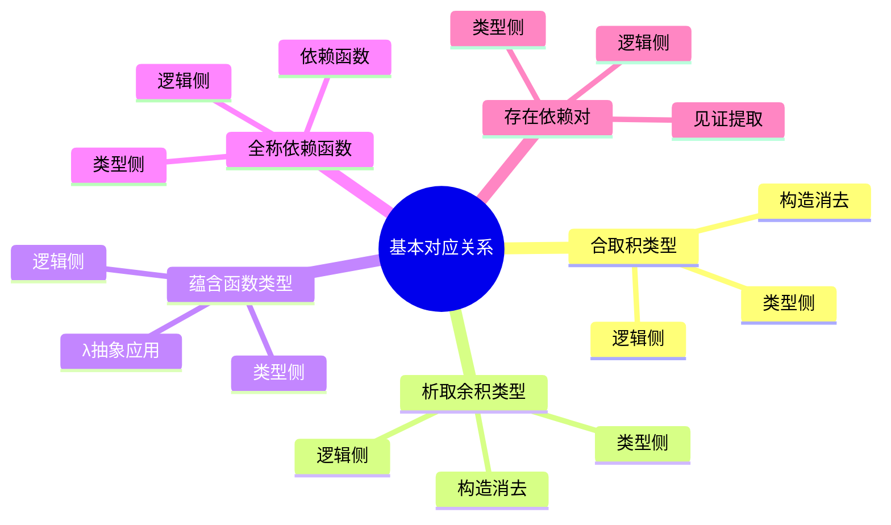
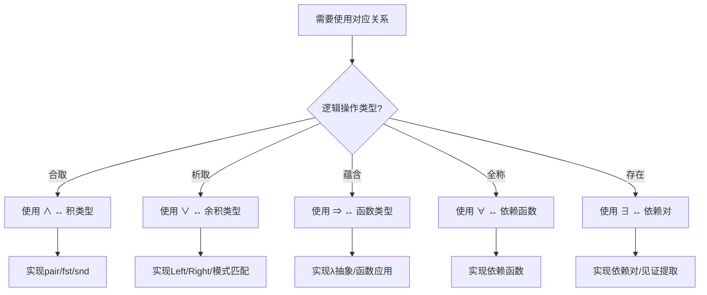
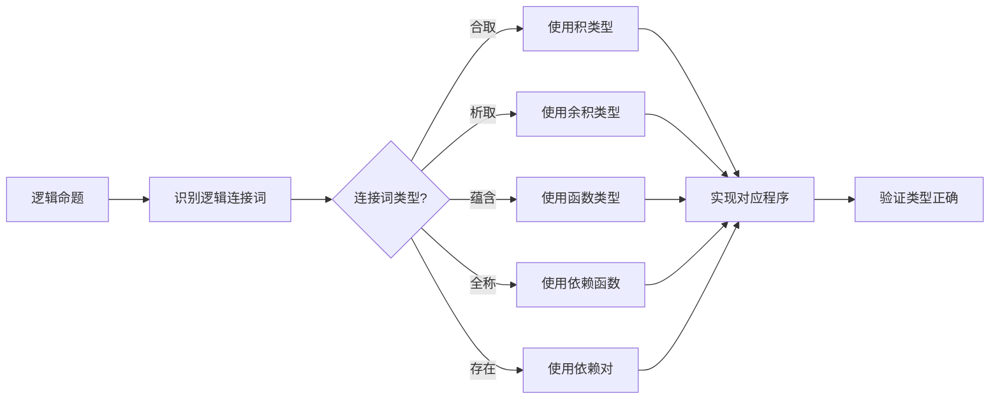
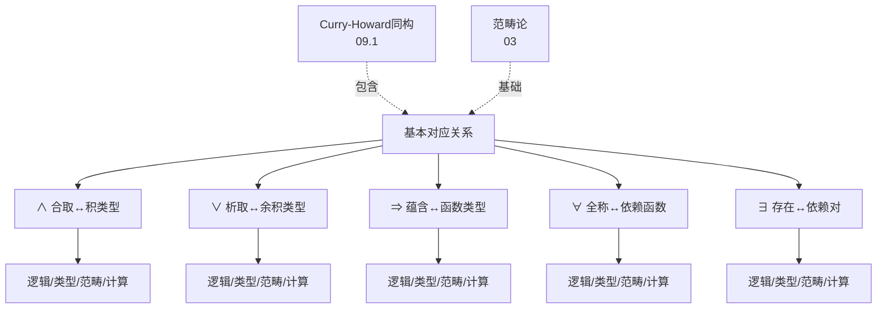
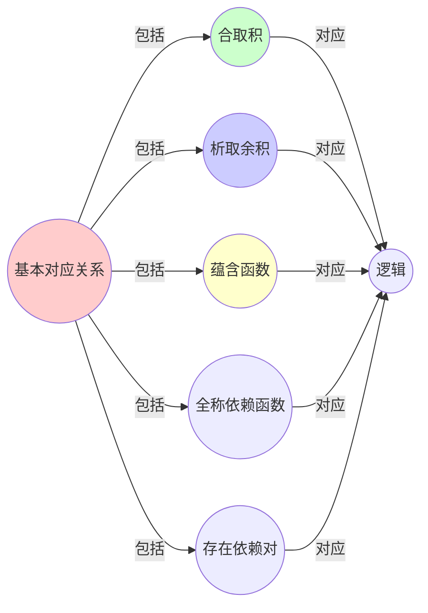
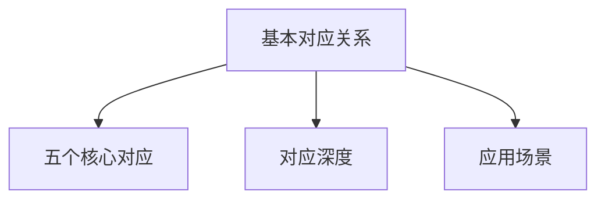

# 09.2 基本对应关系详解

> **来源**: view08.md
> **创建日期**: 2025-01-27
> **最后更新**: 2025-01-27

## 📋 目录

- [09.2 基本对应关系详解](#092-基本对应关系详解)
  - [📋 目录](#-目录)
  - [📋 内容概览](#-内容概览)
  - [🎯 核心理念](#-核心理念)
  - [📊 完整对应关系表](#-完整对应关系表)
  - [🔗 1. ∧ (与) ↔ 积类型 (A × B) ↔ Tuple](#-1--与--积类型-a--b--tuple)
    - [逻辑侧：合取](#逻辑侧合取)
    - [范畴侧：积（Product）](#范畴侧积product)
    - [编程侧：Tuple](#编程侧tuple)
  - [🔀 2. ∨ (或) ↔ 余积类型 (A + B) ↔ Either](#-2--或--余积类型-a--b--either)
    - [逻辑侧：析取](#逻辑侧析取)
    - [范畴侧：余积（Coproduct）](#范畴侧余积coproduct)
    - [编程侧：Either](#编程侧either)
  - [➡️ 3. ⇒ (蕴含) ↔ 指数类型 (A ⇒ B) ↔ Function](#️-3--蕴含--指数类型-a--b--function)
    - [逻辑侧：蕴含](#逻辑侧蕴含)
    - [范畴侧：指数对象（Exponential）](#范畴侧指数对象exponential)
    - [编程侧：Function类型](#编程侧function类型)
  - [🔄 4. ∀ ↔ Π-类型 ↔ Dependent Function](#-4---π-类型--dependent-function)
    - [逻辑侧：全称量词](#逻辑侧全称量词)
    - [范畴侧：Π-构造（Dependent Product）](#范畴侧π-构造dependent-product)
    - [编程侧：Dependent Function](#编程侧dependent-function)
  - [🔍 5. ∃ ↔ Σ-类型 ↔ Dependent Pair](#-5---σ-类型--dependent-pair)
    - [逻辑侧：存在量词](#逻辑侧存在量词)
    - [范畴侧：Σ-构造（Dependent Sum）](#范畴侧σ-构造dependent-sum)
    - [编程侧：Dependent Pair](#编程侧dependent-pair)
  - [🎯 统一视角：伴随立方](#-统一视角伴随立方)
    - [伴随关系](#伴随关系)
  - [📊 详细案例研究](#-详细案例研究)
    - [案例研究 1：使用积类型实现合取逻辑](#案例研究-1使用积类型实现合取逻辑)
    - [案例研究 2：使用Either类型实现析取逻辑](#案例研究-2使用either类型实现析取逻辑)
    - [案例研究 3：依赖类型系统在形式化证明中的应用](#案例研究-3依赖类型系统在形式化证明中的应用)
  - [⚠️ 批判性分析与局限性](#️-批判性分析与局限性)
    - [局限性讨论](#局限性讨论)
      - [1. Curry-Howard对应的适用范围](#1-curry-howard对应的适用范围)
      - [2. 类型系统的表达能力](#2-类型系统的表达能力)
      - [3. 证明的自动生成](#3-证明的自动生成)
    - [改进方向](#改进方向)
      - [1. 扩展对应关系](#1-扩展对应关系)
      - [2. 提高实用性](#2-提高实用性)
  - [📊 思维表征体系](#-思维表征体系)
    - [📊 1. 思维导图（增强版）](#-1-思维导图增强版)
      - [1.1 文本格式（基础版）](#11-文本格式基础版)
      - [1.2 Mermaid格式（可视化版）](#12-mermaid格式可视化版)
    - [📊 2. 多维对比矩阵](#-2-多维对比矩阵)
      - [2.1 五个基本对应关系对比矩阵](#21-五个基本对应关系对比矩阵)
      - [2.2 对应关系深度对比矩阵](#22-对应关系深度对比矩阵)
      - [2.3 应用场景对比矩阵](#23-应用场景对比矩阵)
    - [🌲 3. 决策树](#-3-决策树)
      - [3.1 对应关系应用选择决策树](#31-对应关系应用选择决策树)
    - [🛤️ 4. 决策逻辑路径](#️-4-决策逻辑路径)
      - [4.1 对应关系应用路径](#41-对应关系应用路径)
    - [🕸️ 5. 概念关系网络](#️-5-概念关系网络)
      - [5.1 基本对应关系概念网络](#51-基本对应关系概念网络)
    - [🗺️ 6. 知识图谱](#️-6-知识图谱)
      - [6.1 基本对应关系知识图谱](#61-基本对应关系知识图谱)
  - [📚 理论体系](#-理论体系)
    - [理论基础](#理论基础)
      - [逻辑学/类型论/范畴论基础](#逻辑学类型论范畴论基础)
      - [历史发展](#历史发展)
    - [理论框架](#理论框架)
      - [核心假设](#核心假设)
      - [基本概念体系](#基本概念体系)
      - [主要定理/结论](#主要定理结论)
      - [适用范围和边界](#适用范围和边界)
    - [当前知识共识](#当前知识共识)
      - [学术界共识](#学术界共识)
      - [主要争议点](#主要争议点)
      - [权威来源](#权威来源)
    - [与其他理论的关系](#与其他理论的关系)
      - [逻辑关系](#逻辑关系)
      - [映射关系](#映射关系)
  - [🔗 关联网络](#-关联网络)
    - [🔗 概念级关联](#-概念级关联)
      - [核心概念映射](#核心概念映射)
    - [🔗 理论级关联](#-理论级关联)
      - [理论基础](#理论基础-1)
    - [🔗 方法级关联](#-方法级关联)
      - [方法应用网络](#方法应用网络)
    - [🔗 应用场景关联](#-应用场景关联)
  - [🛤️ 学习路径](#️-学习路径)
    - [前置知识](#前置知识)
    - [后续学习](#后续学习)
    - [并行学习](#并行学习)
  - [🔗 相关文档](#-相关文档)
  - [📖 扩展阅读](#-扩展阅读)

---

## 📋 内容概览

本文档详细阐述Curry-Howard同构中五个基本对应关系的逻辑、范畴和编程实现。通过形式化方法，全面展示逻辑、类型系统和编程之间的深刻对应关系。

---

## 🎯 核心理念

Curry-Howard同构揭示了逻辑、类型系统和计算之间的深刻对应关系：命题即类型，证明即程序。这种对应关系为我们理解逻辑推理、类型系统和程序设计提供了统一的视角。

## 📊 完整对应关系表

| 逻辑 | 范畴 | 编程语言 | 证明 |
|------|------|----------|------|
| ∧ (与) | 积 | Tuple (A, B) | 对构造 |
| ∨ (或) | 余积 | Either A B | 情况分析 |
| ⇒ (蕴含) | 指数 | Function A -> B | λ抽象 |
| ∀ | Π-对象 | Dep Function | 泛证 |
| ∃ | Σ-对象 | Dep Pair | 见证提取 |

## 🔗 1. ∧ (与) ↔ 积类型 (A × B) ↔ Tuple

### 逻辑侧：合取

**命题**：`A ∧ B` 表示"A与B同时为真"

**证明规则**：

- **引入**：若 ⊢ A 且 ⊢ B，则 ⊢ A ∧ B
- **消去**：若 ⊢ A ∧ B，则 ⊢ A；若 ⊢ A ∧ B，则 ⊢ B

### 范畴侧：积（Product）

**定义**：对象A和B的**积** A × B 满足**泛性质**

**交换图**：

```text
      C
      |
      | f
      v
A <---π₁--- A × B ---π₂---> B
```

**存在唯一态射** ⟨f,g⟩: C → A×B 使得 π₁∘⟨f,g⟩ = f, π₂∘⟨f,g⟩ = g

### 编程侧：Tuple

```haskell
-- 构造子（introduction）
pair :: A -> B -> (A, B)
pair a b = (a, b)

-- 消去子（elimination）
fst :: (A, B) -> A
fst (a, b) = a

snd :: (A, B) -> B
snd (a, b) = b

-- β-规约（计算规则）
fst (pair a b) = a
snd (pair a b) = b

-- η-规约（唯一性规则）
pair (fst p) (snd p) = p
```

**关键同构**：

- `pair` = **合取引入**
- `fst/snd` = **合取消去**
- `β-规约` = **证明规约**

## 🔀 2. ∨ (或) ↔ 余积类型 (A + B) ↔ Either

### 逻辑侧：析取

**命题**：`A ∨ B` 表示"A或B至少一个为真"

**证明规则**：

- **引入**：若 ⊢ A，则 ⊢ A ∨ B；若 ⊢ B，则 ⊢ A ∨ B
- **消去**：若 ⊢ A ∨ B，且从A可证C，从B可证C，则 ⊢ C

### 范畴侧：余积（Coproduct）

**定义**：对象A和B的**余积** A + B 满足**对偶泛性质**

**交换图**：

```text
A ---i₁---> A + B <---i₂--- B
           ↑
           | [f,g]
           |
           C
```

**存在唯一态射** [f,g]: A+B → C 使得 [f,g]∘i₁ = f, [f,g]∘i₂ = g

### 编程侧：Either

```haskell
data Either a b = Left a | Right b

-- 构造子
left  :: A -> Either A B
left a = Left a

right :: B -> Either A B
right b = Right b

-- 消去子（模式匹配 = 证明分情况）
caseEither :: Either A B -> (A -> C) -> (B -> C) -> C
caseEither (Left a)  f g = f a
caseEither (Right b) f g = g b

-- β-规约
caseEither (left a)  f g = f a
caseEither (right b) f g = g b
```

**关键同构**：

- `Left/Right` = **析取引入**
- `caseEither` = **析取消去**
- **模式匹配** = **证明分支**

## ➡️ 3. ⇒ (蕴含) ↔ 指数类型 (A ⇒ B) ↔ Function

### 逻辑侧：蕴含

**命题**：`A ⇒ B` 表示"若A为真，则B为真"

**证明规则**：

- **引入**：在假设A下证明了B，则 ⊢ A ⇒ B
- **消去**：若 ⊢ A ⇒ B 且 ⊢ A，则 ⊢ B（**Modus Ponens**）

### 范畴侧：指数对象（Exponential）

**定义**：对象Bᴬ = A ⇒ B 满足**currying**同构：

```latex
\text{Hom}(C \times A, B) \cong \text{Hom}(C, B^A)
```

**评估态射** eval: Bᴬ × A → B

### 编程侧：Function类型

```haskell
-- 构造子（λ抽象 = 蕴含引入）
lambda :: (A -> B) -> (A -> B)
lambda f = f

-- 消去子（函数应用 = 蕴含消去）
apply :: (A -> B) -> A -> B
apply f a = f a

-- β-规约（函数调用 = Modus Ponens）
apply (lambda f) a = f a

-- curry/uncurry同构
curry :: ((A, B) -> C) -> (A -> B -> C)
curry f = \a -> \b -> f (a, b)

uncurry :: (A -> B -> C) -> ((A, B) -> C)
uncurry f = \(a, b) -> f a b
```

**关键同构**：

- **λ抽象** = **假设A，证明B**
- **函数应用** = **肯定前件**（Modus Ponens）
- `curry` = **证明转换**

## 🔄 4. ∀ ↔ Π-类型 ↔ Dependent Function

### 逻辑侧：全称量词

**命题**：`∀x:A. P(x)` 表示"对所有A中的x，P(x)为真"

**证明规则**：

- **引入**：对任意a:A，证明了P(a)，则 ⊢ ∀x:A. P(x)
- **消去**：若 ⊢ ∀x:A. P(x) 且 ⊢ a:A，则 ⊢ P(a)

### 范畴侧：Π-构造（Dependent Product）

**定义**：给定纤维化 p: ℰ → ℬ，**Π-类型**是将纤维上的族**积**到基

**通配态射**：**截面**（section）s: A → Π_A P，满足 p∘s = id_A

### 编程侧：Dependent Function

```idris
-- 依赖类型：向量的长度依赖其元素类型
Vec : (n : Nat) -> (a : Type) -> Type
Vec n a = ...  -- 长度为n的a向量

-- Π-类型：证明∀n:Nat. Vec n A → Vec n A
reverse : (n : Nat) -> Vec n a -> Vec n a
reverse n xs = ...  -- 对任意n都成立

-- 构造子（∀引入）
forallIntro : ((a : A) -> P a) -> (x : A) -> P x
forallIntro f a = f a

-- 消去子（∀消去）
applyForall : ((x : A) -> P x) -> (a : A) -> P a
applyForall f a = f a
```

**关键同构**：

- `reverse : (n : Nat) → Vec n a → Vec n a` = **对任意自然数n，存在向量反转操作**
- **类型检查** = **全称量词的证明检查**

## 🔍 5. ∃ ↔ Σ-类型 ↔ Dependent Pair

### 逻辑侧：存在量词

**命题**：`∃x:A. P(x)` 表示"存在A中的x，使P(x)为真"

**证明规则**：

- **引入**：给定a:A和P(a)的证明，则 ⊢ ∃x:A. P(x)
- **消去**：若 ⊢ ∃x:A. P(x)，则可假设某个x₀:A满足P(x₀)

### 范畴侧：Σ-构造（Dependent Sum）

**定义**：纤维化 p: ℰ → ℬ 的**Σ-类型** = **余积到基的聚合**

**配对对象**：(a, p) 其中 a:A, p:P(a)

### 编程侧：Dependent Pair

```idris
-- Σ-类型：证明"存在非空向量"
data ExistsNonEmpty : (a : Type) -> Type where
  MkNonEmpty : (n : Nat) -> (vec : Vec (S n) a) -> ExistsNonEmpty a
  -- S n = n+1, 确保长度>0

-- 构造子（∃引入）
existsIntro : (a : A) -> P a -> Σ A P
existsIntro a pa = (a, pa)

-- 消去子（∃消去）
elimExists : Σ A P -> ( (a : A) -> P a -> C ) -> C
elimExists (a, pa) cont = cont a pa
```

**关键同构**：

- `Σ Nat (\n => Vec n a)` = **存在某个长度的向量**
- **模式匹配** = **存在消去**（提取见证a和证明pa）

## 🎯 统一视角：伴随立方

### 伴随关系

```text
         Π
        / \
       /   \
      /     \
   ⇒        ×
    \     /
     \   /
      ∨ +
       \ /
         Σ
```

- **右伴随**：×, Π, ⇒
- **左伴随**：+, Σ
- **双重否定延续（CNF）**：Curry-Howard-Lambek三重同构

## 📊 详细案例研究

### 案例研究 1：使用积类型实现合取逻辑

**背景**：在Haskell中实现逻辑合取运算，展示逻辑与类型的对应。

**形式化分析**：

```haskell
-- 逻辑：A ∧ B
-- 类型：(A, B)
-- 证明：构造一个pair

-- 合取引入（∧-Intro）
conjIntro :: a -> b -> (a, b)
conjIntro a b = (a, b)

-- 合取消去（∧-Elim）
conjElim1 :: (a, b) -> a
conjElim1 (a, b) = a

conjElim2 :: (a, b) -> b
conjElim2 (a, b) = b

-- 验证β-规约
-- fst (pair a b) = a  ✓
-- snd (pair a b) = b  ✓
```

**关键发现**：

- ✅ Tuple类型的构造对应逻辑合取的引入规则
- ✅ Tuple的投影对应逻辑合取的消去规则
- ✅ 类型系统的β-规约对应逻辑的证明规约

**应用价值**：

- ✅ 在依赖类型系统中验证程序正确性
- ✅ 通过类型检查确保逻辑一致性
- ✅ 实现形式化验证的工具

### 案例研究 2：使用Either类型实现析取逻辑

**背景**：使用Haskell的Either类型实现逻辑析取运算。

**形式化分析**：

```haskell
-- 逻辑：A ∨ B
-- 类型：Either A B
-- 证明：Left或Right构造

-- 析取引入（∨-Intro）
disjIntro1 :: a -> Either a b
disjIntro1 a = Left a

disjIntro2 :: b -> Either a b
disjIntro2 b = Right b

-- 析取消去（∨-Elim）
disjElim :: Either a b -> (a -> c) -> (b -> c) -> c
disjElim (Left a)  f g = f a
disjElim (Right b) f g = g b
```

**关键发现**：

- ✅ Either类型的Left/Right构造对应析取的引入规则
- ✅ 模式匹配对应析取的消去规则（情况分析）
- ✅ 类型系统保证了析取逻辑的正确性

**应用价值**：

- ✅ 错误处理：Either可用于表示成功或失败
- ✅ 可选值：Maybe类型是Either的特例
- ✅ 形式化验证：类型检查保证逻辑正确性

### 案例研究 3：依赖类型系统在形式化证明中的应用

**背景**：使用Agda/Idris等依赖类型系统进行形式化证明。

**形式化分析**：

```idris
-- 逻辑：∀n:Nat. ∃m:Nat. m = n + 1
-- 类型：(n : Nat) -> (m : Nat ** m = n + 1)
-- 证明：构造一个函数，对任意n返回m和证明

existsSuccessor : (n : Nat) -> (m : Nat ** m = n + 1)
existsSuccessor n = (S n ** Refl)
  -- S n = n + 1
  -- Refl是相等性的证明

-- 类型检查器会验证：
-- 1. 对所有n，返回值存在
-- 2. m确实等于n+1
```

**关键发现**：

- ✅ 依赖类型系统能够表达量化逻辑
- ✅ 类型检查器能够验证逻辑证明
- ✅ 程序和证明在同一个系统中统一

**应用价值**：

- ✅ 形式化验证：证明程序正确性
- ✅ 数学证明：在计算机中形式化数学
- ✅ 安全编程：通过类型系统保证安全性

## ⚠️ 批判性分析与局限性

### 局限性讨论

#### 1. Curry-Howard对应的适用范围

**问题**：并非所有逻辑系统都能完美对应到类型系统。

**挑战**：

- ⚠️ 经典逻辑（包含排中律）的对应较复杂
- ⚠️ 高阶逻辑需要更复杂的类型系统
- ⚠️ 非构造性证明难以直接对应

**应对策略**：

- ✅ 使用直觉主义逻辑作为基础
- ✅ 通过控制操作符模拟经典逻辑
- ✅ 明确对应关系的适用范围

#### 2. 类型系统的表达能力

**问题**：某些类型系统的表达能力有限，难以表达复杂的逻辑。

**挑战**：

- ⚠️ 简单类型λ演算只能表达命题逻辑
- ⚠️ 依赖类型系统的复杂性高
- ⚠️ 类型推断的难度随系统复杂度增长

**改进方向**：

- ✅ 开发更强大的类型系统
- ✅ 优化类型推断算法
- ✅ 平衡表达能力和易用性

#### 3. 证明的自动生成

**问题**：虽然类型对应证明，但自动生成证明仍然困难。

**挑战**：

- ⚠️ 证明搜索空间巨大
- ⚠️ 需要用户提供提示和策略
- ⚠️ 证明的可读性有待提高

**改进方向**：

- ✅ 开发更好的证明策略
- ✅ 使用机器学习辅助证明
- ✅ 改进证明的表示和展示

### 改进方向

#### 1. 扩展对应关系

**目标**：扩展Curry-Howard对应到更多逻辑系统。

**方法**：

- 研究线性逻辑的类型对应
- 探索模态逻辑的类型系统
- 开发混合逻辑的类型对应

#### 2. 提高实用性

**目标**：使Curry-Howard对应在实际编程中更容易应用。

**方法**：

- 开发用户友好的证明工具
- 改进类型推断算法
- 提供更好的错误信息

## 📊 思维表征体系

### 📊 1. 思维导图（增强版）

#### 1.1 文本格式（基础版）

```text
Curry-Howard同构基本对应关系
├── ∧ (合取) ↔ 积类型
│   ├── 逻辑侧：A ∧ B
│   ├── 类型侧：(A, B)
│   ├── 构造：pair
│   ├── 消去：fst/snd
│   └── 案例：逻辑合取实现
├── ∨ (析取) ↔ 余积类型
│   ├── 逻辑侧：A ∨ B
│   ├── 类型侧：Either A B
│   ├── 构造：Left/Right
│   ├── 消去：模式匹配
│   └── 案例：错误处理应用
├── ⇒ (蕴含) ↔ 函数类型
│   ├── 逻辑侧：A ⇒ B
│   ├── 类型侧：A -> B
│   ├── 构造：λ抽象
│   ├── 消去：函数应用
│   └── 案例：Modus Ponens对应
├── ∀ (全称) ↔ 依赖函数
│   ├── 逻辑侧：∀x:A. P(x)
│   ├── 类型侧：(x : A) -> P x
│   ├── 构造：依赖函数
│   ├── 消去：函数应用
│   └── 案例：形式化证明
└── ∃ (存在) ↔ 依赖对
    ├── 逻辑侧：∃x:A. P(x)
    ├── 类型侧：(x : A ** P x)
    ├── 构造：存在引入
    ├── 消去：模式匹配
    └── 案例：见证提取
```

#### 1.2 Mermaid格式（可视化版）



### 📊 2. 多维对比矩阵

#### 2.1 五个基本对应关系对比矩阵

| 对应关系 | ∧ 合取 | ∨ 析取 | ⇒ 蕴含 | ∀ 全称 | ∃ 存在 |
|---------|--------|--------|--------|--------|--------|
| **逻辑侧** | A ∧ B | A ∨ B | A ⇒ B | ∀x:A. P(x) | ∃x:A. P(x) |
| **类型侧** | (A, B) | Either A B | A -> B | (x : A) -> P x | (x : A, p : P x) |
| **范畴侧** | 积 | 余积 | 指数 | Π-对象 | Σ-对象 |
| **构造规则** | pair | Left/Right | λ抽象 | 依赖函数 | 存在引入 |
| **消去规则** | fst/snd | 模式匹配 | 函数应用 | 函数应用 | 模式匹配 |
| **复杂度** | 低 | 低 | 中 | 高 | 高 |

#### 2.2 对应关系深度对比矩阵

| 对应关系 | 语法对应 | 语义对应 | 计算对应 | 证明对应 | 对应深度 |
|---------|---------|---------|---------|---------|---------|
| **∧ 合取** | 完全对应 | 完全对应 | 完全对应 | 完全对应 | 很深 |
| **∨ 析取** | 完全对应 | 完全对应 | 完全对应 | 完全对应 | 很深 |
| **⇒ 蕴含** | 完全对应 | 完全对应 | 完全对应 | 完全对应 | 很深 |
| **∀ 全称** | 完全对应 | 完全对应 | 完全对应 | 完全对应 | 很深 |
| **∃ 存在** | 完全对应 | 完全对应 | 完全对应 | 完全对应 | 很深 |

#### 2.3 应用场景对比矩阵

| 对应关系 | 定理证明 | 程序验证 | 类型安全 | 日常编程 | 应用频率 |
|---------|---------|---------|---------|---------|---------|
| **∧ 合取** | 高 | 高 | 高 | 很高 | 很高 |
| **∨ 析取** | 高 | 高 | 高 | 高 | 高 |
| **⇒ 蕴含** | 很高 | 很高 | 很高 | 很高 | 很高 |
| **∀ 全称** | 高 | 中 | 中 | 低 | 中 |
| **∃ 存在** | 中 | 中 | 低 | 低 | 低 |

### 🌲 3. 决策树

#### 3.1 对应关系应用选择决策树



### 🛤️ 4. 决策逻辑路径

#### 4.1 对应关系应用路径



### 🕸️ 5. 概念关系网络

#### 5.1 基本对应关系概念网络



### 🗺️ 6. 知识图谱

#### 6.1 基本对应关系知识图谱



## 📚 理论体系

### 理论基础

#### 逻辑学/类型论/范畴论基础

基本对应关系的理论基础：

**1. 逻辑学基础**：

- 命题逻辑
- 一阶逻辑
- 证明论

**2. 类型论基础**：

- 简单类型论
- 依赖类型论
- 构造演算

**3. 范畴论基础**：

- 笛卡尔闭范畴
- 极限和余极限
- 函子和自然变换

#### 历史发展

**关键时间节点**：

- **1969年**：Curry-Howard对应发现
  - Curry的观察
  - Howard的对应

- **1970-1980年代**：理论发展
  - 类型论发展
  - 范畴论视角

- **1990-2000年代**：依赖类型扩展
  - 依赖类型系统
  - 构造演算

- **2010年代至今**：现代应用
  - 形式化验证
  - 定理证明工具
  - 类型驱动开发

### 理论框架

#### 核心假设

**假设1：对应关系的精确性**

- **内容**：对应关系是精确的
- **适用范围**：构造性逻辑
- **限制条件**：非构造性逻辑可能不同

**假设2：类型检查即证明验证**

- **内容**：类型检查对应证明验证
- **适用范围**：强类型系统
- **限制条件**：需要类型系统支持

**假设3：程序即证明**

- **内容**：编写程序即构造证明
- **适用范围**：构造性证明
- **限制条件**：非构造性证明可能不同

#### 基本概念体系



#### 主要定理/结论

**结论1：对应关系的完整性**

- **内容**：五个对应关系构成完整对应
- **证据**：理论证明
- **应用**：统一理解

**结论2：类型安全保证逻辑正确性**

- **内容**：类型安全对应逻辑正确
- **证据**：对应关系
- **应用**：程序正确性

**结论3：计算即证明执行**

- **内容**：程序计算对应证明执行
- **证据**：对应关系
- **应用**：证明执行

#### 适用范围和边界

**适用范围**：

- 构造性逻辑
- 强类型系统
- 形式化验证

**边界条件**：

- 需要构造性证明
- 需要类型系统支持
- 需要考虑计算复杂性

**不适用场景**：

- 非构造性逻辑
- 弱类型系统
- 无类型系统

### 当前知识共识

#### 学术界共识

**广泛接受的共识**：

1. **对应关系的正确性**
   - **共识**：五个对应关系是正确的
   - **支持证据**：形式化证明和实践
   - **来源**：逻辑学、类型论

2. **对应关系的完整性**
   - **共识**：五个对应关系构成核心对应
   - **支持证据**：理论分析
   - **来源**：类型论研究

3. **应用的广泛性**
   - **共识**：对应关系应用广泛
   - **支持证据**：成功应用
   - **来源**：软件工程、形式化验证

#### 主要争议点

1. **对应关系的扩展**
   - **观点A**：需要扩展到更多逻辑
   - **观点B**：当前对应关系足够
   - **当前状态**：多数认为可以扩展

2. **计算的本质**
   - **观点A**：计算即证明执行
   - **观点B**：计算更复杂
   - **当前状态**：多数接受对应关系

#### 权威来源

**经典文献**：

- 《Types and Programming Languages》- Benjamin C. Pierce
- 《Proofs and Types》- Jean-Yves Girard
- Curry-Howard对应原始论文

**权威机构/专家**：

- **ACM**
- **IEEE**
- **类型论研究会**

**最新发展**：

- **2020-2024**：线性逻辑对应、模态类型、量子类型
- **前沿方向**：同态加密、零知识证明、形式化验证

### 与其他理论的关系

#### 逻辑关系

**理论基础**：

- **Curry-Howard同构**（[09.1_逻辑与类型的对应.md](09.1_逻辑与类型的对应.md)） → 基本对应关系详解
  - 关系类型：详细阐述
  - 关键映射：核心对应 → 详细对应

**理论扩展**：

- **依赖类型系统**（[09.4_依赖类型系统.md](09.4_依赖类型系统.md)） → 基本对应关系详解
  - 关系类型：扩展应用
  - 关键映射：依赖类型 → 全称/存在对应

#### 映射关系

| 本理论概念 | 映射理论 | 映射概念 | 映射类型 | 映射说明 |
|-----------|---------|---------|---------|----------|
| **积类型** | 03.3_极限与余极限 | 积对象 | 对应 | 积对应积 |
| **余积类型** | 03.3_极限与余极限 | 余积对象 | 对应 | 余积对应余积 |
| **函数类型** | 03.2_函子与自然变换 | 指数对象 | 对应 | 函数对应指数 |
| **依赖函数** | 09.4_依赖类型系统 | Π类型 | 对应 | 依赖函数对应Π |

## 🔗 关联网络

### 🔗 概念级关联

#### 核心概念映射

| 本文档概念 | 关联文档 | 关联概念 | 关系类型 | 映射说明 |
|-----------|---------|---------|---------|----------|
| **积类型** | 03.3_极限与余极限 | 积对象 | 对应 | 积对应积 |
| **余积类型** | 03.3_极限与余极限 | 余积对象 | 对应 | 余积对应余积 |
| **函数类型** | 03.2_函子与自然变换 | 指数对象 | 对应 | 函数对应指数 |
| **依赖函数** | 09.4_依赖类型系统 | Π类型 | 对应 | 依赖函数对应Π |
| **依赖对** | 09.4_依赖类型系统 | Σ类型 | 对应 | 依赖对对应Σ |
| **对应关系** | 09.1_逻辑与类型的对应 | 核心对应 | 对应 | 详细对应核心对应 |

### 🔗 理论级关联

#### 理论基础

- **本理论基于**：
  - [09.1_逻辑与类型的对应.md](09.1_逻辑与类型的对应.md) ⭐⭐⭐ - Curry-Howard同构
  - [03_范畴论与形式化方法](../03_范畴论与形式化方法/) ⭐⭐⭐ - 范畴论

- **本理论应用于**：
  - [09.4_依赖类型系统.md](09.4_依赖类型系统.md) ⭐⭐⭐ - 依赖类型
  - [09.5_实际应用.md](09.5_实际应用.md) ⭐⭐⭐ - 实际应用

### 🔗 方法级关联

#### 方法应用网络

| 本文档方法 | 应用文档 | 应用场景 | 应用效果 |
|-----------|---------|---------|---------|
| **对应关系** | 09.5_实际应用 | 形式化验证 | 成功 |
| **类型构造** | 实际编程 | 类型安全 | 成功 |
| **证明构造** | 定理证明 | 形式化证明 | 成功 |

### 🔗 应用场景关联

**场景**：类型安全编程

| 视角 | 关联文档 | 核心理论 | 关注点 |
|------|---------|---------|--------|
| **对应关系** | 本文档 | 基本对应 | 对应实现 |
| **理论基础** | 09.1_逻辑与类型的对应 | Curry-Howard | 理论理解 |
| **实际应用** | 09.5_实际应用 | 应用案例 | 实践应用 |

## 🛤️ 学习路径

### 前置知识

**必须先学习**：

- [09.1_逻辑与类型的对应.md](09.1_逻辑与类型的对应.md) ⭐⭐⭐ - Curry-Howard同构
- [03_范畴论与形式化方法](../03_范畴论与形式化方法/) ⭐⭐ - 范畴论

**建议先了解**：

- 逻辑学基础
- 类型论基础
- 编程语言

### 后续学习

**建议接下来学习**（按顺序）：

1. [09.3_范畴论视角.md](09.3_范畴论视角.md) ⭐⭐⭐ - 范畴论视角
2. [09.4_依赖类型系统.md](09.4_依赖类型系统.md) ⭐⭐⭐ - 依赖类型
3. [09.5_实际应用.md](09.5_实际应用.md) ⭐⭐ - 实际应用

### 并行学习

**可以同时学习**：

- 实际编程语言 - 类型系统实践
- 形式化验证工具 - 定理证明实践

## 🔗 相关文档

- [09.1_逻辑与类型的对应.md](09.1_逻辑与类型的对应.md)
- [09.3_范畴论视角.md](09.3_范畴论视角.md)
- [03_范畴论与形式化方法/README.md](../03_范畴论与形式化方法/README.md)

## 📖 扩展阅读

- 《Types and Programming Languages》- Benjamin C. Pierce
- 《Proofs and Types》- Jean-Yves Girard
- Wikipedia: [Curry-Howard Correspondence](https://en.wikipedia.org/wiki/Curry%E2%80%93Howard_correspondence)
