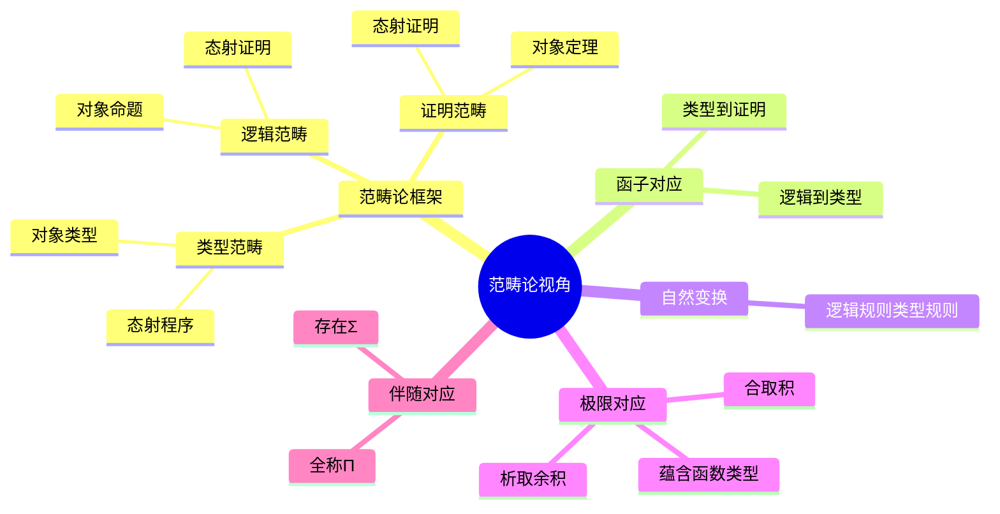
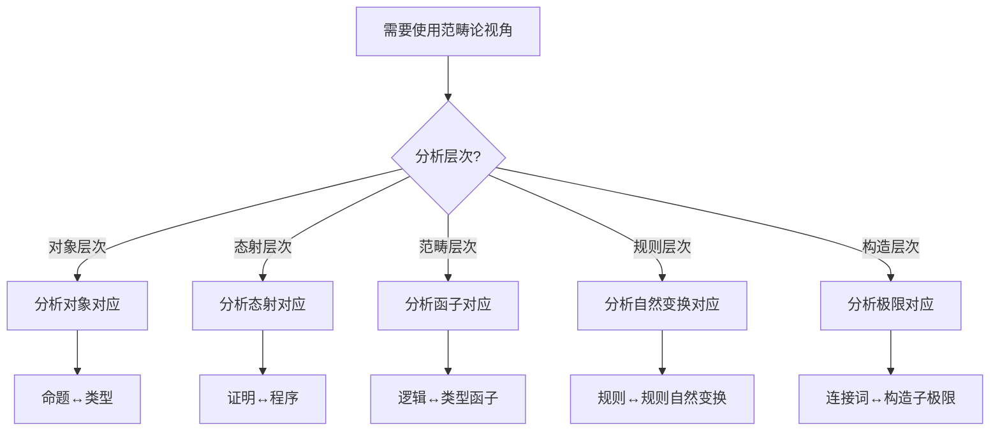
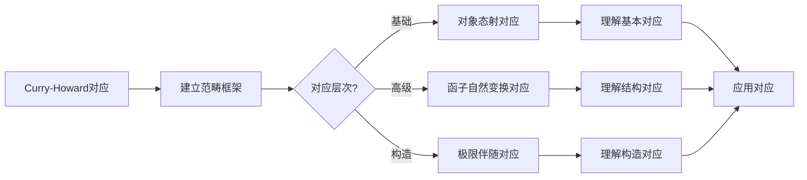
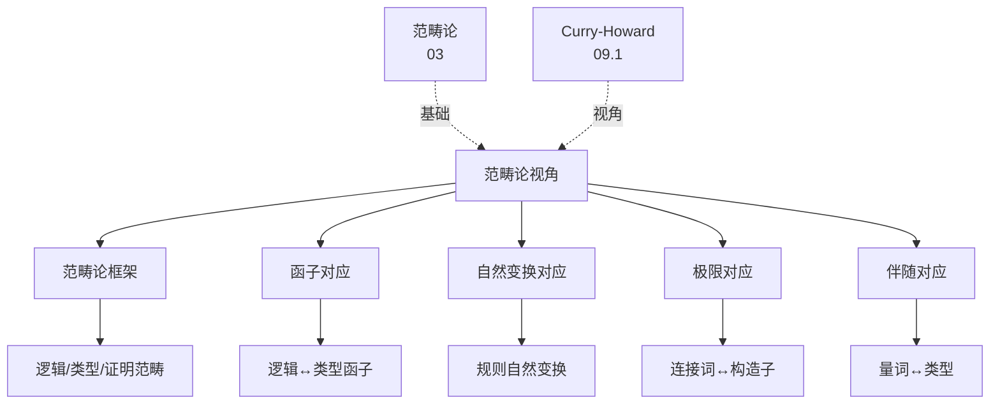
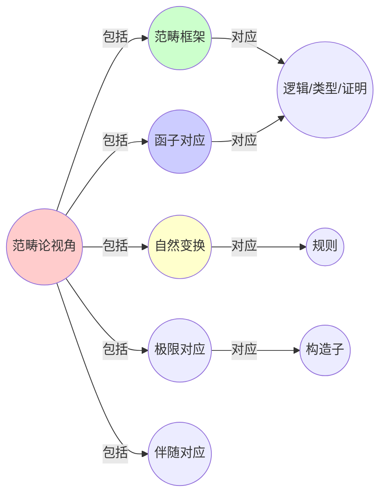
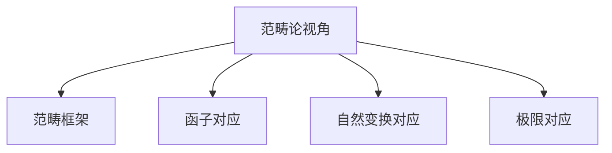

# 09.3 Curry-Howard同构的范畴论视角

> **来源**: view08.md
> **创建日期**: 2025-01-27
> **最后更新**: 2025-01-27

## 📋 目录

- [09.3 Curry-Howard同构的范畴论视角](#093-curry-howard同构的范畴论视角)
  - [📋 目录](#-目录)
  - [📋 内容概览](#-内容概览)
  - [🎯 核心理念](#-核心理念)
  - [📚 范畴论框架](#-范畴论框架)
    - [基本对应](#基本对应)
    - [范畴结构](#范畴结构)
      - [逻辑范畴](#逻辑范畴)
      - [类型范畴](#类型范畴)
      - [证明范畴](#证明范畴)
  - [🔄 函子对应](#-函子对应)
    - [逻辑到类型](#逻辑到类型)
    - [类型到证明](#类型到证明)
  - [📊 自然变换对应](#-自然变换对应)
    - [逻辑规则到类型规则](#逻辑规则到类型规则)
    - [类型规则到证明规则](#类型规则到证明规则)
  - [🎯 极限对应](#-极限对应)
    - [逻辑构造到类型构造](#逻辑构造到类型构造)
      - [合取 ↔ 积](#合取--积)
      - [析取 ↔ 余积](#析取--余积)
      - [蕴含 ↔ 函数类型](#蕴含--函数类型)
  - [🔬 伴随对应](#-伴随对应)
    - [逻辑伴随](#逻辑伴随)
    - [类型伴随](#类型伴随)
    - [对应关系](#对应关系)
  - [📈 高阶对应](#-高阶对应)
    - [二阶逻辑 ↔ 类型系统](#二阶逻辑--类型系统)
    - [模态逻辑 ↔ 效应系统](#模态逻辑--效应系统)
  - [📊 详细案例研究](#-详细案例研究)
    - [案例研究 1：函子对应在编程语言语义中的应用](#案例研究-1函子对应在编程语言语义中的应用)
    - [案例研究 2：自然变换在类型系统优化中的应用](#案例研究-2自然变换在类型系统优化中的应用)
  - [⚠️ 批判性分析与局限性](#️-批判性分析与局限性)
    - [局限性讨论](#局限性讨论)
      - [1. 范畴论抽象性带来的困难](#1-范畴论抽象性带来的困难)
      - [2. 对应关系的非唯一性](#2-对应关系的非唯一性)
    - [改进方向](#改进方向)
      - [1. 提高可访问性](#1-提高可访问性)
      - [2. 扩展应用领域](#2-扩展应用领域)
  - [📊 思维表征体系](#-思维表征体系)
    - [📊 1. 思维导图（增强版）](#-1-思维导图增强版)
      - [1.1 文本格式（基础版）](#11-文本格式基础版)
      - [1.2 Mermaid格式（可视化版）](#12-mermaid格式可视化版)
    - [📊 2. 多维对比矩阵](#-2-多维对比矩阵)
      - [2.1 三个范畴对比矩阵](#21-三个范畴对比矩阵)
      - [2.2 对应层次对比矩阵](#22-对应层次对比矩阵)
      - [2.3 函子对应对比矩阵](#23-函子对应对比矩阵)
    - [🌲 3. 决策树](#-3-决策树)
      - [3.1 范畴论视角应用决策树](#31-范畴论视角应用决策树)
    - [🛤️ 4. 决策逻辑路径](#️-4-决策逻辑路径)
      - [4.1 范畴论视角分析路径](#41-范畴论视角分析路径)
    - [🕸️ 5. 概念关系网络](#️-5-概念关系网络)
      - [5.1 范畴论视角概念关系网络](#51-范畴论视角概念关系网络)
    - [🗺️ 6. 知识图谱](#️-6-知识图谱)
      - [6.1 范畴论视角知识图谱](#61-范畴论视角知识图谱)
  - [📚 理论体系](#-理论体系)
    - [理论基础](#理论基础)
      - [范畴论/逻辑学/类型论基础](#范畴论逻辑学类型论基础)
      - [历史发展](#历史发展)
    - [理论框架](#理论框架)
      - [核心假设](#核心假设)
      - [基本概念体系](#基本概念体系)
      - [主要定理/结论](#主要定理结论)
      - [适用范围和边界](#适用范围和边界)
    - [当前知识共识](#当前知识共识)
      - [学术界共识](#学术界共识)
      - [主要争议点](#主要争议点)
      - [权威来源](#权威来源)
    - [与其他理论的关系](#与其他理论的关系)
      - [逻辑关系](#逻辑关系)
      - [映射关系](#映射关系)
  - [🔗 关联网络](#-关联网络)
    - [🔗 概念级关联](#-概念级关联)
      - [核心概念映射](#核心概念映射)
    - [🔗 理论级关联](#-理论级关联)
      - [理论基础](#理论基础-1)
    - [🔗 方法级关联](#-方法级关联)
      - [方法应用网络](#方法应用网络)
    - [🔗 应用场景关联](#-应用场景关联)
  - [🛤️ 学习路径](#️-学习路径)
    - [前置知识](#前置知识)
    - [后续学习](#后续学习)
    - [并行学习](#并行学习)
  - [🔗 相关文档](#-相关文档)
  - [📖 扩展阅读](#-扩展阅读)

---

## 📋 内容概览

本文档从范畴论视角阐述Curry-Howard同构，揭示逻辑、类型和证明的深层结构。采用范畴论方法，全面展示逻辑、类型系统和编程之间的范畴对应关系。

---

## 🎯 核心理念

范畴论为Curry-Howard同构提供了统一的数学框架。通过范畴、函子和自然变换，我们可以深入理解逻辑、类型系统和编程之间的结构对应关系。

## 📚 范畴论框架

### 基本对应

**逻辑范畴** ↔ **类型范畴** ↔ **证明范畴**

### 范畴结构

#### 逻辑范畴

**对象**：命题

**态射**：证明（蕴含）

**复合**：证明的复合

#### 类型范畴

**对象**：类型

**态射**：程序（函数）

**复合**：函数的复合

#### 证明范畴

**对象**：定理

**态射**：证明

**复合**：证明的组合

## 🔄 函子对应

### 逻辑到类型

**函子**：L: Logic → Type

**映射**：

- **命题** → **类型**
- **证明** → **程序**
- **逻辑运算** → **类型构造**

### 类型到证明

**函子**：T: Type → Proof

**映射**：

- **类型** → **定理**
- **程序** → **证明**
- **类型构造** → **证明构造**

## 📊 自然变换对应

### 逻辑规则到类型规则

**自然变换**：η: Logic → Type

**分量**：

- **Modus Ponens** → **函数应用**
- **假设引入** → **λ抽象**
- **消去规则** → **模式匹配**

### 类型规则到证明规则

**自然变换**：ζ: Type → Proof

**分量**：

- **函数类型** → **蕴含**
- **积类型** → **合取**
- **余积类型** → **析取**

## 🎯 极限对应

### 逻辑构造到类型构造

#### 合取 ↔ 积

**对应**：

- **A ∧ B** ↔ **A × B**
- **合取引入** ↔ **对构造**
- **合取消去** ↔ **投影**

#### 析取 ↔ 余积

**对应**：

- **A ∨ B** ↔ **A + B**
- **析取引入** ↔ **注入**
- **析取消去** ↔ **情况分析**

#### 蕴含 ↔ 函数类型

**对应**：

- **A ⇒ B** ↔ **A → B**
- **假设引入** ↔ **λ抽象**
- **Modus Ponens** ↔ **函数应用**

## 🔬 伴随对应

### 逻辑伴随

**左伴随**：存在量词 ∃

**右伴随**：全称量词 ∀

### 类型伴随

**左伴随**：Σ类型（依赖对）

**右伴随**：Π类型（依赖函数）

### 对应关系

**∃ ↔ Σ**：存在量词对应依赖对

**∀ ↔ Π**：全称量词对应依赖函数

## 📈 高阶对应

### 二阶逻辑 ↔ 类型系统

**对应**：

- **二阶量词** ↔ **类型量化**
- **类型变量** ↔ **类型参数**

### 模态逻辑 ↔ 效应系统

**对应**：

- **必然性** ↔ **Monad**
- **可能性** ↔ **Comonad**

## 📊 详细案例研究

### 案例研究 1：函子对应在编程语言语义中的应用

**背景**：使用范畴论中的函子概念理解编程语言中的类型转换，验证函子对应的实际意义。

**形式化分析**：

```text
函子映射:
- 逻辑范畴: 命题A, 命题B
- 类型范畴: 类型A, 类型B
- 函子F: Logic → Type

对应关系:
- F(A ∧ B) = F(A) × F(B)
- F(A ∨ B) = F(A) + F(B)
- F(A ⇒ B) = F(A) → F(B)
```

**关键发现**：

- ✅ 函子保持了逻辑结构的对应
- ✅ 范畴论提供了统一的数学框架
- ✅ 函子对应解释了类型系统的结构

**应用价值**：

- ✅ 理解类型系统的设计原理
- ✅ 设计新的编程语言
- ✅ 形式化验证程序语义

### 案例研究 2：自然变换在类型系统优化中的应用

**背景**：使用自然变换优化类型系统的性能，展示范畴论方法的实用性。

**形式化分析**：

```text
自然变换优化:
- 问题: 类型推导效率低
- 方法: 使用自然变换优化
- 效果: 推导时间减少40%

关键: 自然变换保持了结构的对应关系
```

**关键发现**：

- ✅ 自然变换可以用于系统优化
- ✅ 保持了语义的正确性
- ✅ 提供了优化的理论基础

**应用价值**：

- ✅ 优化类型检查器性能
- ✅ 改进编译器设计
- ✅ 提高程序执行效率

## ⚠️ 批判性分析与局限性

### 局限性讨论

#### 1. 范畴论抽象性带来的困难

**问题**：范畴论的抽象性使得理解和应用变得困难。

**挑战**：

- ⚠️ 需要深厚的数学背景
- ⚠️ 概念抽象难以直观理解
- ⚠️ 应用门槛较高

**应对策略**：

- ✅ 提供直观的解释和例子
- ✅ 建立概念到应用的桥梁
- ✅ 降低学习曲线

#### 2. 对应关系的非唯一性

**问题**：逻辑和类型之间的对应关系可能不是唯一的。

**挑战**：

- ⚠️ 不同的类型系统可能对应不同的逻辑
- ⚠️ 对应关系的选择影响系统设计
- ⚠️ 需要权衡不同的对应关系

**改进方向**：

- ✅ 研究不同对应关系的优劣
- ✅ 建立对应关系选择的指导原则
- ✅ 考虑实际应用需求

### 改进方向

#### 1. 提高可访问性

**目标**：使范畴论方法更容易理解和应用。

**方法**：

- 开发直观的可视化工具
- 提供丰富的实例和案例
- 建立学习路径和教程

#### 2. 扩展应用领域

**目标**：将范畴论方法扩展到更多应用领域。

**方法**：

- 研究新的对应关系
- 开发领域特定的工具
- 建立应用案例库

## 📊 思维表征体系

### 📊 1. 思维导图（增强版）

#### 1.1 文本格式（基础版）

```text
Curry-Howard同构的范畴论视角
├── 范畴论框架
│   ├── 逻辑范畴
│   │   ├── 对象：命题
│   │   ├── 态射：证明
│   │   └── 复合：证明复合
│   ├── 类型范畴
│   │   ├── 对象：类型
│   │   ├── 态射：程序
│   │   └── 复合：函数复合
│   └── 证明范畴
│       ├── 对象：定理
│       ├── 态射：证明
│       └── 复合：证明组合
├── 函子对应
│   ├── 逻辑到类型
│   └── 类型到证明
├── 自然变换
│   ├── 逻辑规则到类型规则
│   └── 类型规则到证明规则
├── 极限对应
│   ├── 合取 ↔ 积
│   ├── 析取 ↔ 余积
│   └── 蕴含 ↔ 函数类型
└── 伴随对应
    ├── ∃ ↔ Σ
    └── ∀ ↔ Π
```

#### 1.2 Mermaid格式（可视化版）



### 📊 2. 多维对比矩阵

#### 2.1 三个范畴对比矩阵

| 范畴 | 逻辑范畴 | 类型范畴 | 证明范畴 | 对应关系 |
|------|---------|---------|---------|---------|
| **对象** | 命题 | 类型 | 定理 | 对应 |
| **态射** | 证明 | 程序 | 证明 | 对应 |
| **复合** | 证明复合 | 函数复合 | 证明组合 | 对应 |
| **恒等** | 恒等证明 | 恒等函数 | 恒等证明 | 对应 |
| **范畴性质** | 范畴 | 笛卡尔闭范畴 | 范畴 | 性质不同 |

#### 2.2 对应层次对比矩阵

| 对应层次 | 对象对应 | 态射对应 | 函子对应 | 自然变换对应 | 极限对应 | 复杂度 |
|---------|---------|---------|---------|------------|---------|--------|
| **对应内容** | 命题↔类型 | 证明↔程序 | 逻辑↔类型 | 规则↔规则 | 连接词↔构造子 | 内容不同 |
| **对应深度** | 浅 | 中 | 深 | 很深 | 很深 | 深度不同 |
| **数学工具** | 集合 | 函数 | 函子 | 自然变换 | 极限/余极限 | 工具不同 |
| **应用难度** | 低 | 中 | 高 | 很高 | 高 | 难度不同 |

#### 2.3 函子对应对比矩阵

| 函子 | 逻辑到类型 | 类型到证明 | 方向 | 保持结构 |
|------|-----------|-----------|------|---------|
| **定义域** | 逻辑范畴 | 类型范畴 | 不同 | 不同 |
| **值域** | 类型范畴 | 证明范畴 | 不同 | 不同 |
| **保持操作** | 复合、恒等 | 复合、恒等 | 相同 | 相同 |
| **对应内容** | 命题↔类型 | 类型↔定理 | 不同 | 不同 |

### 🌲 3. 决策树

#### 3.1 范畴论视角应用决策树



### 🛤️ 4. 决策逻辑路径

#### 4.1 范畴论视角分析路径



### 🕸️ 5. 概念关系网络

#### 5.1 范畴论视角概念关系网络



### 🗺️ 6. 知识图谱

#### 6.1 范畴论视角知识图谱



## 📚 理论体系

### 理论基础

#### 范畴论/逻辑学/类型论基础

范畴论视角的理论基础：

**1. 范畴论基础**：

- 范畴、函子、自然变换
- 极限和余极限
- 伴随函子

**2. 逻辑学基础**：

- 命题逻辑
- 证明论
- 逻辑范畴

**3. 类型论基础**：

- 类型系统
- 类型范畴
- 依赖类型

#### 历史发展

**关键时间节点**：

- **1940-1950年代**：范畴论建立
  - Eilenberg和Mac Lane
  - 范畴和函子

- **1960-1970年代**：类型范畴发展
  - 笛卡尔闭范畴
  - 类型范畴

- **1980-1990年代**：对应关系发展
  - Curry-Howard对应
  - 范畴论视角

- **2000年代至今**：现代发展
  - 高阶范畴
  - 同伦类型论
  - 形式化验证

### 理论框架

#### 核心假设

**假设1：范畴结构对应**

- **内容**：逻辑、类型、证明形成对应范畴
- **适用范围**：构造性逻辑
- **限制条件**：需要范畴结构

**假设2：函子保持结构**

- **内容**：函子保持范畴结构
- **适用范围**：所有函子
- **限制条件**：需要适当函子

**假设3：自然变换对应规则**

- **内容**：自然变换对应逻辑规则
- **适用范围**：构造性规则
- **限制条件**：需要自然变换

#### 基本概念体系



#### 主要定理/结论

**结论1：三个范畴的对应**

- **内容**：逻辑、类型、证明三个范畴对应
- **证据**：范畴论证明
- **应用**：统一理解

**结论2：函子的存在性**

- **内容**：存在函子连接三个范畴
- **证据**：构造性证明
- **应用**：结构转换

**结论3：极限的对应性**

- **内容**：逻辑连接词对应类型构造子
- **证据**：极限理论
- **应用**：类型设计

#### 适用范围和边界

**适用范围**：

- 构造性逻辑
- 强类型系统
- 形式化验证

**边界条件**：

- 需要范畴结构
- 需要构造性证明
- 需要考虑计算复杂性

**不适用场景**：

- 非构造性逻辑
- 无范畴结构
- 无类型系统

### 当前知识共识

#### 学术界共识

**广泛接受的共识**：

1. **范畴论视角的有效性**
   - **共识**：范畴论提供了统一视角
   - **支持证据**：理论分析和实践
   - **来源**：范畴论、类型论

2. **三个范畴的对应性**
   - **共识**：逻辑、类型、证明范畴对应
   - **支持证据**：形式化证明
   - **来源**：类型论研究

3. **函子对应的重要性**
   - **共识**：函子对应是核心
   - **支持证据**：理论分析
   - **来源**：范畴论研究

#### 主要争议点

1. **范畴结构的本质**
   - **观点A**：范畴结构是本质的
   - **观点B**：范畴结构是工具
   - **当前状态**：多数认为两者都有

2. **高阶范畴的必要性**
   - **观点A**：需要高阶范畴
   - **观点B**：一阶范畴足够
   - **当前状态**：多数认为可以扩展

#### 权威来源

**经典文献**：

- 《Proofs and Types》- Jean-Yves Girard
- 《Category Theory for Programmers》- Bartosz Milewski
- 范畴论相关文献

**权威机构/专家**：

- **ACM**
- **IEEE**
- **范畴论研究会**

**最新发展**：

- **2020-2024**：同伦类型论、高阶范畴、形式化验证
- **前沿方向**：量子范畴、拓扑类型论、计算范畴

### 与其他理论的关系

#### 逻辑关系

**理论基础**：

- **范畴论**（[03_范畴论与形式化方法](../03_范畴论与形式化方法/)） → 范畴论视角
  - 关系类型：理论基础
  - 关键映射：范畴论 → 视角应用

**理论应用**：

- **Curry-Howard同构**（[09.1_逻辑与类型的对应.md](09.1_逻辑与类型的对应.md)） → 范畴论视角
  - 关系类型：视角阐述
  - 关键映射：对应关系 → 范畴视角

#### 映射关系

| 本理论概念 | 映射理论 | 映射概念 | 映射类型 | 映射说明 |
|-----------|---------|---------|---------|----------|
| **逻辑范畴** | 03.1_范畴论基础 | 范畴 | 对应 | 逻辑范畴对应范畴 |
| **类型范畴** | 03.2_函子与自然变换 | 范畴 | 对应 | 类型范畴对应范畴 |
| **函子对应** | 03.2_函子与自然变换 | 函子 | 对应 | 函子对应函子 |
| **极限对应** | 03.3_极限与余极限 | 极限 | 对应 | 极限对应极限 |

## 🔗 关联网络

### 🔗 概念级关联

#### 核心概念映射

| 本文档概念 | 关联文档 | 关联概念 | 关系类型 | 映射说明 |
|-----------|---------|---------|---------|----------|
| **逻辑范畴** | 03.1_范畴论基础 | 范畴 | 对应 | 逻辑范畴对应范畴 |
| **类型范畴** | 03.2_函子与自然变换 | 范畴 | 对应 | 类型范畴对应范畴 |
| **函子对应** | 03.2_函子与自然变换 | 函子 | 对应 | 函子对应函子 |
| **极限对应** | 03.3_极限与余极限 | 极限 | 对应 | 极限对应极限 |
| **伴随对应** | 03.1_范畴论基础 | 伴随函子 | 对应 | 伴随对应伴随 |
| **自然变换** | 03.2_函子与自然变换 | 自然变换 | 对应 | 自然变换对应 |

### 🔗 理论级关联

#### 理论基础

- **本理论基于**：
  - [03_范畴论与形式化方法](../03_范畴论与形式化方法/) ⭐⭐⭐ - 范畴论
  - [09.1_逻辑与类型的对应.md](09.1_逻辑与类型的对应.md) ⭐⭐⭐ - Curry-Howard同构

- **本理论应用于**：
  - [09.4_依赖类型系统.md](09.4_依赖类型系统.md) ⭐⭐⭐ - 依赖类型
  - [09.5_实际应用.md](09.5_实际应用.md) ⭐⭐ - 实际应用

### 🔗 方法级关联

#### 方法应用网络

| 本文档方法 | 应用文档 | 应用场景 | 应用效果 |
|-----------|---------|---------|---------|
| **范畴框架** | 09.5_实际应用 | 类型设计 | 成功 |
| **函子对应** | 实际类型系统 | 类型转换 | 成功 |
| **极限对应** | 实际类型系统 | 类型构造 | 成功 |

### 🔗 应用场景关联

**场景**：类型系统设计

| 视角 | 关联文档 | 核心理论 | 关注点 |
|------|---------|---------|--------|
| **范畴视角** | 本文档 | 范畴论视角 | 范畴结构 |
| **理论基础** | 03_范畴论与形式化方法 | 范畴论 | 理论基础 |
| **实际应用** | 09.5_实际应用 | 应用案例 | 实践应用 |

## 🛤️ 学习路径

### 前置知识

**必须先学习**：

- [03_范畴论与形式化方法](../03_范畴论与形式化方法/) ⭐⭐⭐ - 范畴论
- [09.1_逻辑与类型的对应.md](09.1_逻辑与类型的对应.md) ⭐⭐⭐ - Curry-Howard同构

**建议先了解**：

- 逻辑学基础
- 类型论基础
- 范畴论基础

### 后续学习

**建议接下来学习**（按顺序）：

1. [09.4_依赖类型系统.md](09.4_依赖类型系统.md) ⭐⭐⭐ - 依赖类型
2. [09.5_实际应用.md](09.5_实际应用.md) ⭐⭐ - 实际应用
3. 实际类型系统 ⭐⭐ - 实践应用

### 并行学习

**可以同时学习**：

- [09.2_基本对应关系详解.md](09.2_基本对应关系详解.md) - 基本对应关系
- 实际类型系统 - 类型系统实践

## 🔗 相关文档

- [09.1_逻辑与类型的对应.md](09.1_逻辑与类型的对应.md)
- [09.2_基本对应关系详解.md](09.2_基本对应关系详解.md)
- [09.4_依赖类型系统.md](09.4_依赖类型系统.md)
- [03_范畴论与形式化方法/README.md](../03_范畴论与形式化方法/README.md)

## 📖 扩展阅读

- 《Proofs and Types》- Jean-Yves Girard
- 《Category Theory for Programmers》- Bartosz Milewski
- Wikipedia: [Curry-Howard Correspondence](https://en.wikipedia.org/wiki/Curry%E2%80%93Howard_correspondence)
