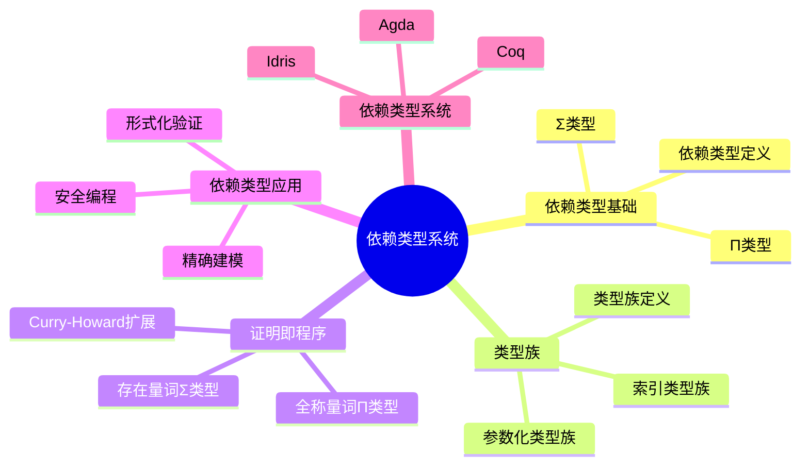
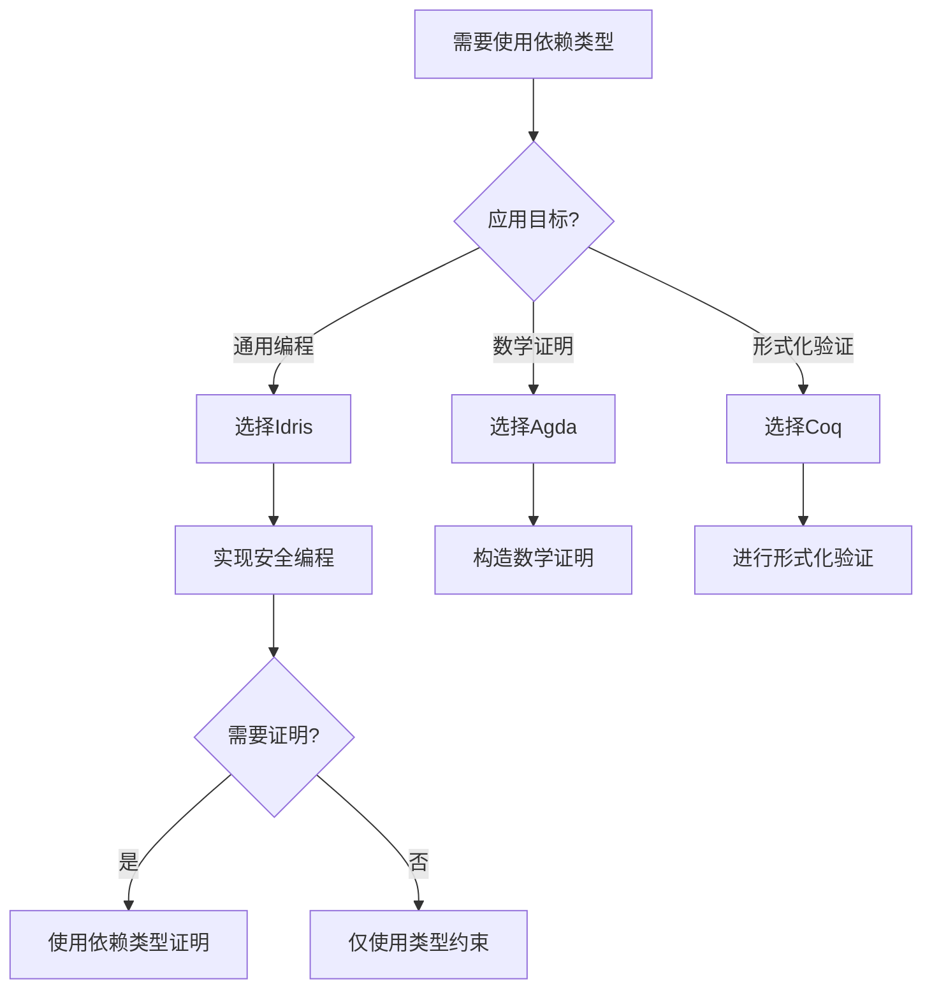
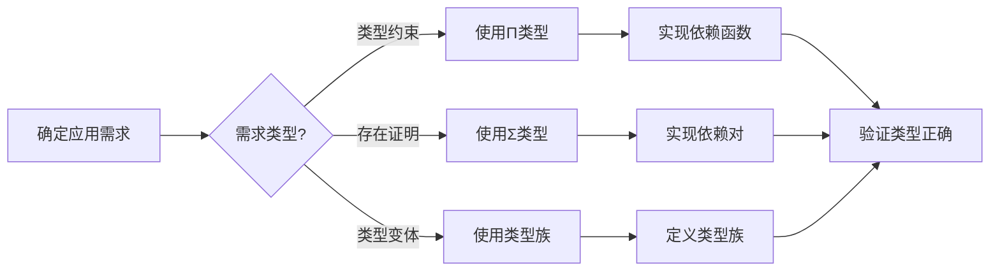
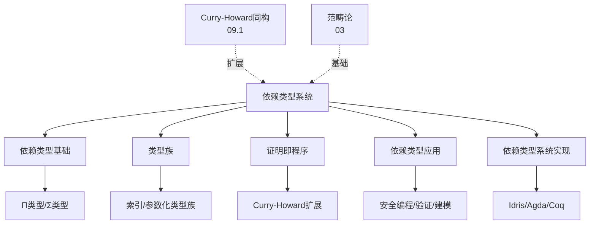
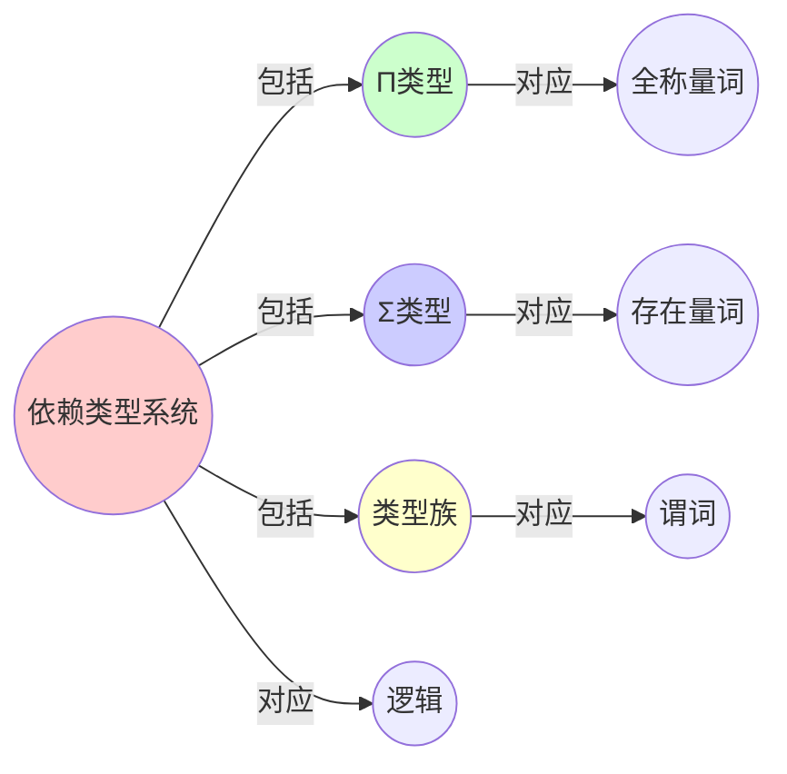
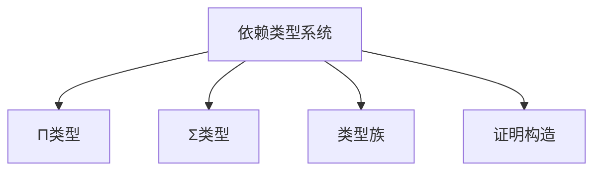

# 09.4 依赖类型系统

> **来源**: view08.md
> **创建日期**: 2025-01-27
> **最后更新**: 2025-01-27

## 📋 目录

- [09.4 依赖类型系统](#094-依赖类型系统)
  - [📋 目录](#-目录)
  - [📋 内容概览](#-内容概览)
  - [🎯 核心理念](#-核心理念)
  - [🔗 依赖类型基础](#-依赖类型基础)
    - [基本概念](#基本概念)
    - [依赖函数类型](#依赖函数类型)
    - [依赖对类型](#依赖对类型)
  - [📊 类型族](#-类型族)
    - [定义](#定义)
    - [索引类型族](#索引类型族)
    - [参数化类型族](#参数化类型族)
  - [🔍 证明即程序](#-证明即程序)
    - [Curry-Howard扩展](#curry-howard扩展)
    - [全称量词](#全称量词)
    - [存在量词](#存在量词)
  - [🎯 依赖类型应用](#-依赖类型应用)
    - [应用1：安全编程](#应用1安全编程)
    - [应用2：形式化验证](#应用2形式化验证)
    - [应用3：精确建模](#应用3精确建模)
  - [📈 依赖类型系统](#-依赖类型系统)
    - [Idris](#idris)
    - [Agda](#agda)
    - [Coq](#coq)
  - [📊 详细案例研究](#-详细案例研究)
    - [案例研究 1：依赖类型在数组边界检查中的应用](#案例研究-1依赖类型在数组边界检查中的应用)
    - [案例研究 2：依赖类型在排序算法验证中的应用](#案例研究-2依赖类型在排序算法验证中的应用)
    - [案例研究 3：依赖类型在矩阵运算中的应用](#案例研究-3依赖类型在矩阵运算中的应用)
  - [⚠️ 批判性分析与局限性](#️-批判性分析与局限性)
    - [局限性讨论](#局限性讨论)
      - [1. 依赖类型系统的复杂性](#1-依赖类型系统的复杂性)
      - [2. 表达能力与实用性的权衡](#2-表达能力与实用性的权衡)
      - [3. 性能开销](#3-性能开销)
    - [改进方向](#改进方向)
      - [1. 提高易用性](#1-提高易用性)
      - [2. 扩展应用领域](#2-扩展应用领域)
  - [📊 思维表征体系](#-思维表征体系)
    - [📊 1. 思维导图（增强版）](#-1-思维导图增强版)
      - [1.1 文本格式（基础版）](#11-文本格式基础版)
      - [1.2 Mermaid格式（可视化版）](#12-mermaid格式可视化版)
    - [📊 2. 多维对比矩阵](#-2-多维对比矩阵)
      - [2.1 依赖类型系统对比矩阵](#21-依赖类型系统对比矩阵)
      - [2.2 依赖类型对比矩阵](#22-依赖类型对比矩阵)
      - [2.3 应用场景对比矩阵](#23-应用场景对比矩阵)
    - [🌲 3. 决策树](#-3-决策树)
      - [3.1 依赖类型系统选择决策树](#31-依赖类型系统选择决策树)
    - [🛤️ 4. 决策逻辑路径](#️-4-决策逻辑路径)
      - [4.1 依赖类型应用路径](#41-依赖类型应用路径)
    - [🕸️ 5. 概念关系网络](#️-5-概念关系网络)
      - [5.1 依赖类型系统概念关系网络](#51-依赖类型系统概念关系网络)
    - [🗺️ 6. 知识图谱](#️-6-知识图谱)
      - [6.1 依赖类型系统知识图谱](#61-依赖类型系统知识图谱)
  - [📚 理论体系](#-理论体系)
    - [理论基础](#理论基础)
      - [类型论/逻辑学/计算理论基础](#类型论逻辑学计算理论基础)
      - [历史发展](#历史发展)
    - [理论框架](#理论框架)
      - [核心假设](#核心假设)
      - [基本概念体系](#基本概念体系)
      - [主要定理/结论](#主要定理结论)
      - [适用范围和边界](#适用范围和边界)
    - [当前知识共识](#当前知识共识)
      - [学术界共识](#学术界共识)
      - [主要争议点](#主要争议点)
      - [权威来源](#权威来源)
    - [与其他理论的关系](#与其他理论的关系)
      - [逻辑关系](#逻辑关系)
      - [映射关系](#映射关系)
  - [🔗 关联网络](#-关联网络)
    - [🔗 概念级关联](#-概念级关联)
      - [核心概念映射](#核心概念映射)
    - [🔗 理论级关联](#-理论级关联)
      - [理论基础](#理论基础-1)
    - [🔗 方法级关联](#-方法级关联)
      - [方法应用网络](#方法应用网络)
    - [🔗 应用场景关联](#-应用场景关联)
  - [🛤️ 学习路径](#️-学习路径)
    - [前置知识](#前置知识)
    - [后续学习](#后续学习)
    - [并行学习](#并行学习)
  - [🔗 相关文档](#-相关文档)
  - [📖 扩展阅读](#-扩展阅读)

---

## 📋 内容概览

本文档详细阐述依赖类型系统，包括依赖类型、类型族、证明即程序等概念。通过形式化方法，全面展示依赖类型系统的理论基础和实际应用。

---

## 🎯 核心理念

依赖类型系统允许类型依赖于值，这使得我们能够在类型层面表达更丰富的性质和不变量。通过依赖类型，我们可以将程序正确性的验证从运行时移到编译时。

## 🔗 依赖类型基础

### 基本概念

**依赖类型**：类型依赖于值的类型

**例子**：

```idris
Vec : (n : Nat) -> (a : Type) -> Type
Vec n a = ...  -- 长度为n的a向量
```

**特征**：

- **类型参数化**：类型可以参数化
- **值依赖**：类型可以依赖值
- **证明能力**：可以表达不变量

### 依赖函数类型

**定义**：Π类型（依赖函数类型）

**语法**：

```idris
(x : A) -> P x
```

**含义**：对任意x:A，返回类型P x

**例子**：

```idris
reverse : (n : Nat) -> Vec n a -> Vec n a
```

### 依赖对类型

**定义**：Σ类型（依赖对类型）

**语法**：

```idris
(x : A ** P x)
```

**含义**：存在x:A，使得P x成立

**例子**：

```idris
ExistsNonEmpty : (a : Type) -> Type
ExistsNonEmpty a = (n : Nat ** Vec (S n) a)
```

## 📊 类型族

### 定义

**类型族**：类型到类型的函数

**例子**：

```idris
List : Type -> Type
List a = ...
```

### 索引类型族

**定义**：类型族可以索引

**例子**：

```idris
Vec : Nat -> Type -> Type
Vec n a = ...
```

### 参数化类型族

**定义**：类型族可以参数化

**例子**：

```idris
Matrix : Nat -> Nat -> Type -> Type
Matrix m n a = ...
```

## 🔍 证明即程序

### Curry-Howard扩展

**对应**：

- **类型** ↔ **命题**
- **程序** ↔ **证明**
- **依赖类型** ↔ **全称/存在量词**

### 全称量词

**对应**：Π类型 ↔ ∀量词

**例子**：

```idris
-- 类型：对所有自然数n，存在向量反转
reverse : (n : Nat) -> Vec n a -> Vec n a
```

**证明**：程序即证明

### 存在量词

**对应**：Σ类型 ↔ ∃量词

**例子**：

```idris
-- 类型：存在非空向量
ExistsNonEmpty : (a : Type) -> Type
ExistsNonEmpty a = (n : Nat ** Vec (S n) a)
```

**证明**：构造即证明

## 🎯 依赖类型应用

### 应用1：安全编程

**应用**：保证程序安全性

**例子**：

```idris
-- 保证不会越界
index : (n : Nat) -> (i : Fin n) -> Vec n a -> a
```

**优势**：编译时保证安全性

### 应用2：形式化验证

**应用**：形式化验证程序

**例子**：

```idris
-- 证明排序算法的正确性
sort : (xs : List a) -> (ys : List a ** Sorted ys)
```

**优势**：程序即证明

### 应用3：精确建模

**应用**：精确建模领域

**例子**：

```idris
-- 精确建模矩阵维度
multiply : Matrix m n a -> Matrix n p a -> Matrix m p a
```

**优势**：类型系统保证正确性

## 📈 依赖类型系统

### Idris

**特点**：

- **完整依赖类型**：支持完整依赖类型
- **证明能力**：强大的证明能力
- **实用**：注重实用性

### Agda

**特点**：

- **严格依赖类型**：严格的依赖类型
- **证明助手**：强大的证明助手
- **研究导向**：研究导向

### Coq

**特点**：

- **证明助手**：强大的证明助手
- **程序提取**：可以从证明提取程序
- **形式化验证**：广泛用于形式化验证

## 📊 详细案例研究

### 案例研究 1：依赖类型在数组边界检查中的应用

**背景**：使用依赖类型系统在编译时保证数组访问的安全性，消除运行时边界检查。

**形式化分析**：

```idris
-- 类型：保证不会越界
index : (n : Nat) -> (i : Fin n) -> Vec n a -> a
index n i xs = ...

-- 使用示例
-- index 5 3 vec5  ✓ (3 < 5)
-- index 5 6 vec5  ✗ (类型错误，6 >= 5)
```

**关键发现**：

- ✅ 依赖类型在编译时捕获越界错误
- ✅ 无需运行时检查，提高性能
- ✅ 类型系统保证了程序的安全性

**应用价值**：

- ✅ 安全关键系统开发
- ✅ 高性能计算
- ✅ 减少运行时错误

### 案例研究 2：依赖类型在排序算法验证中的应用

**背景**：使用依赖类型系统证明排序算法的正确性。

**形式化分析**：

```idris
-- 类型：排序后列表是有序的且是原列表的排列
sort : (xs : List a) -> (ys : List a ** (Sorted ys, Permutation xs ys))
sort xs = ...

-- 类型检查器验证:
-- 1. 返回列表是有序的
-- 2. 返回列表是原列表的排列
```

**关键发现**：

- ✅ 依赖类型可以表达复杂的性质
- ✅ 类型检查器验证程序正确性
- ✅ 程序即证明，证明即程序

**应用价值**：

- ✅ 形式化验证算法
- ✅ 保证程序正确性
- ✅ 减少测试需求

### 案例研究 3：依赖类型在矩阵运算中的应用

**背景**：使用依赖类型系统保证矩阵运算的维度正确性。

**形式化分析**：

```idris
-- 类型：保证矩阵乘法维度正确
multiply : Matrix m n a -> Matrix n p a -> Matrix m p a
multiply m1 m2 = ...

-- 使用示例
-- multiply (Matrix 3 4) (Matrix 4 5) → Matrix 3 5  ✓
-- multiply (Matrix 3 4) (Matrix 3 5) → 类型错误  ✗
```

**关键发现**：

- ✅ 依赖类型保证维度一致性
- ✅ 编译时捕获维度错误
- ✅ 提高代码的可靠性和可维护性

**应用价值**：

- ✅ 科学计算库开发
- ✅ 数值计算安全性
- ✅ 减少维度相关的错误

## ⚠️ 批判性分析与局限性

### 局限性讨论

#### 1. 依赖类型系统的复杂性

**问题**：依赖类型系统比普通类型系统复杂得多，学习和使用门槛高。

**挑战**：

- ⚠️ 类型推导困难
- ⚠️ 需要显式类型注解
- ⚠️ 编译时间长

**应对策略**：

- ✅ 开发更好的类型推导算法
- ✅ 提供类型推导建议
- ✅ 优化编译性能

#### 2. 表达能力与实用性的权衡

**问题**：依赖类型系统虽然表达能力强，但在实用性方面可能不如普通类型系统。

**挑战**：

- ⚠️ 学习曲线陡峭
- ⚠️ 开发效率可能较低
- ⚠️ 工具链不够成熟

**改进方向**：

- ✅ 提高开发工具质量
- ✅ 提供更好的错误信息
- ✅ 平衡表达能力和易用性

#### 3. 性能开销

**问题**：依赖类型可能在运行时引入性能开销。

**挑战**：

- ⚠️ 类型擦除的实现
- ⚠️ 运行时类型检查
- ⚠️ 代码生成优化

**改进方向**：

- ✅ 优化类型擦除机制
- ✅ 减少运行时开销
- ✅ 改进代码生成

### 改进方向

#### 1. 提高易用性

**目标**：使依赖类型系统更容易使用。

**方法**：

- 改进类型推导
- 提供更好的错误信息
- 开发用户友好的工具

#### 2. 扩展应用领域

**目标**：将依赖类型系统应用到更多领域。

**方法**：

- 研究领域特定的类型系统
- 开发应用库
- 建立最佳实践

## 📊 思维表征体系

### 📊 1. 思维导图（增强版）

#### 1.1 文本格式（基础版）

```text
依赖类型系统
├── 依赖类型基础
│   ├── 依赖类型定义
│   ├── 依赖函数类型（Π类型）
│   └── 依赖对类型（Σ类型）
├── 类型族
│   ├── 类型族定义
│   ├── 索引类型族
│   └── 参数化类型族
├── 证明即程序
│   ├── Curry-Howard扩展
│   ├── 全称量词 ↔ Π类型
│   └── 存在量词 ↔ Σ类型
├── 依赖类型应用
│   ├── 安全编程
│   ├── 形式化验证
│   └── 精确建模
└── 依赖类型系统
    ├── Idris
    ├── Agda
    └── Coq
```

#### 1.2 Mermaid格式（可视化版）



### 📊 2. 多维对比矩阵

#### 2.1 依赖类型系统对比矩阵

| 系统 | Idris | Agda | Coq | 特点 |
|------|-------|------|-----|------|
| **语言特性** | 函数式 | 函数式 | 函数式+证明 | 特性不同 |
| **语法** | Haskell-like | Haskell-like | ML-like | 语法不同 |
| **证明风格** | 证明即程序 | 证明即程序 | 策略证明 | 风格不同 |
| **适用场景** | 通用编程 | 数学证明 | 形式化验证 | 场景不同 |
| **学习曲线** | 中 | 陡峭 | 陡峭 | 曲线不同 |
| **社区活跃度** | 中 | 高 | 很高 | 活跃度不同 |

#### 2.2 依赖类型对比矩阵

| 类型 | Π类型（依赖函数） | Σ类型（依赖对） | 类型族 | 应用 |
|------|----------------|--------------|--------|------|
| **逻辑对应** | ∀ 全称量词 | ∃ 存在量词 | 谓词 | 对应不同 |
| **语法** | (x : A) -> P x | (x : A, p : P x) | type family | 语法不同 |
| **表达能力** | 高 | 高 | 很高 | 能力不同 |
| **复杂度** | 中 | 中 | 高 | 复杂度不同 |
| **使用频率** | 高 | 中 | 中 | 频率不同 |

#### 2.3 应用场景对比矩阵

| 应用场景 | 安全编程 | 形式化验证 | 精确建模 | 优势 |
|---------|---------|-----------|---------|------|
| **使用依赖类型** | 类型约束 | 证明构造 | 精确类型 | 使用不同 |
| **复杂度** | 中 | 高 | 中 | 复杂度不同 |
| **开发效率** | 中 | 低 | 中 | 效率不同 |
| **正确性保证** | 高 | 很高 | 高 | 保证不同 |
| **适用领域** | 通用 | 关键系统 | 特定领域 | 领域不同 |

### 🌲 3. 决策树

#### 3.1 依赖类型系统选择决策树



### 🛤️ 4. 决策逻辑路径

#### 4.1 依赖类型应用路径



### 🕸️ 5. 概念关系网络

#### 5.1 依赖类型系统概念关系网络



### 🗺️ 6. 知识图谱

#### 6.1 依赖类型系统知识图谱



## 📚 理论体系

### 理论基础

#### 类型论/逻辑学/计算理论基础

依赖类型系统的理论基础：

**1. 类型论基础**：

- 依赖类型论
- 构造演算
- 类型系统

**2. 逻辑学基础**：

- 一阶逻辑
- 证明论
- 构造性逻辑

**3. 计算理论基础**：

- λ演算
- 计算理论
- 程序语义

#### 历史发展

**关键时间节点**：

- **1970-1980年代**：依赖类型理论建立
  - 构造演算
  - 依赖类型系统

- **1990年代**：实际系统发展
  - Coq系统
  - Agda系统

- **2000年代**：应用扩展
  - 形式化验证
  - 安全编程

- **2010年代至今**：现代发展
  - Idris系统
  - 类型驱动开发
  - 形式化验证工具

### 理论框架

#### 核心假设

**假设1：类型可以依赖值**

- **内容**：类型可以依赖于值
- **适用范围**：依赖类型系统
- **限制条件**：需要类型系统支持

**假设2：证明即程序**

- **内容**：构造证明即编写程序
- **适用范围**：构造性逻辑
- **限制条件**：需要构造性证明

**假设3：类型检查即证明验证**

- **内容**：类型检查对应证明验证
- **适用范围**：强依赖类型系统
- **限制条件**：需要类型系统支持

#### 基本概念体系



#### 主要定理/结论

**结论1：Π类型的表达能力**

- **内容**：Π类型可以表达全称量词
- **证据**：类型论证明
- **应用**：类型设计

**结论2：Σ类型的表达能力**

- **内容**：Σ类型可以表达存在量词
- **证据**：类型论证明
- **应用**：证明构造

**结论3：类型族的灵活性**

- **内容**：类型族提供灵活的类型变体
- **证据**：类型系统设计
- **应用**：精确建模

#### 适用范围和边界

**适用范围**：

- 形式化验证
- 安全编程
- 精确建模

**边界条件**：

- 需要类型系统支持
- 需要考虑计算复杂性
- 需要构造性逻辑

**不适用场景**：

- 无类型系统
- 非构造性逻辑
- 过于简单的任务

### 当前知识共识

#### 学术界共识

**广泛接受的共识**：

1. **依赖类型的表达能力**
   - **共识**：依赖类型系统表达能力很强
   - **支持证据**：理论和实践
   - **来源**：类型论、逻辑学

2. **证明即程序的价值**
   - **共识**：证明即程序提高正确性
   - **支持证据**：成功应用
   - **来源**：形式化验证

3. **类型检查的有效性**
   - **共识**：类型检查可以验证证明
   - **支持证据**：理论证明
   - **来源**：类型论

#### 主要争议点

1. **复杂性的权衡**
   - **观点A**：表达能力更重要
   - **观点B**：易用性更重要
   - **当前状态**：多数认为需要平衡

2. **实际应用的范围**
   - **观点A**：应该广泛使用
   - **观点B**：仅限特定领域
   - **当前状态**：多数认为渐进采用

#### 权威来源

**经典文献**：

- 《Type-Driven Development with Idris》- Edwin Brady
- 《Programming Language Foundations in Agda》- Philip Wadler
- 依赖类型相关文献

**权威机构/专家**：

- **ACM**
- **IEEE**
- **类型论研究会**

**最新发展**：

- **2020-2024**：类型驱动开发、形式化验证、安全编程
- **前沿方向**：同伦类型论、立方类型论、形式化验证工具

### 与其他理论的关系

#### 逻辑关系

**理论基础**：

- **Curry-Howard同构**（[09.1_逻辑与类型的对应.md](09.1_逻辑与类型的对应.md)） → 依赖类型系统
  - 关系类型：扩展应用
  - 关键映射：对应关系 → 依赖类型

**理论扩展**：

- **基本对应关系**（[09.2_基本对应关系详解.md](09.2_基本对应关系详解.md)） → 依赖类型系统
  - 关系类型：扩展对应
  - 关键映射：基本对应 → 依赖对应

#### 映射关系

| 本理论概念 | 映射理论 | 映射概念 | 映射类型 | 映射说明 |
|-----------|---------|---------|---------|----------|
| **Π类型** | 09.2_基本对应关系详解 | 全称对应 | 对应 | Π类型对应全称 |
| **Σ类型** | 09.2_基本对应关系详解 | 存在对应 | 对应 | Σ类型对应存在 |
| **类型族** | 03.3_极限与余极限 | 极限构造 | 相关 | 类型族对应构造 |
| **证明构造** | 09.5_实际应用 | 形式化验证 | 对应 | 证明构造对应验证 |

## 🔗 关联网络

### 🔗 概念级关联

#### 核心概念映射

| 本文档概念 | 关联文档 | 关联概念 | 关系类型 | 映射说明 |
|-----------|---------|---------|---------|----------|
| **Π类型** | 09.2_基本对应关系详解 | 全称对应 | 对应 | Π类型对应全称 |
| **Σ类型** | 09.2_基本对应关系详解 | 存在对应 | 对应 | Σ类型对应存在 |
| **类型族** | 03.3_极限与余极限 | 极限构造 | 相关 | 类型族对应构造 |
| **证明构造** | 09.5_实际应用 | 形式化验证 | 对应 | 证明构造对应验证 |
| **依赖类型系统** | 09.1_逻辑与类型的对应 | Curry-Howard扩展 | 对应 | 系统对应扩展 |
| **类型检查** | 09.5_实际应用 | 程序验证 | 对应 | 检查对应验证 |

### 🔗 理论级关联

#### 理论基础

- **本理论基于**：
  - [09.1_逻辑与类型的对应.md](09.1_逻辑与类型的对应.md) ⭐⭐⭐ - Curry-Howard同构
  - [09.2_基本对应关系详解.md](09.2_基本对应关系详解.md) ⭐⭐⭐ - 基本对应关系

- **本理论应用于**：
  - [09.5_实际应用.md](09.5_实际应用.md) ⭐⭐⭐ - 实际应用
  - 形式化验证 ⭐⭐⭐ - 实际应用

### 🔗 方法级关联

#### 方法应用网络

| 本文档方法 | 应用文档 | 应用场景 | 应用效果 |
|-----------|---------|---------|---------|
| **依赖类型** | 09.5_实际应用 | 形式化验证 | 成功 |
| **类型族** | 实际编程 | 精确建模 | 成功 |
| **证明构造** | 形式化验证 | 程序验证 | 成功 |

### 🔗 应用场景关联

**场景**：形式化开发

| 视角 | 关联文档 | 核心理论 | 关注点 |
|------|---------|---------|--------|
| **类型系统** | 本文档 | 依赖类型 | 类型设计 |
| **理论基础** | 09.1_逻辑与类型的对应 | Curry-Howard | 理论理解 |
| **实际应用** | 09.5_实际应用 | 应用案例 | 实践应用 |

## 🛤️ 学习路径

### 前置知识

**必须先学习**：

- [09.1_逻辑与类型的对应.md](09.1_逻辑与类型的对应.md) ⭐⭐⭐ - Curry-Howard同构
- [09.2_基本对应关系详解.md](09.2_基本对应关系详解.md) ⭐⭐⭐ - 基本对应关系
- 类型论基础 ⭐⭐

**建议先了解**：

- 函数式编程
- 逻辑学基础
- 证明论基础

### 后续学习

**建议接下来学习**（按顺序）：

1. [09.5_实际应用.md](09.5_实际应用.md) ⭐⭐⭐ - 实际应用
2. 实际依赖类型系统 ⭐⭐ - 实践应用
3. 形式化验证项目 ⭐⭐ - 项目实践

### 并行学习

**可以同时学习**：

- [09.3_范畴论视角.md](09.3_范畴论视角.md) - 范畴论视角
- 实际编程语言 - 类型系统实践

## 🔗 相关文档

- [09.1_逻辑与类型的对应.md](09.1_逻辑与类型的对应.md)
- [09.2_基本对应关系详解.md](09.2_基本对应关系详解.md)
- [09.3_范畴论视角.md](09.3_范畴论视角.md)

## 📖 扩展阅读

- 《Type-Driven Development with Idris》- Edwin Brady
- 《Programming Language Foundations in Agda》- Philip Wadler
- Wikipedia: [Dependent Type](https://en.wikipedia.org/wiki/Dependent_type)
