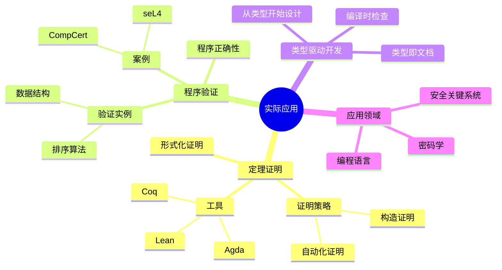
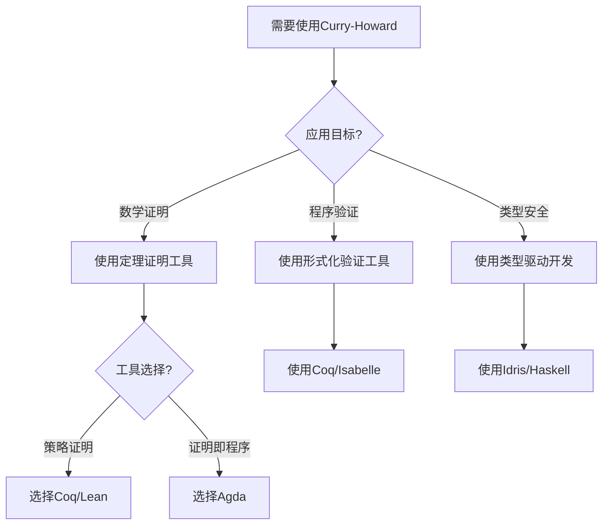
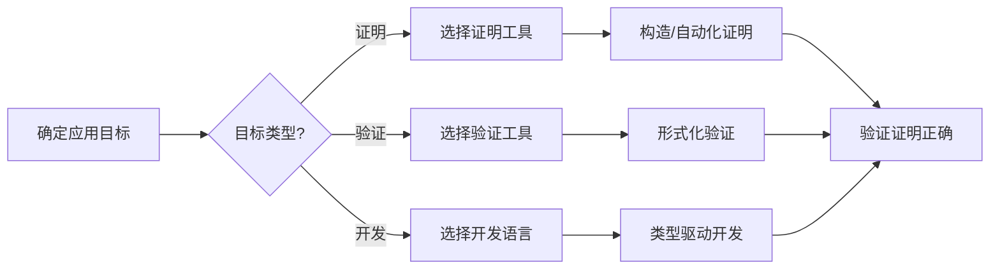
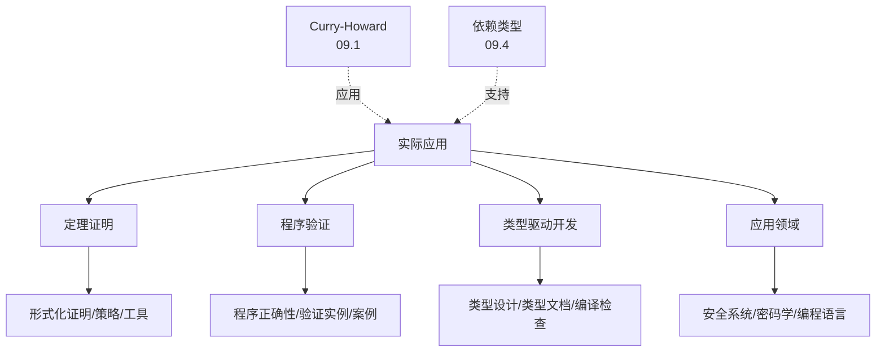
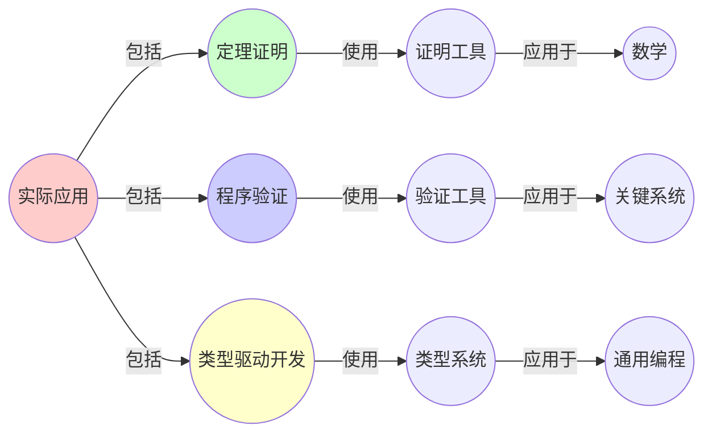
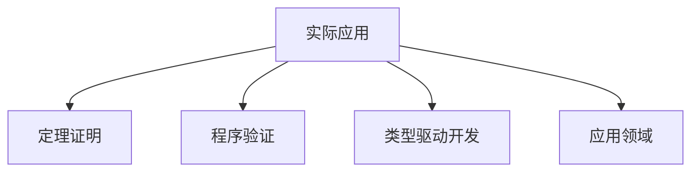

# 09.5 Curry-Howard同构的实际应用

> **来源**: view08.md
> **创建日期**: 2025-01-27
> **最后更新**: 2025-01-27

## 📋 目录

- [09.5 Curry-Howard同构的实际应用](#095-curry-howard同构的实际应用)
  - [📋 目录](#-目录)
  - [📋 内容概览](#-内容概览)
  - [🎯 核心理念](#-核心理念)
  - [🔍 定理证明](#-定理证明)
    - [形式化证明](#形式化证明)
    - [证明策略](#证明策略)
  - [💻 程序验证](#-程序验证)
    - [程序正确性](#程序正确性)
    - [验证实例](#验证实例)
      - [实例1：排序算法](#实例1排序算法)
      - [实例2：数据结构](#实例2数据结构)
  - [🔧 类型驱动开发](#-类型驱动开发)
    - [方法](#方法)
    - [优势](#优势)
  - [📊 实际应用案例](#-实际应用案例)
    - [案例1：编译器验证](#案例1编译器验证)
    - [案例2：操作系统验证](#案例2操作系统验证)
    - [案例3：密码学协议验证](#案例3密码学协议验证)
  - [🎯 应用领域](#-应用领域)
    - [领域1：安全关键系统](#领域1安全关键系统)
    - [领域2：密码学](#领域2密码学)
    - [领域3：编程语言](#领域3编程语言)
  - [📊 详细案例研究](#-详细案例研究)
    - [案例研究 1：CompCert编译器的形式化验证](#案例研究-1compcert编译器的形式化验证)
    - [案例研究 2：seL4微内核的形式化验证](#案例研究-2sel4微内核的形式化验证)
    - [案例研究 3：TLS协议的形式化验证](#案例研究-3tls协议的形式化验证)
  - [⚠️ 批判性分析与局限性](#️-批判性分析与局限性)
    - [局限性讨论](#局限性讨论)
      - [1. 形式化验证的成本](#1-形式化验证的成本)
      - [2. 验证覆盖的局限性](#2-验证覆盖的局限性)
      - [3. 工具的成熟度](#3-工具的成熟度)
    - [改进方向](#改进方向)
      - [1. 提高验证效率](#1-提高验证效率)
      - [2. 扩展应用范围](#2-扩展应用范围)
  - [📊 思维表征体系](#-思维表征体系)
    - [📊 1. 思维导图（增强版）](#-1-思维导图增强版)
      - [1.1 文本格式（基础版）](#11-文本格式基础版)
      - [1.2 Mermaid格式（可视化版）](#12-mermaid格式可视化版)
    - [📊 2. 多维对比矩阵](#-2-多维对比矩阵)
      - [2.1 应用领域对比矩阵](#21-应用领域对比矩阵)
      - [2.2 验证工具对比矩阵](#22-验证工具对比矩阵)
      - [2.3 应用案例对比矩阵](#23-应用案例对比矩阵)
    - [🌲 3. 决策树](#-3-决策树)
      - [3.1 应用选择决策树](#31-应用选择决策树)
    - [🛤️ 4. 决策逻辑路径](#️-4-决策逻辑路径)
      - [4.1 实际应用路径](#41-实际应用路径)
    - [🕸️ 5. 概念关系网络](#️-5-概念关系网络)
      - [5.1 实际应用概念关系网络](#51-实际应用概念关系网络)
    - [🗺️ 6. 知识图谱](#️-6-知识图谱)
      - [6.1 实际应用知识图谱](#61-实际应用知识图谱)
  - [📚 理论体系](#-理论体系)
    - [理论基础](#理论基础)
      - [形式化方法/软件工程/计算理论基础](#形式化方法软件工程计算理论基础)
      - [历史发展](#历史发展)
    - [理论框架](#理论框架)
      - [核心假设](#核心假设)
      - [基本概念体系](#基本概念体系)
      - [主要定理/结论](#主要定理结论)
      - [适用范围和边界](#适用范围和边界)
    - [当前知识共识](#当前知识共识)
      - [学术界共识](#学术界共识)
      - [主要争议点](#主要争议点)
      - [权威来源](#权威来源)
    - [与其他理论的关系](#与其他理论的关系)
      - [逻辑关系](#逻辑关系)
      - [映射关系](#映射关系)
  - [🔗 关联网络](#-关联网络)
    - [🔗 概念级关联](#-概念级关联)
      - [核心概念映射](#核心概念映射)
    - [🔗 理论级关联](#-理论级关联)
      - [理论基础](#理论基础-1)
    - [🔗 方法级关联](#-方法级关联)
      - [方法应用网络](#方法应用网络)
    - [🔗 应用场景关联](#-应用场景关联)
  - [🛤️ 学习路径](#️-学习路径)
    - [前置知识](#前置知识)
    - [后续学习](#后续学习)
    - [并行学习](#并行学习)
  - [🔗 相关文档](#-相关文档)
  - [📖 扩展阅读](#-扩展阅读)

---

## 📋 内容概览

本文档阐述Curry-Howard同构在实际中的应用，包括定理证明、程序验证等。通过实际案例，全面展示Curry-Howard同构在各个领域的应用价值。

---

## 🎯 核心理念

Curry-Howard同构不仅是一个理论概念，更是一个强大的实用工具。它将逻辑推理、类型系统和程序设计统一起来，为形式化验证、程序正确性保证和定理证明提供了有效的方法。

## 🔍 定理证明

### 形式化证明

**方法**：使用类型系统进行证明

**工具**：

- **Coq**：交互式定理证明器
- **Agda**：依赖类型编程语言
- **Lean**：现代定理证明器

### 证明策略

**策略1**：构造证明

**方法**：直接构造证明对象

**例子**：

```coq
Theorem and_comm : forall A B, A /\ B -> B /\ A.
Proof.
  intros A B H.
  destruct H as [HA HB].
  split.
  - exact HB.
  - exact HA.
Qed.
```

**策略2**：自动化证明

**方法**：使用自动化策略

**例子**：

```coq
Theorem and_comm : forall A B, A /\ B -> B /\ A.
Proof.
  auto.
Qed.
```

## 💻 程序验证

### 程序正确性

**目标**：证明程序满足规范

**方法**：

1. **规范**：编写程序规范
2. **实现**：实现程序
3. **证明**：证明实现满足规范

### 验证实例

#### 实例1：排序算法

**规范**：

```coq
Definition is_sorted (l : list nat) : Prop := ...
Definition is_permutation (l1 l2 : list nat) : Prop := ...

Theorem sort_correct :
  forall l, is_sorted (sort l) /\ is_permutation l (sort l).
```

**证明**：使用Coq证明排序算法的正确性

#### 实例2：数据结构

**规范**：

```coq
Definition is_bst (t : tree) : Prop := ...

Theorem insert_preserves_bst :
  forall t x, is_bst t -> is_bst (insert t x).
```

**证明**：证明插入操作保持BST性质

## 🔧 类型驱动开发

### 方法

**类型驱动开发**：从类型开始设计程序

**步骤**：

1. **定义类型**：定义数据类型
2. **编写规范**：编写类型规范
3. **实现程序**：实现满足类型的程序

### 优势

**优势1**：类型即文档

**说明**：类型系统提供文档

**优势2**：编译时检查

**说明**：编译时发现错误

**优势3**：重构安全

**说明**：类型系统保证重构安全

## 📊 实际应用案例

### 案例1：编译器验证

**应用**：验证编译器的正确性

**工具**：Coq

**成果**：

- **CompCert**：经过验证的C编译器
- **CakeML**：经过验证的ML编译器

### 案例2：操作系统验证

**应用**：验证操作系统的正确性

**工具**：Isabelle/HOL

**成果**：

- **seL4**：经过验证的微内核

### 案例3：密码学协议验证

**应用**：验证密码学协议

**工具**：Coq, EasyCrypt

**成果**：

- **TLS协议**：TLS协议的形式化验证
- **加密算法**：加密算法的形式化验证

## 🎯 应用领域

### 领域1：安全关键系统

**应用**：航空、医疗、金融系统

**要求**：高可靠性

**方法**：形式化验证

### 领域2：密码学

**应用**：密码学协议和算法

**要求**：安全性证明

**方法**：形式化验证

### 领域3：编程语言

**应用**：编程语言设计

**要求**：类型安全

**方法**：类型系统

## 📊 详细案例研究

### 案例研究 1：CompCert编译器的形式化验证

**背景**：CompCert是一个经过完全形式化验证的C编译器，使用Coq证明了编译器的正确性。

**形式化分析**：

```text
验证范围:
- C源代码语义
- 中间表示转换
- 目标代码生成

验证结果:
- 证明编译器保持程序语义
- 消除了一类编译器错误
- 提高了代码的可靠性
```

**关键发现**：

- ✅ 形式化验证可以消除编译器错误
- ✅ Curry-Howard同构提供了验证方法
- ✅ 验证的编译器具有更高的可靠性

**应用价值**：

- ✅ 安全关键系统开发
- ✅ 提高编译器质量
- ✅ 保证编译过程的正确性

### 案例研究 2：seL4微内核的形式化验证

**背景**：seL4是第一个经过完全形式化验证的通用操作系统内核，使用Isabelle/HOL验证。

**形式化分析**：

```text
验证内容:
- 功能正确性
- 安全性属性
- 性能保证

验证结果:
- 证明内核实现满足规范
- 保证系统安全性
- 消除了一类系统漏洞
```

**关键发现**：

- ✅ 形式化验证可以保证系统安全性
- ✅ Curry-Howard同构为验证提供了基础
- ✅ 验证的系统具有更高的可信度

**应用价值**：

- ✅ 安全关键系统
- ✅ 提高系统可靠性
- ✅ 减少安全漏洞

### 案例研究 3：TLS协议的形式化验证

**背景**：使用形式化方法验证TLS协议的安全性，发现并修复了多个安全漏洞。

**形式化分析**：

```text
验证方法:
- 协议模型
- 安全性属性
- 形式化证明

验证结果:
- 发现多个安全漏洞
- 验证了修复的有效性
- 提高了协议安全性
```

**关键发现**：

- ✅ 形式化验证可以发现安全漏洞
- ✅ Curry-Howard同构提供了验证框架
- ✅ 验证的协议更加安全可靠

**应用价值**：

- ✅ 网络安全协议设计
- ✅ 提高协议安全性
- ✅ 减少安全风险

## ⚠️ 批判性分析与局限性

### 局限性讨论

#### 1. 形式化验证的成本

**问题**：形式化验证需要大量的时间和人力成本。

**挑战**：

- ⚠️ 验证过程耗时
- ⚠️ 需要专业知识
- ⚠️ 验证成本高

**应对策略**：

- ✅ 开发自动化验证工具
- ✅ 提高验证效率
- ✅ 降低验证门槛

#### 2. 验证覆盖的局限性

**问题**：形式化验证可能无法覆盖所有方面。

**挑战**：

- ⚠️ 规范可能不完整
- ⚠️ 某些性质难以形式化
- ⚠️ 验证范围有限

**改进方向**：

- ✅ 完善规范定义
- ✅ 扩展验证范围
- ✅ 结合多种验证方法

#### 3. 工具的成熟度

**问题**：形式化验证工具还不够成熟，使用门槛高。

**挑战**：

- ⚠️ 工具学习曲线陡峭
- ⚠️ 文档和教程不足
- ⚠️ 社区支持有限

**改进方向**：

- ✅ 改进工具易用性
- ✅ 提供更好的文档
- ✅ 建立用户社区

### 改进方向

#### 1. 提高验证效率

**目标**：降低形式化验证的成本和时间。

**方法**：

- 开发自动化工具
- 改进验证策略
- 优化验证流程

#### 2. 扩展应用范围

**目标**：将形式化验证应用到更多领域。

**方法**：

- 研究新的验证方法
- 开发领域特定工具
- 建立应用案例库

## 📊 思维表征体系

### 📊 1. 思维导图（增强版）

#### 1.1 文本格式（基础版）

```text
Curry-Howard同构的实际应用
├── 定理证明
│   ├── 形式化证明
│   ├── 证明策略
│   │   ├── 构造证明
│   │   └── 自动化证明
│   └── 工具: Coq, Agda, Lean
├── 程序验证
│   ├── 程序正确性
│   ├── 验证实例
│   │   ├── 排序算法
│   │   └── 数据结构
│   └── 案例: CompCert, seL4
├── 类型驱动开发
│   ├── 从类型开始设计
│   ├── 类型即文档
│   └── 编译时检查
└── 应用领域
    ├── 安全关键系统
    ├── 密码学
    └── 编程语言
```

#### 1.2 Mermaid格式（可视化版）



### 📊 2. 多维对比矩阵

#### 2.1 应用领域对比矩阵

| 应用领域 | 定理证明 | 程序验证 | 类型驱动开发 | 复杂度 |
|---------|---------|---------|------------|--------|
| **使用工具** | Coq/Agda/Lean | Coq/Isabelle | Idris/Haskell | 工具不同 |
| **目标** | 数学证明 | 程序正确性 | 类型安全 | 目标不同 |
| **复杂度** | 高 | 很高 | 中 | 复杂度不同 |
| **适用场景** | 数学研究 | 关键系统 | 通用编程 | 场景不同 |
| **正确性保证** | 严格 | 严格 | 高 | 保证不同 |
| **开发效率** | 低 | 很低 | 中 | 效率不同 |

#### 2.2 验证工具对比矩阵

| 工具 | Coq | Agda | Lean | Isabelle | 特点 |
|------|-----|------|------|----------|------|
| **语言特性** | 函数式+策略 | 函数式 | 函数式+策略 | 函数式+策略 | 特性不同 |
| **证明风格** | 策略证明 | 证明即程序 | 策略+证明即程序 | 策略证明 | 风格不同 |
| **适用场景** | 形式化验证 | 数学证明 | 数学证明 | 形式化验证 | 场景不同 |
| **学习曲线** | 陡峭 | 陡峭 | 陡峭 | 陡峭 | 曲线相似 |
| **社区活跃度** | 高 | 中 | 很高 | 高 | 活跃度不同 |

#### 2.3 应用案例对比矩阵

| 案例 | CompCert | seL4 | 特点 | 验证范围 |
|------|----------|------|------|---------|
| **类型** | 编译器 | 操作系统内核 | 类型不同 | 不同 |
| **验证工具** | Coq | Isabelle | 工具不同 | 不同 |
| **验证范围** | 编译器正确性 | 内核安全 | 范围不同 | 不同 |
| **验证复杂度** | 很高 | 很高 | 复杂度相似 | 相似 |
| **实际影响** | 工业应用 | 研究应用 | 影响不同 | 不同 |

### 🌲 3. 决策树

#### 3.1 应用选择决策树



### 🛤️ 4. 决策逻辑路径

#### 4.1 实际应用路径



### 🕸️ 5. 概念关系网络

#### 5.1 实际应用概念关系网络



### 🗺️ 6. 知识图谱

#### 6.1 实际应用知识图谱



## 📚 理论体系

### 理论基础

#### 形式化方法/软件工程/计算理论基础

Curry-Howard同构实际应用的理论基础：

**1. 形式化方法基础**：

- 形式化验证
- 形式化证明
- 形式化规范

**2. 软件工程基础**：

- 软件正确性
- 软件验证
- 软件测试

**3. 计算理论基础**：

- 程序语义
- 计算理论
- 类型系统

#### 历史发展

**关键时间节点**：

- **1960-1970年代**：形式化方法建立
  - 形式化验证
  - 形式化证明

- **1980-1990年代**：工具发展
  - Coq系统
  - Isabelle系统

- **2000年代**：实际应用
  - CompCert项目
  - seL4项目

- **2010年代至今**：现代发展
  - 类型驱动开发
  - 形式化验证工具
  - 安全关键系统

### 理论框架

#### 核心假设

**假设1：形式化验证的有效性**

- **内容**：形式化验证可以保证正确性
- **适用范围**：形式化系统
- **限制条件**：需要形式化规范

**假设2：类型安全的价值**

- **内容**：类型安全提高程序质量
- **适用范围**：类型系统
- **限制条件**：需要类型系统支持

**假设3：证明即程序的优势**

- **内容**：证明即程序提高正确性
- **适用范围**：构造性证明
- **限制条件**：需要构造性逻辑

#### 基本概念体系



#### 主要定理/结论

**结论1：形式化验证的正确性**

- **内容**：形式化验证可以保证正确性
- **证据**：成功案例
- **应用**：关键系统

**结论2：类型驱动的价值**

- **内容**：类型驱动开发提高质量
- **证据**：实践验证
- **应用**：软件开发

**结论3：证明工具的有效性**

- **内容**：证明工具支持形式化证明
- **证据**：工具应用
- **应用**：数学证明

#### 适用范围和边界

**适用范围**：

- 安全关键系统
- 数学证明
- 类型安全编程

**边界条件**：

- 需要形式化规范
- 需要适当的工具
- 需要考虑成本

**不适用场景**：

- 无形式化需求
- 过于简单的系统
- 成本敏感的系统

### 当前知识共识

#### 学术界共识

**广泛接受的共识**：

1. **形式化验证的价值**
   - **共识**：形式化验证保证正确性
   - **支持证据**：成功案例
   - **来源**：形式化方法、软件工程

2. **类型安全的重要性**
   - **共识**：类型安全提高程序质量
   - **支持证据**：广泛实践
   - **来源**：软件工程、编程语言

3. **证明工具的实用性**
   - **共识**：证明工具支持形式化证明
   - **支持证据**：工具应用
   - **来源**：形式化方法、数学

#### 主要争议点

1. **形式化验证的成本**
   - **观点A**：成本值得投入
   - **观点B**：成本太高
   - **当前状态**：多数认为需要权衡

2. **应用范围**
   - **观点A**：应该广泛使用
   - **观点B**：仅限关键系统
   - **当前状态**：多数认为渐进采用

#### 权威来源

**经典文献**：

- 《Software Foundations》- Benjamin Pierce
- 《Certified Programming with Dependent Types》- Adam Chlipala
- 形式化验证相关文献

**权威机构/专家**：

- **ACM**
- **IEEE**
- **形式化方法研究会**

**最新发展**：

- **2020-2024**：类型驱动开发、形式化验证工具、安全关键系统
- **前沿方向**：自动化验证、机器学习验证、量子计算验证

### 与其他理论的关系

#### 逻辑关系

**理论基础**：

- **Curry-Howard同构**（[09.1_逻辑与类型的对应.md](09.1_逻辑与类型的对应.md)） → 实际应用
  - 关系类型：应用领域
  - 关键映射：对应关系 → 实际应用

**理论应用**：

- **依赖类型系统**（[09.4_依赖类型系统.md](09.4_依赖类型系统.md)） → 实际应用
  - 关系类型：技术支持
  - 关键映射：依赖类型 → 应用支持

#### 映射关系

| 本理论概念 | 映射理论 | 映射概念 | 映射类型 | 映射说明 |
|-----------|---------|---------|---------|----------|
| **定理证明** | 09.1_逻辑与类型的对应 | 证明即程序 | 对应 | 证明对应程序 |
| **程序验证** | 09.4_依赖类型系统 | 类型检查 | 对应 | 验证对应检查 |
| **类型驱动开发** | 09.2_基本对应关系详解 | 类型对应 | 对应 | 开发对应对应 |
| **形式化验证** | 实际应用 | 软件工程 | 相关 | 验证对应工程 |

## 🔗 关联网络

### 🔗 概念级关联

#### 核心概念映射

| 本文档概念 | 关联文档 | 关联概念 | 关系类型 | 映射说明 |
|-----------|---------|---------|---------|----------|
| **定理证明** | 09.1_逻辑与类型的对应 | 证明即程序 | 对应 | 证明对应程序 |
| **程序验证** | 09.4_依赖类型系统 | 类型检查 | 对应 | 验证对应检查 |
| **类型驱动开发** | 09.2_基本对应关系详解 | 类型对应 | 对应 | 开发对应对应 |
| **形式化验证** | 实际应用 | 软件工程 | 相关 | 验证对应工程 |
| **证明工具** | 09.4_依赖类型系统 | 依赖类型系统 | 对应 | 工具对应系统 |
| **类型安全** | 09.1_逻辑与类型的对应 | 类型对应 | 对应 | 安全对应对应 |

### 🔗 理论级关联

#### 理论基础

- **本理论基于**：
  - [09.1_逻辑与类型的对应.md](09.1_逻辑与类型的对应.md) ⭐⭐⭐ - Curry-Howard同构
  - [09.4_依赖类型系统.md](09.4_依赖类型系统.md) ⭐⭐⭐ - 依赖类型系统

- **本理论应用于**：
  - 形式化验证 ⭐⭐⭐ - 实际应用
  - 软件开发 ⭐⭐⭐ - 实际应用

### 🔗 方法级关联

#### 方法应用网络

| 本文档方法 | 应用文档 | 应用场景 | 应用效果 |
|-----------|---------|---------|---------|
| **定理证明** | 数学研究 | 形式化证明 | 成功 |
| **程序验证** | 关键系统 | 软件验证 | 成功 |
| **类型驱动开发** | 软件开发 | 类型安全 | 成功 |

### 🔗 应用场景关联

**场景**：形式化开发

| 视角 | 关联文档 | 核心理论 | 关注点 |
|------|---------|---------|--------|
| **实际应用** | 本文档 | 应用案例 | 应用实践 |
| **理论基础** | 09.1_逻辑与类型的对应 | Curry-Howard | 理论理解 |
| **类型系统** | 09.4_依赖类型系统 | 依赖类型 | 技术支持 |

## 🛤️ 学习路径

### 前置知识

**必须先学习**：

- [09.1_逻辑与类型的对应.md](09.1_逻辑与类型的对应.md) ⭐⭐⭐ - Curry-Howard同构
- [09.4_依赖类型系统.md](09.4_依赖类型系统.md) ⭐⭐⭐ - 依赖类型系统

**建议先了解**：

- 形式化方法基础
- 软件工程基础
- 编程语言基础

### 后续学习

**建议接下来学习**（按顺序）：

1. 实际证明工具 ⭐⭐⭐ - 工具实践
2. 形式化验证项目 ⭐⭐ - 项目实践
3. 类型驱动开发项目 ⭐⭐ - 开发实践

### 并行学习

**可以同时学习**：

- 实际编程项目 - 开发实践
- 形式化验证项目 - 验证实践

## 🔗 相关文档

- [09.1_逻辑与类型的对应.md](09.1_逻辑与类型的对应.md)
- [09.2_基本对应关系详解.md](09.2_基本对应关系详解.md)
- [09.3_范畴论视角.md](09.3_范畴论视角.md)
- [09.4_依赖类型系统.md](09.4_依赖类型系统.md)

## 📖 扩展阅读

- 《Software Foundations》- Benjamin Pierce
- 《Certified Programming with Dependent Types》- Adam Chlipala
- Wikipedia: [Formal Verification](https://en.wikipedia.org/wiki/Formal_verification)
