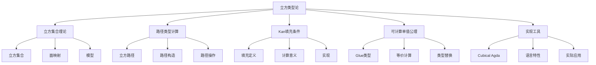
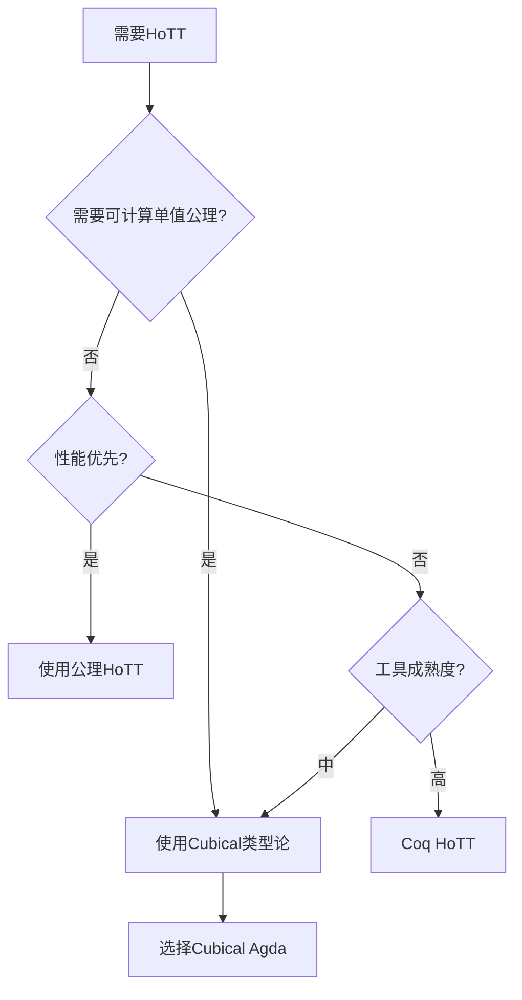
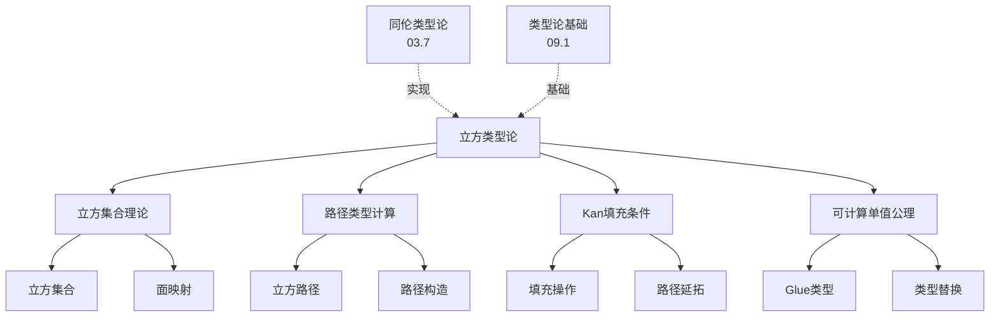

# 09.6 立方类型论

> **来源**: 基于2025年最新研究进展
> **创建日期**: 2025-11-14
> **最后更新**: 2025-11-14

## 📋 目录

- [09.6 立方类型论](#096-立方类型论)
  - [📋 目录](#-目录)
  - [📋 内容概览](#-内容概览)
  - [🎯 核心理念](#-核心理念)
  - [📦 立方集合理论](#-立方集合理论)
    - [基本概念](#基本概念)
    - [立方集合](#立方集合)
    - [面映射](#面映射)
  - [🛤️ 路径类型计算](#️-路径类型计算)
    - [立方路径](#立方路径)
    - [路径构造](#路径构造)
    - [路径操作](#路径操作)
  - [🔧 Kan填充条件](#-kan填充条件)
    - [定义](#定义)
    - [计算意义](#计算意义)
    - [实现方式](#实现方式)
  - [⚡ 可计算单值公理](#-可计算单值公理)
    - [单值公理的计算化](#单值公理的计算化)
    - [Glue类型](#glue类型)
    - [等价的计算](#等价的计算)
  - [💻 Cubical Agda实现](#-cubical-agda实现)
    - [语言特性](#语言特性)
    - [路径类型语法](#路径类型语法)
    - [实际编程](#实际编程)
  - [🔬 高阶归纳类型实现](#-高阶归纳类型实现)
    - [HIT的定义](#hit的定义)
    - [路径构造子](#路径构造子)
    - [填充操作](#填充操作)
  - [📊 详细案例研究](#-详细案例研究)
    - [案例研究 1：可计算单值公理的使用](#案例研究-1可计算单值公理的使用)
    - [案例研究 2：圆周的实现](#案例研究-2圆周的实现)
    - [案例研究 3：同伦群的计算](#案例研究-3同伦群的计算)
  - [⚠️ 批判性分析与局限性](#️-批判性分析与局限性)
    - [局限性讨论](#局限性讨论)
    - [改进方向](#改进方向)
  - [📊 思维表征体系](#-思维表征体系)
    - [📊 1. 思维导图（增强版）](#-1-思维导图增强版)
      - [1.1 文本格式（基础版）](#11-文本格式基础版)
      - [1.2 Mermaid格式（可视化版）](#12-mermaid格式可视化版)
    - [📊 2. 多维对比矩阵](#-2-多维对比矩阵)
      - [2.1 HoTT实现对比矩阵](#21-hott实现对比矩阵)
      - [2.2 路径类型实现对比矩阵](#22-路径类型实现对比矩阵)
    - [🌲 3. 决策树](#-3-决策树)
      - [3.1 选择HoTT实现决策树](#31-选择hott实现决策树)
    - [🕸️ 5. 概念关系网络](#️-5-概念关系网络)
      - [5.1 立方类型论概念关系网络](#51-立方类型论概念关系网络)
  - [📚 理论体系](#-理论体系)
    - [理论基础](#理论基础)
      - [数学基础](#数学基础)
      - [历史发展](#历史发展)
    - [理论框架](#理论框架)
      - [核心假设](#核心假设)
      - [主要定理/结论](#主要定理结论)
    - [当前知识共识](#当前知识共识)
      - [学术界共识](#学术界共识)
      - [主要争议点](#主要争议点)
      - [权威来源](#权威来源)
  - [🔗 关联网络](#-关联网络)
    - [🔗 概念级关联](#-概念级关联)
      - [核心概念映射](#核心概念映射)
    - [🔗 理论级关联](#-理论级关联)
      - [理论基础](#理论基础-1)
    - [🔗 方法级关联](#-方法级关联)
      - [方法应用网络](#方法应用网络)
  - [🛤️ 学习路径](#️-学习路径)
    - [前置知识](#前置知识)
    - [后续学习](#后续学习)
    - [并行学习](#并行学习)
  - [🔗 相关文档](#-相关文档)
    - [内部关联](#内部关联)
    - [外部资源](#外部资源)
  - [📖 扩展阅读](#-扩展阅读)
    - [经典教材](#经典教材)
    - [学术论文](#学术论文)
    - [在线资源](#在线资源)

---

## 📋 内容概览

立方类型论（Cubical Type Theory）是同伦类型论的**计算实现**，通过引入立方集合模型，实现了单值公理的**可计算性**。
与传统的HoTT相比，Cubical类型论不仅提供了相同的表达能力，更重要的是使得单值公理不再是不可计算的公理，而是可以通过Kan填充条件计算得出的结果。
本文档全面阐述立方类型论的核心概念、计算机制、实现细节和应用实践。

---

## 🎯 核心理念

**核心思想**：路径即立方，填充即计算，单值可计算

立方类型论的核心创新在于：

- **路径用立方表示**：路径类型通过立方集合模型表示
- **Kan填充条件**：通过填充条件实现路径的延拓和计算
- **可计算单值公理**：单值公理不再是公理，而是可计算的定理
- **构造性计算**：所有操作都是构造性的，可以直接计算

这种计算性使得Cubical类型论成为HoTT的实用实现，为形式化数学和程序验证提供了可执行的基础。

## 📦 立方集合理论

### 基本概念

**立方集合**（Cubical Sets）是立方类型论的数学模型基础。

**立方**：n维立方 [0,1]ⁿ，其中：

- **0维立方**：点
- **1维立方**：线段
- **2维立方**：正方形
- **3维立方**：立方体
- **n维立方**：超立方

### 立方集合

**立方集合**由立方和面映射组成：

```agda
-- 立方集合的定义
record CubicalSet : Type₁ where
  field
    cubes : (n : ℕ) → Type
    faces : {n : ℕ} → cubes n → (i : Fin n) (b : Bool) → cubes (n-1)
```

**面映射**：将n维立方的面映射到(n-1)维立方。

### 面映射

**面映射**指定立方如何映射到其面：

- **方向**：每个面有两个方向（i = 0 或 i = 1）
- **约束**：面映射必须满足一致性条件

**例子**：正方形的面映射

```text
    1-------1
    |       |
    |   2   |
    |       |
    0-------0
```

- 上面映射到上边（1维）
- 下面映射到下边（1维）
- 左面映射到左边（1维）
- 右面映射到右边（1维）

## 🛤️ 路径类型计算

### 立方路径

**立方路径**：在立方类型论中，路径通过立方表示。

```agda
-- 路径类型
Path : (A : Type) → A → A → Type
Path A x y = (i : I) → A

-- I是区间类型
postulate
  I : Type
  0ᵢ 1ᵢ : I
```

**区间I**：表示[0,1]区间，用于参数化路径。

### 路径构造

**路径构造**：通过函数构造路径。

```agda
-- 路径lambda
λ i → expr : Path A (expr[0/i]) (expr[1/i])

-- 例子：路径常量
refl : {A : Type} {a : A} → Path A a a
refl = λ i → a

-- 例子：路径反转
sym : {A : Type} {a b : A} → Path A a b → Path A b a
sym p = λ i → p (~ i)  -- ~表示取反

-- 例子：路径复合
_∙_ : {A : Type} {a b c : A}
    → Path A a b → Path A b c → Path A a c
p ∙ q = λ i → hcomp (λ j → λ { (i = i0) → p j
                              ; (i = i1) → q j })
                    (p i)
```

### 路径操作

**路径操作**包括：

- **路径应用**：`p i` 应用路径到点 i
- **路径反转**：`~ i` 反转路径方向
- **路径复合**：使用`hcomp`进行路径复合
- **路径约束**：通过模式匹配指定路径在边界的行为

## 🔧 Kan填充条件

### 定义

**Kan填充条件**（Kan Filling Condition）是立方类型论的核心，确保路径可以延拓。

**填充**：给定立方的所有面，可以填充完整立方。

```agda
-- Kan填充条件
hcomp : {A : Type} {φ : I}
      → (∀ i → Partial φ A)
      → A
      → A
```

**部分元素**：`Partial φ A` 表示在约束φ下的部分A值。

### 计算意义

**Kan填充条件**的计算意义：

- **路径延拓**：可以从部分路径延拓到完整路径
- **路径复合**：可以通过填充实现路径的复合
- **路径转换**：可以在不同路径表示间转换

### 实现方式

**实现方式**：通过`hcomp`和`transp`实现。

```agda
-- 传输操作
transp : (A : I → Type) (a : A i0) → A i1
transp A a = ...

-- 复合操作
hcomp : {A : Type} {φ : I}
      → (∀ i → Partial φ A)
      → A
      → A
hcomp {φ} u a0 = ...
```

## ⚡ 可计算单值公理

### 单值公理的计算化

**关键创新**：在Cubical类型论中，单值公理**可计算**。

```agda
-- 单值公理（可计算版本）
ua : {A B : Type} → (A ≃ B) → Path Type A B
ua e = ...

-- 单值公理的逆
ua⁻¹ : {A B : Type} → Path Type A B → (A ≃ B)
ua⁻¹ p = ...
```

**计算性**：`ua`和`ua⁻¹`都是可计算的函数，而非公理。

### Glue类型

**Glue类型**是实现可计算单值公理的关键构造：

```agda
Glue : (A : Type) {φ : I}
     → (Te : Partial φ (Σ[ T ∈ Type ] (T ≃ A)))
     → Type
```

**作用**：Glue类型允许在类型等价时"粘贴"结构。

### 等价的计算

**等价的计算**：通过Glue类型和填充条件实现。

```agda
-- 等价的计算
equivToPath : {A B : Type} → (A ≃ B) → Path Type A B
equivToPath e = ua e

-- 路径到等价
pathToEquiv : {A B : Type} → Path Type A B → (A ≃ B)
pathToEquiv p = ua⁻¹ p
```

## 💻 Cubical Agda实现

### 语言特性

**Cubical Agda**是Cubical类型论的完整实现：

- **区间类型I**：原生支持
- **路径类型**：`Path A x y`
- **部分类型**：`Partial φ A`
- **填充操作**：`hcomp`, `transp`
- **Glue类型**：原生支持

### 路径类型语法

**路径类型语法**：

```agda
-- 路径类型定义
_≡_ : {A : Type} → A → A → Type
_≡_ {A} x y = Path A x y

-- 路径构造
refl : {A : Type} {x : A} → x ≡ x
refl = λ i → x

-- 路径应用
ap : {A B : Type} {x y : A}
   → (f : A → B) → x ≡ y → f x ≡ f y
ap f p = λ i → f (p i)

-- 路径复合
_∙_ : {A : Type} {x y z : A}
    → x ≡ y → y ≡ z → x ≡ z
p ∙ q = λ i → hcomp (λ j → λ { (i = i0) → p j
                              ; (i = i1) → q j })
                    (p i)
```

### 实际编程

**实际编程示例**：

```agda
-- 函数外延性（可计算）
funExt : {A : Type} {B : A → Type}
       → {f g : (x : A) → B x}
       → ((x : A) → f x ≡ g x)
       → f ≡ g
funExt h = λ i → λ x → h x i

-- 单值公理的应用
transport : {A B : Type} → A ≃ B → A → B
transport e = equivFun (pathToEquiv (ua e))
```

## 🔬 高阶归纳类型实现

### HIT的定义

**高阶归纳类型**（Higher Inductive Types, HITs）在Cubical Agda中的定义：

```agda
-- 圆周 S¹
data S¹ : Type where
  base : S¹
  loop : base ≡ base

-- 球面 S²
data S² : Type where
  north : S²
  surf : refl {x = north} ≡ refl
```

### 路径构造子

**路径构造子**：HIT可以包含路径作为构造子。

```agda
-- 环面 T²
data T² : Type where
  base : T²
  loop₁ : base ≡ base
  loop₂ : base ≡ base
  surf : loop₁ ∙ loop₂ ≡ loop₂ ∙ loop₁
```

### 填充操作

**填充操作**：HIT的消除子使用填充条件。

```agda
-- 圆周的消除
S¹-elim : {P : S¹ → Type}
        → (b : P base)
        → (l : PathP (λ i → P (loop i)) b b)
        → (x : S¹) → P x
S¹-elim b l base = b
S¹-elim b l (loop i) = l i
```

## 📊 详细案例研究

### 案例研究 1：可计算单值公理的使用

**背景**：使用可计算单值公理进行类型替换。

**问题**：需要在类型等价时替换类型。

**Cubical Agda解决方案**：

```agda
-- 类型族
Family : Type → Type₁
Family A = A → Type

-- 通过等价转换类型族
transportFamily : {A B : Type} (e : A ≃ B)
                → Family A → Family B
transportFamily e P = λ b → transport (ua (sym≃ e)) (P (invEq e b))

-- 使用单值公理
example : {A B : Type} (e : A ≃ B) (P : Family A)
        → Path Type (Σ A P) (Σ B (transportFamily e P))
example e P = ua (Σ-cong-equiv e (λ a → idEquiv (P a)))
```

**关键优势**：

- ✅ 单值公理可计算
- ✅ 类型替换自动进行
- ✅ 不需要手动构造等价

### 案例研究 2：圆周的实现

**背景**：实现圆周S¹及其基本性质。

**Cubical Agda实现**：

```agda
-- 圆周定义
data S¹ : Type where
  base : S¹
  loop : base ≡ base

-- 路径空间
ΩS¹ : Type
ΩS¹ = base ≡ base

-- 路径空间是整数
ΩS¹≃ℤ : ΩS¹ ≃ ℤ
ΩS¹≃ℤ = ...

-- 使用单值公理
ΩS¹≡ℤ : Path Type ΩS¹ ℤ
ΩS¹≡ℤ = ua ΩS¹≃ℤ
```

**应用**：

- ✅ 计算基本群
- ✅ 研究纤维化
- ✅ 形式化同伦论

### 案例研究 3：同伦群的计算

**背景**：使用Cubical类型论计算同伦群。

**实现**：

```agda
-- n维球面
data Sⁿ : (n : ℕ) → Type where
  ...

-- n维同伦群
πₙ : (n : ℕ) (A : Type) (a : A) → Set
πₙ n A a = ∥ Ωⁿ A a n ∥₀

-- 计算π₁(S¹)
π₁S¹ : πₙ 1 S¹ base ≃ ℤ
π₁S¹ = ...

-- 使用单值公理
π₁S¹≡ℤ : Path Type (πₙ 1 S¹ base) ℤ
π₁S¹≡ℤ = ua π₁S¹
```

**优势**：

- ✅ 构造性计算
- ✅ 可以直接提取值
- ✅ 类型安全的计算

## ⚠️ 批判性分析与局限性

### 局限性讨论

**1. 计算复杂度**

- **问题**：填充操作的计算可能复杂
- **影响**：类型检查可能变慢
- **现状**：编译器优化在改进

**2. 学习曲线**

- **问题**：需要理解立方集合模型
- **影响**：入门门槛较高
- **现状**：需要更好的教程

**3. 工具成熟度**

- **问题**：Cubical Agda仍在发展
- **影响**：某些特性可能不稳定
- **现状**：社区活跃，持续改进

**4. 性能问题**

- **问题**：某些操作可能较慢
- **影响**：大型项目可能受影响
- **现状**：性能优化在进行

### 改进方向

**1. 性能优化**

- 优化填充算法
- 改进类型检查
- 开发专用编译器

**2. 工具改进**

- 改进IDE支持
- 开发调试工具
- 优化错误信息

**3. 教育和推广**

- 编写更好的教程
- 开发可视化工具
- 提供更多例子

**4. 理论研究**

- 研究计算模型
- 优化算法
- 扩展应用范围

## 📊 思维表征体系

### 📊 1. 思维导图（增强版）

#### 1.1 文本格式（基础版）

```text
立方类型论
├── 立方集合理论
│   ├── 立方集合
│   ├── 面映射
│   └── 模型
├── 路径类型计算
│   ├── 立方路径
│   ├── 路径构造
│   └── 路径操作
├── Kan填充条件
│   ├── 填充定义
│   ├── 计算意义
│   └── 实现
├── 可计算单值公理
│   ├── Glue类型
│   ├── 等价计算
│   └── 类型替换
└── 实现工具
    ├── Cubical Agda
    ├── 语言特性
    └── 实际应用
```

#### 1.2 Mermaid格式（可视化版）



### 📊 2. 多维对比矩阵

#### 2.1 HoTT实现对比矩阵

| 特征 | 公理HoTT | Cubical类型论 | 其他实现 |
|------|---------|--------------|---------|
| **单值公理** | 公理 | 可计算 | 其他方式 |
| **计算性** | ❌ | ✅ | ⚠️ |
| **填充条件** | ❌ | ✅ | ❌ |
| **Glue类型** | ❌ | ✅ | ❌ |
| **性能** | 高 | 中 | 中 |
| **成熟度** | 高 | 中 | 低 |

#### 2.2 路径类型实现对比矩阵

| 特征 | 命题相等 | 路径类型 | 立方路径 |
|------|---------|---------|---------|
| **计算性** | ❌ | ⚠️ | ✅ |
| **路径复合** | 公理 | 构造 | 可计算 |
| **路径反转** | 公理 | 构造 | 可计算 |
| **填充** | ❌ | ❌ | ✅ |
| **性能** | 高 | 中 | 中 |

### 🌲 3. 决策树

#### 3.1 选择HoTT实现决策树



### 🕸️ 5. 概念关系网络

#### 5.1 立方类型论概念关系网络



## 📚 理论体系

### 理论基础

#### 数学基础

立方类型论的理论基础：

**1. 立方集合理论**：

- 立方集合
- 面映射
- Kan条件

**2. 同伦类型论**：

- 路径类型
- 单值公理
- 高阶归纳类型

**3. 计算理论**：

- 构造性数学
- 类型论
- 程序验证

#### 历史发展

**关键时间节点**：

- **2013-2015年**：Cubical类型论的提出
  - 发现可计算的单值公理
  - 引入立方集合模型

- **2016-2018年**：Cubical Agda的开发
  - 完整实现
  - 工具支持

- **2019-2021年**：应用和优化
  - 大量形式化项目
  - 性能优化

- **2022-2025年**：成熟和推广
  - 工具成熟
  - 教育推广

### 理论框架

#### 核心假设

**假设1：立方集合模型**

- **内容**：类型可以用立方集合模型
- **适用范围**：所有类型
- **限制条件**：需要理解模型

**假设2：Kan填充条件**

- **内容**：填充条件成立
- **适用范围**：所有立方集合
- **限制条件**：计算复杂度

**假设3：可计算性**

- **内容**：单值公理可计算
- **适用范围**：所有类型等价
- **限制条件**：性能考虑

#### 主要定理/结论

**定理1：单值公理可计算**

- **内容**：单值公理通过Glue类型可计算
- **证据**：立方集合模型
- **应用**：类型替换

**定理2：Kan填充条件**

- **内容**：填充条件保证路径延拓
- **证据**：立方集合性质
- **应用**：路径计算

**结论3：构造性计算**

- **内容**：所有操作都是构造性的
- **证据**：模型构造
- **应用**：程序验证

### 当前知识共识

#### 学术界共识

**广泛接受的共识**：

1. **Cubical类型论的重要性**
   - **共识**：Cubical类型论是HoTT的重要实现
   - **支持证据**：大量应用
   - **来源**：形式化数学社区

2. **可计算性的价值**
   - **共识**：可计算单值公理是重要进步
   - **支持证据**：简化形式化
   - **来源**：实践应用

#### 主要争议点

1. **性能vs可计算性**
   - **观点A**：可计算性更重要
   - **观点B**：性能也很重要
   - **当前状态**：两者都在改进

2. **复杂度**
   - **观点A**：复杂度可以接受
   - **观点B**：需要简化
   - **当前状态**：工具在改进

#### 权威来源

**经典文献**：

- 《Cubical Type Theory》- Various authors
- 《Computational Content of Univalence》- Various authors
- Cubical Agda文档

**权威机构/专家**：

- **Cubical类型论研究组**
- **Cubical Agda团队**
- **形式化数学社区**

## 🔗 关联网络

### 🔗 概念级关联

#### 核心概念映射

| Cubical概念 | 对应概念 | 关联文档 |
|------------|---------|---------|
| 立方路径 | 路径类型 | [03.7_同伦类型论.md](../03_范畴论与形式化方法/03.7_同伦类型论.md) |
| Kan填充 | 路径延拓 | [09.1_逻辑与类型的对应.md](09.1_逻辑与类型的对应.md) |
| Glue类型 | 类型粘贴 | [09.4_依赖类型系统.md](09.4_依赖类型系统.md) |
| 可计算单值 | 类型替换 | [09.5_实际应用.md](09.5_实际应用.md) |

### 🔗 理论级关联

#### 理论基础

- **同伦类型论**：提供了理论基础
- **立方集合理论**：提供了模型
- **类型论**：提供了语法基础

### 🔗 方法级关联

#### 方法应用网络

| 方法 | 应用场景 | 相关工具 |
|------|---------|---------|
| 立方路径 | 路径计算 | Cubical Agda |
| Kan填充 | 路径延拓 | Cubical Agda |
| Glue类型 | 类型替换 | Cubical Agda |
| 可计算单值 | 等价计算 | Cubical Agda |

## 🛤️ 学习路径

### 前置知识

**必需知识**：

1. **同伦类型论基础**
   - 路径类型
   - 单值公理
   - 高阶归纳类型

2. **类型论基础**
   - 依赖类型
   - 归纳类型
   - 函数类型

3. **函数式编程**
   - Agda基础
   - 模式匹配
   - 递归

**推荐学习顺序**：

1. 学习同伦类型论（[03.7_同伦类型论.md](../03_范畴论与形式化方法/03.7_同伦类型论.md)）
2. 学习Agda基础
3. 学习Cubical Agda
4. 实践项目

### 后续学习

**深入方向**：

1. **高级Cubical特性**
   - 模态类型
   - 更高维度
   - 性能优化

2. **应用项目**
   - 数学形式化
   - 程序验证
   - 工具开发

### 并行学习

**相关主题**：

- **同伦类型论**（[03.7_同伦类型论.md](../03_范畴论与形式化方法/03.7_同伦类型论.md)）
- **依赖类型**（[09.4_依赖类型系统.md](09.4_依赖类型系统.md)）
- **形式化验证**（[07.6_AI系统形式化验证.md](../07_IT行业形式化应用/07.6_AI系统形式化验证.md)）

## 🔗 相关文档

### 内部关联

- [03.7_同伦类型论.md](../03_范畴论与形式化方法/03.7_同伦类型论.md) - 理论基础
- [09.1_逻辑与类型的对应.md](09.1_逻辑与类型的对应.md) - 类型论基础
- [09.4_依赖类型系统.md](09.4_依赖类型系统.md) - 依赖类型
- [09.5_实际应用.md](09.5_实际应用.md) - 实际应用

### 外部资源

- Cubical Agda文档: https://agda.readthedocs.io/en/latest/language/cubical.html
- Cubical Type Theory论文
- 在线教程和例子

## 📖 扩展阅读

### 经典教材

1. **《Cubical Type Theory》**
   - 作者：Various authors
   - 内容：Cubical类型论的完整介绍

2. **《Computational Content of Univalence》**
   - 内容：单值公理的计算内容

### 学术论文

1. **Cubical类型论原始论文**
   - 可计算单值公理
   - Kan填充条件

2. **实现论文**
   - Cubical Agda实现
   - 性能优化

### 在线资源

1. **Cubical Agda文档**
   - 语言特性
   - 使用指南

2. **示例代码**
   - GitHub仓库
   - 教程项目

---

**文档版本**: v1.0
**最后更新**: 2025-11-14
**维护者**: FormalScience项目组
