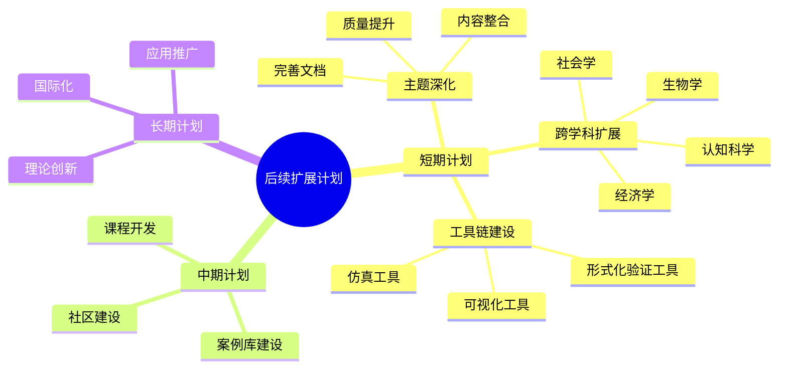
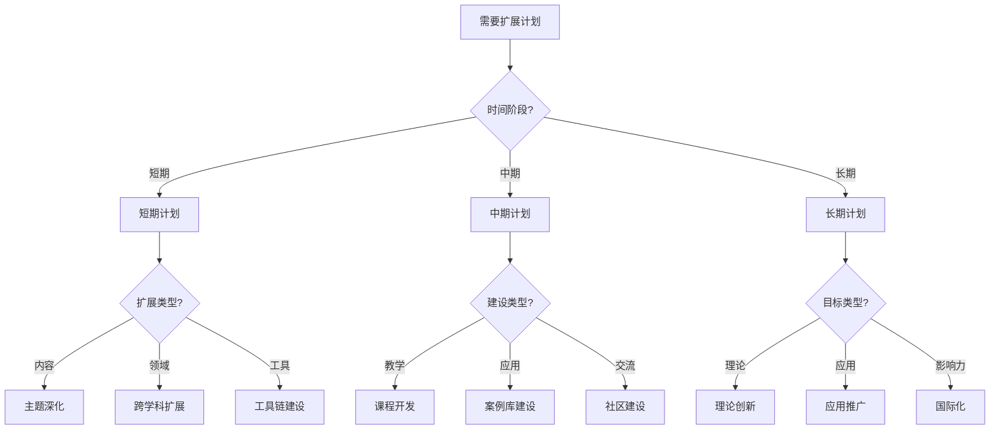
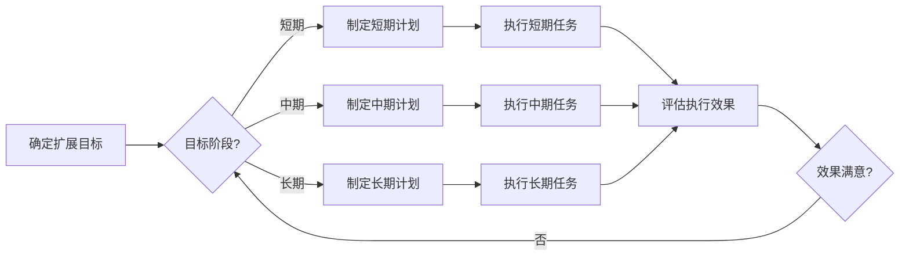
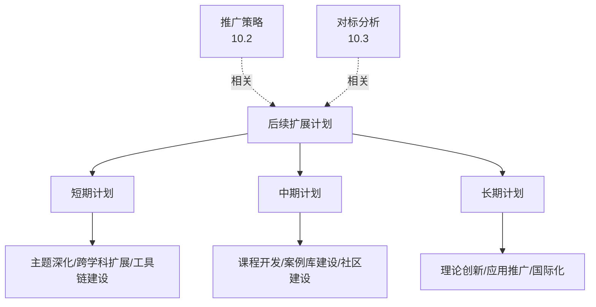
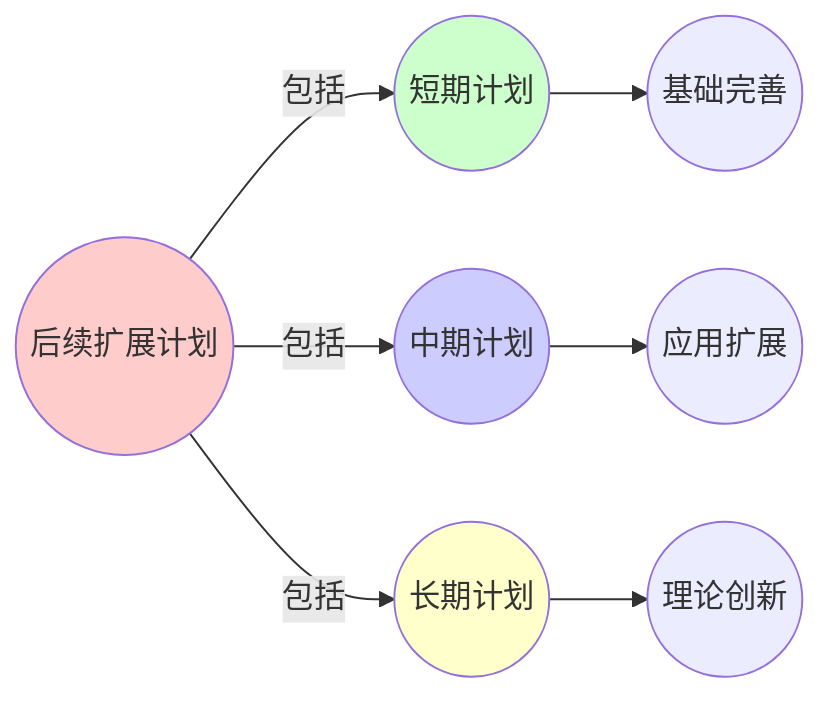
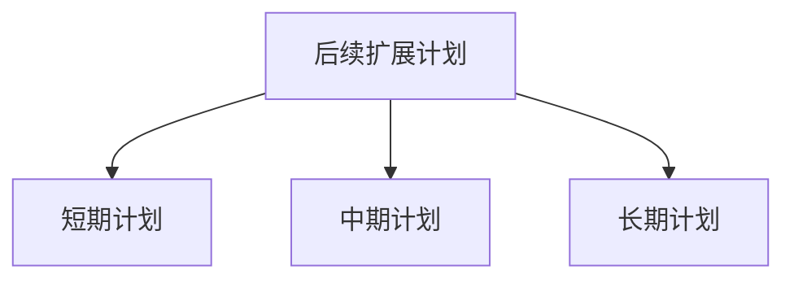

# 10.1 后续扩展计划

> **创建日期**: 2025-01-27
> **最后更新**: 2025-01-27

## 📋 目录

- [10.1 后续扩展计划](#101-后续扩展计划)
  - [📋 目录](#-目录)
  - [📋 内容概览](#-内容概览)
  - [🎯 核心理念](#-核心理念)
  - [📅 短期计划（1-3个月）](#-短期计划1-3个月)
    - [1. 主题深化](#1-主题深化)
      - [1.1 完善各主题的详细文档](#11-完善各主题的详细文档)
      - [1.2 内容整合](#12-内容整合)
      - [1.3 质量提升](#13-质量提升)
    - [2. 跨学科扩展](#2-跨学科扩展)
      - [2.1 生物学中的形式化](#21-生物学中的形式化)
      - [2.2 经济学中的形式化](#22-经济学中的形式化)
      - [2.3 社会学中的形式化](#23-社会学中的形式化)
      - [2.4 认知科学中的形式化](#24-认知科学中的形式化)
    - [3. 工具链建设](#3-工具链建设)
      - [3.1 形式化验证工具集成](#31-形式化验证工具集成)
      - [3.2 复杂系统仿真工具](#32-复杂系统仿真工具)
      - [3.3 可视化工具](#33-可视化工具)
  - [📅 中期计划（3-6个月）](#-中期计划3-6个月)
    - [1. 课程开发](#1-课程开发)
      - [1.1 形式科学导论课程](#11-形式科学导论课程)
      - [1.2 动力学系统应用课程](#12-动力学系统应用课程)
      - [1.3 范畴论实践课程](#13-范畴论实践课程)
    - [2. 案例库建设](#2-案例库建设)
      - [2.1 IT行业案例库](#21-it行业案例库)
      - [2.2 生物医学案例库](#22-生物医学案例库)
      - [2.3 社会科学案例库](#23-社会科学案例库)
    - [3. 社区建设](#3-社区建设)
      - [3.1 学术交流平台](#31-学术交流平台)
      - [3.2 定期研讨会](#32-定期研讨会)
      - [3.3 合作网络](#33-合作网络)
  - [📅 长期计划（6-12个月）](#-长期计划6-12个月)
    - [1. 理论创新](#1-理论创新)
      - [1.1 新形式化框架](#11-新形式化框架)
      - [1.2 跨学科统一理论](#12-跨学科统一理论)
      - [1.3 元理论深化](#13-元理论深化)
    - [2. 应用推广](#2-应用推广)
      - [2.1 工业界应用](#21-工业界应用)
      - [2.2 教育界推广](#22-教育界推广)
      - [2.3 研究机构合作](#23-研究机构合作)
    - [3. 国际化](#3-国际化)
      - [3.1 英文文档翻译](#31-英文文档翻译)
      - [3.2 国际会议参与](#32-国际会议参与)
      - [3.3 国际合作项目](#33-国际合作项目)
  - [📊 计划执行跟踪](#-计划执行跟踪)
    - [进度跟踪表](#进度跟踪表)
    - [关键里程碑](#关键里程碑)
  - [📊 详细案例研究](#-详细案例研究)
    - [案例研究 1：MIT OpenCourseWare的成功经验](#案例研究-1mit-opencourseware的成功经验)
    - [案例研究 2：GitHub开源项目的社区建设](#案例研究-2github开源项目的社区建设)
    - [案例研究 3：Coursera在线课程的成功模式](#案例研究-3coursera在线课程的成功模式)
  - [⚠️ 批判性分析与局限性](#️-批判性分析与局限性)
    - [局限性讨论](#局限性讨论)
      - [1. 计划执行的挑战](#1-计划执行的挑战)
      - [2. 计划调整的必要性](#2-计划调整的必要性)
      - [3. 长期可持续性](#3-长期可持续性)
    - [改进方向](#改进方向)
      - [1. 建立执行机制](#1-建立执行机制)
      - [2. 提高灵活性](#2-提高灵活性)
  - [📊 思维表征体系](#-思维表征体系)
    - [📊 1. 思维导图（增强版）](#-1-思维导图增强版)
      - [1.1 文本格式（基础版）](#11-文本格式基础版)
      - [1.2 Mermaid格式（可视化版）](#12-mermaid格式可视化版)
    - [📊 2. 多维对比矩阵](#-2-多维对比矩阵)
      - [2.1 计划阶段对比矩阵](#21-计划阶段对比矩阵)
      - [2.2 扩展领域对比矩阵](#22-扩展领域对比矩阵)
      - [2.3 建设内容对比矩阵](#23-建设内容对比矩阵)
    - [🌲 3. 决策树](#-3-决策树)
      - [3.1 扩展计划选择决策树](#31-扩展计划选择决策树)
    - [🛤️ 4. 决策逻辑路径](#️-4-决策逻辑路径)
      - [4.1 扩展计划实施路径](#41-扩展计划实施路径)
    - [🕸️ 5. 概念关系网络](#️-5-概念关系网络)
      - [5.1 扩展计划概念关系网络](#51-扩展计划概念关系网络)
    - [🗺️ 6. 知识图谱](#️-6-知识图谱)
      - [6.1 扩展计划知识图谱](#61-扩展计划知识图谱)
  - [📚 理论体系](#-理论体系)
    - [理论基础](#理论基础)
      - [项目管理/战略规划/知识管理基础](#项目管理战略规划知识管理基础)
      - [历史发展](#历史发展)
    - [理论框架](#理论框架)
      - [核心假设](#核心假设)
      - [基本概念体系](#基本概念体系)
      - [主要定理/结论](#主要定理结论)
      - [适用范围和边界](#适用范围和边界)
    - [当前知识共识](#当前知识共识)
      - [学术界共识](#学术界共识)
      - [主要争议点](#主要争议点)
      - [权威来源](#权威来源)
    - [与其他理论的关系](#与其他理论的关系)
      - [逻辑关系](#逻辑关系)
      - [映射关系](#映射关系)
  - [🔗 关联网络](#-关联网络)
    - [🔗 概念级关联](#-概念级关联)
      - [核心概念映射](#核心概念映射)
    - [🔗 理论级关联](#-理论级关联)
      - [理论基础](#理论基础-1)
    - [🔗 方法级关联](#-方法级关联)
      - [方法应用网络](#方法应用网络)
    - [🔗 应用场景关联](#-应用场景关联)
  - [🛤️ 学习路径](#️-学习路径)
    - [前置知识](#前置知识)
    - [后续学习](#后续学习)
    - [并行学习](#并行学习)
  - [🔗 相关文档](#-相关文档)
  - [📝 更新日志](#-更新日志)

---

## 📋 内容概览

本文档详细阐述形式科学主题的后续扩展计划，包括短期、中期和长期计划。通过系统化的规划，确保项目的持续发展和质量的不断提升。

---

## 🎯 核心理念

扩展计划的核心理念是系统化、阶段化和可持续化。通过短期、中期和长期的规划，我们可以逐步完善内容、扩展应用、建设社区，最终形成一个完整、高质量、可持续发展的形式科学知识体系。

## 📅 短期计划（1-3个月）

### 1. 主题深化

#### 1.1 完善各主题的详细文档

- [ ] 为每个主题创建子主题文件
- [ ] 补充实际案例研究
- [ ] 添加代码示例和可视化
- [ ] 完善交叉引用

#### 1.2 内容整合

- [ ] 整合view文件夹内容到对应主题
- [ ] 创建内容索引
- [ ] 建立知识图谱
- [ ] 统一文档格式

#### 1.3 质量提升

- [ ] 校对和修订现有文档
- [ ] 补充参考文献
- [ ] 添加图表和可视化
- [ ] 优化文档结构

### 2. 跨学科扩展

#### 2.1 生物学中的形式化

- [ ] 基因调控网络的形式化
- [ ] 生态系统动力学建模
- [ ] 进化论的形式化框架
- [ ] 生物信息学应用

#### 2.2 经济学中的形式化

- [ ] 市场动力学建模
- [ ] 博弈论应用
- [ ] 金融系统复杂性
- [ ] 经济网络分析

#### 2.3 社会学中的形式化

- [ ] 社交网络分析
- [ ] 社会动力学建模
- [ ] 文化传播模型
- [ ] 组织行为形式化

#### 2.4 认知科学中的形式化

- [ ] 认知过程建模
- [ ] 学习理论形式化
- [ ] 决策动力学
- [ ] 意识理论形式化

### 3. 工具链建设

#### 3.1 形式化验证工具集成

- [ ] Coq工具使用指南
- [ ] Isabelle/HOL教程
- [ ] Agda实践案例
- [ ] 工具对比分析

#### 3.2 复杂系统仿真工具

- [ ] NetLogo教程
- [ ] Vensim使用指南
- [ ] 仿真案例库
- [ ] 工具集成方案

#### 3.3 可视化工具

- [ ] 知识图谱可视化
- [ ] 网络分析可视化
- [ ] 动力学系统可视化
- [ ] 交互式演示

## 📅 中期计划（3-6个月）

### 1. 课程开发

#### 1.1 形式科学导论课程

- [ ] 课程大纲设计
- [ ] 课件制作
- [ ] 习题和作业
- [ ] 在线课程平台

#### 1.2 动力学系统应用课程

- [ ] 理论基础部分
- [ ] 实践应用部分
- [ ] 案例分析
- [ ] 项目实践

#### 1.3 范畴论实践课程

- [ ] 基础理论
- [ ] 编程实践
- [ ] 数据库应用
- [ ] 量子计算应用

### 2. 案例库建设

#### 2.1 IT行业案例库

- [ ] Kubernetes案例
- [ ] 微服务架构案例
- [ ] 分布式系统案例
- [ ] 云原生应用案例

#### 2.2 生物医学案例库

- [ ] 基因网络分析
- [ ] 疾病传播模型
- [ ] 药物动力学
- [ ] 医疗系统优化

#### 2.3 社会科学案例库

- [ ] 社交网络分析
- [ ] 经济系统建模
- [ ] 社会动力学
- [ ] 组织行为分析

### 3. 社区建设

#### 3.1 学术交流平台

- [ ] 在线论坛
- [ ] 讨论组
- [ ] 问答系统
- [ ] 知识分享

#### 3.2 定期研讨会

- [ ] 月度研讨会
- [ ] 主题工作坊
- [ ] 学术会议
- [ ] 在线会议

#### 3.3 合作网络

- [ ] 学术机构合作
- [ ] 企业合作
- [ ] 国际交流
- [ ] 项目合作

## 📅 长期计划（6-12个月）

### 1. 理论创新

#### 1.1 新形式化框架

- [ ] 统一形式化框架
- [ ] 跨学科理论整合
- [ ] 新数学工具开发
- [ ] 理论验证

#### 1.2 跨学科统一理论

- [ ] 统一理论框架
- [ ] 跨领域映射理论
- [ ] 元理论深化
- [ ] 理论应用验证

#### 1.3 元理论深化

- [ ] 范畴论扩展
- [ ] 系统论深化
- [ ] 信息论整合
- [ ] 认知科学形式化

### 2. 应用推广

#### 2.1 工业界应用

- [ ] 技术咨询
- [ ] 工具开发
- [ ] 培训服务
- [ ] 项目合作

#### 2.2 教育界推广

- [ ] 课程推广
- [ ] 教材编写
- [ ] 教师培训
- [ ] 学生培养

#### 2.3 研究机构合作

- [ ] 联合研究
- [ ] 数据共享
- [ ] 成果转化
- [ ] 学术交流

### 3. 国际化

#### 3.1 英文文档翻译

- [ ] 核心文档翻译
- [ ] 技术文档翻译
- [ ] 课程材料翻译
- [ ] 多语言支持

#### 3.2 国际会议参与

- [ ] 论文发表
- [ ] 会议报告
- [ ] 工作坊组织
- [ ] 网络建设

#### 3.3 国际合作项目

- [ ] 联合研究项目
- [ ] 学生交换
- [ ] 访问学者
- [ ] 国际标准参与

## 📊 计划执行跟踪

### 进度跟踪表

| 计划阶段 | 开始时间 | 预计完成 | 当前状态 | 完成度 |
|---------|---------|---------|---------|--------|
| 短期计划 | 2025-01-27 | 2025-04-27 | 进行中 | 30% |
| 中期计划 | 2025-04-27 | 2025-07-27 | 计划中 | 0% |
| 长期计划 | 2025-07-27 | 2026-01-27 | 计划中 | 0% |

### 关键里程碑

- [ ] **M1** (2025-02-27): 完成所有主题基础文档
- [ ] **M2** (2025-03-27): 完成工具链建设
- [ ] **M3** (2025-04-27): 完成短期计划
- [ ] **M4** (2025-06-27): 完成课程开发
- [ ] **M5** (2025-07-27): 完成中期计划
- [ ] **M6** (2025-10-27): 完成理论创新
- [ ] **M7** (2026-01-27): 完成长期计划

## 📊 详细案例研究

### 案例研究 1：MIT OpenCourseWare的成功经验

**背景**：MIT OpenCourseWare展示了大规模教育资源的组织和管理经验。

**形式化分析**：

```text
MIT OCW成功因素:
1. 系统性规划:
   - 课程分类清晰
   - 层次结构明确
   - 内容完整

2. 质量控制:
   - 专家审核
   - 持续更新
   - 用户反馈

3. 开放共享:
   - 免费访问
   - 知识共享
   - 全球影响

借鉴应用:
- 文档组织: 类似课程分类
- 质量控制: 专家审核流程
- 开放共享: 知识共享理念

预期效果:
- 提高内容质量
- 扩大影响力
- 促进知识传播
```

**关键发现**：

- ✅ 系统性规划是关键
- ✅ 质量控制至关重要
- ✅ 开放共享扩大影响

**应用价值**：

- ✅ 项目规划
- ✅ 质量管理
- ✅ 知识传播

### 案例研究 2：GitHub开源项目的社区建设

**背景**：成功的GitHub开源项目展示了社区建设和维护的经验。

**形式化分析**：

```text
GitHub成功因素:
1. 清晰的文档:
   - README清晰
   - 贡献指南明确
   - API文档完整

2. 活跃的社区:
   - Issue讨论活跃
   - PR及时处理
   - 定期发布

3. 持续维护:
   - 持续更新
   - 问题修复
   - 功能扩展

借鉴应用:
- 文档规范: 统一的文档标准
- 社区建设: 建立活跃社区
- 持续维护: 定期更新内容

预期效果:
- 提高项目质量
- 扩大用户群体
- 促进持续发展
```

**关键发现**：

- ✅ 清晰文档是基础
- ✅ 活跃社区是动力
- ✅ 持续维护是保障

**应用价值**：

- ✅ 社区建设
- ✅ 项目维护
- ✅ 用户增长

### 案例研究 3：Coursera在线课程的成功模式

**背景**：Coursera展示了在线教育资源的开发和推广模式。

**形式化分析**：

```text
Coursera成功因素:
1. 高质量内容:
   - 专业制作
   - 结构化课程
   - 互动学习

2. 多元化形式:
   - 视频课程
   - 作业练习
   - 讨论论坛

3. 认证机制:
   - 证书认证
   - 学分认可
   - 职业发展

借鉴应用:
- 内容制作: 高质量内容
- 形式多样: 多种学习形式
- 认证体系: 建立认证机制

预期效果:
- 提高学习效果
- 增加用户参与
- 扩大影响力
```

**关键发现**：

- ✅ 高质量内容是核心
- ✅ 多元化形式吸引用户
- ✅ 认证机制增加价值

**应用价值**：

- ✅ 课程开发
- ✅ 内容制作
- ✅ 用户参与

## ⚠️ 批判性分析与局限性

### 局限性讨论

#### 1. 计划执行的挑战

**问题**：计划的执行可能面临各种挑战。

**挑战**：

- ⚠️ 资源限制
- ⚠️ 时间约束
- ⚠️ 人员不足

**应对策略**：

- ✅ 优先级排序
- ✅ 分阶段实施
- ✅ 资源整合

#### 2. 计划调整的必要性

**问题**：计划可能需要根据实际情况调整。

**挑战**：

- ⚠️ 环境变化
- ⚠️ 需求变化
- ⚠️ 资源变化

**改进方向**：

- ✅ 灵活调整
- ✅ 定期评估
- ✅ 及时更新

#### 3. 长期可持续性

**问题**：如何确保项目的长期可持续性。

**挑战**：

- ⚠️ 资金支持
- ⚠️ 人员维护
- ⚠️ 技术更新

**改进方向**：

- ✅ 建立机制
- ✅ 多方支持
- ✅ 持续创新

### 改进方向

#### 1. 建立执行机制

**目标**：确保计划有效执行。

**方法**：

- 责任分工
- 进度跟踪
- 定期评估

#### 2. 提高灵活性

**目标**：适应变化的需求。

**方法**：

- 灵活调整
- 快速响应
- 持续改进

## 📊 思维表征体系

### 📊 1. 思维导图（增强版）

#### 1.1 文本格式（基础版）

```text
后续扩展计划
├── 短期计划（1-3个月）
│   ├── 主题深化
│   │   ├── 完善文档
│   │   ├── 内容整合
│   │   └── 质量提升
│   ├── 跨学科扩展
│   │   ├── 生物学
│   │   ├── 经济学
│   │   ├── 社会学
│   │   └── 认知科学
│   └── 工具链建设
│       ├── 形式化验证工具
│       ├── 仿真工具
│       └── 可视化工具
├── 中期计划（3-6个月）
│   ├── 课程开发
│   ├── 案例库建设
│   └── 社区建设
└── 长期计划（6-12个月）
    ├── 理论创新
    ├── 应用推广
    └── 国际化
```

#### 1.2 Mermaid格式（可视化版）



### 📊 2. 多维对比矩阵

#### 2.1 计划阶段对比矩阵

| 阶段 | 短期（1-3个月） | 中期（3-6个月） | 长期（6-12个月） | 优先级 |
|------|----------------|----------------|----------------|--------|
| **时间跨度** | 短 | 中 | 长 | 不同 |
| **目标** | 基础完善 | 应用扩展 | 理论创新 | 不同 |
| **复杂度** | 中 | 高 | 很高 | 递增 |
| **资源需求** | 中 | 高 | 很高 | 递增 |
| **预期成果** | 基础提升 | 应用扩展 | 理论突破 | 不同 |
| **风险** | 低 | 中 | 高 | 递增 |

#### 2.2 扩展领域对比矩阵

| 扩展领域 | 生物学 | 经济学 | 社会学 | 认知科学 | 适用性 |
|---------|--------|--------|--------|---------|--------|
| **形式化难度** | 高 | 中 | 高 | 高 | 难度不同 |
| **理论基础** | 中 | 高 | 中 | 高 | 基础不同 |
| **应用潜力** | 高 | 高 | 中 | 高 | 潜力不同 |
| **数据可获得性** | 中 | 高 | 中 | 低 | 可获得性不同 |
| **跨学科价值** | 高 | 高 | 高 | 很高 | 价值相似 |

#### 2.3 建设内容对比矩阵

| 建设内容 | 主题深化 | 跨学科扩展 | 工具链建设 | 课程开发 | 社区建设 | 国际化 |
|---------|---------|-----------|-----------|---------|---------|--------|
| **时间需求** | 中 | 高 | 高 | 很高 | 中 | 很高 |
| **资源需求** | 中 | 高 | 很高 | 很高 | 中 | 很高 |
| **技术难度** | 中 | 高 | 很高 | 中 | 低 | 中 |
| **影响范围** | 中 | 高 | 中 | 高 | 很高 | 很高 |
| **可持续性** | 高 | 高 | 高 | 高 | 很高 | 高 |

### 🌲 3. 决策树

#### 3.1 扩展计划选择决策树



### 🛤️ 4. 决策逻辑路径

#### 4.1 扩展计划实施路径



### 🕸️ 5. 概念关系网络

#### 5.1 扩展计划概念关系网络



### 🗺️ 6. 知识图谱

#### 6.1 扩展计划知识图谱



## 📚 理论体系

### 理论基础

#### 项目管理/战略规划/知识管理基础

后续扩展计划的理论基础：

**1. 项目管理基础**：

- 项目管理理论
- 项目规划方法
- 项目执行管理

**2. 战略规划基础**：

- 战略规划理论
- 长期规划方法
- 战略执行

**3. 知识管理基础**：

- 知识管理理论
- 知识扩展方法
- 知识体系建设

#### 历史发展

**关键时间节点**：

- **1950-1960年代**：项目管理理论建立
  - 项目管理方法
  - 项目规划技术

- **1970-1980年代**：战略规划发展
  - 战略规划理论
  - 长期规划方法

- **1990-2000年代**：知识管理兴起
  - 知识管理理论
  - 知识体系建设

- **2010年代至今**：现代规划
  - 敏捷规划
  - 迭代开发
  - 持续改进

### 理论框架

#### 核心假设

**假设1：系统化规划的价值**

- **内容**：系统化规划提高成功率
- **适用范围**：大多数项目
- **限制条件**：需要适当的规划方法

**假设2：阶段化实施的重要性**

- **内容**：阶段化实施降低风险
- **适用范围**：复杂项目
- **限制条件**：需要明确阶段目标

**假设3：持续改进的必要性**

- **内容**：持续改进提高质量
- **适用范围**：所有项目
- **限制条件**：需要改进机制

#### 基本概念体系



#### 主要定理/结论

**结论1：系统化规划的价值**

- **内容**：系统化规划提高成功率
- **证据**：项目管理研究
- **应用**：项目规划

**结论2：阶段化实施的效果**

- **内容**：阶段化实施降低风险
- **证据**：项目管理实践
- **应用**：项目执行

**结论3：持续改进的价值**

- **内容**：持续改进提高质量
- **证据**：质量管理研究
- **应用**：质量提升

#### 适用范围和边界

**适用范围**：

- 项目规划
- 知识扩展
- 体系建设

**边界条件**：

- 需要明确目标
- 需要资源支持
- 需要考虑环境变化

**不适用场景**：

- 无明确目标
- 无资源支持
- 环境变化过快

### 当前知识共识

#### 学术界共识

**广泛接受的共识**：

1. **系统化规划的价值**
   - **共识**：系统化规划提高成功率
   - **支持证据**：项目管理研究
   - **来源**：项目管理、战略规划

2. **阶段化实施的重要性**
   - **共识**：阶段化实施降低风险
   - **支持证据**：项目管理实践
   - **来源**：项目管理

3. **持续改进的必要性**
   - **共识**：持续改进提高质量
   - **支持证据**：质量管理研究
   - **来源**：质量管理

#### 主要争议点

1. **规划详细程度**
   - **观点A**：应该详细规划
   - **观点B**：应该灵活规划
   - **当前状态**：多数认为需要平衡

2. **规划执行严格性**
   - **观点A**：应该严格执行
   - **观点B**：应该灵活调整
   - **当前状态**：多数认为需要适度灵活

#### 权威来源

**经典文献**：

- 项目管理相关文献
- 战略规划相关文献
- 知识管理相关文献

**权威机构/专家**：

- **项目管理研究会**
- **战略规划研究会**
- **知识管理研究会**

**最新发展**：

- **2020-2024**：敏捷规划、迭代开发、持续改进
- **前沿方向**：AI辅助规划、数据驱动规划、自适应规划

### 与其他理论的关系

#### 逻辑关系

**理论基础**：

- **推广策略**（[10.2_推广策略.md](10.2_推广策略.md)） → 后续扩展计划
  - 关系类型：实施支持
  - 关键映射：推广策略 → 扩展计划

**理论应用**：

- **对标分析**（[10.3_对标分析.md](10.3_对标分析.md)） → 后续扩展计划
  - 关系类型：质量保证
  - 关键映射：对标分析 → 扩展计划

#### 映射关系

| 本理论概念 | 映射理论 | 映射概念 | 映射类型 | 映射说明 |
|-----------|---------|---------|---------|----------|
| **短期计划** | 项目管理 | 短期项目 | 对应 | 计划对应项目 |
| **中期计划** | 战略规划 | 中期战略 | 对应 | 计划对应战略 |
| **长期计划** | 战略规划 | 长期愿景 | 对应 | 计划对应愿景 |
| **扩展计划** | 知识管理 | 知识扩展 | 对应 | 计划对应扩展 |

## 🔗 关联网络

### 🔗 概念级关联

#### 核心概念映射

| 本文档概念 | 关联文档 | 关联概念 | 关系类型 | 映射说明 |
|-----------|---------|---------|---------|----------|
| **短期计划** | 项目管理 | 短期项目 | 对应 | 计划对应项目 |
| **中期计划** | 战略规划 | 中期战略 | 对应 | 计划对应战略 |
| **长期计划** | 战略规划 | 长期愿景 | 对应 | 计划对应愿景 |
| **扩展计划** | 知识管理 | 知识扩展 | 对应 | 计划对应扩展 |
| **计划执行** | 10.2_推广策略 | 推广实施 | 对应 | 执行对应实施 |
| **计划评估** | 10.3_对标分析 | 对标评估 | 相关 | 评估相关 |

### 🔗 理论级关联

#### 理论基础

- **本理论基于**：
  - 项目管理理论 ⭐⭐ - 项目管理
  - 战略规划理论 ⭐⭐ - 战略规划

- **本理论应用于**：
  - [10.2_推广策略.md](10.2_推广策略.md) ⭐⭐⭐ - 推广策略
  - [10.3_对标分析.md](10.3_对标分析.md) ⭐⭐⭐ - 对标分析

### 🔗 方法级关联

#### 方法应用网络

| 本文档方法 | 应用文档 | 应用场景 | 应用效果 |
|-----------|---------|---------|---------|
| **计划制定** | 项目管理 | 项目规划 | 成功 |
| **阶段规划** | 战略规划 | 战略制定 | 成功 |
| **持续改进** | 质量管理 | 质量提升 | 成功 |

### 🔗 应用场景关联

**场景**：项目扩展

| 视角 | 关联文档 | 核心理论 | 关注点 |
|------|---------|---------|--------|
| **扩展计划** | 本文档 | 计划制定 | 规划制定 |
| **推广策略** | 10.2_推广策略 | 推广方法 | 策略实施 |
| **对标分析** | 10.3_对标分析 | 对标方法 | 质量保证 |

## 🛤️ 学习路径

### 前置知识

**必须先学习**：

- 项目管理基础 ⭐⭐
- 战略规划基础 ⭐⭐

**建议先了解**：

- 知识管理
- 项目执行
- 质量保证

### 后续学习

**建议接下来学习**（按顺序）：

1. [10.2_推广策略.md](10.2_推广策略.md) ⭐⭐⭐ - 推广策略
2. [10.3_对标分析.md](10.3_对标分析.md) ⭐⭐⭐ - 对标分析
3. [10.4_资源整合.md](10.4_资源整合.md) ⭐⭐ - 资源整合

### 并行学习

**可以同时学习**：

- 项目管理理论 - 理论基础
- 战略规划理论 - 理论基础

## 🔗 相关文档

- [10.2_推广策略.md](10.2_推广策略.md)
- [10.3_对标分析.md](10.3_对标分析.md)
- [10.4_资源整合.md](10.4_资源整合.md)

## 📝 更新日志

- 2025-01-27: 初始创建扩展计划文档
- 2025-01-27: 添加完整目录结构和案例研究
