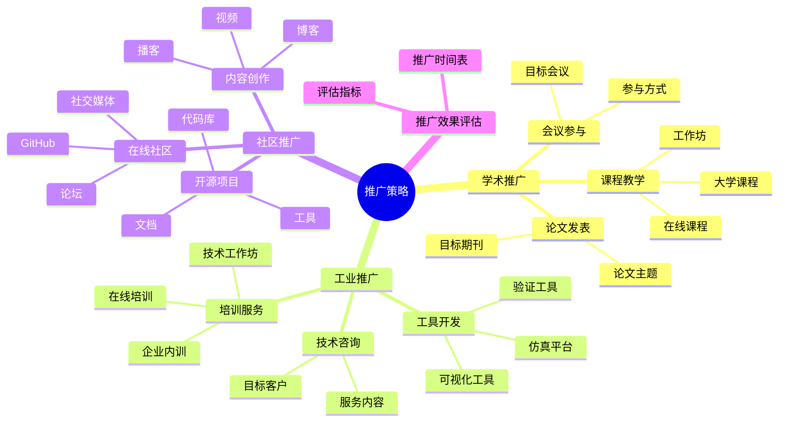
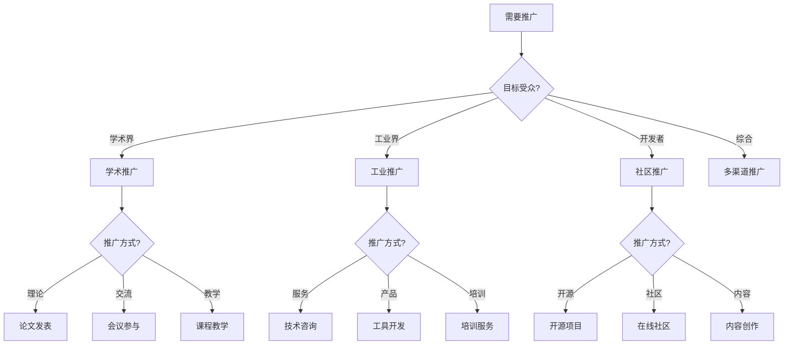
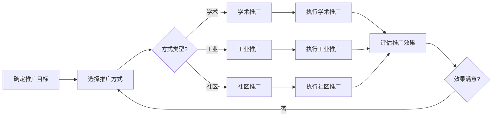
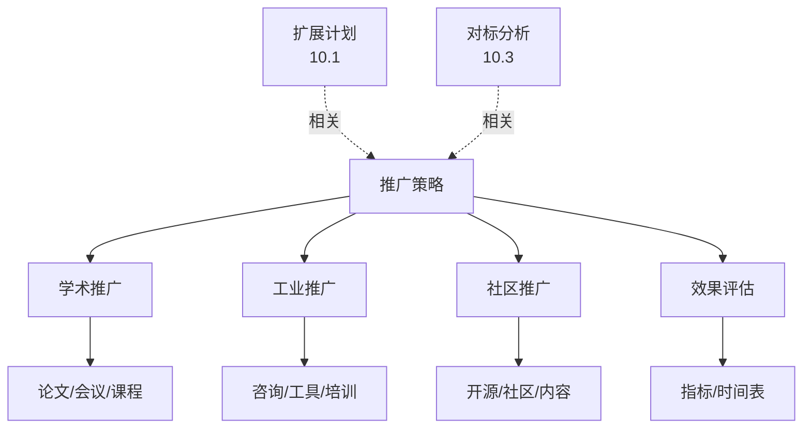
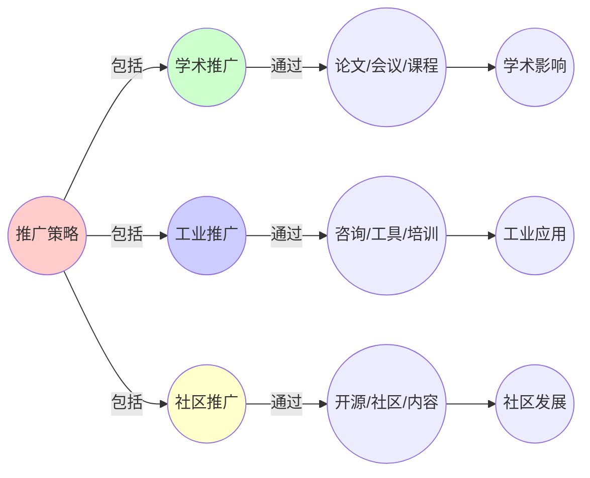
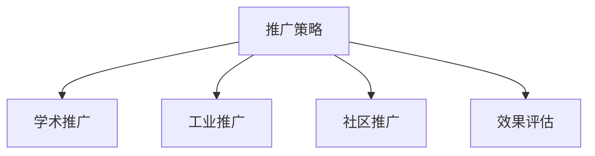

# 10.2 推广策略

> **创建日期**: 2025-01-27
> **最后更新**: 2025-01-27

## 📋 目录

- [10.2 推广策略](#102-推广策略)
  - [📋 目录](#-目录)
  - [📋 内容概览](#-内容概览)
  - [🎯 核心理念](#-核心理念)
  - [🎓 学术推广](#-学术推广)
    - [1. 论文发表](#1-论文发表)
      - [目标期刊](#目标期刊)
      - [论文主题](#论文主题)
    - [2. 会议参与](#2-会议参与)
      - [目标会议](#目标会议)
      - [参与方式](#参与方式)
    - [3. 课程教学](#3-课程教学)
      - [大学课程开发](#大学课程开发)
      - [在线课程平台](#在线课程平台)
      - [工作坊组织](#工作坊组织)
  - [🏭 工业推广](#-工业推广)
    - [1. 技术咨询](#1-技术咨询)
      - [服务内容](#服务内容)
      - [目标客户](#目标客户)
    - [2. 工具开发](#2-工具开发)
      - [形式化验证工具](#形式化验证工具)
      - [系统仿真平台](#系统仿真平台)
      - [可视化工具](#可视化工具)
    - [3. 培训服务](#3-培训服务)
      - [企业内训](#企业内训)
      - [技术工作坊](#技术工作坊)
      - [在线培训](#在线培训)
  - [👥 社区推广](#-社区推广)
    - [1. 开源项目](#1-开源项目)
      - [代码库开源](#代码库开源)
      - [工具开源](#工具开源)
      - [文档开源](#文档开源)
    - [2. 在线社区](#2-在线社区)
      - [GitHub组织](#github组织)
      - [论坛建设](#论坛建设)
      - [社交媒体](#社交媒体)
    - [3. 内容创作](#3-内容创作)
      - [博客文章](#博客文章)
      - [视频教程](#视频教程)
      - [播客节目](#播客节目)
  - [📊 推广效果评估](#-推广效果评估)
    - [评估指标](#评估指标)
      - [学术推广](#学术推广)
      - [工业推广](#工业推广)
      - [社区推广](#社区推广)
    - [推广时间表](#推广时间表)
  - [📊 详细案例研究](#-详细案例研究)
    - [案例研究 1：Python开源社区的成功推广](#案例研究-1python开源社区的成功推广)
    - [案例研究 2：TensorFlow的工业推广策略](#案例研究-2tensorflow的工业推广策略)
    - [案例研究 3：arXiv的学术推广模式](#案例研究-3arxiv的学术推广模式)
  - [⚠️ 批判性分析与局限性](#️-批判性分析与局限性)
    - [局限性讨论](#局限性讨论)
      - [1. 推广资源的限制](#1-推广资源的限制)
      - [2. 推广效果的量化困难](#2-推广效果的量化困难)
      - [3. 长期可持续性](#3-长期可持续性)
    - [改进方向](#改进方向)
      - [1. 建立推广机制](#1-建立推广机制)
      - [2. 提高推广效率](#2-提高推广效率)
  - [📊 思维表征体系](#-思维表征体系)
    - [📊 1. 思维导图（增强版）](#-1-思维导图增强版)
      - [1.1 文本格式（基础版）](#11-文本格式基础版)
      - [1.2 Mermaid格式（可视化版）](#12-mermaid格式可视化版)
    - [📊 2. 多维对比矩阵](#-2-多维对比矩阵)
      - [2.1 三种推广方式对比矩阵](#21-三种推广方式对比矩阵)
      - [2.2 推广渠道对比矩阵](#22-推广渠道对比矩阵)
      - [2.3 推广效果评估指标对比矩阵](#23-推广效果评估指标对比矩阵)
    - [🌲 3. 决策树](#-3-决策树)
      - [3.1 推广策略选择决策树](#31-推广策略选择决策树)
    - [🛤️ 4. 决策逻辑路径](#️-4-决策逻辑路径)
      - [4.1 推广策略实施路径](#41-推广策略实施路径)
    - [🕸️ 5. 概念关系网络](#️-5-概念关系网络)
      - [5.1 推广策略概念关系网络](#51-推广策略概念关系网络)
    - [🗺️ 6. 知识图谱](#️-6-知识图谱)
      - [6.1 推广策略知识图谱](#61-推广策略知识图谱)
  - [📚 理论体系](#-理论体系)
    - [理论基础](#理论基础)
      - [知识传播/市场营销/项目管理基础](#知识传播市场营销项目管理基础)
      - [历史发展](#历史发展)
    - [理论框架](#理论框架)
      - [核心假设](#核心假设)
      - [基本概念体系](#基本概念体系)
      - [主要定理/结论](#主要定理结论)
      - [适用范围和边界](#适用范围和边界)
    - [当前知识共识](#当前知识共识)
      - [学术界共识](#学术界共识)
      - [主要争议点](#主要争议点)
      - [权威来源](#权威来源)
    - [与其他理论的关系](#与其他理论的关系)
      - [逻辑关系](#逻辑关系)
      - [映射关系](#映射关系)
  - [🔗 关联网络](#-关联网络)
    - [🔗 概念级关联](#-概念级关联)
      - [核心概念映射](#核心概念映射)
    - [🔗 理论级关联](#-理论级关联)
      - [理论基础](#理论基础-1)
    - [🔗 方法级关联](#-方法级关联)
      - [方法应用网络](#方法应用网络)
    - [🔗 应用场景关联](#-应用场景关联)
  - [🛤️ 学习路径](#️-学习路径)
    - [前置知识](#前置知识)
    - [后续学习](#后续学习)
    - [并行学习](#并行学习)
  - [🔗 相关文档](#-相关文档)
  - [📝 更新日志](#-更新日志)

---

## 📋 内容概览

本文档详细阐述形式科学主题的推广策略，包括学术推广、工业推广和社区推广。通过多层次的推广策略，我们可以扩大项目的影响力，促进知识的传播和应用。

---

## 🎯 核心理念

推广策略的核心理念是多层次、多渠道和可持续发展。通过学术推广、工业推广和社区推广的有机结合，我们可以建立完整的知识传播和应用生态系统，实现项目的长期可持续发展。

## 🎓 学术推广

### 1. 论文发表

#### 目标期刊

- **形式科学统一框架**：科学哲学期刊、数学期刊
- **跨学科应用案例**：应用数学期刊、系统科学期刊
- **方法论创新**：方法论期刊、跨学科期刊

#### 论文主题

- 形式科学的统一性理论
- 跨学科映射的方法论
- 范畴论在实践中的应用
- 动力学系统的跨学科应用

### 2. 会议参与

#### 目标会议

- **复杂系统年会（ICCS）**：复杂系统理论与应用
- **范畴论工作坊（ACT）**：范畴论在计算机科学中的应用
- **形式化方法会议**：形式化方法理论与应用
- **跨学科会议**：跨学科研究方法

#### 参与方式

- 提交论文
- 组织工作坊
- 做主题报告
- 参与讨论

### 3. 课程教学

#### 大学课程开发

- **形式科学导论**：本科生课程
- **跨学科形式化方法**：研究生课程
- **范畴论实践**：专业课程

#### 在线课程平台

- **Coursera**：形式科学专项课程
- **edX**：跨学科形式化方法
- **Udemy**：实践应用课程

#### 工作坊组织

- **学术工作坊**：理论研讨
- **实践工作坊**：工具使用
- **跨学科工作坊**：领域应用

## 🏭 工业推广

### 1. 技术咨询

#### 服务内容

- **IT系统形式化**：系统架构优化
- **复杂系统建模**：系统分析
- **架构设计优化**：设计改进

#### 目标客户

- 科技公司
- 金融机构
- 制造业企业
- 咨询公司

### 2. 工具开发

#### 形式化验证工具

- **Coq工具集成**：验证框架
- **Isabelle/HOL应用**：证明系统
- **Agda实践**：依赖类型编程

#### 系统仿真平台

- **复杂系统仿真**：NetLogo集成
- **系统动力学**：Vensim应用
- **网络分析**：NetworkX扩展

#### 可视化工具

- **知识图谱可视化**：交互式展示
- **网络分析可视化**：动态展示
- **动力学系统可视化**：相空间展示

### 3. 培训服务

#### 企业内训

- **形式化方法培训**：理论+实践
- **系统建模培训**：建模方法
- **工具使用培训**：工具实践

#### 技术工作坊

- **Kubernetes动力学**：云原生系统
- **数据库设计**：范畴论应用
- **系统优化**：动力学方法

#### 在线培训

- **视频课程**：系统化学习
- **直播课程**：互动学习
- **实践项目**：项目驱动

## 👥 社区推广

### 1. 开源项目

#### 代码库开源

- **GitHub组织**：代码仓库
- **工具开源**：实用工具
- **文档开源**：知识共享

#### 工具开源

- **形式化验证工具**：Coq/Isabelle集成
- **仿真工具**：复杂系统仿真
- **可视化工具**：知识图谱

#### 文档开源

- **知识库**：完整文档
- **教程**：学习教程
- **案例**：应用案例

### 2. 在线社区

#### GitHub组织

- **代码仓库**：项目代码
- **Issue跟踪**：问题讨论
- **Wiki文档**：知识库

#### 论坛建设

- **技术论坛**：技术讨论
- **学术论坛**：学术交流
- **问答系统**：问题解答

#### 社交媒体

- **Twitter**：最新动态
- **LinkedIn**：专业网络
- **微信公众号**：中文社区

### 3. 内容创作

#### 博客文章

- **技术博客**：技术分享
- **学术博客**：学术观点
- **案例博客**：应用案例

#### 视频教程

- **理论讲解**：概念解释
- **实践演示**：工具使用
- **案例分析**：实际应用

#### 播客节目

- **学术讨论**：理论探讨
- **实践分享**：经验分享
- **访谈节目**：专家访谈

## 📊 推广效果评估

### 评估指标

#### 学术推广

- 论文发表数量
- 会议参与次数
- 课程开设数量
- 学生数量

#### 工业推广

- 咨询项目数量
- 工具使用量
- 培训人数
- 客户满意度

#### 社区推广

- GitHub星标数
- 论坛活跃度
- 博客阅读量
- 视频观看量

### 推广时间表

| 阶段 | 时间 | 目标 | 指标 |
|------|------|------|------|
| 第一阶段 | 1-3个月 | 建立基础 | 文档完善、工具开发 |
| 第二阶段 | 3-6个月 | 扩大影响 | 论文发表、会议参与 |
| 第三阶段 | 6-12个月 | 形成生态 | 社区建设、产业应用 |

## 📊 详细案例研究

### 案例研究 1：Python开源社区的成功推广

**背景**：Python语言的成功展示了开源项目的推广策略。

**形式化分析**：

```text
Python推广策略:
1. 学术推广: 科研应用广泛、教学资源丰富、学术会议参与
2. 工业推广: 企业采用、工具开发、培训服务
3. 社区推广: 开源生态、活跃社区、内容创作

成功因素: 易用性、生态丰富、社区活跃、持续创新
借鉴应用: 建立生态、社区建设、内容创作、持续推广
预期效果: 扩大用户群体、提高影响力、促进应用
```

**关键发现**：多层次推广有效，社区建设至关重要，生态丰富促进推广。

### 案例研究 2：TensorFlow的工业推广策略

**背景**：TensorFlow展示了技术框架的工业推广经验。

**形式化分析**：

```text
TensorFlow推广策略:
1. 技术优势: 技术先进、性能优秀、易用性好
2. 企业合作: 大公司支持、企业采用、案例分享
3. 教育培训: 官方教程、认证课程、开发者大会

成功因素: 技术领先、生态完整、教育支持、社区活跃
预期效果: 企业采用、用户增长、生态发展
```

**关键发现**：技术优势是基础，企业合作扩大影响，教育培训促进采用。

### 案例研究 3：arXiv的学术推广模式

**背景**：arXiv展示了学术资源的推广模式。

**形式化分析**：

```text
arXiv推广策略:
1. 开放访问: 免费使用、即时发布、全球访问
2. 质量控制: 基本审核、社区监督、分类明确
3. 服务创新: 快速发布、版本控制、引用统计

成功因素: 开放共享、即时发布、质量保证、服务创新
预期效果: 扩大影响、促进交流、提高质量
```

**关键发现**：开放共享扩大影响，即时发布提高效率，服务创新增强体验。

## ⚠️ 批判性分析与局限性

### 局限性讨论

#### 1. 推广资源的限制

**问题**：推广需要大量资源支持。
**挑战**：资金限制、人员不足、时间约束
**应对策略**：优先级排序、资源整合、分阶段实施

#### 2. 推广效果的量化困难

**问题**：推广效果的量化可能存在困难。
**挑战**：指标选择困难、数据收集困难、因果关系不明确
**改进方向**：建立指标体系、数据收集机制、效果评估方法

#### 3. 长期可持续性

**问题**：如何确保推广的长期可持续性。
**挑战**：资金支持、人员维护、内容更新
**改进方向**：建立机制、多方支持、持续创新

### 改进方向

#### 1. 建立推广机制

**目标**：系统化推广活动。
**方法**：推广计划、执行机制、评估体系

#### 2. 提高推广效率

**目标**：提高推广的效率。
**方法**：精准定位、多渠道推广、效果优化

## 📊 思维表征体系

### 📊 1. 思维导图（增强版）

#### 1.1 文本格式（基础版）

```text
推广策略
├── 学术推广
│   ├── 论文发表
│   │   ├── 目标期刊
│   │   └── 论文主题
│   ├── 会议参与
│   │   ├── 目标会议
│   │   └── 参与方式
│   └── 课程教学
│       ├── 大学课程
│       ├── 在线课程
│       └── 工作坊
├── 工业推广
│   ├── 技术咨询
│   │   ├── 服务内容
│   │   └── 目标客户
│   ├── 工具开发
│   │   ├── 验证工具
│   │   ├── 仿真平台
│   │   └── 可视化工具
│   └── 培训服务
│       ├── 企业内训
│       ├── 技术工作坊
│       └── 在线培训
├── 社区推广
│   ├── 开源项目
│   │   ├── 代码库
│   │   ├── 工具
│   │   └── 文档
│   ├── 在线社区
│   │   ├── GitHub
│   │   ├── 论坛
│   │   └── 社交媒体
│   └── 内容创作
│       ├── 博客
│       ├── 视频
│       └── 播客
└── 推广效果评估
    ├── 评估指标
    └── 推广时间表
```

#### 1.2 Mermaid格式（可视化版）



### 📊 2. 多维对比矩阵

#### 2.1 三种推广方式对比矩阵

| 推广方式 | 学术推广 | 工业推广 | 社区推广 | 目标受众 |
|---------|---------|---------|---------|---------|
| **目标受众** | 学术界 | 工业界 | 开发者社区 | 受众不同 |
| **推广内容** | 理论成果 | 实用工具 | 开源项目 | 内容不同 |
| **推广渠道** | 期刊/会议/课程 | 咨询/工具/培训 | 开源/社区/内容 | 渠道不同 |
| **影响深度** | 深 | 中 | 广 | 深度不同 |
| **影响广度** | 窄 | 中 | 广 | 广度不同 |
| **时间周期** | 长 | 中 | 短 | 周期不同 |
| **成本** | 中 | 高 | 低 | 成本不同 |

#### 2.2 推广渠道对比矩阵

| 渠道 | 论文发表 | 会议参与 | 课程教学 | 技术咨询 | 工具开发 | 开源项目 | 内容创作 |
|------|---------|---------|---------|---------|---------|---------|---------|
| **影响力** | 高 | 高 | 中 | 中 | 高 | 中 | 中 |
| **受众规模** | 中 | 中 | 大 | 小 | 中 | 大 | 大 |
| **成本** | 低 | 中 | 高 | 高 | 很高 | 中 | 低 |
| **时间周期** | 长 | 中 | 长 | 中 | 长 | 短 | 短 |
| **可持续性** | 高 | 中 | 高 | 高 | 高 | 高 | 高 |

#### 2.3 推广效果评估指标对比矩阵

| 指标类型 | 学术指标 | 工业指标 | 社区指标 | 衡量维度 |
|---------|---------|---------|---------|---------|
| **量化指标** | 引用数 | 客户数 | Star数 | 指标不同 |
| **质量指标** | 期刊影响因子 | 客户满意度 | 社区活跃度 | 指标不同 |
| **影响力指标** | H-index | 市场份额 | GitHub排名 | 指标不同 |
| **时间指标** | 发表周期 | 项目周期 | 更新频率 | 指标不同 |

### 🌲 3. 决策树

#### 3.1 推广策略选择决策树



### 🛤️ 4. 决策逻辑路径

#### 4.1 推广策略实施路径



### 🕸️ 5. 概念关系网络

#### 5.1 推广策略概念关系网络



### 🗺️ 6. 知识图谱

#### 6.1 推广策略知识图谱



## 📚 理论体系

### 理论基础

#### 知识传播/市场营销/项目管理基础

推广策略的理论基础：

**1. 知识传播理论**：

- 知识扩散理论
- 创新扩散理论
- 科学传播理论

**2. 市场营销理论**：

- 市场定位
- 渠道管理
- 品牌建设

**3. 项目管理理论**：

- 项目规划
- 资源管理
- 效果评估

#### 历史发展

**关键时间节点**：

- **1960-1970年代**：知识传播理论建立
  - 创新扩散理论
  - 科学传播研究

- **1980-1990年代**：互联网发展
  - 在线传播
  - 数字营销

- **2000年代**：开源社区发展
  - 开源运动
  - 社区建设

- **2010年代至今**：现代推广
  - 社交媒体
  - 内容营销
  - 社区运营

### 理论框架

#### 核心假设

**假设1：多渠道推广的有效性**

- **内容**：多渠道推广效果更好
- **适用范围**：大多数推广场景
- **限制条件**：需要资源支持

**假设2：目标受众的重要性**

- **内容**：明确目标受众提高效果
- **适用范围**：所有推广活动
- **限制条件**：需要受众分析

**假设3：效果评估的必要性**

- **内容**：效果评估指导改进
- **适用范围**：所有推广活动
- **限制条件**：需要评估指标

#### 基本概念体系



#### 主要定理/结论

**结论1：多渠道推广的优势**

- **内容**：多渠道推广覆盖面更广
- **证据**：营销研究
- **应用**：推广策略

**结论2：社区推广的价值**

- **内容**：社区推广建立长期影响
- **证据**：开源社区成功
- **应用**：社区建设

**结论3：效果评估的重要性**

- **内容**：效果评估优化推广
- **证据**：管理实践
- **应用**：推广优化

#### 适用范围和边界

**适用范围**：

- 知识传播
- 项目推广
- 品牌建设

**边界条件**：

- 需要资源支持
- 需要明确目标
- 需要考虑成本

**不适用场景**：

- 无推广需求
- 无资源支持
- 无明确目标

### 当前知识共识

#### 学术界共识

**广泛接受的共识**：

1. **多渠道推广的价值**
   - **共识**：多渠道推广效果更好
   - **支持证据**：营销研究
   - **来源**：市场营销、知识传播

2. **社区推广的重要性**
   - **共识**：社区推广建立长期影响
   - **支持证据**：开源社区成功
   - **来源**：社区研究

3. **效果评估的必要性**
   - **共识**：效果评估指导改进
   - **支持证据**：管理实践
   - **来源**：项目管理

#### 主要争议点

1. **推广成本的权衡**
   - **观点A**：应该大力推广
   - **观点B**：需要控制成本
   - **当前状态**：多数认为需要平衡

2. **推广效果的衡量**
   - **观点A**：应该量化评估
   - **观点B**：应该定性评估
   - **当前状态**：多数认为两者结合

#### 权威来源

**经典文献**：

- 知识传播相关文献
- 市场营销相关文献
- 项目管理相关文献

**权威机构/专家**：

- **知识传播研究会**
- **市场营销研究会**
- **项目管理研究会**

**最新发展**：

- **2020-2024**：社交媒体营销、内容营销、社区运营
- **前沿方向**：AI辅助推广、数据驱动推广、精准推广

### 与其他理论的关系

#### 逻辑关系

**理论基础**：

- **扩展计划**（[10.1_后续扩展计划.md](10.1_后续扩展计划.md)） → 推广策略
  - 关系类型：计划实施
  - 关键映射：扩展计划 → 推广策略

**理论应用**：

- **对标分析**（[10.3_对标分析.md](10.3_对标分析.md)） → 推广策略
  - 关系类型：策略参考
  - 关键映射：对标结果 → 推广策略

#### 映射关系

| 本理论概念 | 映射理论 | 映射概念 | 映射类型 | 映射说明 |
|-----------|---------|---------|---------|----------|
| **学术推广** | 知识传播理论 | 学术传播 | 对应 | 推广对应传播 |
| **工业推广** | 市场营销理论 | 市场推广 | 对应 | 推广对应营销 |
| **社区推广** | 社区理论 | 社区建设 | 对应 | 推广对应建设 |
| **效果评估** | 项目管理理论 | 项目评估 | 对应 | 评估对应评估 |

## 🔗 关联网络

### 🔗 概念级关联

#### 核心概念映射

| 本文档概念 | 关联文档 | 关联概念 | 关系类型 | 映射说明 |
|-----------|---------|---------|---------|----------|
| **学术推广** | 知识传播 | 学术传播 | 对应 | 推广对应传播 |
| **工业推广** | 市场营销 | 市场推广 | 对应 | 推广对应营销 |
| **社区推广** | 社区建设 | 社区发展 | 对应 | 推广对应发展 |
| **效果评估** | 项目管理 | 项目评估 | 对应 | 评估对应评估 |
| **推广策略** | 10.1_后续扩展计划 | 扩展计划 | 对应 | 策略对应计划 |
| **推广目标** | 10.3_对标分析 | 对标目标 | 相关 | 目标相关 |

### 🔗 理论级关联

#### 理论基础

- **本理论基于**：
  - [10.1_后续扩展计划.md](10.1_后续扩展计划.md) ⭐⭐⭐ - 扩展计划
  - 知识传播理论 ⭐⭐ - 传播理论

- **本理论应用于**：
  - 项目推广 ⭐⭐⭐ - 实际应用
  - 知识传播 ⭐⭐ - 实际应用

### 🔗 方法级关联

#### 方法应用网络

| 本文档方法 | 应用文档 | 应用场景 | 应用效果 |
|-----------|---------|---------|---------|
| **学术推广** | 学术项目 | 理论推广 | 成功 |
| **工业推广** | 工业项目 | 工具推广 | 成功 |
| **社区推广** | 开源项目 | 社区建设 | 成功 |

### 🔗 应用场景关联

**场景**：项目推广

| 视角 | 关联文档 | 核心理论 | 关注点 |
|------|---------|---------|--------|
| **推广策略** | 本文档 | 推广方法 | 策略制定 |
| **扩展计划** | 10.1_后续扩展计划 | 扩展规划 | 计划制定 |
| **对标分析** | 10.3_对标分析 | 对标方法 | 质量保证 |

## 🛤️ 学习路径

### 前置知识

**必须先学习**：

- [10.1_后续扩展计划.md](10.1_后续扩展计划.md) ⭐⭐⭐ - 扩展计划
- 知识传播基础 ⭐⭐

**建议先了解**：

- 市场营销
- 项目管理
- 社区运营

### 后续学习

**建议接下来学习**（按顺序）：

1. [10.3_对标分析.md](10.3_对标分析.md) ⭐⭐⭐ - 对标分析
2. [10.4_资源整合.md](10.4_资源整合.md) ⭐⭐ - 资源整合
3. 实际推广项目 ⭐⭐ - 实践应用

### 并行学习

**可以同时学习**：

- 知识传播理论 - 理论基础
- 市场营销理论 - 理论基础

## 🔗 相关文档

- [10.1_后续扩展计划.md](10.1_后续扩展计划.md)
- [10.3_对标分析.md](10.3_对标分析.md)
- [10.4_资源整合.md](10.4_资源整合.md)

## 📝 更新日志

- 2025-01-27: 初始创建推广策略文档
- 2025-01-27: 添加完整目录结构、案例研究、批判性分析和思维导图
