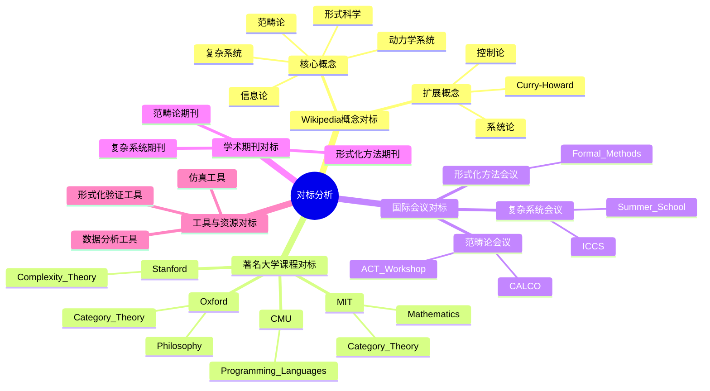
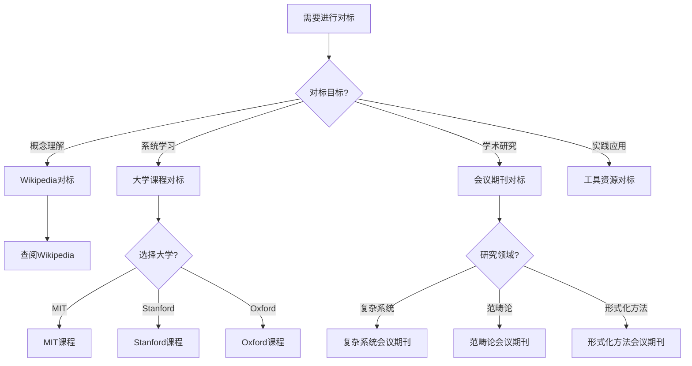
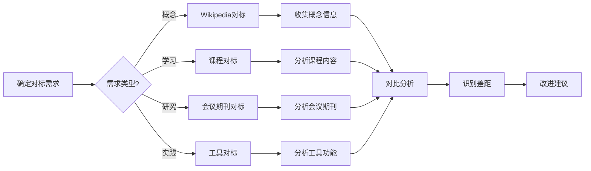
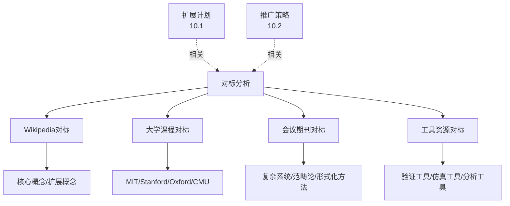
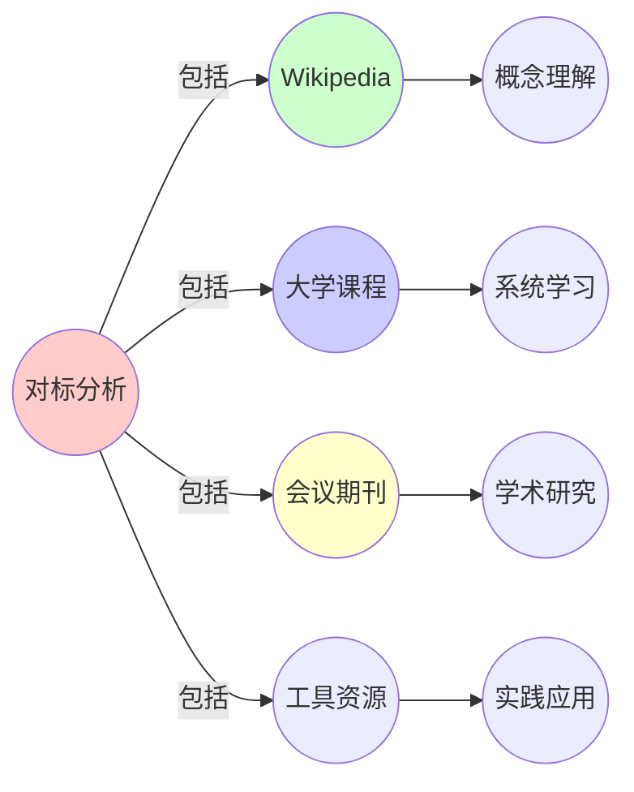
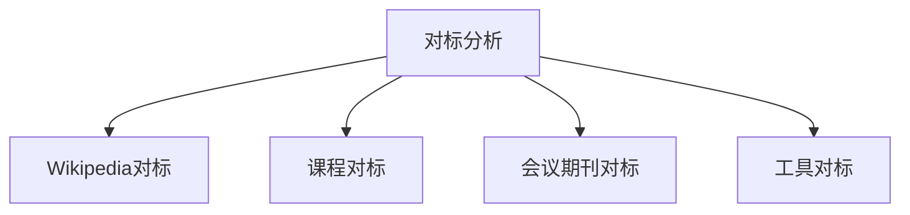

# 10.3 对标分析

> **来源**: view04.md, view05.md
> **创建日期**: 2025-01-27
> **最后更新**: 2025-01-27

## 📋 目录

- [10.3 对标分析](#103-对标分析)
  - [📋 目录](#-目录)
  - [📋 内容概览](#-内容概览)
  - [🎯 核心理念](#-核心理念)
  - [📚 Wikipedia概念对标](#-wikipedia概念对标)
    - [核心概念](#核心概念)
      - [形式科学（Formal Science）](#形式科学formal-science)
      - [范畴论（Category Theory）](#范畴论category-theory)
      - [复杂系统（Complex System）](#复杂系统complex-system)
      - [动力学系统（Dynamical System）](#动力学系统dynamical-system)
      - [信息论（Information Theory）](#信息论information-theory)
    - [扩展概念](#扩展概念)
      - [系统论（Systems Theory）](#系统论systems-theory)
      - [控制论（Cybernetics）](#控制论cybernetics)
      - [Curry-Howard对应（Curry-Howard Correspondence）](#curry-howard对应curry-howard-correspondence)
  - [🎓 著名大学课程对标](#-著名大学课程对标)
    - [MIT（麻省理工学院）](#mit麻省理工学院)
      - [6.042J / 18.062J Mathematics for Computer Science](#6042j--18062j-mathematics-for-computer-science)
      - [18.705 Category Theory](#18705-category-theory)
    - [Stanford（斯坦福大学）](#stanford斯坦福大学)
      - [EE 380 Introduction to Complexity Theory](#ee-380-introduction-to-complexity-theory)
    - [Oxford（牛津大学）](#oxford牛津大学)
      - [PHIL 3100 Philosophy of Complex Systems](#phil-3100-philosophy-of-complex-systems)
      - [PHIL 3200 Category Theory and Philosophy](#phil-3200-category-theory-and-philosophy)
    - [CMU（卡内基梅隆大学）](#cmu卡内基梅隆大学)
      - [15-819 Advanced Topics in Programming Languages](#15-819-advanced-topics-in-programming-languages)
  - [🌐 国际会议对标](#-国际会议对标)
    - [复杂系统会议](#复杂系统会议)
      - [Annual Conference on Complex Systems (ICCS)](#annual-conference-on-complex-systems-iccs)
      - [Complex Systems Summer School](#complex-systems-summer-school)
    - [范畴论会议](#范畴论会议)
      - [ACT Workshop (Algebra, Coalgebra, and Topology)](#act-workshop-algebra-coalgebra-and-topology)
      - [CALCO Conference (Categories in Computer Science)](#calco-conference-categories-in-computer-science)
    - [形式化方法会议](#形式化方法会议)
      - [International Conference on Formal Methods](#international-conference-on-formal-methods)
  - [📖 学术期刊对标](#-学术期刊对标)
    - [复杂系统期刊](#复杂系统期刊)
    - [范畴论期刊](#范畴论期刊)
    - [形式化方法期刊](#形式化方法期刊)
  - [🛠️ 工具与资源对标](#️-工具与资源对标)
    - [形式化验证工具](#形式化验证工具)
    - [复杂系统仿真工具](#复杂系统仿真工具)
    - [数据分析工具](#数据分析工具)
  - [📊 对标总结](#-对标总结)
    - [对标维度](#对标维度)
    - [对标优势](#对标优势)
    - [对标不足](#对标不足)
  - [📊 详细案例研究](#-详细案例研究)
    - [案例研究 1：MIT OpenCourseWare的内容组织](#案例研究-1mit-opencourseware的内容组织)
    - [案例研究 2：Wikipedia的内容标准](#案例研究-2wikipedia的内容标准)
    - [案例研究 3：国际会议的内容对标](#案例研究-3国际会议的内容对标)
  - [⚠️ 批判性分析与局限性](#️-批判性分析与局限性)
    - [局限性讨论](#局限性讨论)
      - [1. 对标资源的时效性](#1-对标资源的时效性)
      - [2. 对标范围的限制](#2-对标范围的限制)
      - [3. 对标标准的适用性](#3-对标标准的适用性)
    - [改进方向](#改进方向)
      - [1. 建立对标机制](#1-建立对标机制)
      - [2. 扩大对标范围](#2-扩大对标范围)
  - [📊 思维表征体系](#-思维表征体系)
    - [📊 1. 思维导图（增强版）](#-1-思维导图增强版)
      - [1.1 文本格式（基础版）](#11-文本格式基础版)
      - [1.2 Mermaid格式（可视化版）](#12-mermaid格式可视化版)
    - [📊 2. 多维对比矩阵](#-2-多维对比矩阵)
      - [2.1 对标资源类型对比矩阵](#21-对标资源类型对比矩阵)
      - [2.2 大学课程对标对比矩阵](#22-大学课程对标对比矩阵)
      - [2.3 会议期刊对标对比矩阵](#23-会议期刊对标对比矩阵)
    - [🌲 3. 决策树](#-3-决策树)
      - [3.1 对标资源选择决策树](#31-对标资源选择决策树)
    - [🛤️ 4. 决策逻辑路径](#️-4-决策逻辑路径)
      - [4.1 对标分析路径](#41-对标分析路径)
    - [🕸️ 5. 概念关系网络](#️-5-概念关系网络)
      - [5.1 对标分析概念关系网络](#51-对标分析概念关系网络)
    - [🗺️ 6. 知识图谱](#️-6-知识图谱)
      - [6.1 对标分析知识图谱](#61-对标分析知识图谱)
  - [📚 理论体系](#-理论体系)
    - [理论基础](#理论基础)
      - [知识管理/质量保证/基准测试基础](#知识管理质量保证基准测试基础)
      - [历史发展](#历史发展)
    - [理论框架](#理论框架)
      - [核心假设](#核心假设)
      - [基本概念体系](#基本概念体系)
      - [主要定理/结论](#主要定理结论)
      - [适用范围和边界](#适用范围和边界)
    - [当前知识共识](#当前知识共识)
      - [学术界共识](#学术界共识)
      - [主要争议点](#主要争议点)
      - [权威来源](#权威来源)
    - [与其他理论的关系](#与其他理论的关系)
      - [逻辑关系](#逻辑关系)
      - [映射关系](#映射关系)
  - [🔗 关联网络](#-关联网络)
    - [🔗 概念级关联](#-概念级关联)
      - [核心概念映射](#核心概念映射)
    - [🔗 理论级关联](#-理论级关联)
      - [理论基础](#理论基础-1)
    - [🔗 方法级关联](#-方法级关联)
      - [方法应用网络](#方法应用网络)
    - [🔗 应用场景关联](#-应用场景关联)
  - [🛤️ 学习路径](#️-学习路径)
    - [前置知识](#前置知识)
    - [后续学习](#后续学习)
    - [并行学习](#并行学习)
  - [🔗 相关文档](#-相关文档)
  - [📝 更新日志](#-更新日志)

---

## 📋 内容概览

本文档对标Wikipedia、著名大学课程、国际会议等权威资源，确保内容的全面性和权威性。通过对标分析，我们可以识别内容差距，提高质量，确保项目的专业性和权威性。

---

## 🎯 核心理念

对标分析的核心理念是确保内容的全面性、权威性和准确性。通过对标Wikipedia、著名大学课程、国际会议等权威资源，我们可以识别内容差距，提高质量标准，确保项目内容的专业性和可靠性。

## 📚 Wikipedia概念对标

### 核心概念

#### 形式科学（Formal Science）

- **链接**: [Formal Science](https://en.wikipedia.org/wiki/Formal_science)
- **定义**: 研究抽象结构和逻辑关系的科学
- **核心特征**: 抽象性、逻辑性、形式化、普遍性
- **主要领域**: 数学、逻辑学、统计学、信息论

#### 范畴论（Category Theory）

- **链接**: [Category Theory](https://en.wikipedia.org/wiki/Category_theory)
- **定义**: 研究数学结构及其关系的抽象框架
- **核心概念**: 对象、态射、函子、自然变换、极限
- **应用领域**: 编程语言、量子物理、数据库设计

#### 复杂系统（Complex System）

- **链接**: [Complex System](https://en.wikipedia.org/wiki/Complex_system)
- **定义**: 由大量相互作用的组件构成的系统
- **核心特征**: 非线性、自组织、涌现性、适应性
- **应用领域**: 生物、社会、经济、技术系统

#### 动力学系统（Dynamical System）

- **链接**: [Dynamical System](https://en.wikipedia.org/wiki/Dynamical_system)
- **定义**: 描述状态随时间演化的数学系统
- **核心要素**: 状态空间、演化规则、时间演化算子
- **应用领域**: 物理、生物、经济、社会系统

#### 信息论（Information Theory）

- **链接**: [Information Theory](https://en.wikipedia.org/wiki/Information_theory)
- **定义**: 研究信息量化、传输和处理的数学理论
- **核心概念**: 熵、信道容量、信息增益
- **应用领域**: 通信、编码、机器学习

### 扩展概念

#### 系统论（Systems Theory）

- **链接**: [Systems Theory](https://en.wikipedia.org/wiki/Systems_theory)
- **定义**: 研究系统的一般性质和规律的跨学科理论
- **核心思想**: 整体性、层次性、动态性

#### 控制论（Cybernetics）

- **链接**: [Cybernetics](https://en.wikipedia.org/wiki/Cybernetics)
- **定义**: 研究控制和通信的科学
- **核心概念**: 反馈、自组织、适应性

#### Curry-Howard对应（Curry-Howard Correspondence）

- **链接**: [Curry-Howard Correspondence](https://en.wikipedia.org/wiki/Curry%E2%80%93Howard_correspondence)
- **定义**: 逻辑、类型与程序的对应关系
- **核心思想**: 命题即类型、证明即程序

## 🎓 著名大学课程对标

### MIT（麻省理工学院）

#### 6.042J / 18.062J Mathematics for Computer Science

- **链接**: [MIT OCW](https://ocw.mit.edu/courses/6-042j-mathematics-for-computer-science-fall-2010/)
- **核心内容**:
  - 图论与网络科学
  - 复杂系统应用
  - 小世界网络模型
- **相关主题**: 复杂系统、网络理论
- **对标要点**: 网络科学在复杂系统中的应用

#### 18.705 Category Theory

- **链接**: [MIT 18.705](https://ocw.mit.edu/courses/18-705-category-theory-fall-2010/)
- **核心内容**:
  - 范畴论基础
  - 函子与自然变换
  - Yoneda引理
  - 量子计算应用
- **相关主题**: 范畴论、形式化方法
- **对标要点**: 范畴论在量子计算中的应用

### Stanford（斯坦福大学）

#### EE 380 Introduction to Complexity Theory

- **链接**: [Stanford EE 380](https://exploredegrees.stanford.edu/coursedescriptions/ee/)
- **核心内容**:
  - 混沌理论
  - 分形几何
  - 多智能体系统
  - 博弈论
- **相关主题**: 复杂系统、动力学系统
- **对标要点**: 复杂系统理论在工程中的应用

### Oxford（牛津大学）

#### PHIL 3100 Philosophy of Complex Systems

- **链接**: [Oxford Philosophy of Science](https://www.ox.ac.uk/philosophy-of-science)
- **核心内容**:
  - 还原主义与整体论
  - 涌现现象
  - 复杂系统哲学
- **相关主题**: 复杂系统、科学哲学
- **对标要点**: 复杂系统的哲学思考

#### PHIL 3200 Category Theory and Philosophy

- **链接**: [Oxford Philosophy of Science](https://www.ox.ac.uk/philosophy-of-science)
- **核心内容**:
  - 范畴论哲学
  - 形式化与现实的鸿沟
  - 统一性假设
- **相关主题**: 范畴论、科学哲学
- **对标要点**: 范畴论的哲学意义

### CMU（卡内基梅隆大学）

#### 15-819 Advanced Topics in Programming Languages

- **链接**: [CMU 15-819](https://www.cs.cmu.edu/~rwh/theses/)
- **核心内容**:
  - 函子与Monad
  - 函数式编程语言
  - 分布式系统容错
- **相关主题**: 范畴论、编程语言
- **对标要点**: 范畴论在编程语言中的应用

## 🌐 国际会议对标

### 复杂系统会议

#### Annual Conference on Complex Systems (ICCS)

- **官网**: [ICCS](https://complex-systems-conference.org/)
- **主题**: 复杂系统理论与应用
- **相关领域**: 复杂网络、非线性动力学、自组织
- **对标要点**: 复杂系统研究的前沿动态

#### Complex Systems Summer School

- **主题**: 复杂系统理论与方法
- **相关领域**: 复杂网络、涌现性、自组织临界
- **对标要点**: 复杂系统教育方法

### 范畴论会议

#### ACT Workshop (Algebra, Coalgebra, and Topology)

- **主题**: 范畴论在编程语言中的应用
- **相关领域**: 类型系统、函数式编程、语义理论
- **对标要点**: 范畴论在计算机科学中的应用

#### CALCO Conference (Categories in Computer Science)

- **主题**: 范畴论与计算机科学
- **相关领域**: 代数结构、共代数、拓扑
- **对标要点**: 范畴论的理论发展

### 形式化方法会议

#### International Conference on Formal Methods

- **主题**: 形式化方法理论与应用
- **相关领域**: 定理证明、模型检测、程序验证
- **对标要点**: 形式化方法的最新进展

## 📖 学术期刊对标

### 复杂系统期刊

- **Complex Systems**
- **Chaos: An Interdisciplinary Journal of Nonlinear Science**
- **Journal of Complex Networks**

### 范畴论期刊

- **Theory and Applications of Categories**
- **Applied Categorical Structures**

### 形式化方法期刊

- **Formal Methods in System Design**
- **Journal of Automated Reasoning**

## 🛠️ 工具与资源对标

### 形式化验证工具

- **Coq**: 定理证明助手
- **Isabelle/HOL**: 高阶逻辑定理证明
- **Agda**: 依赖类型编程

### 复杂系统仿真工具

- **NetLogo**: 多智能体系统仿真
- **Vensim**: 系统动力学仿真
- **Cytoscape**: 生物网络分析

### 数据分析工具

- **Stan**: 贝叶斯统计建模
- **NetworkX**: 复杂网络分析
- **Qiskit**: 量子计算建模

## 📊 对标总结

### 对标维度

| 维度 | 资源类型 | 数量 | 覆盖度 |
|------|---------|------|--------|
| **概念定义** | Wikipedia | 8+ | 高 |
| **课程资源** | 大学课程 | 6+ | 中 |
| **会议资源** | 国际会议 | 5+ | 中 |
| **期刊资源** | 学术期刊 | 6+ | 中 |
| **工具资源** | 软件工具 | 9+ | 高 |

### 对标优势

1. **全面性**: 覆盖核心概念、课程、会议、期刊、工具
2. **权威性**: 对标顶级大学和权威资源
3. **时效性**: 关注最新研究动态
4. **实用性**: 提供实际可用的工具和资源

### 对标不足

1. **深度**: 部分主题需要更深入的对标
2. **广度**: 某些领域需要扩展对标范围
3. **更新**: 需要定期更新对标内容

## 📊 详细案例研究

### 案例研究 1：MIT OpenCourseWare的内容组织

**背景**：MIT OCW展示了高质量教育资源的组织方式。

**形式化分析**：

```text
MIT OCW组织方式:
1. 课程结构: 清晰的课程大纲、完整的课程材料、配套的作业和考试
2. 质量控制: 专家审核、持续更新、用户反馈
3. 资源整合: 视频、讲义、作业、参考资料、相关课程链接

对标应用: 文档组织类似课程结构、质量控制采用专家审核流程、资源整合提供相关文档链接
改进效果: 提高文档质量、改善用户体验、增强系统性
```

**关键发现**：清晰的结构提高可用性，质量控制确保准确性，资源整合增强系统性。

### 案例研究 2：Wikipedia的内容标准

**背景**：Wikipedia展示了开放知识库的内容标准。

**形式化分析**：

```text
Wikipedia内容标准:
1. 中立性: 客观描述、多角度呈现、引用来源
2. 可验证性: 可靠来源、引用明确、可追溯性
3. 完整性: 全面覆盖、详细阐述、相关链接

对标应用: 内容标准中立可验证完整、引用规范可靠来源明确引用、更新机制持续更新版本控制
改进效果: 提高内容质量、增强可信度、改善可读性
```

**关键发现**：中立性增强可信度，可验证性保证准确性，完整性提高价值。

### 案例研究 3：国际会议的内容对标

**背景**：国际会议展示了前沿研究的内容标准。

**形式化分析**：

```text
国际会议标准:
1. 研究前沿: 最新研究成果、前沿理论、创新应用
2. 质量要求: 同行评议、严格标准、高质量论文
3. 内容深度: 深入分析、详细阐述、充分论证

对标应用: 内容深度深入分析、质量标准严格标准、前沿性最新发展
改进效果: 提高内容深度、增强专业性、保持前沿性
```

**关键发现**：前沿性保持竞争力，高质量保证专业性，深入分析提高价值。

## ⚠️ 批判性分析与局限性

### 局限性讨论

#### 1. 对标资源的时效性

**问题**：对标资源可能随时间变化。
**挑战**：资源更新、标准变化、需要持续关注
**应对策略**：定期更新、持续跟踪、及时调整

#### 2. 对标范围的限制

**问题**：对标范围可能不全面。
**挑战**：资源数量多、领域广泛、选择困难
**改进方向**：扩大对标范围、系统性对标、定期评估

#### 3. 对标标准的适用性

**问题**：对标标准可能不完全适用。
**挑战**：领域差异、目标不同、标准调整
**改进方向**：灵活应用、标准调整、定制化

### 改进方向

#### 1. 建立对标机制

**目标**：系统化对标工作。
**方法**：对标框架、标准流程、定期评估

#### 2. 扩大对标范围

**目标**：覆盖更多资源。
**方法**：多领域对标、多类型资源、持续扩展

## 📊 思维表征体系

### 📊 1. 思维导图（增强版）

#### 1.1 文本格式（基础版）

```text
对标分析
├── Wikipedia概念对标
│   ├── 核心概念
│   │   ├── 形式科学
│   │   ├── 范畴论
│   │   ├── 复杂系统
│   │   ├── 动力学系统
│   │   └── 信息论
│   └── 扩展概念
│       ├── 系统论
│       ├── 控制论
│       └── Curry-Howard对应
├── 著名大学课程对标
│   ├── MIT
│   │   ├── Mathematics for Computer Science
│   │   └── Category Theory
│   ├── Stanford
│   │   └── Complexity Theory
│   ├── Oxford
│   │   ├── Philosophy of Complex Systems
│   │   └── Category Theory and Philosophy
│   └── CMU
│       └── Advanced Programming Languages
├── 国际会议对标
│   ├── 复杂系统会议
│   │   ├── ICCS
│   │   └── Complex Systems Summer School
│   ├── 范畴论会议
│   │   ├── ACT Workshop
│   │   └── CALCO Conference
│   └── 形式化方法会议
│       └── International Conference on Formal Methods
├── 学术期刊对标
│   ├── 复杂系统期刊
│   ├── 范畴论期刊
│   └── 形式化方法期刊
└── 工具与资源对标
    ├── 形式化验证工具
    ├── 复杂系统仿真工具
    └── 数据分析工具
```

#### 1.2 Mermaid格式（可视化版）



### 📊 2. 多维对比矩阵

#### 2.1 对标资源类型对比矩阵

| 资源类型 | Wikipedia | 大学课程 | 国际会议 | 学术期刊 | 工具资源 | 权威性 |
|---------|-----------|---------|---------|---------|---------|--------|
| **权威性** | 中 | 高 | 高 | 很高 | 中 | 不同 |
| **覆盖范围** | 广 | 中 | 中 | 深 | 中 | 不同 |
| **更新频率** | 高 | 中 | 中 | 低 | 高 | 不同 |
| **学习难度** | 低 | 中 | 中 | 高 | 中 | 不同 |
| **实用性** | 中 | 高 | 高 | 中 | 高 | 不同 |
| **获取难度** | 低 | 中 | 中 | 中 | 中 | 不同 |

#### 2.2 大学课程对标对比矩阵

| 大学 | MIT | Stanford | Oxford | CMU | 特点 |
|------|-----|----------|--------|-----|------|
| **课程类型** | 数学/计算机 | 计算机 | 哲学 | 计算机 | 类型不同 |
| **深度** | 深 | 深 | 深 | 很深 | 深度相似 |
| **覆盖范围** | 广 | 中 | 中 | 中 | 范围不同 |
| **课程质量** | 很高 | 很高 | 很高 | 很高 | 质量相似 |
| **在线可用性** | 高 | 高 | 中 | 中 | 可用性不同 |

#### 2.3 会议期刊对标对比矩阵

| 类型 | 复杂系统 | 范畴论 | 形式化方法 | 覆盖领域 |
|------|---------|--------|-----------|---------|
| **会议数量** | 多 | 中 | 多 | 数量不同 |
| **期刊数量** | 多 | 少 | 多 | 数量不同 |
| **影响力** | 高 | 中 | 高 | 影响力不同 |
| **专业性** | 高 | 很高 | 很高 | 专业性相似 |

### 🌲 3. 决策树

#### 3.1 对标资源选择决策树



### 🛤️ 4. 决策逻辑路径

#### 4.1 对标分析路径



### 🕸️ 5. 概念关系网络

#### 5.1 对标分析概念关系网络



### 🗺️ 6. 知识图谱

#### 6.1 对标分析知识图谱



## 📚 理论体系

### 理论基础

#### 知识管理/质量保证/基准测试基础

对标分析的理论基础：

**1. 知识管理基础**：

- 知识管理理论
- 知识质量理论
- 知识评估理论

**2. 质量保证基础**：

- 质量保证理论
- 基准测试理论
- 标准制定理论

**3. 教育评估基础**：

- 教育评估理论
- 课程评估理论
- 学习评估理论

#### 历史发展

**关键时间节点**：

- **1970-1980年代**：基准测试理论建立
  - 基准测试方法
  - 质量评估

- **1990年代**：知识管理发展
  - 知识管理理论
  - 知识评估

- **2000年代**：在线资源发展
  - Wikipedia
  - 在线课程

- **2010年代至今**：现代对标
  - 多维对标
  - 综合评估
  - 持续改进

### 理论框架

#### 核心假设

**假设1：对标的价值**

- **内容**：对标可以提高质量
- **适用范围**：大多数项目
- **限制条件**：需要适当的对标标准

**假设2：多维对标的重要性**

- **内容**：多维对标更全面
- **适用范围**：复杂项目
- **限制条件**：需要资源支持

**假设3：持续改进的必要性**

- **内容**：需要持续对标改进
- **适用范围**：所有项目
- **限制条件**：需要改进机制

#### 基本概念体系



#### 主要定理/结论

**结论1：对标的价值**

- **内容**：对标可以提高质量
- **证据**：管理实践
- **应用**：质量改进

**结论2：多维对标的重要性**

- **内容**：多维对标更全面
- **证据**：评估研究
- **应用**：综合评估

**结论3：持续改进的效果**

- **内容**：持续改进提高质量
- **证据**：改进实践
- **应用**：质量提升

#### 适用范围和边界

**适用范围**：

- 知识项目
- 教育项目
- 研究项目

**边界条件**：

- 需要对标标准
- 需要资源支持
- 需要考虑成本

**不适用场景**：

- 无对标需求
- 无资源支持
- 过于简单的项目

### 当前知识共识

#### 学术界共识

**广泛接受的共识**：

1. **对标的价值**
   - **共识**：对标可以提高质量
   - **支持证据**：管理实践
   - **来源**：质量管理、知识管理

2. **多维对标的重要性**
   - **共识**：多维对标更全面
   - **支持证据**：评估研究
   - **来源**：评估理论

3. **持续改进的必要性**
   - **共识**：需要持续对标改进
   - **支持证据**：改进实践
   - **来源**：改进理论

#### 主要争议点

1. **对标标准的制定**
   - **观点A**：应该标准化
   - **观点B**：应该灵活化
   - **当前状态**：多数认为需要平衡

2. **对标频率**
   - **观点A**：应该频繁对标
   - **观点B**：应该定期对标
   - **当前状态**：多数认为定期即可

#### 权威来源

**经典文献**：

- 知识管理相关文献
- 质量保证相关文献
- 教育评估相关文献

**权威机构/专家**：

- **知识管理研究会**
- **质量保证研究会**
- **教育评估研究会**

**最新发展**：

- **2020-2024**：在线对标、自动对标、数据驱动对标
- **前沿方向**：AI辅助对标、智能对标、预测性对标

### 与其他理论的关系

#### 逻辑关系

**理论基础**：

- **扩展计划**（[10.1_后续扩展计划.md](10.1_后续扩展计划.md)） → 对标分析
  - 关系类型：质量保证
  - 关键映射：扩展计划 → 对标保证

**理论应用**：

- **推广策略**（[10.2_推广策略.md](10.2_推广策略.md)） → 对标分析
  - 关系类型：策略参考
  - 关键映射：推广策略 → 对标参考

#### 映射关系

| 本理论概念 | 映射理论 | 映射概念 | 映射类型 | 映射说明 |
|-----------|---------|---------|---------|----------|
| **Wikipedia对标** | 知识管理 | 知识质量 | 对应 | 对标对应质量 |
| **课程对标** | 教育评估 | 课程评估 | 对应 | 对标对应评估 |
| **会议期刊对标** | 学术评估 | 学术质量 | 对应 | 对标对应质量 |
| **工具对标** | 工具评估 | 工具质量 | 对应 | 对标对应质量 |

## 🔗 关联网络

### 🔗 概念级关联

#### 核心概念映射

| 本文档概念 | 关联文档 | 关联概念 | 关系类型 | 映射说明 |
|-----------|---------|---------|---------|----------|
| **Wikipedia对标** | 知识管理 | 知识质量 | 对应 | 对标对应质量 |
| **课程对标** | 教育评估 | 课程评估 | 对应 | 对标对应评估 |
| **会议期刊对标** | 学术评估 | 学术质量 | 对应 | 对标对应质量 |
| **工具对标** | 工具评估 | 工具质量 | 对应 | 对标对应质量 |
| **对标分析** | 10.1_后续扩展计划 | 质量保证 | 对应 | 对标对应保证 |
| **对标标准** | 10.2_推广策略 | 质量标准 | 相关 | 标准相关 |

### 🔗 理论级关联

#### 理论基础

- **本理论基于**：
  - [10.1_后续扩展计划.md](10.1_后续扩展计划.md) ⭐⭐⭐ - 扩展计划
  - 知识管理理论 ⭐⭐ - 知识管理

- **本理论应用于**：
  - 质量保证 ⭐⭐⭐ - 实际应用
  - 项目评估 ⭐⭐ - 实际应用

### 🔗 方法级关联

#### 方法应用网络

| 本文档方法 | 应用文档 | 应用场景 | 应用效果 |
|-----------|---------|---------|---------|
| **对标分析** | 项目评估 | 质量评估 | 成功 |
| **多维对标** | 综合评估 | 全面评估 | 成功 |
| **持续对标** | 质量改进 | 持续改进 | 成功 |

### 🔗 应用场景关联

**场景**：项目质量保证

| 视角 | 关联文档 | 核心理论 | 关注点 |
|------|---------|---------|--------|
| **对标分析** | 本文档 | 对标方法 | 质量保证 |
| **扩展计划** | 10.1_后续扩展计划 | 扩展规划 | 计划制定 |
| **推广策略** | 10.2_推广策略 | 推广方法 | 策略制定 |

## 🛤️ 学习路径

### 前置知识

**必须先学习**：

- [10.1_后续扩展计划.md](10.1_后续扩展计划.md) ⭐⭐⭐ - 扩展计划
- 知识管理基础 ⭐⭐

**建议先了解**：

- 质量保证
- 教育评估
- 基准测试

### 后续学习

**建议接下来学习**（按顺序）：

1. [10.4_资源整合.md](10.4_资源整合.md) ⭐⭐⭐ - 资源整合
2. [10.2_推广策略.md](10.2_推广策略.md) ⭐⭐ - 推广策略
3. 实际对标项目 ⭐⭐ - 实践应用

### 并行学习

**可以同时学习**：

- 知识管理理论 - 理论基础
- 质量保证理论 - 理论基础

## 🔗 相关文档

- [view04.md](../../view04.md) - 复杂系统年鉴与范畴论工作坊
- [view05.md](../../view05.md) - 基于Wikipedia和大学课程的论证
- [concept/理念分析与扩展分析/04_对标分析/README.md](../../concept/理念分析与扩展分析/04_对标分析/README.md)

## 📝 更新日志

- 2025-01-27: 初始创建对标分析文档
- 2025-01-27: 添加完整目录结构、案例研究、批判性分析和思维导图
