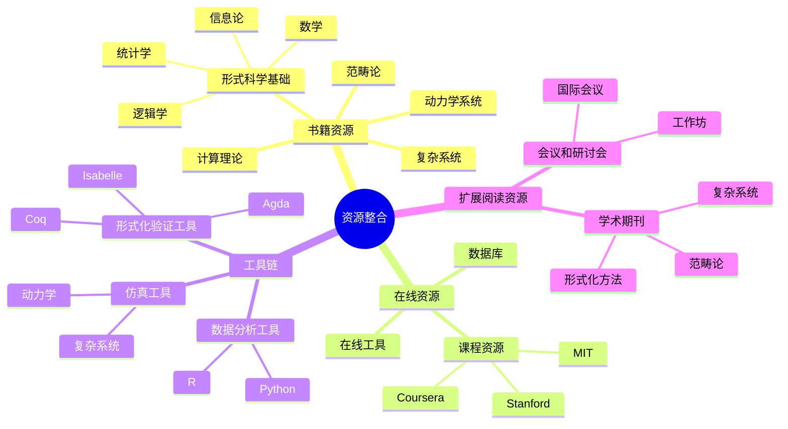
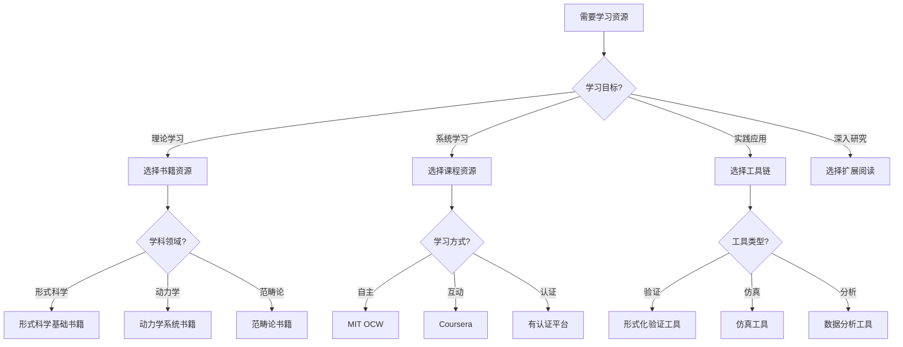
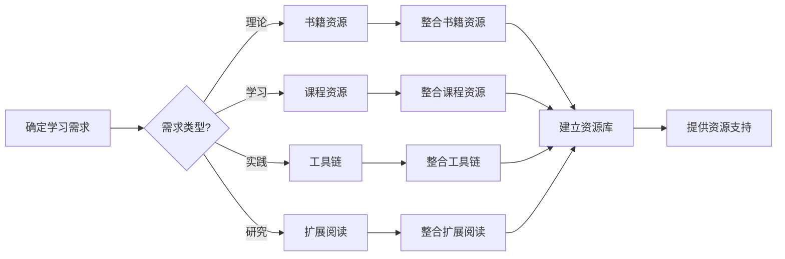
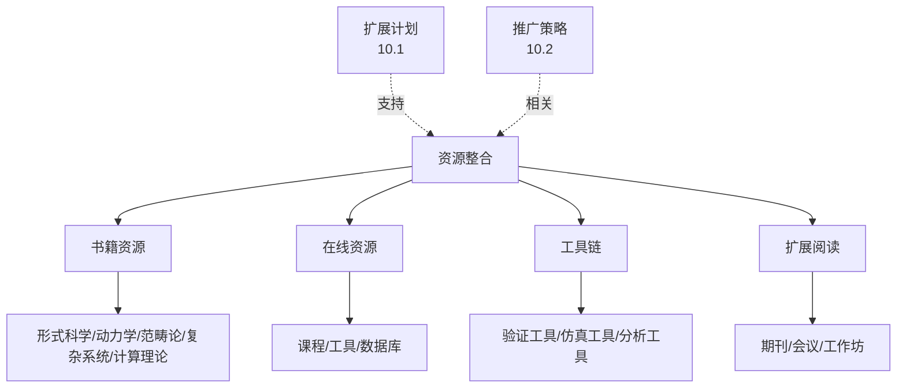
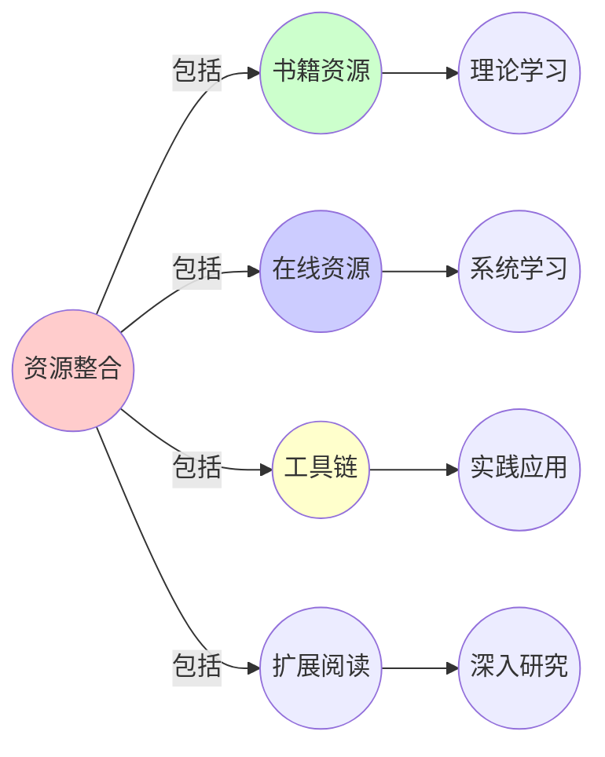
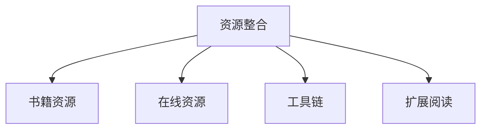

# 10.4 资源整合

> **创建日期**: 2025-01-27
> **最后更新**: 2025-01-27

## 📋 目录

- [10.4 资源整合](#104-资源整合)
  - [📋 目录](#-目录)
  - [📋 内容概览](#-内容概览)
  - [🎯 核心理念](#-核心理念)
  - [📚 书籍资源](#-书籍资源)
    - [形式科学基础](#形式科学基础)
      - [数学](#数学)
      - [逻辑学](#逻辑学)
      - [统计学](#统计学)
      - [信息论](#信息论)
    - [动力学系统](#动力学系统)
    - [范畴论](#范畴论)
    - [复杂系统](#复杂系统)
    - [计算理论](#计算理论)
  - [🌐 在线资源](#-在线资源)
    - [课程资源](#课程资源)
      - [MIT OpenCourseWare](#mit-opencourseware)
      - [Stanford Online](#stanford-online)
      - [Coursera](#coursera)
    - [在线工具](#在线工具)
      - [定理证明器](#定理证明器)
      - [可视化工具](#可视化工具)
      - [网络分析工具](#网络分析工具)
    - [数据库和资源库](#数据库和资源库)
      - [学术数据库](#学术数据库)
      - [代码库](#代码库)
  - [🛠️ 工具链](#️-工具链)
    - [形式化验证工具](#形式化验证工具)
      - [Coq](#coq)
      - [Isabelle/HOL](#isabellehol)
      - [Lean](#lean)
    - [复杂系统仿真工具](#复杂系统仿真工具)
      - [NetLogo](#netlogo)
      - [Vensim](#vensim)
      - [Cytoscape](#cytoscape)
    - [数据分析工具](#数据分析工具)
      - [Python库](#python库)
      - [R包](#r包)
  - [📖 扩展阅读资源](#-扩展阅读资源)
    - [学术期刊](#学术期刊)
      - [形式科学](#形式科学)
      - [复杂系统](#复杂系统-1)
    - [会议和研讨会](#会议和研讨会)
      - [形式化方法](#形式化方法)
      - [复杂系统](#复杂系统-2)
      - [范畴论](#范畴论-1)
  - [📊 详细案例研究](#-详细案例研究)
    - [案例研究 1：Python生态系统的资源整合](#案例研究-1python生态系统的资源整合)
    - [案例研究 2：arXiv的资源整合模式](#案例研究-2arxiv的资源整合模式)
    - [案例研究 3：GitHub的资源组织](#案例研究-3github的资源组织)
  - [⚠️ 批判性分析与局限性](#️-批判性分析与局限性)
    - [局限性讨论](#局限性讨论)
      - [1. 资源质量的保证](#1-资源质量的保证)
      - [2. 资源更新的维护](#2-资源更新的维护)
      - [3. 资源选择的全面性](#3-资源选择的全面性)
    - [改进方向](#改进方向)
      - [1. 建立资源筛选机制](#1-建立资源筛选机制)
      - [2. 自动化资源管理](#2-自动化资源管理)
  - [📊 思维表征体系](#-思维表征体系)
    - [📊 1. 思维导图（增强版）](#-1-思维导图增强版)
      - [1.1 文本格式（基础版）](#11-文本格式基础版)
      - [1.2 Mermaid格式（可视化版）](#12-mermaid格式可视化版)
    - [📊 2. 多维对比矩阵](#-2-多维对比矩阵)
      - [2.1 资源类型对比矩阵](#21-资源类型对比矩阵)
      - [2.2 课程资源对比矩阵](#22-课程资源对比矩阵)
      - [2.3 工具链对比矩阵](#23-工具链对比矩阵)
    - [🌲 3. 决策树](#-3-决策树)
      - [3.1 资源选择决策树](#31-资源选择决策树)
    - [🛤️ 4. 决策逻辑路径](#️-4-决策逻辑路径)
      - [4.1 资源整合路径](#41-资源整合路径)
    - [🕸️ 5. 概念关系网络](#️-5-概念关系网络)
      - [5.1 资源整合概念关系网络](#51-资源整合概念关系网络)
    - [🗺️ 6. 知识图谱](#️-6-知识图谱)
      - [6.1 资源整合知识图谱](#61-资源整合知识图谱)
  - [📚 理论体系](#-理论体系)
    - [理论基础](#理论基础)
      - [知识管理/信息科学/教育资源基础](#知识管理信息科学教育资源基础)
      - [历史发展](#历史发展)
    - [理论框架](#理论框架)
      - [核心假设](#核心假设)
      - [基本概念体系](#基本概念体系)
      - [主要定理/结论](#主要定理结论)
      - [适用范围和边界](#适用范围和边界)
    - [当前知识共识](#当前知识共识)
      - [学术界共识](#学术界共识)
      - [主要争议点](#主要争议点)
      - [权威来源](#权威来源)
    - [与其他理论的关系](#与其他理论的关系)
      - [逻辑关系](#逻辑关系)
      - [映射关系](#映射关系)
  - [🔗 关联网络](#-关联网络)
    - [🔗 概念级关联](#-概念级关联)
      - [核心概念映射](#核心概念映射)
    - [🔗 理论级关联](#-理论级关联)
      - [理论基础](#理论基础-1)
    - [🔗 方法级关联](#-方法级关联)
      - [方法应用网络](#方法应用网络)
    - [🔗 应用场景关联](#-应用场景关联)
  - [🛤️ 学习路径](#️-学习路径)
    - [前置知识](#前置知识)
    - [后续学习](#后续学习)
    - [并行学习](#并行学习)
  - [🔗 相关文档](#-相关文档)
  - [📝 更新日志](#-更新日志)

---

## 📋 内容概览

本文档整合形式科学相关的书籍、在线资源、工具等资源。通过系统化的资源整合，为学习者提供完整的资源支持，促进知识的传播和应用。

---

## 🎯 核心理念

资源整合的核心理念是系统性、全面性和实用性。通过整合书籍、在线资源、工具等多种资源，我们可以为学习者提供全方位的支持，降低学习门槛，提高学习效率。

## 📚 书籍资源

### 形式科学基础

#### 数学

- 《The Princeton Companion to Mathematics》- Timothy Gowers
- 《Mathematics: Its Content, Methods and Meaning》- A.D. Aleksandrov
- 《What is Mathematics?》- Richard Courant

#### 逻辑学

- 《Introduction to Logic》- Irving M. Copi
- 《Mathematical Logic》- Joseph R. Shoenfield
- 《Computability and Logic》- George Boolos

#### 统计学

- 《The Elements of Statistical Learning》- Trevor Hastie
- 《Bayesian Data Analysis》- Andrew Gelman
- 《Information Theory, Inference, and Learning Algorithms》- David MacKay

#### 信息论

- 《Elements of Information Theory》- Thomas M. Cover
- 《Information Theory and Coding》- Robert B. Ash

### 动力学系统

- 《Nonlinear Dynamics and Chaos》- Steven Strogatz
- 《Dynamical Systems and Chaos》- H. Broer
- 《Introduction to Applied Nonlinear Dynamical Systems and Chaos》- Stephen Wiggins

### 范畴论

- 《Category Theory》- Steve Awodey
- 《Basic Category Theory》- Tom Leinster
- 《Categories for the Working Mathematician》- Saunders Mac Lane

### 复杂系统

- 《Complexity: A Guided Tour》- Melanie Mitchell
- 《Networks: An Introduction》- Mark Newman
- 《How Nature Works》- Per Bak

### 计算理论

- 《Introduction to the Theory of Computation》- Michael Sipser
- 《Computational Complexity》- Sanjeev Arora
- 《Algorithm Design》- Jon Kleinberg

## 🌐 在线资源

### 课程资源

#### MIT OpenCourseWare

- **18.705 Category Theory**：范畴论课程
- **6.042J Mathematics for Computer Science**：计算机科学数学
- **18.06 Linear Algebra**：线性代数

#### Stanford Online

- **CS103 Mathematical Foundations of Computing**：计算数学基础
- **CS161 Design and Analysis of Algorithms**：算法设计与分析

#### Coursera

- **Introduction to Logic**：逻辑学导论
- **Discrete Mathematics**：离散数学
- **Algorithms Specialization**：算法专项课程

### 在线工具

#### 定理证明器

- **Coq**：交互式定理证明器
- **Isabelle/HOL**：高阶逻辑定理证明器
- **Lean**：现代定理证明器
- **Agda**：依赖类型编程语言

#### 可视化工具

- **GeoGebra**：几何可视化
- **Desmos**：函数可视化
- **Wolfram Alpha**：数学计算

#### 网络分析工具

- **Gephi**：网络可视化
- **Cytoscape**：生物网络分析
- **NetworkX**：Python网络分析库

### 数据库和资源库

#### 学术数据库

- **arXiv**：预印本论文库
- **Google Scholar**：学术搜索
- **MathSciNet**：数学评论

#### 代码库

- **GitHub**：代码托管
- **GitLab**：代码托管
- **Bitbucket**：代码托管

## 🛠️ 工具链

### 形式化验证工具

#### Coq

- **用途**：定理证明、程序验证
- **应用**：编译器验证、密码学协议验证
- **链接**：https://coq.inria.fr/

#### Isabelle/HOL

- **用途**：高阶逻辑定理证明
- **应用**：操作系统验证、软件验证
- **链接**：https://isabelle.in.tum.de/

#### Lean

- **用途**：现代定理证明
- **应用**：数学形式化
- **链接**：https://leanprover.github.io/

### 复杂系统仿真工具

#### NetLogo

- **用途**：多智能体系统仿真
- **应用**：社交网络、生态系统
- **链接**：https://ccl.northwestern.edu/netlogo/

#### Vensim

- **用途**：系统动力学仿真
- **应用**：供应链、政策模拟
- **链接**：https://vensim.com/

#### Cytoscape

- **用途**：生物网络分析
- **应用**：蛋白质网络、基因网络
- **链接**：https://cytoscape.org/

### 数据分析工具

#### Python库

- **NetworkX**：网络分析
- **NumPy**：数值计算
- **SciPy**：科学计算
- **Matplotlib**：数据可视化

#### R包

- **igraph**：网络分析
- **statnet**：统计网络分析
- **tidyverse**：数据处理

## 📖 扩展阅读资源

### 学术期刊

#### 形式科学

- **Journal of Symbolic Logic**：符号逻辑
- **Annals of Mathematics**：数学年刊
- **Information and Computation**：信息与计算

#### 复杂系统

- **Complexity**：复杂性
- **Journal of Complex Networks**：复杂网络
- **Chaos, Solitons & Fractals**：混沌、孤子与分形

### 会议和研讨会

#### 形式化方法

- **FM**：形式化方法国际会议
- **CAV**：计算机辅助验证
- **TACAS**：工具与算法构建与分析

#### 复杂系统

- **ICCS**：复杂系统国际会议
- **NetSci**：网络科学会议

#### 范畴论

- **ACT**：应用范畴论工作坊
- **CALCO**：计算机科学中的范畴

## 📊 详细案例研究

### 案例研究 1：Python生态系统的资源整合

**背景**：Python生态系统展示了资源整合的成功经验。

**形式化分析**：

```text
Python资源整合:
1. 文档资源:
   - 官方文档
   - 教程资源
   - API文档

2. 工具资源:
   - 开发工具
   - 库和框架
   - 可视化工具

3. 学习资源:
   - 在线课程
   - 书籍推荐
   - 社区支持

成功因素:
- 资源丰富
- 易于获取
- 持续更新
- 社区支持

借鉴应用:
- 资源分类
- 链接整合
- 持续更新
- 社区建设

预期效果:
- 提高学习效率
- 降低学习门槛
- 促进应用
```

**关键发现**：

- ✅ 资源丰富提高价值
- ✅ 易于获取降低门槛
- ✅ 持续更新保持活力

**应用价值**：

- ✅ 资源整合
- ✅ 学习支持
- ✅ 用户增长

### 案例研究 2：arXiv的资源整合模式

**背景**：arXiv展示了学术资源的整合方式。

**形式化分析**：

```text
arXiv资源整合:
1. 论文资源:
   - 分类明确
   - 搜索功能
   - 版本控制

2. 服务功能:
   - 快速发布
   - 引用统计
   - 相关推荐

3. 整合方式:
   - 统一平台
   - 标准格式
   - 开放访问

成功因素:
- 统一平台
- 标准格式
- 开放访问
- 持续服务

借鉴应用:
- 统一平台
- 标准格式
- 开放访问
- 功能整合

预期效果:
- 提高可用性
- 增强体验
- 扩大影响
```

**关键发现**：

- ✅ 统一平台提高效率
- ✅ 标准格式便于使用
- ✅ 开放访问扩大影响

**应用价值**：

- ✅ 资源整合
- ✅ 平台建设
- ✅ 服务创新

### 案例研究 3：GitHub的资源组织

**背景**：GitHub展示了代码资源的组织方式。

**形式化分析**：

```text
GitHub资源组织:
1. 代码组织:
   - 仓库结构
   - 版本控制
   - 协作功能

2. 文档整合:
   - README文档
   - Wiki页面
   - Issue跟踪

3. 社区功能:
   - 讨论区
   - 贡献者
   - 星标和分叉

成功因素:
- 清晰组织
- 功能完整
- 社区活跃
- 易于使用

借鉴应用:
- 资源组织
- 文档整合
- 社区功能
- 易用性设计

预期效果:
- 提高可用性
- 促进协作
- 扩大影响
```

**关键发现**：

- ✅ 清晰组织提高效率
- ✅ 功能完整增强体验
- ✅ 社区活跃促进发展

**应用价值**：

- ✅ 资源组织
- ✅ 平台建设
- ✅ 社区发展

## ⚠️ 批判性分析与局限性

### 局限性讨论

#### 1. 资源质量的保证

**问题**：整合的资源质量可能不一致。

**挑战**：

- ⚠️ 资源质量差异
- ⚠️ 更新不及时
- ⚠️ 审核困难

**应对策略**：

- ✅ 质量筛选
- ✅ 定期审核
- ✅ 用户反馈

#### 2. 资源更新的维护

**问题**：资源需要持续更新和维护。

**挑战**：

- ⚠️ 更新工作量大
- ⚠️ 维护成本高
- ⚠️ 及时性要求

**改进方向**：

- ✅ 自动化工具
- ✅ 社区参与
- ✅ 定期更新

#### 3. 资源选择的全面性

**问题**：资源选择可能不够全面。

**挑战**：

- ⚠️ 资源数量多
- ⚠️ 选择标准难
- ⚠️ 主观性影响

**改进方向**：

- ✅ 明确标准
- ✅ 多方意见
- ✅ 持续补充

### 改进方向

#### 1. 建立资源筛选机制

**目标**：确保资源质量。

**方法**：

- 质量标准
- 审核流程
- 用户评价

#### 2. 自动化资源管理

**目标**：提高管理效率。

**方法**：

- 自动化工具
- 定期检查
- 自动更新

## 📊 思维表征体系

### 📊 1. 思维导图（增强版）

#### 1.1 文本格式（基础版）

```text
资源整合
├── 书籍资源
│   ├── 形式科学基础
│   │   ├── 数学
│   │   ├── 逻辑学
│   │   ├── 统计学
│   │   └── 信息论
│   ├── 动力学系统
│   ├── 范畴论
│   ├── 复杂系统
│   └── 计算理论
├── 在线资源
│   ├── 课程资源
│   │   ├── MIT OpenCourseWare
│   │   ├── Stanford Online
│   │   └── Coursera
│   ├── 在线工具
│   └── 数据库
├── 工具链
│   ├── 形式化验证工具
│   │   ├── Coq
│   │   ├── Agda
│   │   └── Isabelle
│   ├── 仿真工具
│   │   ├── 复杂系统仿真
│   │   └── 动力学仿真
│   └── 数据分析工具
│       ├── Python
│       └── R
└── 扩展阅读资源
    ├── 学术期刊
    │   ├── 复杂系统
    │   ├── 范畴论
    │   └── 形式化方法
    └── 会议和研讨会
        ├── 国际会议
        └── 工作坊
```

#### 1.2 Mermaid格式（可视化版）



### 📊 2. 多维对比矩阵

#### 2.1 资源类型对比矩阵

| 资源类型 | 书籍资源 | 在线资源 | 工具链 | 扩展阅读 | 获取难度 |
|---------|---------|---------|--------|---------|---------|
| **成本** | 中 | 低 | 中 | 低 | 成本不同 |
| **更新频率** | 低 | 高 | 高 | 中 | 频率不同 |
| **系统性** | 高 | 中 | 中 | 低 | 系统性不同 |
| **实用性** | 高 | 高 | 很高 | 中 | 实用性不同 |
| **学习曲线** | 中 | 低 | 中 | 中 | 曲线不同 |
| **适用范围** | 广 | 广 | 中 | 广 | 范围相似 |

#### 2.2 课程资源对比矩阵

| 平台 | MIT OCW | Stanford Online | Coursera | edX | 特点 |
|------|---------|----------------|----------|-----|------|
| **课程数量** | 多 | 中 | 很多 | 多 | 数量不同 |
| **课程质量** | 很高 | 很高 | 高 | 高 | 质量相似 |
| **免费程度** | 完全免费 | 部分免费 | 部分免费 | 部分免费 | 程度不同 |
| **认证** | 无 | 有 | 有 | 有 | 认证不同 |
| **互动性** | 低 | 中 | 高 | 中 | 互动性不同 |

#### 2.3 工具链对比矩阵

| 工具类型 | 形式化验证 | 仿真工具 | 数据分析 | 复杂度 |
|---------|-----------|---------|---------|--------|
| **学习曲线** | 陡峭 | 中 | 平缓 | 曲线不同 |
| **应用范围** | 窄 | 中 | 广 | 范围不同 |
| **专业性** | 很高 | 高 | 中 | 专业性不同 |
| **社区支持** | 中 | 中 | 高 | 支持不同 |
| **更新频率** | 中 | 中 | 高 | 频率不同 |

### 🌲 3. 决策树

#### 3.1 资源选择决策树



### 🛤️ 4. 决策逻辑路径

#### 4.1 资源整合路径



### 🕸️ 5. 概念关系网络

#### 5.1 资源整合概念关系网络



### 🗺️ 6. 知识图谱

#### 6.1 资源整合知识图谱



## 📚 理论体系

### 理论基础

#### 知识管理/信息科学/教育资源基础

资源整合的理论基础：

**1. 知识管理基础**：

- 知识管理理论
- 信息资源管理
- 知识组织理论

**2. 信息科学基础**：

- 信息检索理论
- 信息组织理论
- 信息资源理论

**3. 教育资源基础**：

- 教育资源理论
- 学习资源理论
- 课程资源理论

#### 历史发展

**关键时间节点**：

- **1960-1970年代**：信息资源管理建立
  - 信息资源理论
  - 信息组织方法

- **1980-1990年代**：知识管理发展
  - 知识管理理论
  - 知识组织方法

- **2000年代**：在线资源发展
  - 在线课程
  - 数字图书馆

- **2010年代至今**：现代资源整合
  - 云计算资源
  - 开放教育资源
  - 资源整合平台

### 理论框架

#### 核心假设

**假设1：资源整合的价值**

- **内容**：资源整合提高效率
- **适用范围**：大多数学习场景
- **限制条件**：需要适当的整合方法

**假设2：多类型资源的重要性**

- **内容**：多类型资源互补
- **适用范围**：复杂学习任务
- **限制条件**：需要资源管理

**假设3：资源质量的重要性**

- **内容**：资源质量影响学习效果
- **适用范围**：所有学习场景
- **限制条件**：需要质量标准

#### 基本概念体系



#### 主要定理/结论

**结论1：资源整合的价值**

- **内容**：资源整合提高学习效率
- **证据**：教育研究
- **应用**：资源管理

**结论2：多类型资源的价值**

- **内容**：多类型资源互补提高效果
- **证据**：学习研究
- **应用**：资源设计

**结论3：资源质量的重要性**

- **内容**：资源质量影响学习效果
- **证据**：教育研究
- **应用**：质量控制

#### 适用范围和边界

**适用范围**：

- 学习资源整合
- 知识资源管理
- 教育资源组织

**边界条件**：

- 需要资源来源
- 需要整合方法
- 需要考虑成本

**不适用场景**：

- 无资源需求
- 无资源来源
- 资源过于简单

### 当前知识共识

#### 学术界共识

**广泛接受的共识**：

1. **资源整合的价值**
   - **共识**：资源整合提高效率
   - **支持证据**：管理实践
   - **来源**：知识管理、信息科学

2. **多类型资源的重要性**
   - **共识**：多类型资源互补
   - **支持证据**：学习研究
   - **来源**：教育科学

3. **资源质量的重要性**
   - **共识**：资源质量影响效果
   - **支持证据**：教育研究
   - **来源**：教育科学

#### 主要争议点

1. **资源整合的方式**
   - **观点A**：应该集中整合
   - **观点B**：应该分散整合
   - **当前状态**：多数认为需要平衡

2. **资源质量控制**
   - **观点A**：应该严格质量控制
   - **观点B**：应该开放资源
   - **当前状态**：多数认为需要适度控制

#### 权威来源

**经典文献**：

- 知识管理相关文献
- 信息科学相关文献
- 教育资源相关文献

**权威机构/专家**：

- **知识管理研究会**
- **信息科学研究会**
- **教育科学研究会**

**最新发展**：

- **2020-2024**：云计算资源、开放教育资源、AI辅助资源整合
- **前沿方向**：智能资源推荐、个性化资源、资源自动化整合

### 与其他理论的关系

#### 逻辑关系

**理论基础**：

- **扩展计划**（[10.1_后续扩展计划.md](10.1_后续扩展计划.md)） → 资源整合
  - 关系类型：资源支持
  - 关键映射：扩展计划 → 资源支持

**理论应用**：

- **推广策略**（[10.2_推广策略.md](10.2_推广策略.md)） → 资源整合
  - 关系类型：资源支持
  - 关键映射：推广策略 → 资源支持

#### 映射关系

| 本理论概念 | 映射理论 | 映射概念 | 映射类型 | 映射说明 |
|-----------|---------|---------|---------|----------|
| **书籍资源** | 知识管理 | 知识资源 | 对应 | 资源对应资源 |
| **课程资源** | 教育资源 | 教育资源 | 对应 | 资源对应资源 |
| **工具链** | 工具管理 | 工具资源 | 对应 | 资源对应资源 |
| **扩展阅读** | 知识管理 | 知识扩展 | 对应 | 阅读对应扩展 |

## 🔗 关联网络

### 🔗 概念级关联

#### 核心概念映射

| 本文档概念 | 关联文档 | 关联概念 | 关系类型 | 映射说明 |
|-----------|---------|---------|---------|----------|
| **书籍资源** | 知识管理 | 知识资源 | 对应 | 资源对应资源 |
| **课程资源** | 教育资源 | 教育资源 | 对应 | 资源对应资源 |
| **工具链** | 工具管理 | 工具资源 | 对应 | 资源对应资源 |
| **扩展阅读** | 知识管理 | 知识扩展 | 对应 | 阅读对应扩展 |
| **资源整合** | 10.1_后续扩展计划 | 资源支持 | 对应 | 整合对应支持 |
| **资源质量** | 10.3_对标分析 | 质量标准 | 相关 | 质量相关 |

### 🔗 理论级关联

#### 理论基础

- **本理论基于**：
  - [10.1_后续扩展计划.md](10.1_后续扩展计划.md) ⭐⭐⭐ - 扩展计划
  - 知识管理理论 ⭐⭐ - 知识管理

- **本理论应用于**：
  - 学习支持 ⭐⭐⭐ - 实际应用
  - 资源管理 ⭐⭐ - 实际应用

### 🔗 方法级关联

#### 方法应用网络

| 本文档方法 | 应用文档 | 应用场景 | 应用效果 |
|-----------|---------|---------|---------|
| **资源整合** | 学习项目 | 学习支持 | 成功 |
| **多类型资源** | 教育项目 | 教育资源 | 成功 |
| **资源管理** | 知识项目 | 知识管理 | 成功 |

### 🔗 应用场景关联

**场景**：学习资源支持

| 视角 | 关联文档 | 核心理论 | 关注点 |
|------|---------|---------|--------|
| **资源整合** | 本文档 | 资源整合 | 资源组织 |
| **扩展计划** | 10.1_后续扩展计划 | 扩展规划 | 计划制定 |
| **对标分析** | 10.3_对标分析 | 对标方法 | 质量保证 |

## 🛤️ 学习路径

### 前置知识

**必须先学习**：

- [10.1_后续扩展计划.md](10.1_后续扩展计划.md) ⭐⭐⭐ - 扩展计划
- 知识管理基础 ⭐⭐

**建议先了解**：

- 信息科学
- 教育资源
- 资源管理

### 后续学习

**建议接下来学习**（按顺序）：

1. 实际资源整合项目 ⭐⭐⭐ - 实践应用
2. 资源管理项目 ⭐⭐ - 管理实践
3. 学习支持项目 ⭐⭐ - 学习实践

### 并行学习

**可以同时学习**：

- [10.2_推广策略.md](10.2_推广策略.md) - 推广策略
- [10.3_对标分析.md](10.3_对标分析.md) - 对标分析

## 🔗 相关文档

- [10.1_后续扩展计划.md](10.1_后续扩展计划.md)
- [10.2_推广策略.md](10.2_推广策略.md)
- [10.3_对标分析.md](10.3_对标分析.md)

## 📝 更新日志

- 2025-01-27: 初始创建资源整合文档
- 2025-01-27: 添加完整目录结构和案例研究
