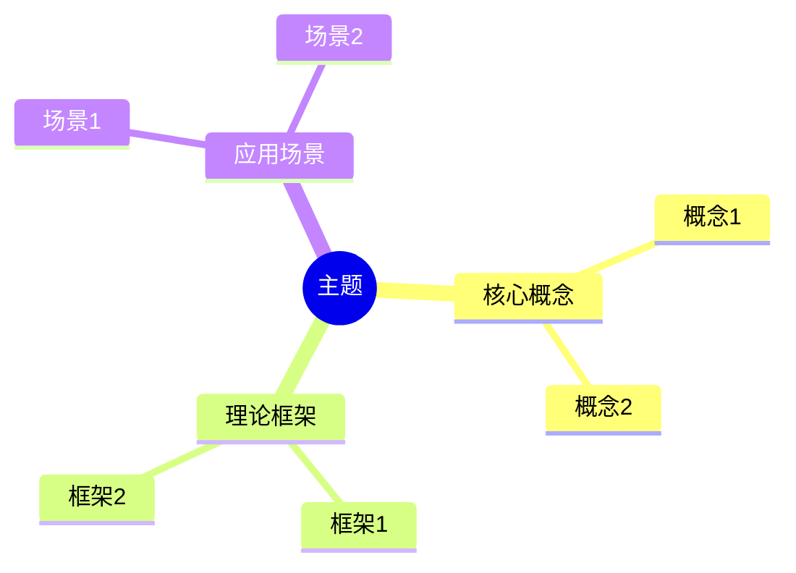
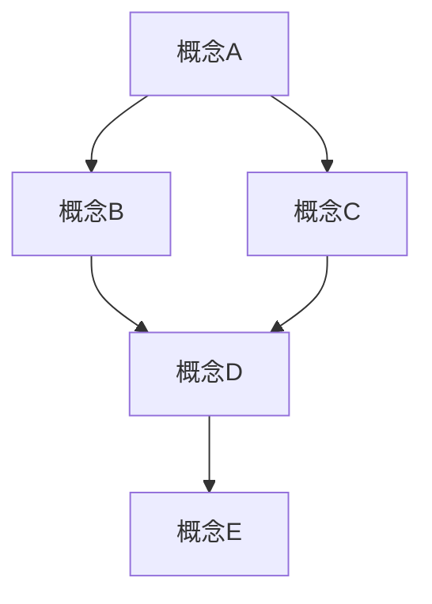
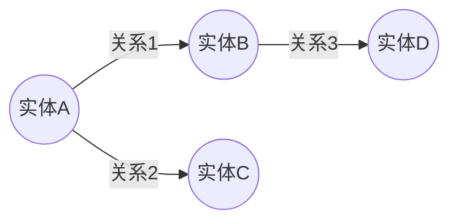

# FormalScience 全面改进计划

> **创建日期**: 2025-01-27
> **版本**: v1.0
> **状态**: 📋 计划阶段

---

## 📋 目录

- [FormalScience 全面改进计划](#formalscience-全面改进计划)
  - [📋 目录](#-目录)
  - [🎯 改进目标](#-改进目标)
    - [总体目标](#总体目标)
    - [具体目标](#具体目标)
  - [📊 当前问题分析](#-当前问题分析)
    - [问题1：思维表征方式单一](#问题1思维表征方式单一)
      - [现状](#现状)
      - [影响](#影响)
    - [问题2：理论模型不完整](#问题2理论模型不完整)
      - [现状](#现状-1)
      - [影响](#影响-1)
    - [问题3：文件间缺乏关联](#问题3文件间缺乏关联)
      - [现状](#现状-2)
      - [影响](#影响-2)
  - [🔍 思维表征方式需求分析](#-思维表征方式需求分析)
    - [必需的思维表征方式（每个文件）](#必需的思维表征方式每个文件)
      - [1. 思维导图（Mind Map）✅ 已有但需增强](#1-思维导图mind-map-已有但需增强)
      - [2. 多维对比矩阵（Multi-dimensional Comparison Matrix）❌ 缺失](#2-多维对比矩阵multi-dimensional-comparison-matrix-缺失)
      - [3. 决策树（Decision Tree）❌ 缺失](#3-决策树decision-tree-缺失)
      - [4. 决策逻辑路径图（Decision Logic Path）❌ 缺失](#4-决策逻辑路径图decision-logic-path-缺失)
      - [5. 概念关系网络图（Concept Relationship Network）❌ 缺失](#5-概念关系网络图concept-relationship-network-缺失)
      - [6. 知识图谱（Knowledge Graph）❌ 缺失](#6-知识图谱knowledge-graph-缺失)
      - [7. 流程图/过程图（Flowchart/Process Diagram）❌ 部分缺失](#7-流程图过程图flowchartprocess-diagram-部分缺失)
      - [8. 时间线/演化图（Timeline/Evolution Diagram）❌ 缺失](#8-时间线演化图timelineevolution-diagram-缺失)
      - [9. 层次结构图（Hierarchy Diagram）❌ 缺失](#9-层次结构图hierarchy-diagram-缺失)
      - [10. 状态转换图（State Transition Diagram）❌ 缺失](#10-状态转换图state-transition-diagram-缺失)
  - [🔗 文件间关联需求分析](#-文件间关联需求分析)
    - [关联类型](#关联类型)
      - [1. 概念级关联 ❌ 缺失](#1-概念级关联--缺失)
      - [2. 理论级关联 ❌ 缺失](#2-理论级关联--缺失)
      - [3. 方法级关联 ❌ 缺失](#3-方法级关联--缺失)
      - [4. 应用场景关联 ❌ 缺失](#4-应用场景关联--缺失)
      - [5. 学习路径关联 ❌ 缺失](#5-学习路径关联--缺失)
  - [📐 改进方案设计](#-改进方案设计)
    - [方案1：增强思维表征方式](#方案1增强思维表征方式)
      - [1.1 在每个文件中添加"思维表征体系"章节](#11-在每个文件中添加思维表征体系章节)
      - [1.2 思维表征方式规范](#12-思维表征方式规范)
    - [方案2：建立文件间关联体系](#方案2建立文件间关联体系)
      - [2.1 在每个文件中添加"关联网络"章节](#21-在每个文件中添加关联网络章节)
      - [2.2 创建统一的关联索引文件](#22-创建统一的关联索引文件)
    - [方案3：完善理论解释体系](#方案3完善理论解释体系)
      - [3.1 在每个文件中添加"理论体系"章节](#31-在每个文件中添加理论体系章节)
      - [3.2 创建统一的理论框架文档](#32-创建统一的理论框架文档)
  - [📅 实施计划](#-实施计划)
    - [阶段1：准备阶段（1-2周）](#阶段1准备阶段1-2周)
      - [1.1 工具和模板准备](#11-工具和模板准备)
      - [1.2 规范制定](#12-规范制定)
    - [阶段2：试点改进（2-3周）](#阶段2试点改进2-3周)
      - [2.1 选择试点文件](#21-选择试点文件)
      - [2.2 完整改进试点文件](#22-完整改进试点文件)
      - [2.3 验证和改进](#23-验证和改进)
    - [阶段3：全面推广（4-6周）](#阶段3全面推广4-6周)
      - [3.1 按系列推进](#31-按系列推进)
      - [3.2 创建统一索引](#32-创建统一索引)
    - [阶段4：验证和完善（1-2周）](#阶段4验证和完善1-2周)
      - [4.1 质量检查](#41-质量检查)
      - [4.2 文档更新](#42-文档更新)
  - [📊 成功标准](#-成功标准)
    - [量化指标](#量化指标)
    - [质量指标](#质量指标)
  - [🔄 持续改进](#-持续改进)
    - [定期审查](#定期审查)
    - [反馈机制](#反馈机制)
  - [📝 下一步行动](#-下一步行动)
    - [立即开始](#立即开始)

---

## 🎯 改进目标

### 总体目标

将FormalScience项目从一个**内容完整但结构松散**的文档集合，提升为**高度整合、多维表征、相互关联**的统一知识体系。

### 具体目标

1. **丰富思维表征方式**：每个文件包含5-7种不同的思维表征方式
2. **建立完整关联网络**：所有文件通过多种方式相互关联
3. **构建统一理论框架**：建立整体性的理论解释体系
4. **增强知识体系性**：消除分裂割裂，形成有机整体

---

## 📊 当前问题分析

### 问题1：思维表征方式单一

#### 现状

- ✅ **已有**：文本格式的简单思维导图（单一树状结构）
- ❌ **缺失**：多维对比矩阵
- ❌ **缺失**：决策树
- ❌ **缺失**：决策逻辑路径图
- ❌ **缺失**：概念关系网络图
- ❌ **缺失**：知识图谱
- ❌ **缺失**：流程图/过程图
- ❌ **缺失**：时间线/演化图
- ❌ **缺失**：层次结构图
- ❌ **缺失**：状态转换图

#### 影响

- 知识理解单一化
- 难以进行多维度对比
- 缺乏决策支持工具
- 无法展示复杂关系网络

### 问题2：理论模型不完整

#### 现状

- ✅ **已有**：各个主题的独立内容
- ❌ **缺失**：理论模型的完整解释体系
- ❌ **缺失**：当前知识共识的明确说明
- ❌ **缺失**：理论间的逻辑联系论证
- ❌ **缺失**：统一的理论框架

#### 影响

- 知识碎片化
- 理论背景不清
- 难以建立整体认知
- 学习路径不明确

### 问题3：文件间缺乏关联

#### 现状

- ✅ **已有**：基本的"相关文档"链接（单向、简单）
- ❌ **缺失**：跨系列的关联网络
- ❌ **缺失**：概念级别的交叉引用
- ❌ **缺失**：理论映射关系说明
- ❌ **缺失**：学习路径规划
- ❌ **缺失**：依赖关系图
- ❌ **缺失**：应用场景关联

#### 影响

- 文件孤立，缺乏整体感
- 跨主题学习困难
- 无法理解知识体系结构
- 应用场景不清晰

---

## 🔍 思维表征方式需求分析

### 必需的思维表征方式（每个文件）

#### 1. 思维导图（Mind Map）✅ 已有但需增强

**当前状态**：简单的文本树状结构

**需要增强**：

- 添加**Mermaid格式**的可视化思维导图
- 支持**多中心节点**
- 支持**层次化展开**
- 支持**交互式导航**

**示例结构**：



#### 2. 多维对比矩阵（Multi-dimensional Comparison Matrix）❌ 缺失

**目的**：多维度对比分析不同概念、方法、理论

**类型**：

- **概念对比矩阵**：对比核心概念的异同
- **方法对比矩阵**：对比不同方法的优劣
- **理论对比矩阵**：对比相关理论的关系
- **应用对比矩阵**：对比应用场景的适用性
- **工具对比矩阵**：对比工具的差异

**格式示例**：

| 维度 | 特征A | 特征B | 特征C | 适用场景 |
|------|-------|-------|-------|----------|
| 维度1 | 值1 | 值2 | 值3 | 场景1 |
| 维度2 | 值4 | 值5 | 值6 | 场景2 |
| 维度3 | 值7 | 值8 | 值9 | 场景3 |

#### 3. 决策树（Decision Tree）❌ 缺失

**目的**：提供决策支持，帮助选择合适的方法/理论

**类型**：

- **方法选择决策树**：如何选择合适的方法
- **理论应用决策树**：如何应用理论
- **问题解决决策树**：如何解决问题
- **学习路径决策树**：如何学习主题

**格式示例**：

```text
决策开始
  ├─ 条件1成立？
  │   ├─ 是 → 路径A
  │   │   ├─ 子条件A1 → 方法1
  │   │   └─ 子条件A2 → 方法2
  │   └─ 否 → 路径B
  │       ├─ 子条件B1 → 方法3
  │       └─ 子条件B2 → 方法4
```

#### 4. 决策逻辑路径图（Decision Logic Path）❌ 缺失

**目的**：展示从问题到解决方案的逻辑路径

**类型**：

- **问题→理论→应用路径**
- **概念→方法→验证路径**
- **学习→理解→应用路径**

**格式示例**：


#### 5. 概念关系网络图（Concept Relationship Network）❌ 缺失

**目的**：展示概念之间的复杂关系网络

**类型**：

- **概念依赖网络**：展示概念间的依赖关系
- **概念映射网络**：展示跨领域概念映射
- **概念层级网络**：展示概念的层次结构

**格式示例**：



#### 6. 知识图谱（Knowledge Graph）❌ 缺失

**目的**：展示实体-关系-实体的知识图谱

**格式示例**：



#### 7. 流程图/过程图（Flowchart/Process Diagram）❌ 部分缺失

**目的**：展示过程、流程、算法

**类型**：

- **方法流程图**
- **验证流程图**
- **分析流程图**

#### 8. 时间线/演化图（Timeline/Evolution Diagram）❌ 缺失

**目的**：展示概念、理论、技术的时间演化

#### 9. 层次结构图（Hierarchy Diagram）❌ 缺失

**目的**：展示概念的层次结构和分类

#### 10. 状态转换图（State Transition Diagram）❌ 缺失

**目的**：展示系统、概念的状态转换

---

## 🔗 文件间关联需求分析

### 关联类型

#### 1. 概念级关联 ❌ 缺失

**当前**：只有文件级链接

**需要**：

- 概念到概念的映射
- 跨文件概念引用
- 概念关系标注

**示例**：

- `02.1_经典确定性动力学.md`中的"相空间" ↔ `03.1_范畴论基础.md`中的"态射空间"
- `05.1_信息论基础.md`中的"熵" ↔ `04.3_自组织临界.md`中的"临界熵"

#### 2. 理论级关联 ❌ 缺失

**需要**：

- 理论继承关系
- 理论应用关系
- 理论映射关系

**示例**：

- `02_动力学系统理论` → `07_IT行业形式化应用`（动力学在IT中的应用）
- `03_范畴论` → `09_Curry-Howard同构`（范畴论视角）

#### 3. 方法级关联 ❌ 缺失

**需要**：

- 方法的跨领域应用
- 方法的组合使用
- 方法的演化关系

#### 4. 应用场景关联 ❌ 缺失

**需要**：

- 同一应用场景的不同理论视角
- 应用场景的分类和层次

#### 5. 学习路径关联 ❌ 缺失

**需要**：

- 前置知识依赖
- 学习顺序推荐
- 学习深度分层

---

## 📐 改进方案设计

### 方案1：增强思维表征方式

#### 1.1 在每个文件中添加"思维表征体系"章节

**位置**：在"思维导图"章节之后

**内容**：

1. **思维导图**（增强版）
   - 文本格式（保持）
   - Mermaid格式（新增）
   - 多视图思维导图（新增）

2. **多维对比矩阵**（新增）
   - 核心概念对比矩阵
   - 方法对比矩阵
   - 理论对比矩阵

3. **决策树**（新增）
   - 方法选择决策树
   - 应用场景决策树

4. **逻辑路径图**（新增）
   - 问题解决路径
   - 学习路径

5. **概念关系网络**（新增）
   - 概念依赖网络
   - 概念映射网络

6. **知识图谱**（新增）
   - 实体-关系图谱

7. **流程图**（新增）
   - 方法流程图
   - 验证流程图

#### 1.2 思维表征方式规范

**格式标准**：

- Mermaid格式用于可视化图表
- 文本格式用于备用和兼容性
- 表格格式用于矩阵

**质量标准**：

- 每个文件至少包含5种不同类型的思维表征
- 所有图表必须有清晰标题和说明
- 图表之间要相互补充，避免重复

### 方案2：建立文件间关联体系

#### 2.1 在每个文件中添加"关联网络"章节

**位置**：在"相关文档"之前

**内容**：

1. **概念级关联**

   ```markdown
   ## 🔗 概念级关联

   ### 核心概念映射

   | 本文档概念 | 关联文档 | 关联概念 | 关系类型 | 说明 |
   |-----------|---------|---------|---------|------|
   | 相空间 | 03.1_范畴论基础.md | 态射空间 | 同构 | 数学结构相似 |
   | 动力学方程 | 04.1_复杂系统基础.md | 系统演化 | 特例 | 特殊到一般 |
   ```

2. **理论级关联**

   ```markdown
   ## 🔗 理论级关联

   ### 理论继承关系
   - 本理论基于：[02.1_经典确定性动力学.md]
   - 本理论应用于：[07.1_Kubernetes动力学.md]
   - 本理论与...结合：[03.1_范畴论基础.md]
   ```

3. **方法级关联**

   ```markdown
   ## 🔗 方法级关联

   ### 方法应用网络
   - 本方法在...中应用：[跨系列文件]
   - 本方法与...组合：[相关方法文件]
   ```

4. **学习路径关联**

   ```markdown
   ## 🛤️ 学习路径

   ### 前置知识
   - 必须先学习：[前置文件列表]

   ### 后续学习
   - 建议接下来学习：[后续文件列表]

   ### 并行学习
   - 可以同时学习：[并行文件列表]
   ```

#### 2.2 创建统一的关联索引文件

**文件**：`view/FormalScience/00_知识体系关联索引.md`

**内容**：

- 所有文件的概念级关联矩阵
- 所有文件的理论级关联网络
- 所有文件的方法级关联图
- 完整的学习路径图

### 方案3：完善理论解释体系

#### 3.1 在每个文件中添加"理论体系"章节

**位置**：在"核心理念"之后

**内容**：

1. **理论基础**
   - 本理论的数学/逻辑基础
   - 本理论的历史发展
   - 当前知识共识

2. **理论框架**
   - 核心假设
   - 基本概念体系
   - 主要定理/结论
   - 适用范围和边界

3. **与其他理论的关系**
   - 理论间的逻辑关系
   - 理论间的映射关系
   - 理论间的互补关系

#### 3.2 创建统一的理论框架文档

**文件**：`view/FormalScience/00_统一理论框架.md`

**内容**：

- 形式科学的整体理论框架
- 各系列理论在框架中的位置
- 理论间的统一性论证
- 理论的整体解释体系

---

## 📅 实施计划

### 阶段1：准备阶段（1-2周）

#### 1.1 工具和模板准备

- [ ] 创建思维表征方式模板
- [ ] 创建关联网络模板
- [ ] 创建理论体系模板
- [ ] 研究最新思维表征方法
- [ ] 准备Mermaid图表示例

#### 1.2 规范制定

- [ ] 制定思维表征方式规范
- [ ] 制定关联网络规范
- [ ] 制定理论体系规范
- [ ] 制定质量标准

### 阶段2：试点改进（2-3周）

#### 2.1 选择试点文件

**建议选择**：

- `01.1_形式科学的定义与特征.md`（基础文件）
- `02.1_经典确定性动力学.md`（应用示例）
- `06.1_跨学科映射策略.md`（关联性强）

#### 2.2 完整改进试点文件

**每个文件包含**：

- [ ] 增强的思维导图（Mermaid格式）
- [ ] 3-5个多维对比矩阵
- [ ] 1-2个决策树
- [ ] 1-2个逻辑路径图
- [ ] 1个概念关系网络
- [ ] 1个知识图谱
- [ ] 完整的关联网络章节
- [ ] 完整的理论体系章节

#### 2.3 验证和改进

- [ ] 验证模板的实用性
- [ ] 收集反馈
- [ ] 改进模板和规范

### 阶段3：全面推广（4-6周）

#### 3.1 按系列推进

**顺序建议**：

1. **01系列**（5个文件）- 基础理论，影响面大
2. **02系列**（6个文件）- 动力学理论
3. **03系列**（6个文件）- 范畴论
4. **04系列**（5个文件）- 复杂系统
5. **05系列**（5个文件）- 信息论
6. **06系列**（5个文件）- 跨学科映射
7. **07系列**（5个文件）- IT应用
8. **08系列**（5个文件）- 认知科学
9. **09系列**（5个文件）- Curry-Howard
10. **10系列**（4个文件）- 推广计划

#### 3.2 创建统一索引

- [ ] 创建`00_知识体系关联索引.md`
- [ ] 创建`00_统一理论框架.md`
- [ ] 更新主README文件

### 阶段4：验证和完善（1-2周）

#### 4.1 质量检查

- [ ] 检查所有文件的思维表征方式
- [ ] 验证所有关联网络
- [ ] 检查理论体系完整性

#### 4.2 文档更新

- [ ] 更新使用指南
- [ ] 创建学习路径图
- [ ] 更新相关文档

---

## 📊 成功标准

### 量化指标

1. **思维表征方式覆盖**
   - ✅ 每个文件至少包含5种不同的思维表征方式
   - ✅ 所有文件包含至少1个Mermaid可视化图表
   - ✅ 所有文件包含至少3个对比矩阵

2. **关联网络完整性**
   - ✅ 每个文件包含概念级关联
   - ✅ 每个文件包含理论级关联
   - ✅ 每个文件包含学习路径
   - ✅ 创建统一的关联索引文件

3. **理论体系完整性**
   - ✅ 每个文件包含理论体系章节
   - ✅ 创建统一的理论框架文档
   - ✅ 所有理论都有明确的边界和关系说明

### 质量指标

1. **可读性**
   - 图表清晰易懂
   - 关联关系明确
   - 理论解释充分

2. **系统性**
   - 文件间关联清晰
   - 整体框架统一
   - 知识体系完整

3. **实用性**
   - 决策树可实际使用
   - 学习路径可执行
   - 关联网络有价值

---

## 🔄 持续改进

### 定期审查

- **每月**：审查新增内容的思维表征方式
- **每季度**：更新关联网络
- **每半年**：更新理论框架

### 反馈机制

- 收集用户反馈
- 分析使用数据
- 持续优化方法

---

## 📝 下一步行动

### 立即开始

1. [ ] 创建思维表征方式模板文件
2. [ ] 创建关联网络模板文件
3. [ ] 创建理论体系模板文件
4. [ ] 选择并改进第一个试点文件
5. [ ] 制定详细的执行计划

---

**状态**: 📋 计划已完成，等待实施
