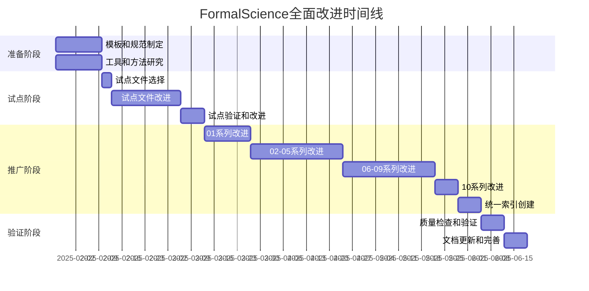

# FormalScience 全面改进实施路线图

> **创建日期**: 2025-01-27
> **版本**: v1.0
> **总体目标**: 将FormalScience从内容完整但结构松散的项目提升为高度整合、多维表征、相互关联的统一知识体系

---

## 📋 路线图概览



---

## 🎯 总体目标

### 目标1：丰富思维表征方式

**当前状态**：每个文件只有1种简单的文本思维导图

**目标状态**：每个文件包含5-7种不同的思维表征方式

**具体指标**：

- ✅ 每个文件至少5种思维表征方式
- ✅ 包含至少1个Mermaid可视化图表
- ✅ 包含至少3个对比矩阵
- ✅ 包含至少1个决策树
- ✅ 包含至少1个逻辑路径图

### 目标2：建立完整关联网络

**当前状态**：文件间只有简单的单向链接

**目标状态**：建立多层级、多维度、双向的关联网络

**具体指标**：

- ✅ 每个文件包含概念级关联
- ✅ 每个文件包含理论级关联
- ✅ 每个文件包含方法级关联
- ✅ 每个文件包含学习路径
- ✅ 创建统一的关联索引文件

### 目标3：完善理论解释体系

**当前状态**：理论背景和共识不明确

**目标状态**：每个理论都有完整的解释和共识说明

**具体指标**：

- ✅ 每个文件包含理论体系章节
- ✅ 明确理论基础和假设
- ✅ 明确知识共识和争议
- ✅ 创建统一的理论框架文档

---

## 📐 改进内容详细说明

### 改进内容1：思维表征方式

#### 必需添加的内容（每个文件）

1. **思维导图（增强版）**
   - 文本格式（保持）
   - Mermaid格式（新增）
   - 多视图思维导图（新增）

2. **多维对比矩阵**（新增，至少3个）
   - 核心概念对比矩阵
   - 方法对比矩阵
   - 理论对比矩阵
   - 应用场景对比矩阵

3. **决策树**（新增，至少1个）
   - 方法选择决策树
   - 应用场景决策树
   - 学习路径决策树

4. **决策逻辑路径图**（新增，至少1个）
   - 问题解决逻辑路径
   - 学习理解逻辑路径
   - 方法应用逻辑路径

5. **概念关系网络图**（新增，至少1个）
   - 概念依赖网络
   - 概念映射网络
   - 跨领域概念网络

6. **知识图谱**（新增，可选）
   - 实体-关系图谱

7. **流程图/过程图**（新增，可选）
   - 方法流程图
   - 验证流程图

### 改进内容2：文件关联体系

#### 必需添加的内容（每个文件）

1. **概念级关联**（新增）

   ```markdown
   ## 🔗 概念级关联

   ### 核心概念映射

   [概念关联表格，至少5个关联]
   ```

2. **理论级关联**（新增）

   ```markdown
   ## 🔗 理论级关联

   ### 理论基础
   - 本理论基于：[列表]

   ### 理论应用
   - 本理论应用于：[列表]

   ### 理论关系
   - 与[理论X]的关系：[说明]
   ```

3. **方法级关联**（新增）

   ```markdown
   ## 🔗 方法级关联

   ### 方法应用网络

   [方法应用表格]
   ```

4. **应用场景关联**（新增）

   ```markdown
   ## 🔗 应用场景关联

   ### 同一场景的多视角

   [场景关联说明]
   ```

5. **学习路径**（新增）

   ```markdown
   ## 🛤️ 学习路径

   ### 前置知识
   - [列表]

   ### 后续学习
   - [列表]

   ### 并行学习
   - [列表]
   ```

### 改进内容3：理论解释体系

#### 必需添加的内容（每个文件）

1. **理论基础**（新增）

   ```markdown
   ## 📚 理论基础

   ### 数学/逻辑基础
   [说明]

   ### 历史发展
   [时间线]
   ```

2. **理论框架**（新增）

   ```markdown
   ## 📚 理论框架

   ### 核心假设
   [列表]

   ### 基本概念体系
   [概念图]

   ### 主要定理/结论
   [列表]

   ### 适用范围和边界
   [说明]
   ```

3. **当前知识共识**（新增）

   ```markdown
   ## 📚 当前知识共识

   ### 学术界共识
   [列表]

   ### 主要争议点
   [列表]

   ### 权威来源
   [列表]

   ### 最新发展
   [说明]
   ```

4. **与其他理论的关系**（新增）

   ```markdown
   ## 📚 与其他理论的关系

   ### 逻辑关系
   [说明]

   ### 映射关系
   [表格]

   ### 统一性论证
   [说明]
   ```

---

## 📅 详细实施计划

### 第1阶段：准备阶段（2周）

#### 周1：模板和规范准备

- [x] **Day 1-2**：创建思维表征方式模板库
- [x] **Day 3-4**：创建文件关联体系设计文档
- [x] **Day 5**：创建理论体系完善计划
- [x] **Day 6-7**：制定详细实施路线图

#### 周2：工具和方法研究

- [ ] **Day 8-9**：研究最新思维表征方法（2024-2025）
- [ ] **Day 10-11**：研究Mermaid图表最佳实践
- [ ] **Day 12-13**：准备示例和最佳实践案例
- [ ] **Day 14**：验证模板的实用性

### 第2阶段：试点改进阶段（3周）

#### 周3：试点文件选择和改进准备

- [ ] **Day 15**：选择试点文件（01.1, 02.1, 06.1）
- [ ] **Day 16-17**：分析试点文件的当前状态
- [ ] **Day 18-19**：设计试点文件的改进方案
- [ ] **Day 20-21**：准备试点文件需要的素材

#### 周4-5：试点文件改进

**文件1：01.1_形式科学的定义与特征.md**

- [ ] 添加增强的思维导图（Mermaid格式）
- [ ] 添加3-5个多维对比矩阵
- [ ] 添加1-2个决策树
- [ ] 添加1-2个逻辑路径图
- [ ] 添加1个概念关系网络
- [ ] 添加完整的关联网络章节
- [ ] 添加完整的理论体系章节

**文件2：02.1_经典确定性动力学.md**

- [ ] 添加增强的思维导图（Mermaid格式）
- [ ] 添加3-5个多维对比矩阵（不同动力学系统的对比）
- [ ] 添加1-2个决策树（如何选择动力学模型）
- [ ] 添加1-2个逻辑路径图（从问题到动力学模型）
- [ ] 添加1个概念关系网络（动力学概念网络）
- [ ] 添加完整的关联网络章节（与其他动力学文件、其他理论）
- [ ] 添加完整的理论体系章节（动力学理论框架）

**文件3：06.1_跨学科映射策略.md**

- [ ] 添加增强的思维导图（Mermaid格式）
- [ ] 添加3-5个多维对比矩阵（映射策略对比）
- [ ] 添加1-2个决策树（如何选择映射策略）
- [ ] 添加1-2个逻辑路径图（映射流程）
- [ ] 添加1个概念关系网络（映射概念网络）
- [ ] 添加完整的关联网络章节（与所有应用文件）
- [ ] 添加完整的理论体系章节（映射理论框架）

#### 周6：试点验证和改进

- [ ] **Day 38-39**：检查试点文件的完整性
- [ ] **Day 40-41**：验证思维表征方式的质量
- [ ] **Day 42**：收集反馈和改进建议
- [ ] **Day 43**：改进模板和规范

### 第3阶段：全面推广阶段（10周）

#### 周7-8：01系列改进（5个文件）

**优先级**：最高（基础理论，影响面大）

- [ ] **01.1**：已完成试点
- [ ] **01.2**：核心领域详解
- [ ] **01.3**：扩展领域详解
- [ ] **01.4**：元理论框架
- [ ] **01.5**：批判性分析

**每个文件包含**：

- 5-7种思维表征方式
- 完整的关联网络
- 完整的理论体系

#### 周9-10：02系列改进（6个文件）

- [ ] **02.1**：已完成试点
- [ ] **02.2**：随机动力学
- [ ] **02.3**：网络动力学
- [ ] **02.4**：分岔理论与相变
- [ ] **02.5**：跨学科动力学映射
- [ ] **02.6**：高级抽象

#### 周11-12：03系列改进（6个文件）

- [ ] **03.1**：范畴论基础
- [ ] **03.2**：函子与自然变换
- [ ] **03.3**：极限与余极限
- [ ] **03.4**：数据库设计中的范畴论
- [ ] **03.5**：编程语言语义的范畴化
- [ ] **03.6**：量子计算中的范畴论

#### 周13-14：04-05系列改进（10个文件）

**04系列（5个）**：

- [ ] **04.1-04.5**：复杂系统与网络理论

**05系列（5个）**：

- [ ] **05.1-05.5**：信息论与计算理论

#### 周15-16：06-07系列改进（10个文件）

**06系列（5个）**：

- [ ] **06.1**：已完成试点
- [ ] **06.2-06.5**：跨学科映射与应用

**07系列（5个）**：

- [ ] **07.1-07.5**：IT行业形式化应用

#### 周17-18：08-09系列改进（10个文件）

**08系列（5个）**：

- [ ] **08.1-08.5**：数学直觉与认知科学

**09系列（5个）**：

- [ ] **09.1-09.5**：Curry-Howard同构

#### 周19：10系列改进（4个文件）

- [ ] **10.1-10.4**：扩展计划与推广

#### 周20：统一索引创建

- [ ] 创建`00_知识体系关联索引.md`
- [ ] 创建`00_统一理论框架.md`
- [ ] 更新主README文件

### 第4阶段：验证和完善阶段（2周）

#### 周21：质量检查

- [ ] 检查所有文件的思维表征方式（51个文件）
- [ ] 验证所有关联网络的完整性
- [ ] 检查理论体系的完整性
- [ ] 验证统一索引的正确性

#### 周22：文档更新

- [ ] 更新使用指南
- [ ] 创建学习路径总图
- [ ] 更新相关文档
- [ ] 创建改进完成报告

---

## 📊 成功标准

### 量化指标

1. **思维表征方式**：
   - ✅ 每个文件包含至少5种不同的思维表征方式
   - ✅ 51个文件共包含至少255个思维表征实例
   - ✅ 每个文件包含至少1个Mermaid可视化图表
   - ✅ 每个文件包含至少3个对比矩阵

2. **关联网络**：
   - ✅ 每个文件包含概念级关联（至少5个）
   - ✅ 每个文件包含理论级关联
   - ✅ 每个文件包含方法级关联
   - ✅ 每个文件包含学习路径
   - ✅ 创建统一的关联索引文件

3. **理论体系**：
   - ✅ 每个文件包含理论体系章节
   - ✅ 创建统一的理论框架文档
   - ✅ 所有理论都有明确的边界和关系说明

### 质量指标

1. **可读性**：
   - 图表清晰易懂
   - 关联关系明确
   - 理论解释充分

2. **系统性**：
   - 文件间关联清晰
   - 整体框架统一
   - 知识体系完整

3. **实用性**：
   - 决策树可实际使用
   - 学习路径可执行
   - 关联网络有价值

---

## 🎯 关键里程碑

### 里程碑1：准备完成（Week 2结束）

- ✅ 所有模板和规范已创建
- ✅ 工具和方法已研究
- ✅ 试点方案已制定

### 里程碑2：试点完成（Week 6结束）

- ✅ 3个试点文件已完成改进
- ✅ 模板已验证和改进
- ✅ 推广方案已确定

### 里程碑3：01-03系列完成（Week 12结束）

- ✅ 基础理论系列已完成改进
- ✅ 核心理论系列已完成改进
- ✅ 方法已成熟

### 里程碑4：全部完成（Week 22结束）

- ✅ 所有51个文件已完成改进
- ✅ 统一索引已创建
- ✅ 质量验证已通过

---

## ⚠️ 风险和应对

### 风险1：工作量过大

**风险**：改进51个文件工作量巨大

**应对**：

- 先完成试点，验证可行性
- 制定详细的模板，减少重复工作
- 按优先级分批推进
- 可以分多个阶段完成

### 风险2：质量难以保证

**风险**：改进后的内容质量不一致

**应对**：

- 制定详细的质量标准
- 建立审查机制
- 定期进行质量检查

### 风险3：关联网络过于复杂

**风险**：关联网络可能过于复杂，难以维护

**应对**：

- 使用清晰的标注规范
- 自动化生成部分关联
- 定期更新和维护

---

## 📝 下一步行动

### 立即开始（Week 1）

1. [ ] 研究最新思维表征方法
2. [ ] 完善模板库
3. [ ] 开始试点文件改进

### 本周内完成

1. [ ] 完成模板库创建
2. [ ] 完成关联体系设计
3. [ ] 完成理论体系计划
4. [ ] 完成实施路线图

---

**状态**: 📋 路线图已完成，可以开始实施

**预计完成时间**: 2025年6月中旬（约22周）
