# 思维表征方式模板库

> **创建日期**: 2025-01-27
> **版本**: v1.0
> **用途**: 为FormalScience项目提供标准化的思维表征方式模板

---

## 📋 目录

- [思维表征方式模板库](#思维表征方式模板库)
  - [📋 目录](#-目录)
  - [1. 思维导图模板](#1-思维导图模板)
    - [1.1 文本格式（基础版）](#11-文本格式基础版)
    - [1.2 Mermaid格式（可视化版）](#12-mermaid格式可视化版)
    - [1.3 多中心思维导图](#13-多中心思维导图)
  - [2. 多维对比矩阵模板](#2-多维对比矩阵模板)
    - [2.1 核心概念对比矩阵](#21-核心概念对比矩阵)
    - [2.2 方法对比矩阵](#22-方法对比矩阵)
    - [2.3 理论对比矩阵](#23-理论对比矩阵)
    - [2.4 应用场景对比矩阵](#24-应用场景对比矩阵)
  - [3. 决策树模板](#3-决策树模板)
    - [3.1 方法选择决策树](#31-方法选择决策树)
    - [3.3 问题解决决策树](#33-问题解决决策树)
  - [4. 决策逻辑路径模板](#4-决策逻辑路径模板)
    - [4.1 问题解决逻辑路径](#41-问题解决逻辑路径)
  - [5. 概念关系网络模板](#5-概念关系网络模板)
    - [5.1 概念依赖网络](#51-概念依赖网络)
    - [7.2 验证流程图](#72-验证流程图)
  - [8. 时间线模板](#8-时间线模板)
    - [8.1 理论演化时间线](#81-理论演化时间线)
    - [8.2 概念发展时间线](#82-概念发展时间线)
  - [9. 层次结构图模板](#9-层次结构图模板)
    - [9.1 概念层次结构](#91-概念层次结构)
  - [10. 状态转换图模板](#10-状态转换图模板)
    - [10.1 系统状态转换](#101-系统状态转换)
    - [10.2 学习状态转换](#102-学习状态转换)
  - [📝 使用说明](#-使用说明)
    - [如何选择模板](#如何选择模板)
    - [模板定制](#模板定制)

---

## 1. 思维导图模板

### 1.1 文本格式（基础版）

```text
主题名称
├── 主要分支1
│   ├── 子分支1.1
│   │   ├── 细节1.1.1
│   │   └── 细节1.1.2
│   ├── 子分支1.2
│   └── 子分支1.3
├── 主要分支2
│   ├── 子分支2.1
│   └── 子分支2.2
└── 主要分支3
    └── 子分支3.1
```

### 1.2 Mermaid格式（可视化版）

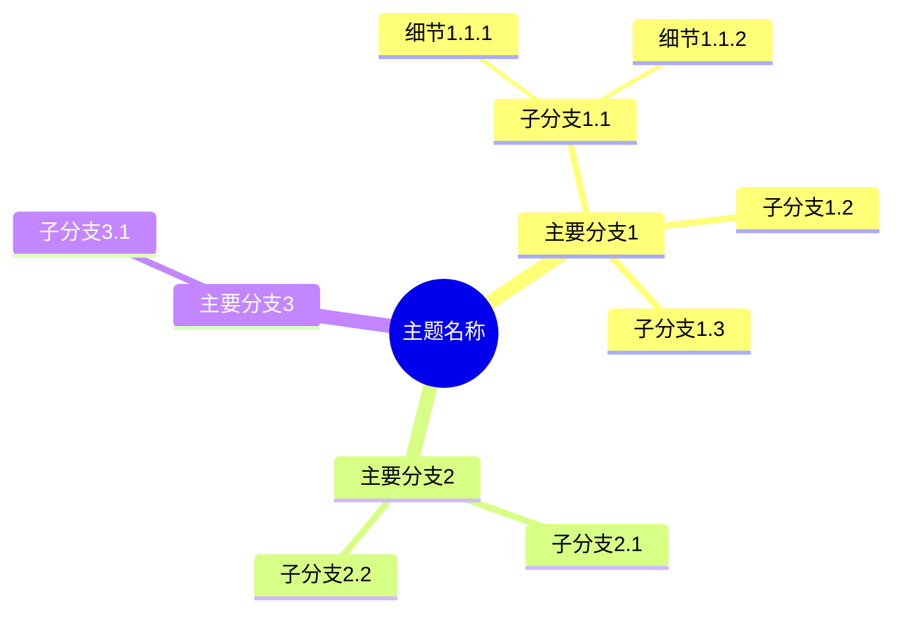

### 1.3 多中心思维导图

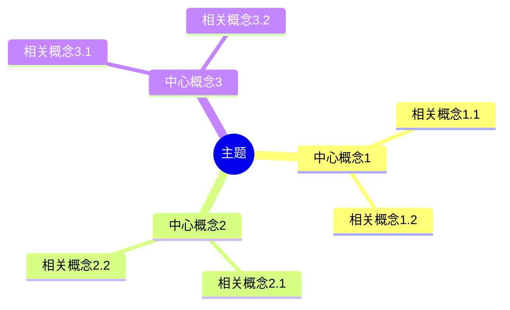

---

## 2. 多维对比矩阵模板

### 2.1 核心概念对比矩阵

```markdown
## 📊 核心概念对比矩阵

| 维度 | 概念A | 概念B | 概念C | 综合评价 |
|------|-------|-------|-------|----------|
| **定义** | 定义A | 定义B | 定义C | - |
| **特征1** | 值A1 | 值B1 | 值C1 | C > A > B |
| **特征2** | 值A2 | 值B2 | 值C2 | A = B > C |
| **适用场景** | 场景A | 场景B | 场景C | - |
| **优势** | 优势A | 优势B | 优势C | - |
| **局限** | 局限A | 局限B | 局限C | - |
| **关联理论** | 理论A | 理论B | 理论C | - |
```

### 2.2 方法对比矩阵

```markdown
## 📊 方法对比矩阵

| 维度 | 方法A | 方法B | 方法C | 推荐场景 |
|------|-------|-------|-------|----------|
| **复杂度** | 低 | 中 | 高 | - |
| **准确性** | 中 | 高 | 高 | - |
| **效率** | 高 | 中 | 低 | - |
| **适用条件** | 条件A | 条件B | 条件C | - |
| **实施难度** | 易 | 中 | 难 | - |
| **工具支持** | 工具A | 工具B | 工具C | - |
| **综合评分** | 7/10 | 8/10 | 6/10 | - |
```

### 2.3 理论对比矩阵

```markdown
## 📊 理论对比矩阵

| 维度 | 理论A | 理论B | 理论C | 关系类型 |
|------|-------|-------|-------|----------|
| **核心概念** | 概念A | 概念B | 概念C | - |
| **数学基础** | 基础A | 基础B | 基础C | - |
| **适用范围** | 范围A | 范围B | 范围C | - |
| **验证方式** | 方式A | 方式B | 方式C | - |
| **与本文档关系** | 基础 | 应用 | 扩展 | - |
| **关联强度** | 强 | 中 | 弱 | - |
```

### 2.4 应用场景对比矩阵

```markdown
## 📊 应用场景对比矩阵

| 维度 | 场景A | 场景B | 场景C | 适用理论 |
|------|-------|-------|-------|----------|
| **问题类型** | 类型A | 类型B | 类型C | - |
| **系统规模** | 小 | 中 | 大 | - |
| **时间要求** | 实时 | 近实时 | 批处理 | - |
| **精度要求** | 高 | 中 | 低 | - |
| **推荐方法** | 方法A | 方法B | 方法C | - |
```

---

## 3. 决策树模板

### 3.1 方法选择决策树

```markdown
## 🌲 方法选择决策树

```text
开始：需要解决什么问题？
  ├─ 问题类型是什么？
  │   ├─ 理论问题
  │   │   ├─ 需要严格证明？
  │   │   │   ├─ 是 → 使用 [方法A：形式化证明]
  │   │   │   └─ 否 → 使用 [方法B：理论分析]
  │   │   └─ 需要建模？
  │   │       ├─ 是 → 使用 [方法C：数学建模]
  │   │       └─ 否 → 使用 [方法B：理论分析]
  │   ├─ 实践问题
  │   │   ├─ 系统规模？
  │   │   │   ├─ 小规模 → 使用 [方法D：简单模型]
  │   │   │   ├─ 中规模 → 使用 [方法E：中等模型]
  │   │   │   └─ 大规模 → 使用 [方法F：复杂模型]
  │   │   └─ 时间要求？
  │   │       ├─ 实时 → 使用 [方法G：快速方法]
  │   │       └─ 非实时 → 使用 [方法H：精确方法]
  │   └─ 跨学科问题
  │       ├─ 需要领域知识？
  │       │   ├─ 是 → 使用 [方法I：混合方法]
  │       │   └─ 否 → 使用 [方法J：通用方法]
  │       └─ 需要验证？
  │           ├─ 是 → 使用 [方法K：验证方法]
  │           └─ 否 → 使用 [方法J：通用方法]
```

**决策说明**：

- 每个分支节点代表一个决策条件
- 每个叶子节点代表一个推荐方法
- 箭头表示决策流程

```

### 3.2 学习路径决策树

```markdown
## 🌲 学习路径决策树

```text
开始：你的背景是什么？
  ├─ 理论基础
  │   ├─ 数学基础扎实？
  │   │   ├─ 是 → 直接学习 [高级主题]
  │   │   └─ 否 → 先学习 [数学基础] → 再学习 [基础主题]
  │   └─ 实践经验丰富？
  │       ├─ 是 → 从 [应用案例] 开始 → 学习 [理论基础]
  │       └─ 否 → 从 [基础概念] 开始 → 学习 [实践应用]
  └─ 学习目标
      ├─ 理论研究
      │   └─ 学习路径：[基础理论] → [高级理论] → [前沿理论]
      ├─ 实践应用
      │   └─ 学习路径：[基础概念] → [方法工具] → [案例实践]
      └─ 跨学科研究
          └─ 学习路径：[核心概念] → [映射方法] → [跨学科案例]
```

### 3.3 问题解决决策树

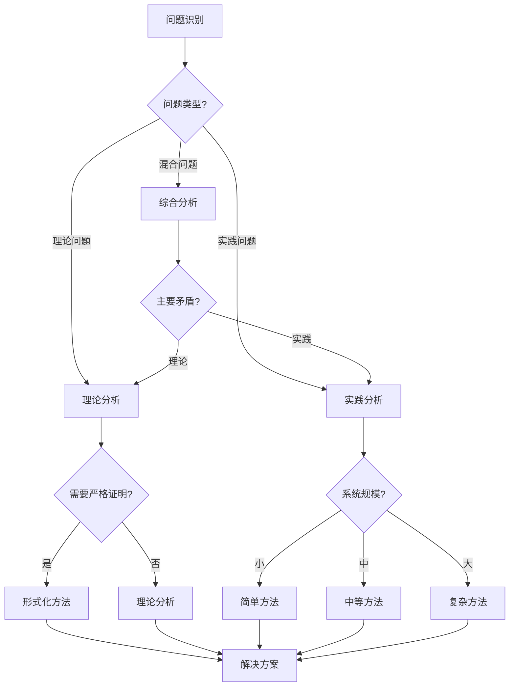

---

## 4. 决策逻辑路径模板

### 4.1 问题解决逻辑路径

```markdown
## 🛤️ 问题解决逻辑路径

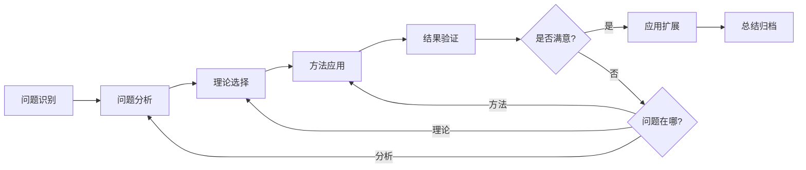

**路径说明**：

1. **问题识别**：明确问题的本质和范围
2. **问题分析**：深入分析问题的特征和约束
3. **理论选择**：选择适用的理论基础
4. **方法应用**：应用具体的方法解决问题
5. **结果验证**：验证结果的正确性和有效性
6. **迭代优化**：根据结果反馈优化解决方案

```

### 4.2 学习理解逻辑路径

```markdown
## 🛤️ 学习理解逻辑路径

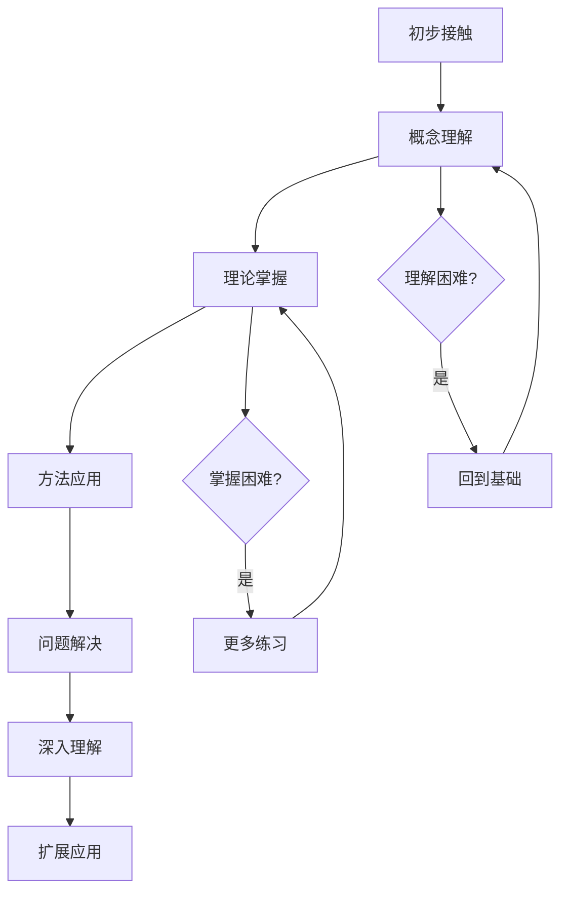

---

## 5. 概念关系网络模板

### 5.1 概念依赖网络

```markdown
## 🕸️ 概念依赖网络

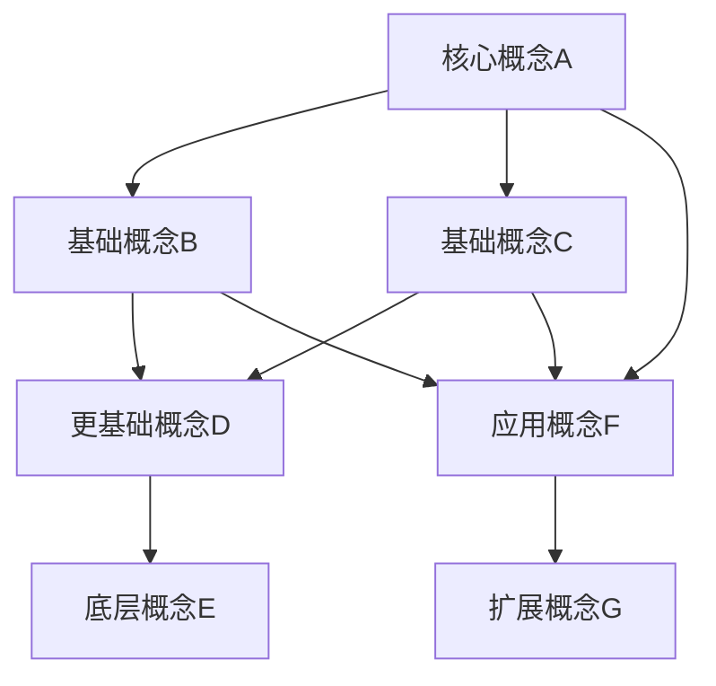

**依赖关系说明**：

- `概念A` 依赖于 `概念B` 和 `概念C`
- `概念B` 和 `概念C` 都依赖于 `概念D`
- 学习路径：E → D → {B, C} → A → F → G

```

### 5.2 概念映射网络

```markdown
## 🕸️ 跨领域概念映射网络

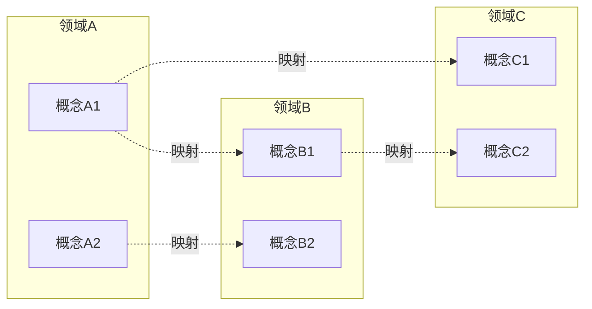

**映射关系说明**：

- 实线箭头：直接映射关系
- 虚线箭头：间接映射关系
- 跨领域映射的类型：同构、相似、类比

```

---

## 6. 知识图谱模板

### 6.1 实体-关系图谱

```markdown
## 🗺️ 知识图谱

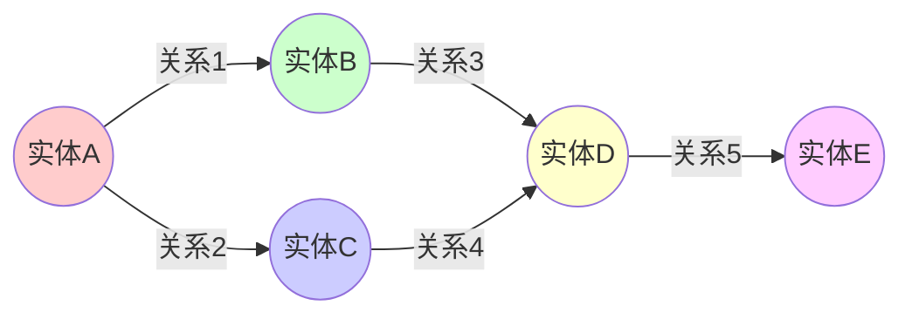

**实体类型**：

- 🟥 核心概念
- 🟩 理论基础
- 🟦 方法工具
- 🟨 应用场景
- 🟪 扩展概念

**关系类型**：

- **依赖关系**：A → B（A依赖B）
- **应用关系**：A --应用--> B（A应用于B）
- **映射关系**：A -.映射.-> B（A映射到B）
- **扩展关系**：A --扩展--> B（A扩展为B）

```

---

## 7. 流程图模板

### 7.1 方法流程图

```markdown
## 📈 方法流程图

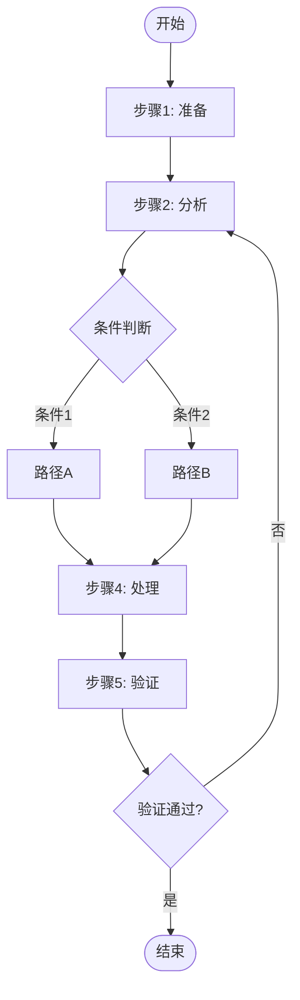

### 7.2 验证流程图

```markdown
## 📈 验证流程图

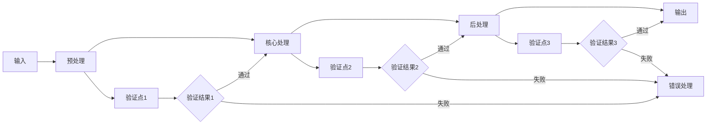

---

## 8. 时间线模板

### 8.1 理论演化时间线

```markdown
## ⏱️ 理论演化时间线

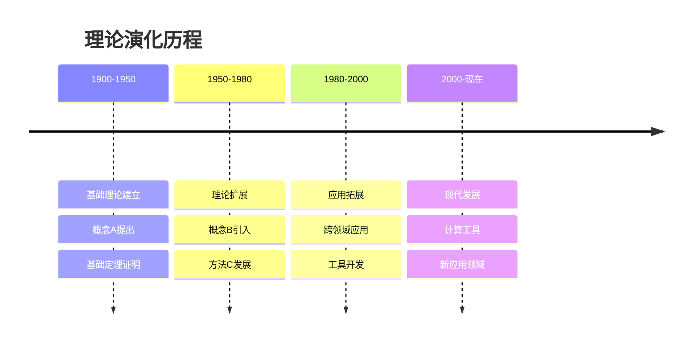

### 8.2 概念发展时间线

```markdown
## ⏱️ 概念发展时间线

| 时间 | 事件 | 关键人物 | 影响 |
|------|------|---------|------|
| **1900-1910** | 概念A首次提出 | 学者X | 理论基础 |
| **1920-1930** | 概念B发展 | 学者Y | 理论完善 |
| **1950-1960** | 概念C引入 | 学者Z | 应用拓展 |
| **1980-1990** | 概念D整合 | 学者W | 系统化 |
| **2000-现在** | 概念E现代化 | 学者V | 计算化 |
```

---

## 9. 层次结构图模板

### 9.1 概念层次结构

```markdown
## 📊 概念层次结构图

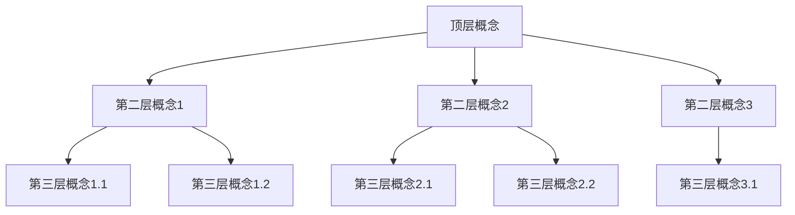

**层次说明**：

- **顶层**：最抽象的概念
- **第二层**：主要分类
- **第三层**：具体概念

```

### 9.2 理论体系层次

```markdown
## 📊 理论体系层次结构

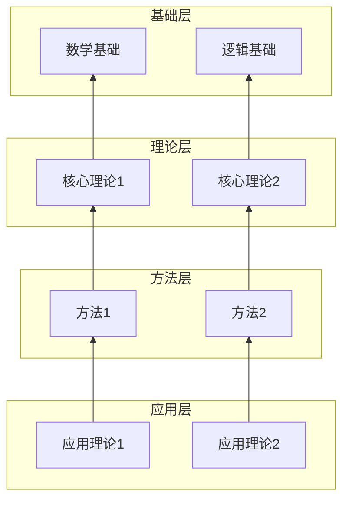

---

## 10. 状态转换图模板

### 10.1 系统状态转换

```markdown
## 🔄 系统状态转换图

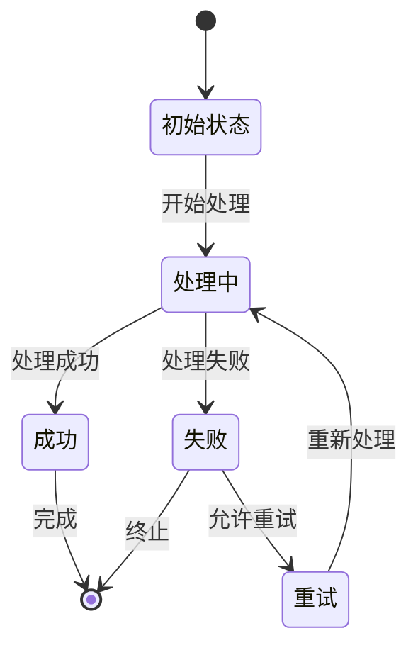

### 10.2 学习状态转换

```markdown
## 🔄 学习状态转换图

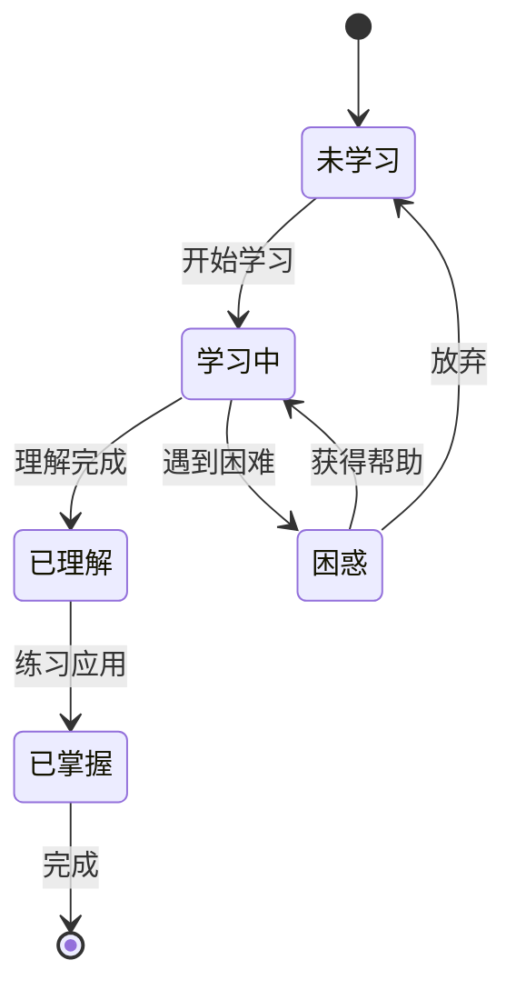

---

## 📝 使用说明

### 如何选择模板

1. **思维导图**：用于展示主题的整体结构
2. **对比矩阵**：用于多维度对比分析
3. **决策树**：用于提供决策支持
4. **逻辑路径**：用于展示从问题到解决的路径
5. **关系网络**：用于展示概念间的复杂关系
6. **知识图谱**：用于展示实体-关系-实体结构
7. **流程图**：用于展示过程和流程
8. **时间线**：用于展示时间演化
9. **层次结构**：用于展示概念的层次
10. **状态转换**：用于展示状态变化

### 模板定制

根据具体内容，可以：

- 修改节点名称
- 调整关系类型
- 添加或删除分支
- 改变图表样式

---

**状态**: 📋 模板库已完成，可供使用
