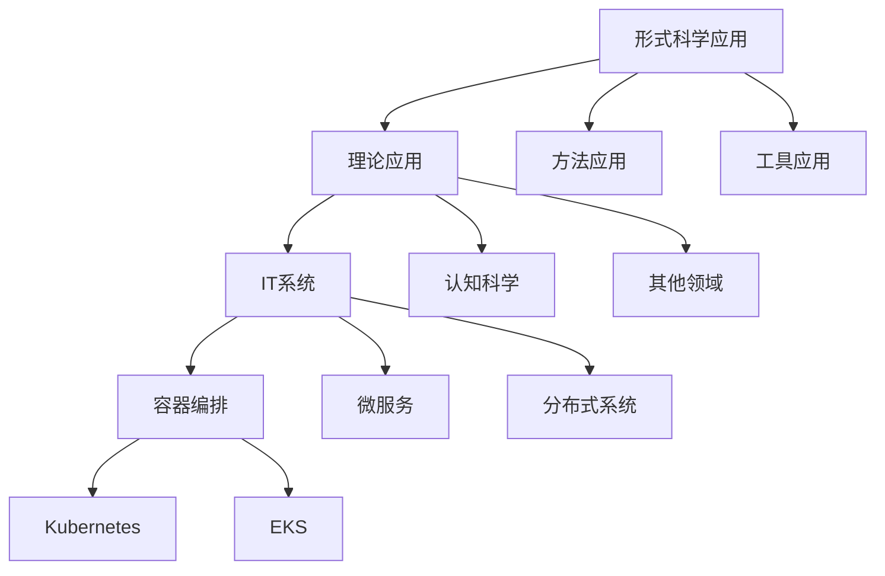
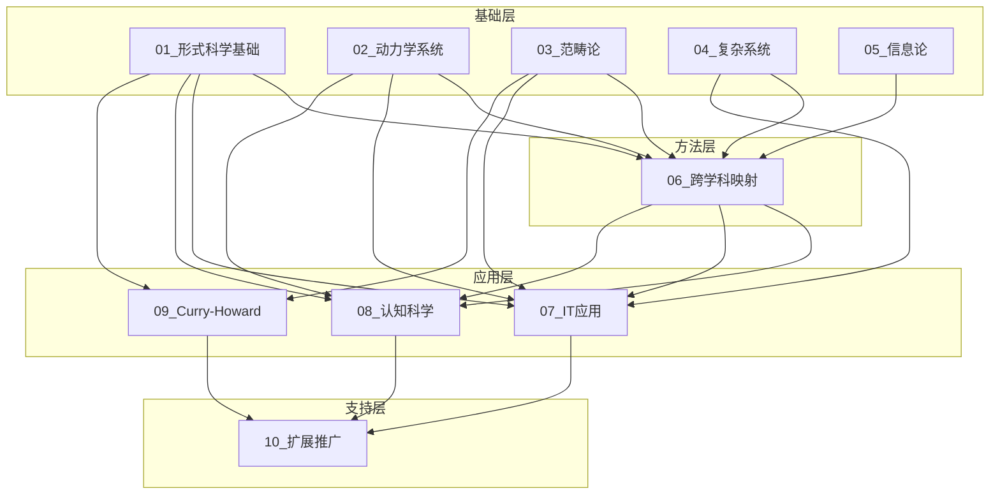
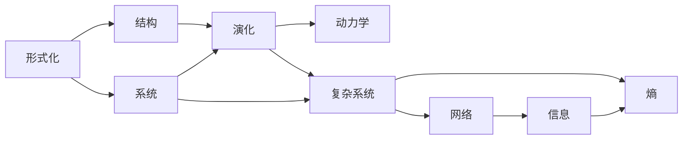
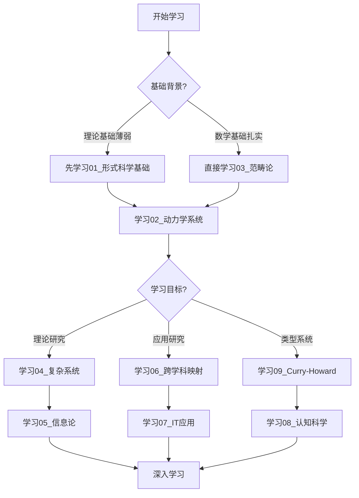

# 文件关联体系设计

> **创建日期**: 2025-01-27
> **版本**: v1.0
> **用途**: 设计FormalScience项目的文件间关联体系

---

## 📋 目录

- [文件关联体系设计](#文件关联体系设计)
  - [📋 目录](#-目录)
  - [🎯 设计目标](#-设计目标)
  - [🔗 关联类型定义](#-关联类型定义)
  - [📊 关联矩阵设计](#-关联矩阵设计)
  - [🗺️ 关联网络设计](#️-关联网络设计)
  - [📐 实施规范](#-实施规范)

---

## 🎯 设计目标

### 总体目标

建立一个**多层级、多维度、双向**的文件关联体系，使FormalScience项目从**独立文档集合**转变为**有机统一的知识体系**。

### 具体目标

1. **消除分裂感**：通过多种关联方式，展示文件间的紧密联系
2. **提供导航**：帮助读者快速找到相关内容
3. **展示体系**：揭示知识体系的整体结构
4. **支持学习**：提供清晰的学习路径
5. **促进理解**：通过关联帮助理解概念和理论

---

## 🔗 关联类型定义

### 1. 概念级关联

#### 1.1 同构关系（Isomorphism）

**定义**：两个概念在数学结构上相同

**示例**：
- `02.1_经典确定性动力学.md`的"相空间" ↔ `03.1_范畴论基础.md`的"态射空间"
- `05.1_信息论基础.md`的"熵" ↔ `04.3_自组织临界.md`的"临界熵"

**表示方式**：
```markdown
| 本文档概念 | 关联文档 | 关联概念 | 关系类型 | 映射说明 |
|-----------|---------|---------|---------|----------|
| 相空间 | 03.1_范畴论基础.md | 态射空间 | 同构 | 数学结构完全对应 |
```

#### 1.2 特例-一般关系（Specialization-Generalization）

**定义**：一个概念是另一个概念的特殊情况或一般化

**示例**：
- `02.1_经典确定性动力学.md`的"动力学方程" → `04.1_复杂系统基础.md`的"系统演化"（特例→一般）
- `03.2_函子与自然变换.md`的"函子" → `03.1_范畴论基础.md`的"态射"（一般→特例）

**表示方式**：
```markdown
| 本文档概念 | 关联文档 | 关联概念 | 关系类型 | 关系说明 |
|-----------|---------|---------|---------|----------|
| 动力学方程 | 04.1_复杂系统基础.md | 系统演化 | 特例→一般 | 动力学方程是系统演化的特殊形式 |
```

#### 1.3 类比关系（Analogy）

**定义**：两个概念在不同领域中具有相似的结构或功能

**示例**：
- `02.2_随机动力学.md`的"随机过程" ↔ `08.4_决策动力学.md`的"决策过程"（类比）
- `07.1_Kubernetes动力学.md`的"Pod调度" ↔ `02.5_跨学科动力学映射.md`的"种群动态"（类比）

#### 1.4 依赖关系（Dependency）

**定义**：一个概念依赖于另一个概念

**示例**：
- `03.3_极限与余极限.md`的"极限" 依赖于 `03.1_范畴论基础.md`的"范畴"
- `09.4_依赖类型系统.md`的"依赖类型" 依赖于 `09.1_逻辑与类型的对应.md`的"类型对应"

#### 1.5 组合关系（Composition）

**定义**：一个概念由多个概念组合而成

**示例**：
- `07.3_微服务架构.md`的"微服务架构" 由 `07.4_分布式系统.md`的"分布式系统" + `06.1_跨学科映射策略.md`的"映射策略" 组合

### 2. 理论级关联

#### 2.1 基础-应用关系（Foundation-Application）

**定义**：一个理论是另一个理论的基础或被应用

**示例**：
- `02_动力学系统理论` → `07_IT行业形式化应用`（基础→应用）
- `03_范畴论` → `09_Curry-Howard同构`（基础→应用）

**表示方式**：
```markdown
## 🔗 理论级关联

### 理论基础
- **本理论基于**：
  - [02.1_经典确定性动力学.md](../02_动力学系统理论/02.1_经典确定性动力学.md) - 提供动力学基础
  - [03.1_范畴论基础.md](../03_范畴论与形式化方法/03.1_范畴论基础.md) - 提供范畴论框架

### 理论应用
- **本理论应用于**：
  - [07.1_Kubernetes动力学.md](../07_IT行业形式化应用/07.1_Kubernetes动力学.md) - 在容器编排中的应用
  - [07.2_EKS系统分析.md](../07_IT行业形式化应用/07.2_EKS系统分析.md) - 在云原生系统中的应用
```

#### 2.2 互补关系（Complementarity）

**定义**：两个理论相互补充，共同构成完整的知识体系

**示例**：
- `02_动力学系统理论` ↔ `04_复杂系统与网络理论`（互补）
- `03_范畴论` ↔ `05_信息论与计算理论`（互补）

#### 2.3 扩展关系（Extension）

**定义**：一个理论是另一个理论的扩展或推广

**示例**：
- `02.2_随机动力学.md` 扩展了 `02.1_经典确定性动力学.md`
- `03.2_函子与自然变换.md` 扩展了 `03.1_范畴论基础.md`

#### 2.4 视角关系（Perspective）

**定义**：同一个主题从不同视角的阐述

**示例**：
- `02_动力学系统理论` 与 `04_复杂系统与网络理论` 从不同视角研究系统
- `03_范畴论` 与 `09_Curry-Howard同构` 从不同视角研究类型系统

### 3. 方法级关联

#### 3.1 方法应用关系

**定义**：一个方法在多个领域中的应用

**示例**：
- `06.2_类比迁移方法.md`的"类比迁移" 应用于 `07_IT行业形式化应用` 和 `08_数学直觉与认知科学`

**表示方式**：
```markdown
## 🔗 方法级关联

### 方法应用网络

| 本文档方法 | 应用文档 | 应用场景 | 应用效果 |
|-----------|---------|---------|---------|
| 类比迁移 | 07.1_Kubernetes动力学.md | Pod调度类比 | 成功 |
| 类比迁移 | 08.1_数学直觉的动力学.md | 概念空间类比 | 成功 |
| 类比迁移 | 04.3_自组织临界.md | 临界状态类比 | 部分成功 |
```

#### 3.2 方法组合关系

**定义**：多个方法组合使用

**示例**：
- `06.2_类比迁移方法.md` + `06.3_边界条件检验.md` + `06.4_混合建模.md` = 完整的跨学科映射方法

#### 3.3 方法演化关系

**定义**：方法的发展和演化

**示例**：
- `02.1_经典确定性动力学.md`的方法 → `02.2_随机动力学.md`的方法 → `02.3_网络动力学.md`的方法（演化链）

### 4. 应用场景关联

#### 4.1 同一场景的不同视角

**定义**：同一个应用场景从不同理论视角的阐述

**示例**：
- "分布式系统"场景：
  - `07.4_分布式系统.md` - 从系统设计视角
  - `02.3_网络动力学.md` - 从动力学视角
  - `04.2_复杂网络理论.md` - 从网络理论视角

**表示方式**：
```markdown
## 🔗 应用场景关联

### 同一场景的多视角分析

**场景**：分布式系统

| 视角 | 关联文档 | 核心理论 | 关注点 |
|------|---------|---------|--------|
| 系统设计 | 07.4_分布式系统.md | 系统架构 | 组件、通信、一致性 |
| 动力学 | 02.3_网络动力学.md | 动力学方程 | 演化、稳定性 |
| 网络理论 | 04.2_复杂网络理论.md | 网络拓扑 | 拓扑、度分布、路径 |
| 信息论 | 05.1_信息论基础.md | 信息熵 | 信息量、传输 |
```

#### 4.2 场景分类和层次

**定义**：应用场景的分类和层次结构

**表示方式**：
```markdown
## 📊 应用场景层次结构



---

## 📊 关联矩阵设计

### 1. 系列间关联矩阵

```markdown
## 📊 系列间关联强度矩阵

| 系列 | 01 | 02 | 03 | 04 | 05 | 06 | 07 | 08 | 09 | 10 |
|------|----|----|----|----|----|----|----|----|----|----|
| **01_形式科学基础** | - | 强 | 强 | 中 | 强 | 强 | 中 | 中 | 强 | 弱 |
| **02_动力学系统** | 强 | - | 中 | 强 | 中 | 强 | 强 | 中 | 弱 | 弱 |
| **03_范畴论** | 强 | 中 | - | 中 | 中 | 中 | 强 | 弱 | 强 | 弱 |
| **04_复杂系统** | 中 | 强 | 中 | - | 强 | 强 | 强 | 中 | 弱 | 弱 |
| **05_信息论** | 强 | 中 | 中 | 强 | - | 中 | 中 | 弱 | 中 | 弱 |
| **06_跨学科映射** | 强 | 强 | 中 | 强 | 中 | - | 强 | 强 | 中 | 中 |
| **07_IT应用** | 中 | 强 | 强 | 强 | 中 | 强 | - | 弱 | 中 | 中 |
| **08_认知科学** | 中 | 中 | 弱 | 中 | 弱 | 强 | 弱 | - | 弱 | 弱 |
| **09_Curry-Howard** | 强 | 弱 | 强 | 弱 | 中 | 中 | 中 | 弱 | - | 弱 |
| **10_扩展推广** | 弱 | 弱 | 弱 | 弱 | 弱 | 中 | 中 | 弱 | 弱 | - |

**关联强度说明**：
- **强**：直接的理论/方法关系，必须理解关联才能深入理解
- **中**：重要的参考关系，理解关联有助于理解
- **弱**：间接或轻微的关系，了解即可
```

### 2. 概念级关联矩阵（示例）

```markdown
## 📊 核心概念关联矩阵

| 概念 | 01.1 | 02.1 | 03.1 | 04.1 | 05.1 | 关系类型 |
|------|------|------|------|------|------|----------|
| **形式化** | ✓ | ✓ | ✓ | - | - | 核心概念 |
| **系统** | - | ✓ | - | ✓ | - | 应用概念 |
| **演化** | - | ✓ | - | ✓ | - | 同构 |
| **结构** | ✓ | - | ✓ | ✓ | - | 同构 |
| **信息** | - | - | - | - | ✓ | 独立概念 |
| **熵** | - | - | - | ✓ | ✓ | 映射关系 |
```

### 3. 方法级关联矩阵

```markdown
## 📊 方法应用关联矩阵

| 方法 | 应用领域1 | 应用领域2 | 应用领域3 | 成功率 | 备注 |
|------|----------|----------|----------|--------|------|
| **类比迁移** | IT系统 | 认知科学 | 复杂系统 | 70% | 需边界检验 |
| **动力学建模** | 物理系统 | 生物系统 | IT系统 | 80% | 需修正项 |
| **范畴论分析** | 数据库 | 编程语言 | 量子计算 | 85% | 通用性强 |
```

---

## 🗺️ 关联网络设计

### 1. 整体关联网络图

```markdown
## 🗺️ FormalScience整体关联网络



### 2. 概念级关联网络

```markdown
## 🗺️ 核心概念关联网络



### 3. 学习路径网络

```markdown
## 🗺️ 学习路径网络



---

## 📐 实施规范

### 1. 每个文件必须包含的关联章节

```markdown
## 🔗 关联网络

### 概念级关联

[概念关联表格]

### 理论级关联

[理论关联说明]

### 方法级关联

[方法关联表格]

### 应用场景关联

[场景关联说明]

### 学习路径

#### 前置知识
- [前置文件列表]

#### 后续学习
- [后续文件列表]

#### 并行学习
- [并行文件列表]
```

### 2. 关联标注规范

#### 2.1 关联强度标注

- **强关联**：`[文档名](链接) ⭐⭐⭐`（必须理解）
- **中关联**：`[文档名](链接) ⭐⭐`（建议理解）
- **弱关联**：`[文档名](链接) ⭐`（了解即可）

#### 2.2 关联类型标注

- **同构**：`[文档名](链接) 🔄`（数学结构相同）
- **依赖**：`[文档名](链接) ➡️`（本概念依赖）
- **应用**：`[文档名](链接) ⬅️`（应用于）
- **类比**：`[文档名](链接) ↔️`（类比关系）
- **扩展**：`[文档名](链接) 🔽`（扩展自）

### 3. 统一关联索引文件

创建 `view/FormalScience/00_知识体系关联索引.md`，包含：

1. **完整的概念关联矩阵**
2. **完整的理论关联网络**
3. **完整的方法关联图**
4. **完整的学习路径图**
5. **关联关系说明**

---

**状态**: 📋 设计已完成，等待实施
