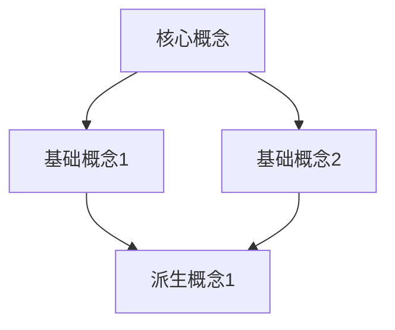
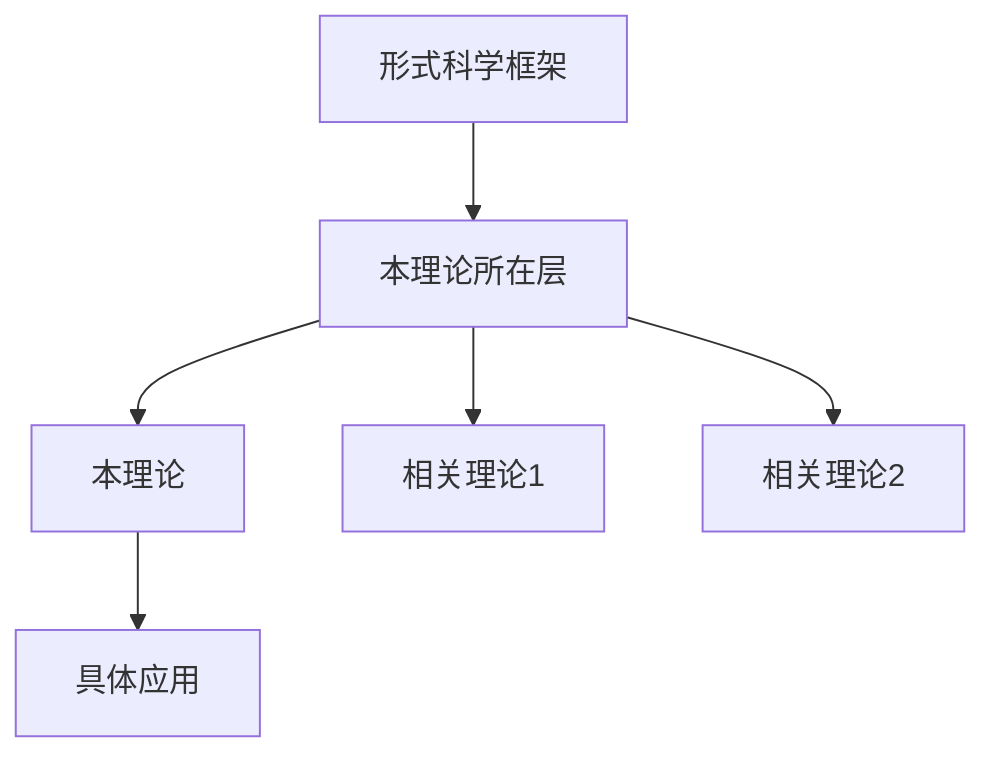

# 理论体系完善计划

> **创建日期**: 2025-01-27
> **版本**: v1.0
> **用途**: 完善FormalScience项目的理论解释体系

---

## 📋 目录

- [理论体系完善计划](#理论体系完善计划)
  - [📋 目录](#-目录)
  - [🎯 完善目标](#-完善目标)
    - [总体目标](#总体目标)
    - [具体目标](#具体目标)
  - [📊 当前问题分析](#-当前问题分析)
    - [问题1：理论模型缺少完整解释](#问题1理论模型缺少完整解释)
      - [现状](#现状)
      - [影响](#影响)
    - [问题2：缺少当前知识共识说明](#问题2缺少当前知识共识说明)
      - [现状](#现状-1)
      - [影响](#影响-1)
    - [问题3：理论间缺乏逻辑联系论证](#问题3理论间缺乏逻辑联系论证)
      - [现状](#现状-2)
      - [影响](#影响-2)
  - [📐 完善方案](#-完善方案)
    - [方案1：在每个文件中添加"理论体系"章节](#方案1在每个文件中添加理论体系章节)
      - [1.1 章节位置](#11-章节位置)
      - [1.2 章节内容结构](#12-章节内容结构)
      - [主要定理/结论](#主要定理结论)
      - [适用范围和边界](#适用范围和边界)
    - [当前知识共识](#当前知识共识)
      - [学术界共识](#学术界共识)
      - [权威来源](#权威来源)
    - [与其他理论的关系](#与其他理论的关系)
      - [逻辑关系](#逻辑关系)
      - [映射关系](#映射关系)
      - [统一性论证](#统一性论证)
  - [📅 实施计划](#-实施计划)
    - [阶段1：模板创建（1周）](#阶段1模板创建1周)
    - [阶段2：试点改进（2-3周）](#阶段2试点改进2-3周)
    - [阶段3：全面推广（6-8周）](#阶段3全面推广6-8周)
    - [阶段4：验证完善（1-2周）](#阶段4验证完善1-2周)

---

## 🎯 完善目标

### 总体目标

将FormalScience项目从**内容完整但理论背景不清**的文档集合，提升为**理论体系完整、解释充分、共识明确**的学术知识体系。

### 具体目标

1. **完整理论解释**：每个主题都有完整的理论背景和解释
2. **明确知识共识**：明确标注当前学术界的共识和争议
3. **统一理论框架**：建立整体性的理论框架
4. **理论关联论证**：充分论证理论间的逻辑关系

---

## 📊 当前问题分析

### 问题1：理论模型缺少完整解释

#### 现状

- ✅ **已有**：概念的定义和基本内容
- ❌ **缺失**：理论的数学/逻辑基础
- ❌ **缺失**：理论的历史发展脉络
- ❌ **缺失**：理论的核心假设和前提
- ❌ **缺失**：理论的适用范围和边界

#### 影响

- 读者无法理解理论的深层含义
- 无法判断理论的适用性
- 难以进行理论的扩展和应用

### 问题2：缺少当前知识共识说明

#### 现状

- ✅ **已有**：理论的基本内容
- ❌ **缺失**：学术界对理论的共识
- ❌ **缺失**：理论的争议点
- ❌ **缺失**：理论的最新发展
- ❌ **缺失**：理论的权威来源

#### 影响

- 读者无法判断内容的权威性
- 无法了解理论的前沿发展
- 难以进行深入研究

### 问题3：理论间缺乏逻辑联系论证

#### 现状

- ✅ **已有**：基本的"相关文档"链接
- ❌ **缺失**：理论间的逻辑关系论证
- ❌ **缺失**：理论间的映射关系说明
- ❌ **缺失**：理论间的统一性论证

#### 影响

- 知识体系看起来分裂
- 无法理解整体框架
- 难以进行跨理论学习

---

## 📐 完善方案

### 方案1：在每个文件中添加"理论体系"章节

#### 1.1 章节位置

在"核心理念"章节之后，"详细内容"章节之前

#### 1.2 章节内容结构

```markdown
## 📚 理论体系

### 理论基础

#### 数学/逻辑基础

[说明本理论的数学或逻辑基础]

**核心数学结构**：
- 结构1：[定义和说明]
- 结构2：[定义和说明]

**公理体系**：
- 公理1：[内容]
- 公理2：[内容]

#### 历史发展

[简要说明理论的历史发展]

**关键时间节点**：
- **1900-1950**：理论起源
  - 关键人物：[姓名]
  - 关键贡献：[内容]
- **1950-1980**：理论发展
  - 关键突破：[内容]
- **1980-现在**：现代发展
  - 最新进展：[内容]

### 理论框架

#### 核心假设

1. **假设1**：[内容]
   - 适用范围：[说明]
   - 限制条件：[说明]

2. **假设2**：[内容]
   - 适用范围：[说明]
   - 限制条件：[说明]

#### 基本概念体系



#### 主要定理/结论

1. **定理1**：[名称]
   - 内容：[数学表述]
   - 证明思路：[简要说明]
   - 应用：[应用场景]

2. **定理2**：[名称]
   - 内容：[数学表述]
   - 证明思路：[简要说明]
   - 应用：[应用场景]

#### 适用范围和边界

**适用范围**：

- 场景1：[说明]
- 场景2：[说明]

**边界条件**：

- 条件1：[说明]
- 条件2：[说明]

**不适用场景**：

- 场景A：[说明原因]
- 场景B：[说明原因]

### 当前知识共识

#### 学术界共识

**广泛接受的共识**：

1. [共识1] - 支持证据：[说明]
2. [共识2] - 支持证据：[说明]

**主要争议点**：

1. [争议1]
   - 观点A：[内容]
   - 观点B：[内容]
   - 当前状态：[未解决/部分解决/已解决]

2. [争议2]
   - 观点A：[内容]
   - 观点B：[内容]
   - 当前状态：[未解决/部分解决/已解决]

#### 权威来源

**经典文献**：

- [文献1] - 作者，年份，主要贡献
- [文献2] - 作者，年份，主要贡献

**权威机构/专家**：

- [机构/专家1] - 主要贡献
- [机构/专家2] - 主要贡献

**最新发展**：

- [2020-2024]：[最新进展]
- [前沿方向]：[研究方向]

### 与其他理论的关系

#### 逻辑关系

**理论基础**：

- [理论A] → 本理论
  - 关系类型：[继承/扩展/应用]
  - 关键映射：[说明]

**理论应用**：

- 本理论 → [理论B]
  - 应用方式：[说明]
  - 应用效果：[说明]

**理论互补**：

- 本理论 ↔ [理论C]
  - 互补方式：[说明]
  - 协同作用：[说明]

#### 映射关系

| 本理论概念 | 映射理论 | 映射概念 | 映射类型 | 映射说明 |
|-----------|---------|---------|---------|----------|
| 概念A | 理论X | 概念X1 | 同构 | [说明] |
| 概念B | 理论Y | 概念Y1 | 类比 | [说明] |

#### 统一性论证

**在形式科学框架中的位置**：



**统一性说明**：

- 本理论与[理论X]统一在[框架Y]下
- 统一的基础是[共同概念/方法/假设]
- 统一的体现是[具体表现]

```

### 方案2：创建统一的理论框架文档

#### 2.1 文件位置

`view/FormalScience/00_统一理论框架.md`

#### 2.2 文件内容结构

```markdown
# 形式科学统一理论框架

## 1. 框架概述

## 2. 理论层次结构

## 3. 核心概念体系

## 4. 理论间的统一性

## 5. 理论的应用框架

## 6. 理论的发展脉络
```

---

## 📅 实施计划

### 阶段1：模板创建（1周）

- [ ] 创建"理论体系"章节模板
- [ ] 创建统一理论框架文档模板
- [ ] 制定理论解释规范

### 阶段2：试点改进（2-3周）

- [ ] 选择3个试点文件
- [ ] 为试点文件添加完整理论体系章节
- [ ] 验证和改进模板

### 阶段3：全面推广（6-8周）

- [ ] 按系列逐个文件添加理论体系章节
- [ ] 创建统一理论框架文档
- [ ] 验证理论体系完整性

### 阶段4：验证完善（1-2周）

- [ ] 检查理论解释的完整性
- [ ] 验证理论关联的正确性
- [ ] 完善统一理论框架

---

**状态**: 📋 计划已完成，等待实施
