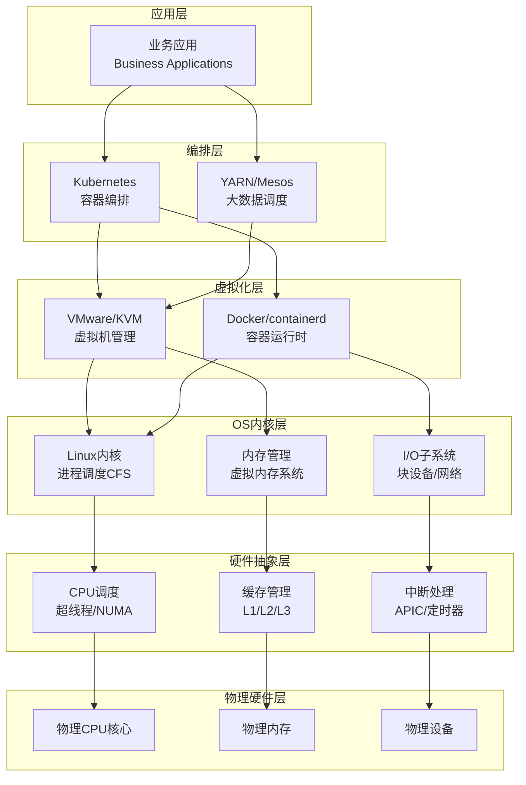
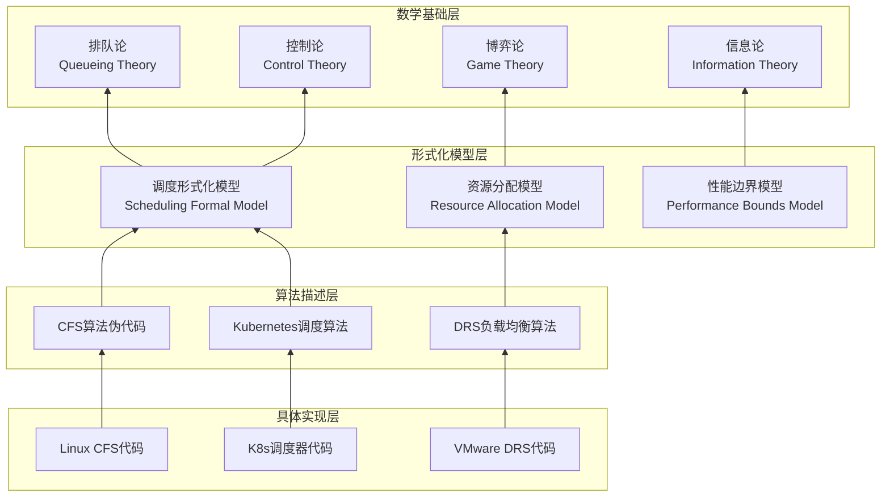
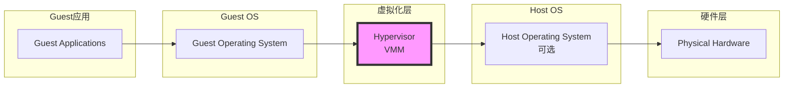
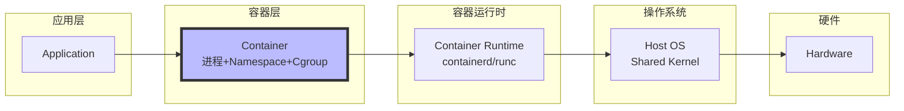
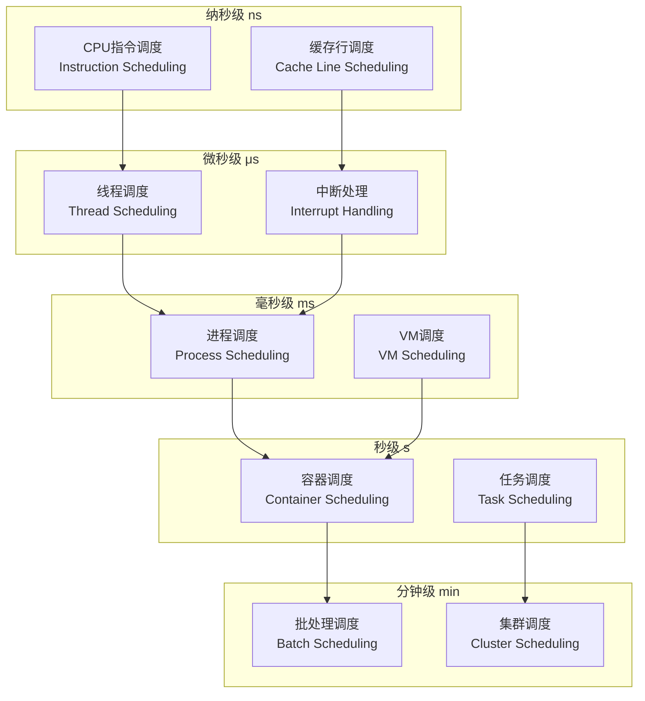
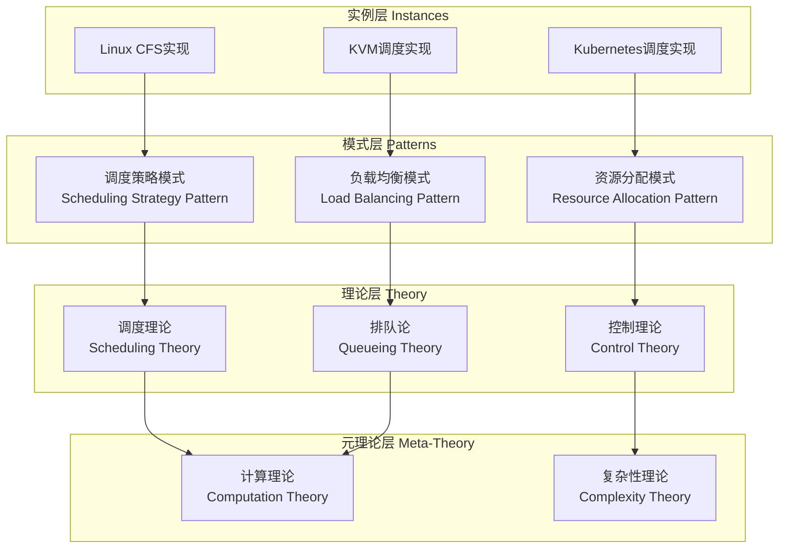

# 层次结构图

## 1. 调度系统层次金字塔

```mermaid
graph TB
    subgraph "应用层"
        A1[业务应用<br/>Business Applications]
    end

    subgraph "编排层"
        O1[Kubernetes<br/>容器编排]
        O2[YARN/Mesos<br/>大数据调度]
    end

    subgraph "虚拟化层"
        V1[VMware/KVM<br/>虚拟机管理]
        V2[Docker/containerd<br/>容器运行时]
    end

    subgraph "OS内核层"
        K1[Linux内核<br/>进程调度CFS]
        K2[内存管理<br/>虚拟内存系统]
        K3[I/O子系统<br/>块设备/网络]
    end

    subgraph "硬件抽象层"
        H1[CPU调度<br/>超线程/NUMA]
        H2[缓存管理<br/>L1/L2/L3]
        H3[中断处理<br/>APIC/定时器]
    end

    subgraph "物理硬件层"
        P1[物理CPU核心]
        P2[物理内存]
        P3[物理设备]
    end

    A1 --> O1
    A1 --> O2

    O1 --> V1
    O1 --> V2
    O2 --> V1

    V1 --> K1
    V2 --> K1
    V1 --> K2
    V2 --> K3

    K1 --> H1
    K2 --> H2
    K3 --> H3

    H1 --> P1
    H2 --> P2
    H3 --> P3
```

## 2. 形式化抽象层次

```mermaid
graph BT
    subgraph "具体实现层"
        I1[Linux CFS代码]
        I2[K8s调度器代码]
        I3[VMware DRS代码]
    end

    subgraph "算法描述层"
        A1[CFS算法伪代码]
        A2[Kubernetes调度算法]
        A3[DRS负载均衡算法]
    end

    subgraph "形式化模型层"
        F1[调度形式化模型<br/>Scheduling Formal Model]
        F2[资源分配模型<br/>Resource Allocation Model]
        F3[性能边界模型<br/>Performance Bounds Model]
    end

    subgraph "数学基础层"
        M1[排队论<br/>Queueing Theory]
        M2[博弈论<br/>Game Theory]
        M3[控制论<br/>Control Theory]
        M4[信息论<br/>Information Theory]
    end

    I1 --> A1
    I2 --> A2
    I3 --> A3

    A1 --> F1
    A2 --> F1
    A3 --> F2

    F1 --> M1
    F2 --> M2
    F1 --> M3
    F3 --> M4
```

## 3. 虚拟化层次栈

```mermaid
graph LR
    subgraph "Guest应用"
        G_APP[Guest Applications]
    end

    subgraph "Guest OS"
        G_OS[Guest Operating System]
    end

    subgraph "虚拟化层"
        VIRT[Hypervisor<br/>VMM]
    end

    subgraph "Host OS"
        H_OS[Host Operating System<br/>可选]
    end

    subgraph "硬件层"
        HW[Physical Hardware]
    end

    G_APP --> G_OS
    G_OS --> VIRT
    VIRT --> H_OS
    H_OS --> HW

    style VIRT fill:#f9f,stroke:#333,stroke-width:4px
```

## 4. 容器层次栈

```mermaid
graph LR
    subgraph "应用层"
        APP[Application]
    end

    subgraph "容器层"
        CONT[Container<br/>进程+Namespace+Cgroup]
    end

    subgraph "容器运行时"
        RUNTIME[Container Runtime<br/>containerd/runc]
    end

    subgraph "操作系统"
        OS[Host OS<br/>Shared Kernel]
    end

    subgraph "硬件"
        HW[Hardware]
    end

    APP --> CONT
    CONT --> RUNTIME
    RUNTIME --> OS
    OS --> HW

    style CONT fill:#bbf,stroke:#333,stroke-width:4px
```

## 5. 调度层次时间粒度

```mermaid
graph TB
    subgraph "纳秒级 ns"
        N1[CPU指令调度<br/>Instruction Scheduling]
        N2[缓存行调度<br/>Cache Line Scheduling]
    end

    subgraph "微秒级 μs"
        U1[线程调度<br/>Thread Scheduling]
        U2[中断处理<br/>Interrupt Handling]
    end

    subgraph "毫秒级 ms"
        M1[进程调度<br/>Process Scheduling]
        M2[VM调度<br/>VM Scheduling]
    end

    subgraph "秒级 s"
        S1[容器调度<br/>Container Scheduling]
        S2[任务调度<br/>Task Scheduling]
    end

    subgraph "分钟级 min"
        MIN1[批处理调度<br/>Batch Scheduling]
        MIN2[集群调度<br/>Cluster Scheduling]
    end

    N1 --> U1
    N2 --> U2
    U1 --> M1
    U2 --> M1
    M1 --> S1
    M2 --> S1
    S1 --> MIN1
    S2 --> MIN2
```

## 6. 知识抽象层次

```mermaid
graph TB
    subgraph "实例层 Instances"
        INST1[Linux CFS实现]
        INST2[KVM调度实现]
        INST3[Kubernetes调度实现]
    end

    subgraph "模式层 Patterns"
        PAT1[调度策略模式<br/>Scheduling Strategy Pattern]
        PAT2[负载均衡模式<br/>Load Balancing Pattern]
        PAT3[资源分配模式<br/>Resource Allocation Pattern]
    end

    subgraph "理论层 Theory"
        TH1[调度理论<br/>Scheduling Theory]
        TH2[排队论<br/>Queueing Theory]
        TH3[控制理论<br/>Control Theory]
    end

    subgraph "元理论层 Meta-Theory"
        META1[计算理论<br/>Computation Theory]
        META2[复杂性理论<br/>Complexity Theory]
    end

    INST1 --> PAT1
    INST2 --> PAT2
    INST3 --> PAT3

    PAT1 --> TH1
    PAT2 --> TH2
    PAT3 --> TH3

    TH1 --> META1
    TH2 --> META1
    TH3 --> META2
```
