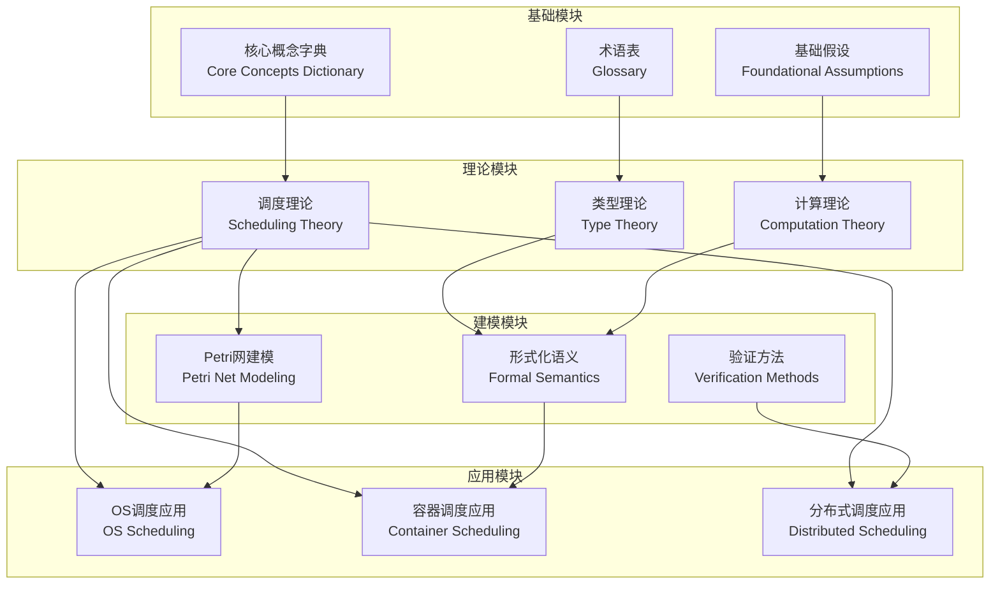
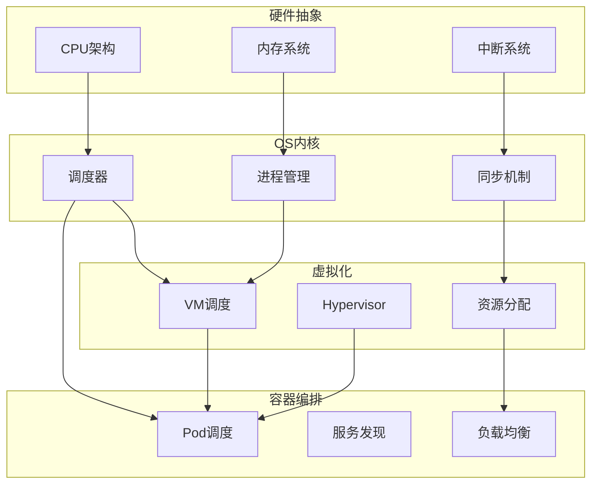
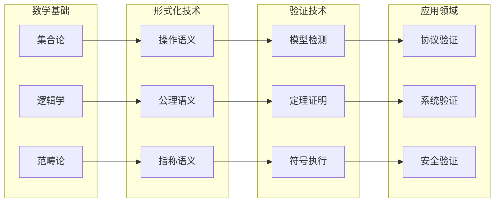
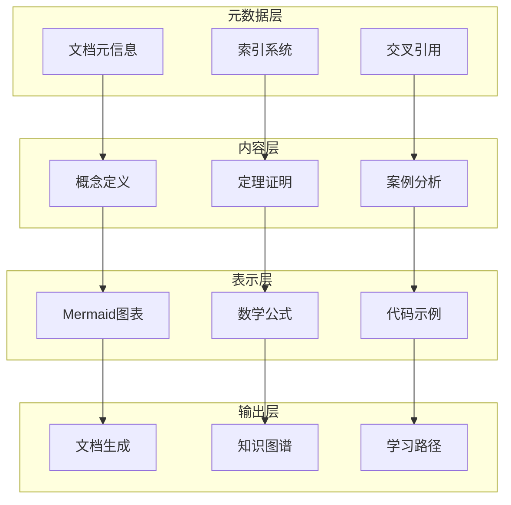
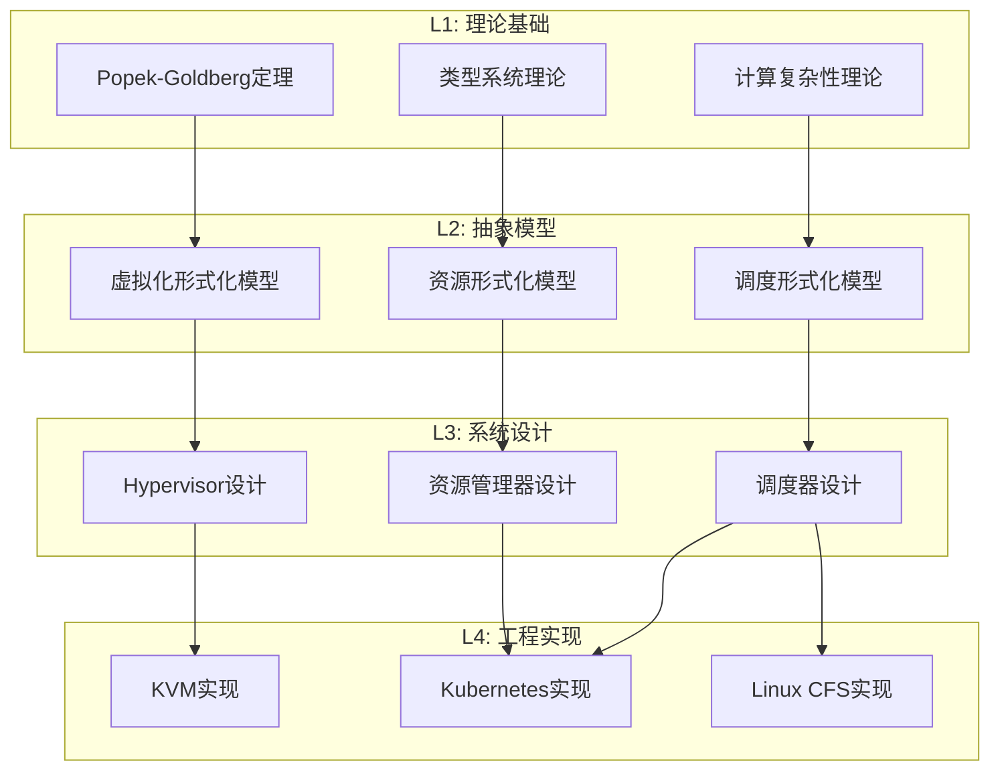

# 模块依赖关系图

## 1. 核心模块依赖图

```mermaid
graph TD
    subgraph "基础模块"
        B1[基础假设<br/>Foundational Assumptions]
        B2[核心概念字典<br/>Core Concepts Dictionary]
        B3[术语表<br/>Glossary]
    end

    subgraph "理论模块"
        T1[计算理论<br/>Computation Theory]
        T2[调度理论<br/>Scheduling Theory]
        T3[类型理论<br/>Type Theory]
    end

    subgraph "建模模块"
        M1[Petri网建模<br/>Petri Net Modeling]
        M2[形式化语义<br/>Formal Semantics]
        M3[验证方法<br/>Verification Methods]
    end

    subgraph "应用模块"
        A1[OS调度应用<br/>OS Scheduling]
        A2[容器调度应用<br/>Container Scheduling]
        A3[分布式调度应用<br/>Distributed Scheduling]
    end

    B1 --> T1
    B2 --> T2
    B3 --> T3

    T1 --> M2
    T2 --> M1
    T3 --> M2

    M1 --> A1
    M2 --> A2
    M3 --> A3

    T2 --> A1
    T2 --> A2
    T2 --> A3
```

## 2. 调度模型模块依赖

```mermaid
graph TD
    subgraph "硬件抽象"
        HW1[CPU架构]
        HW2[内存系统]
        HW3[中断系统]
    end

    subgraph "OS内核"
        OS1[进程管理]
        OS2[调度器]
        OS3[同步机制]
    end

    subgraph "虚拟化"
        VIRT1[Hypervisor]
        VIRT2[VM调度]
        VIRT3[资源分配]
    end

    subgraph "容器编排"
        CONT1[Pod调度]
        CONT2[服务发现]
        CONT3[负载均衡]
    end

    HW1 --> OS2
    HW2 --> OS1
    HW3 --> OS3

    OS1 --> VIRT2
    OS2 --> VIRT2
    OS3 --> VIRT3

    VIRT1 --> CONT1
    VIRT2 --> CONT1
    VIRT3 --> CONT3

    OS2 --> CONT1
```

## 3. 形式化方法模块依赖

```mermaid
graph LR
    subgraph "数学基础"
        MATH1[集合论]
        MATH2[逻辑学]
        MATH3[范畴论]
    end

    subgraph "形式化技术"
        FORM1[操作语义]
        FORM2[公理语义]
        FORM3[指称语义]
    end

    subgraph "验证技术"
        VER1[模型检测]
        VER2[定理证明]
        VER3[符号执行]
    end

    subgraph "应用领域"
        APP1[协议验证]
        APP2[系统验证]
        APP3[安全验证]
    end

    MATH1 --> FORM1
    MATH2 --> FORM2
    MATH3 --> FORM3

    FORM1 --> VER1
    FORM2 --> VER2
    FORM3 --> VER3

    VER1 --> APP1
    VER2 --> APP2
    VER3 --> APP3
```

## 4. 知识库模块依赖

```mermaid
graph TB
    subgraph "元数据层"
        META1[文档元信息]
        META2[索引系统]
        META3[交叉引用]
    end

    subgraph "内容层"
        CONTENT1[概念定义]
        CONTENT2[定理证明]
        CONTENT3[案例分析]
    end

    subgraph "表示层"
        REP1[Mermaid图表]
        REP2[数学公式]
        REP3[代码示例]
    end

    subgraph "输出层"
        OUT1[文档生成]
        OUT2[知识图谱]
        OUT3[学习路径]
    end

    META1 --> CONTENT1
    META2 --> CONTENT2
    META3 --> CONTENT3

    CONTENT1 --> REP1
    CONTENT2 --> REP2
    CONTENT3 --> REP3

    REP1 --> OUT1
    REP2 --> OUT2
    REP3 --> OUT3
```

## 5. 跨层次依赖关系

```mermaid
graph TB
    subgraph "L1: 理论基础"
        L1_1[Popek-Goldberg定理]
        L1_2[计算复杂性理论]
        L1_3[类型系统理论]
    end

    subgraph "L2: 抽象模型"
        L2_1[虚拟化形式化模型]
        L2_2[调度形式化模型]
        L2_3[资源形式化模型]
    end

    subgraph "L3: 系统设计"
        L3_1[Hypervisor设计]
        L3_2[调度器设计]
        L3_3[资源管理器设计]
    end

    subgraph "L4: 工程实现"
        L4_1[KVM实现]
        L4_2[Kubernetes实现]
        L4_3[Linux CFS实现]
    end

    L1_1 --> L2_1
    L1_2 --> L2_2
    L1_3 --> L2_3

    L2_1 --> L3_1
    L2_2 --> L3_2
    L2_3 --> L3_3

    L3_1 --> L4_1
    L3_2 --> L4_2
    L3_2 --> L4_3
    L3_3 --> L4_2
```
