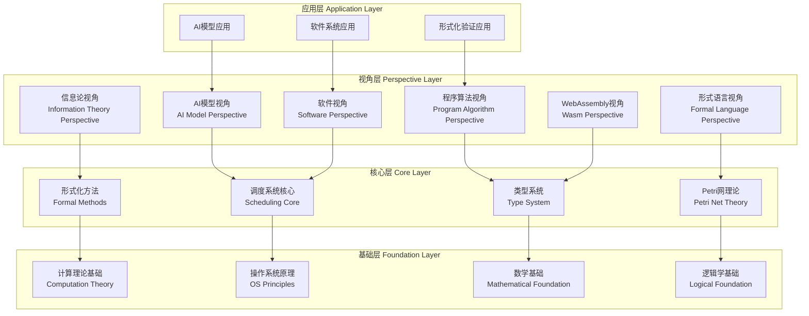
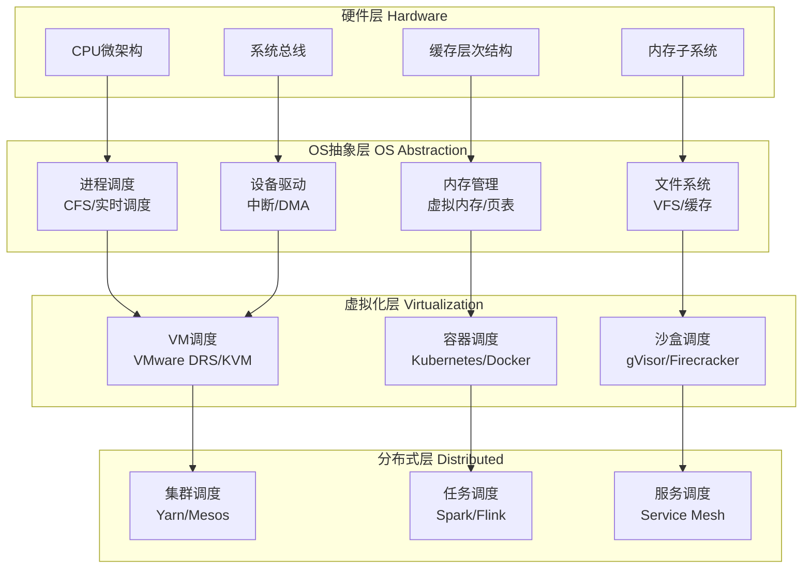
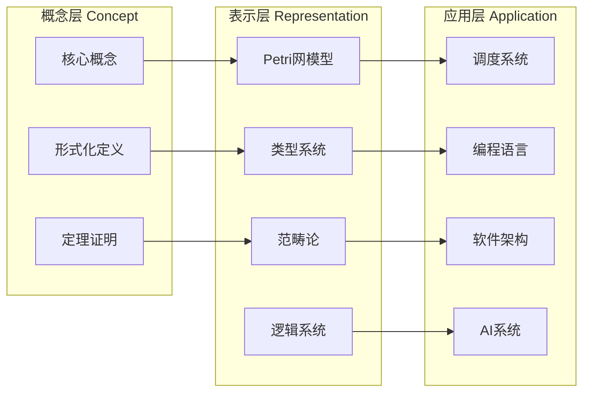
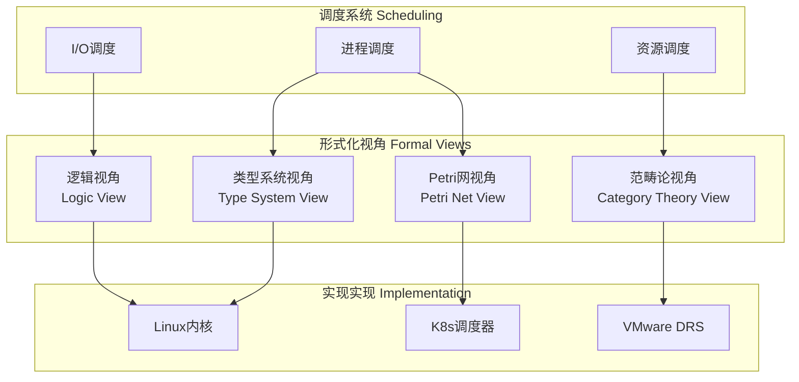
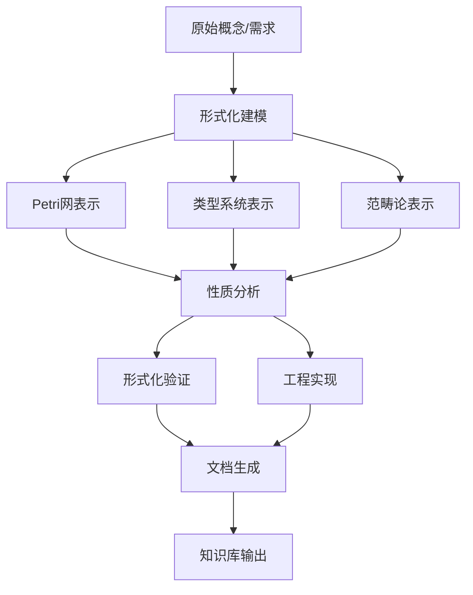

# 系统整体架构图

## 1. FormalScience项目层次架构

```mermaid
graph TB
    subgraph "应用层 Application Layer"
        A1[AI模型应用]
        A2[软件系统应用]
        A3[形式化验证应用]
    end

    subgraph "视角层 Perspective Layer"
        P1[AI模型视角<br/>AI Model Perspective]
        P2[形式语言视角<br/>Formal Language Perspective]
        P3[信息论视角<br/>Information Theory Perspective]
        P4[程序算法视角<br/>Program Algorithm Perspective]
        P5[软件视角<br/>Software Perspective]
        P6[WebAssembly视角<br/>Wasm Perspective]
    end

    subgraph "核心层 Core Layer"
        C1[调度系统核心<br/>Scheduling Core]
        C2[Petri网理论<br/>Petri Net Theory]
        C3[类型系统<br/>Type System]
        C4[形式化方法<br/>Formal Methods]
    end

    subgraph "基础层 Foundation Layer"
        F1[计算理论基础<br/>Computation Theory]
        F2[操作系统原理<br/>OS Principles]
        F3[数学基础<br/>Mathematical Foundation]
        F4[逻辑学基础<br/>Logical Foundation]
    end

    A1 --> P1
    A2 --> P5
    A3 --> P4

    P1 --> C1
    P2 --> C2
    P3 --> C4
    P4 --> C3
    P5 --> C1
    P6 --> C3

    C1 --> F2
    C2 --> F4
    C3 --> F3
    C4 --> F1
```

## 2. 调度系统层次架构

```mermaid
graph TB
    subgraph "硬件层 Hardware"
        H1[CPU微架构]
        H2[缓存层次结构]
        H3[内存子系统]
        H4[系统总线]
    end

    subgraph "OS抽象层 OS Abstraction"
        O1[进程调度<br/>CFS/实时调度]
        O2[内存管理<br/>虚拟内存/页表]
        O3[文件系统<br/>VFS/缓存]
        O4[设备驱动<br/>中断/DMA]
    end

    subgraph "虚拟化层 Virtualization"
        V1[VM调度<br/>VMware DRS/KVM]
        V2[容器调度<br/>Kubernetes/Docker]
        V3[沙盒调度<br/>gVisor/Firecracker]
    end

    subgraph "分布式层 Distributed"
        D1[集群调度<br/>Yarn/Mesos]
        D2[任务调度<br/>Spark/Flink]
        D3[服务调度<br/>Service Mesh]
    end

    H1 --> O1
    H2 --> O2
    H3 --> O3
    H4 --> O4

    O1 --> V1
    O2 --> V2
    O3 --> V3
    O4 --> V1

    V1 --> D1
    V2 --> D2
    V3 --> D3
```

## 3. 知识表示架构

```mermaid
graph LR
    subgraph "概念层 Concept"
        CON1[核心概念]
        CON2[形式化定义]
        CON3[定理证明]
    end

    subgraph "表示层 Representation"
        REP1[Petri网模型]
        REP2[类型系统]
        REP3[范畴论]
        REP4[逻辑系统]
    end

    subgraph "应用层 Application"
        APP1[调度系统]
        APP2[编程语言]
        APP3[软件架构]
        APP4[AI系统]
    end

    CON1 --> REP1
    CON2 --> REP2
    CON3 --> REP3

    REP1 --> APP1
    REP2 --> APP2
    REP3 --> APP3
    REP4 --> APP4
```

## 4. 多视角对应架构

```mermaid
graph TB
    subgraph "调度系统 Scheduling"
        S1[进程调度]
        S2[资源调度]
        S3[I/O调度]
    end

    subgraph "形式化视角 Formal Views"
        F1[类型系统视角<br/>Type System View]
        F2[Petri网视角<br/>Petri Net View]
        F3[范畴论视角<br/>Category Theory View]
        F4[逻辑视角<br/>Logic View]
    end

    subgraph "实现实现 Implementation"
        I1[Linux内核]
        I2[K8s调度器]
        I3[VMware DRS]
    end

    S1 --> F1
    S1 --> F2
    S2 --> F3
    S3 --> F4

    F1 --> I1
    F2 --> I2
    F3 --> I3
    F4 --> I1
```

## 5. 数据流架构

```mermaid
flowchart TB
    Input[原始概念/需求] --> Formalize[形式化建模]
    Formalize --> Petri[Petri网表示]
    Formalize --> Type[类型系统表示]
    Formalize --> Category[范畴论表示]

    Petri --> Analysis[性质分析]
    Type --> Analysis
    Category --> Analysis

    Analysis --> Verification[形式化验证]
    Analysis --> Implementation[工程实现]

    Verification --> Doc[文档生成]
    Implementation --> Doc

    Doc --> Output[知识库输出]
```
