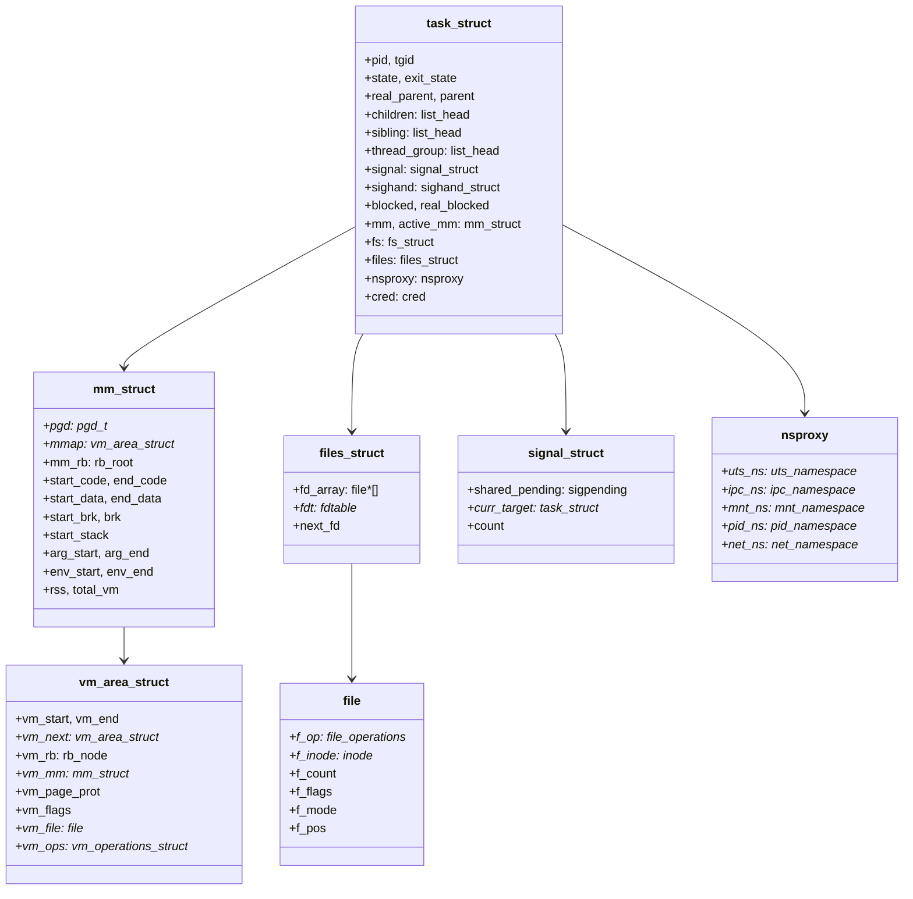
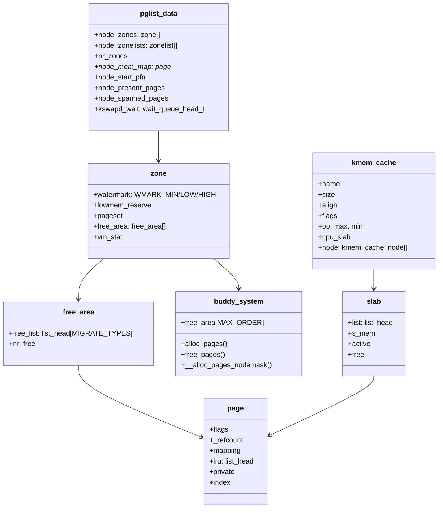
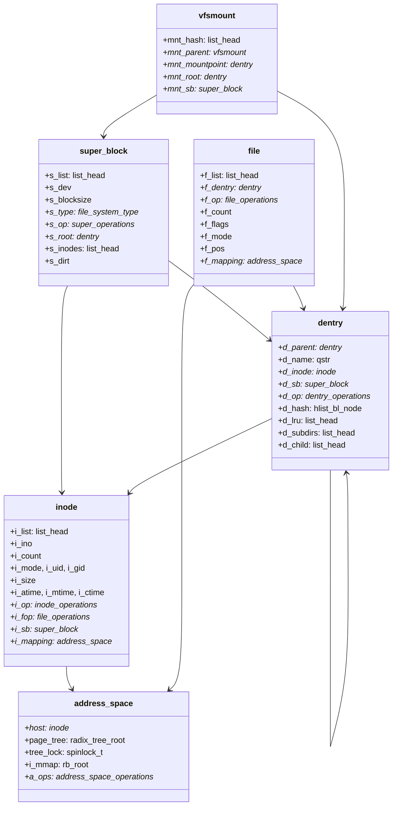
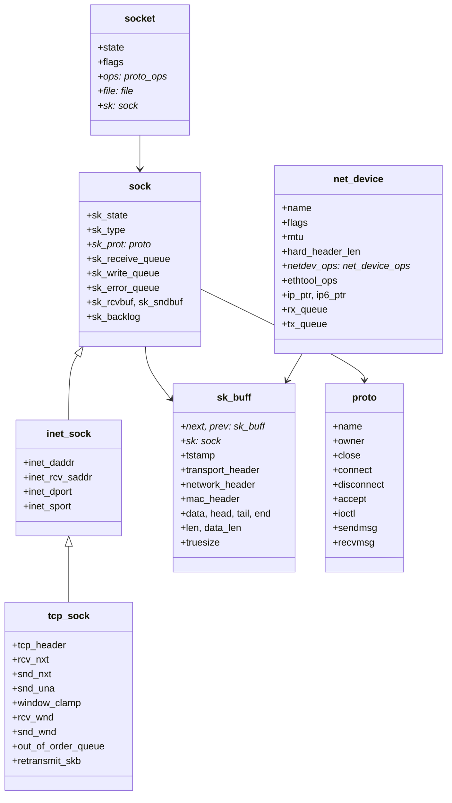
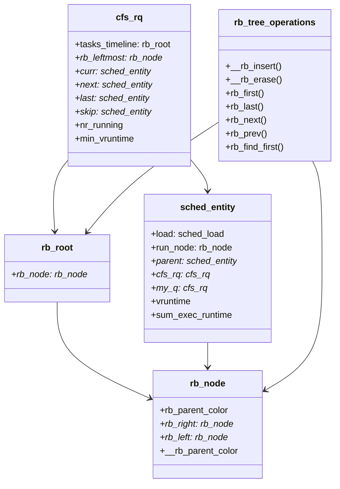
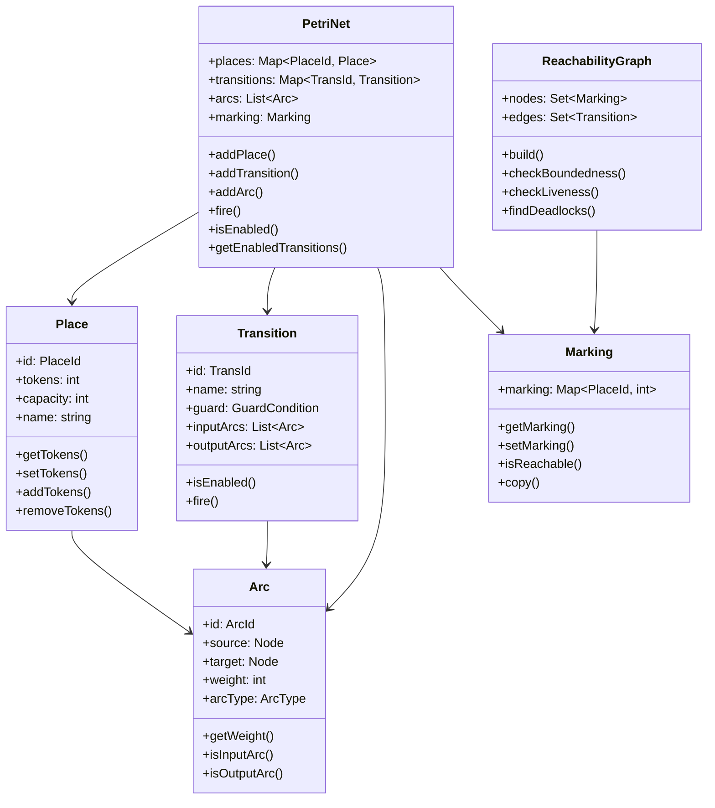

# 数据结构关系图

## 1. 进程控制块关系

```mermaid
classDiagram
    class task_struct {
        +pid, tgid
        +state, exit_state
        +real_parent, parent
        +children: list_head
        +sibling: list_head
        +thread_group: list_head
        +signal: signal_struct
        +sighand: sighand_struct
        +blocked, real_blocked
        +mm, active_mm: mm_struct
        +fs: fs_struct
        +files: files_struct
        +nsproxy: nsproxy
        +cred: cred
    }

    class mm_struct {
        +pgd: pgd_t*
        +mmap: vm_area_struct*
        +mm_rb: rb_root
        +start_code, end_code
        +start_data, end_data
        +start_brk, brk
        +start_stack
        +arg_start, arg_end
        +env_start, env_end
        +rss, total_vm
    }

    class vm_area_struct {
        +vm_start, vm_end
        +vm_next: vm_area_struct*
        +vm_rb: rb_node
        +vm_mm: mm_struct*
        +vm_page_prot
        +vm_flags
        +vm_file: file*
        +vm_ops: vm_operations_struct*
    }

    class files_struct {
        +fd_array: file*[]
        +fdt: fdtable*
        +next_fd
    }

    class file {
        +f_op: file_operations*
        +f_inode: inode*
        +f_count
        +f_flags
        +f_mode
        +f_pos
    }

    class signal_struct {
        +shared_pending: sigpending
        +curr_target: task_struct*
        +count
    }

    class nsproxy {
        +uts_ns: uts_namespace*
        +ipc_ns: ipc_namespace*
        +mnt_ns: mnt_namespace*
        +pid_ns: pid_namespace*
        +net_ns: net_namespace*
    }

    task_struct --> mm_struct
    task_struct --> files_struct
    task_struct --> signal_struct
    task_struct --> nsproxy
    mm_struct --> vm_area_struct
    files_struct --> file
```

## 2. 内存管理数据结构

```mermaid
classDiagram
    class pglist_data {
        +node_zones: zone[]
        +node_zonelists: zonelist[]
        +nr_zones
        +node_mem_map: page*
        +node_start_pfn
        +node_present_pages
        +node_spanned_pages
        +kswapd_wait: wait_queue_head_t
    }

    class zone {
        +watermark: WMARK_MIN/LOW/HIGH
        +lowmem_reserve
        +pageset
        +free_area: free_area[]
        +vm_stat
    }

    class free_area {
        +free_list: list_head[MIGRATE_TYPES]
        +nr_free
    }

    class page {
        +flags
        +_refcount
        +mapping
        +lru: list_head
        +private
        +index
    }

    class slab {
        +list: list_head
        +s_mem
        +active
        +free
    }

    class kmem_cache {
        +name
        +size
        +align
        +flags
        +oo, max, min
        +cpu_slab
        +node: kmem_cache_node[]
    }

    class buddy_system {
        +free_area[MAX_ORDER]
        +alloc_pages()
        +free_pages()
        +__alloc_pages_nodemask()
    }

    pglist_data --> zone
    zone --> free_area
    free_area --> page
    zone --> buddy_system
    kmem_cache --> slab
    slab --> page
```

## 3. 文件系统核心结构

```mermaid
classDiagram
    class super_block {
        +s_list: list_head
        +s_dev
        +s_blocksize
        +s_type: file_system_type*
        +s_op: super_operations*
        +s_root: dentry*
        +s_inodes: list_head
        +s_dirt
    }

    class inode {
        +i_list: list_head
        +i_ino
        +i_count
        +i_mode, i_uid, i_gid
        +i_size
        +i_atime, i_mtime, i_ctime
        +i_op: inode_operations*
        +i_fop: file_operations*
        +i_sb: super_block*
        +i_mapping: address_space*
    }

    class dentry {
        +d_parent: dentry*
        +d_name: qstr
        +d_inode: inode*
        +d_sb: super_block*
        +d_op: dentry_operations*
        +d_hash: hlist_bl_node
        +d_lru: list_head
        +d_subdirs: list_head
        +d_child: list_head
    }

    class file {
        +f_list: list_head
        +f_dentry: dentry*
        +f_op: file_operations*
        +f_count
        +f_flags
        +f_mode
        +f_pos
        +f_mapping: address_space*
    }

    class address_space {
        +host: inode*
        +page_tree: radix_tree_root
        +tree_lock: spinlock_t
        +i_mmap: rb_root
        +a_ops: address_space_operations*
    }

    class vfsmount {
        +mnt_hash: list_head
        +mnt_parent: vfsmount*
        +mnt_mountpoint: dentry*
        +mnt_root: dentry*
        +mnt_sb: super_block*
    }

    super_block --> inode
    super_block --> dentry
    inode --> address_space
    dentry --> inode
    dentry --> dentry
    file --> dentry
    file --> address_space
    vfsmount --> super_block
    vfsmount --> dentry
```

## 4. 网络协议栈结构

```mermaid
classDiagram
    class sock {
        +sk_state
        +sk_type
        +sk_prot: proto*
        +sk_receive_queue
        +sk_write_queue
        +sk_error_queue
        +sk_rcvbuf, sk_sndbuf
        +sk_backlog
    }

    class inet_sock {
        +inet_daddr
        +inet_rcv_saddr
        +inet_dport
        +inet_sport
    }

    class tcp_sock {
        +tcp_header
        +rcv_nxt
        +snd_nxt
        +snd_una
        +window_clamp
        +rcv_wnd
        +snd_wnd
        +out_of_order_queue
        +retransmit_skb
    }

    class socket {
        +state
        +flags
        +ops: proto_ops*
        +file: file*
        +sk: sock*
    }

    class sk_buff {
        +next, prev: sk_buff*
        +sk: sock*
        +tstamp
        +transport_header
        +network_header
        +mac_header
        +data, head, tail, end
        +len, data_len
        +truesize
    }

    class net_device {
        +name
        +flags
        +mtu
        +hard_header_len
        +netdev_ops: net_device_ops*
        +ethtool_ops
        +ip_ptr, ip6_ptr
        +rx_queue
        +tx_queue
    }

    class proto {
        +name
        +owner
        +close
        +connect
        +disconnect
        +accept
        +ioctl
        +sendmsg
        +recvmsg
    }

    sock <|-- inet_sock
    inet_sock <|-- tcp_sock
    socket --> sock
    sock --> sk_buff
    sock --> proto
    net_device --> sk_buff
```

## 5. 红黑树调度结构

```mermaid
classDiagram
    class rb_root {
        +rb_node: rb_node*
    }

    class rb_node {
        +rb_parent_color
        +rb_right: rb_node*
        +rb_left: rb_node*
        +__rb_parent_color
    }

    class sched_entity {
        +load: sched_load
        +run_node: rb_node
        +parent: sched_entity*
        +cfs_rq: cfs_rq*
        +my_q: cfs_rq*
        +vruntime
        +sum_exec_runtime
    }

    class cfs_rq {
        +tasks_timeline: rb_root
        +rb_leftmost: rb_node*
        +curr: sched_entity*
        +next: sched_entity*
        +last: sched_entity*
        +skip: sched_entity*
        +nr_running
        +min_vruntime
    }

    class rb_tree_operations {
        +__rb_insert()
        +__rb_erase()
        +rb_first()
        +rb_last()
        +rb_next()
        +rb_prev()
        +rb_find_first()
    }

    rb_root --> rb_node
    cfs_rq --> rb_root
    sched_entity --> rb_node
    cfs_rq --> sched_entity
    rb_tree_operations --> rb_root
    rb_tree_operations --> rb_node
```

## 6. Petri网核心结构

```mermaid
classDiagram
    class PetriNet {
        +places: Map~PlaceId, Place~
        +transitions: Map~TransId, Transition~
        +arcs: List~Arc~
        +marking: Marking
        +addPlace()
        +addTransition()
        +addArc()
        +fire()
        +isEnabled()
        +getEnabledTransitions()
    }

    class Place {
        +id: PlaceId
        +tokens: int
        +capacity: int
        +name: string
        +getTokens()
        +setTokens()
        +addTokens()
        +removeTokens()
    }

    class Transition {
        +id: TransId
        +name: string
        +guard: GuardCondition
        +inputArcs: List~Arc~
        +outputArcs: List~Arc~
        +isEnabled()
        +fire()
    }

    class Arc {
        +id: ArcId
        +source: Node
        +target: Node
        +weight: int
        +arcType: ArcType
        +getWeight()
        +isInputArc()
        +isOutputArc()
    }

    class Marking {
        +marking: Map~PlaceId, int~
        +getMarking()
        +setMarking()
        +isReachable()
        +copy()
    }

    class ReachabilityGraph {
        +nodes: Set~Marking~
        +edges: Set~Transition~
        +build()
        +checkBoundedness()
        +checkLiveness()
        +findDeadlocks()
    }

    PetriNet --> Place
    PetriNet --> Transition
    PetriNet --> Arc
    PetriNet --> Marking
    Transition --> Arc
    Place --> Arc
    ReachabilityGraph --> Marking
```
