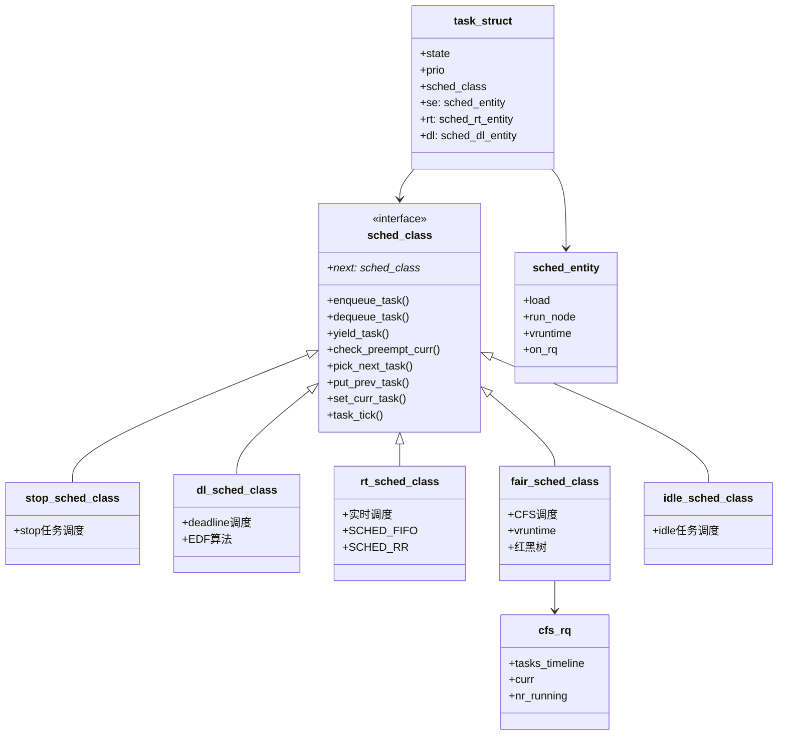
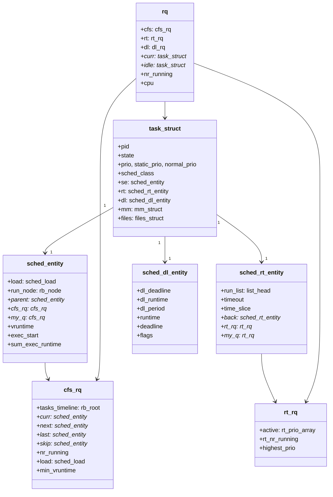
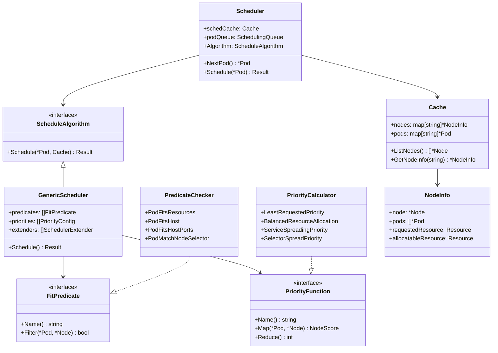
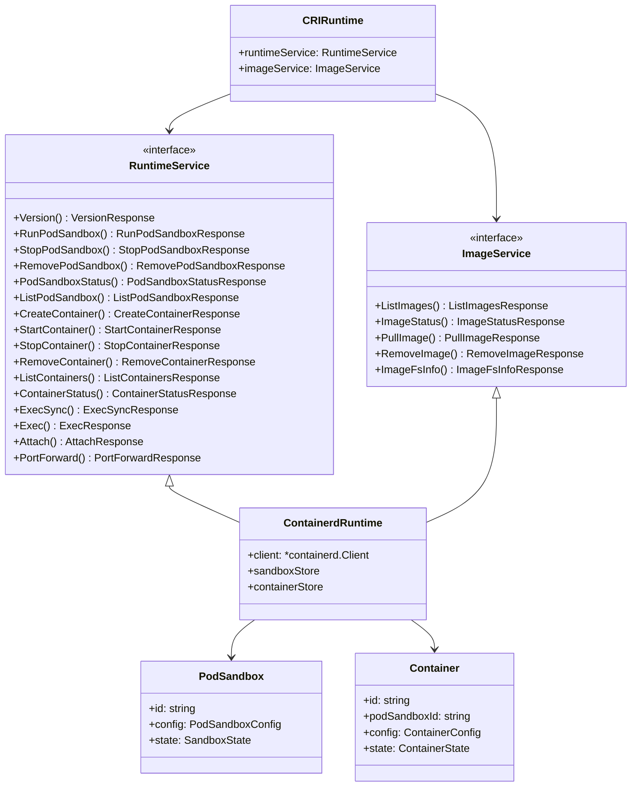
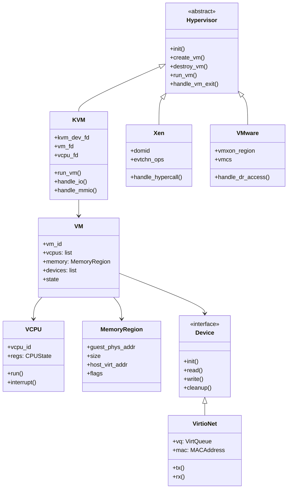

# 调度器类层次图

## 1. Linux调度器类层次

```mermaid
classDiagram
    class sched_class {
        <<interface>>
        +next: sched_class*
        +enqueue_task()
        +dequeue_task()
        +yield_task()
        +check_preempt_curr()
        +pick_next_task()
        +put_prev_task()
        +set_curr_task()
        +task_tick()
    }

    class stop_sched_class {
        +stop任务调度
    }

    class dl_sched_class {
        +deadline调度
        +EDF算法
    }

    class rt_sched_class {
        +实时调度
        +SCHED_FIFO
        +SCHED_RR
    }

    class fair_sched_class {
        +CFS调度
        +vruntime
        +红黑树
    }

    class idle_sched_class {
        +idle任务调度
    }

    sched_class <|-- stop_sched_class
    sched_class <|-- dl_sched_class
    sched_class <|-- rt_sched_class
    sched_class <|-- fair_sched_class
    sched_class <|-- idle_sched_class

    class task_struct {
        +state
        +prio
        +sched_class
        +se: sched_entity
        +rt: sched_rt_entity
        +dl: sched_dl_entity
    }

    class sched_entity {
        +load
        +run_node
        +vruntime
        +on_rq
    }

    class cfs_rq {
        +tasks_timeline
        +curr
        +nr_running
    }

    task_struct --> sched_entity
    task_struct --> sched_class
    fair_sched_class --> cfs_rq
```

## 2. 调度实体关系

```mermaid
classDiagram
    class task_struct {
        +pid
        +state
        +prio, static_prio, normal_prio
        +sched_class
        +se: sched_entity
        +rt: sched_rt_entity
        +dl: sched_dl_entity
        +mm: mm_struct
        +files: files_struct
    }

    class sched_entity {
        +load: sched_load
        +run_node: rb_node
        +parent: sched_entity*
        +cfs_rq: cfs_rq*
        +my_q: cfs_rq*
        +vruntime
        +exec_start
        +sum_exec_runtime
    }

    class sched_rt_entity {
        +run_list: list_head
        +timeout
        +time_slice
        +back: sched_rt_entity*
        +rt_rq: rt_rq*
        +my_q: rt_rq*
    }

    class sched_dl_entity {
        +dl_deadline
        +dl_runtime
        +dl_period
        +runtime
        +deadline
        +flags
    }

    class rq {
        +cfs: cfs_rq
        +rt: rt_rq
        +dl: dl_rq
        +curr: task_struct*
        +idle: task_struct*
        +nr_running
        +cpu
    }

    class cfs_rq {
        +tasks_timeline: rb_root
        +curr: sched_entity*
        +next: sched_entity*
        +last: sched_entity*
        +skip: sched_entity*
        +nr_running
        +load: sched_load
        +min_vruntime
    }

    class rt_rq {
        +active: rt_prio_array
        +rt_nr_running
        +highest_prio
    }

    task_struct "1" --> "1" sched_entity
    task_struct "1" --> "1" sched_rt_entity
    task_struct "1" --> "1" sched_dl_entity
    sched_entity --> cfs_rq
    sched_rt_entity --> rt_rq
    rq --> cfs_rq
    rq --> rt_rq
    rq --> task_struct
```

## 3. Kubernetes调度器架构

```mermaid
classDiagram
    class Scheduler {
        +schedCache: Cache
        +podQueue: SchedulingQueue
        +Algorithm: ScheduleAlgorithm
        +NextPod() *Pod
        +Schedule(*Pod) Result
    }

    class ScheduleAlgorithm {
        <<interface>>
        +Schedule(*Pod, Cache) Result
    }

    class GenericScheduler {
        +predicates: []FitPredicate
        +priorities: []PriorityConfig
        +extenders: []SchedulerExtender
        +Schedule() Result
    }

    class FitPredicate {
        <<interface>>
        +Name() string
        +Filter(*Pod, *Node) bool
    }

    class PriorityFunction {
        <<interface>>
        +Name() string
        +Map(*Pod, *Node) NodeScore
        +Reduce() int
    }

    class PredicateChecker {
        +PodFitsResources
        +PodFitsHost
        +PodFitsHostPorts
        +PodMatchNodeSelector
    }

    class PriorityCalculator {
        +LeastRequestedPriority
        +BalancedResourceAllocation
        +ServiceSpreadingPriority
        +SelectorSpreadPriority
    }

    class Cache {
        +nodes: map[string]*NodeInfo
        +pods: map[string]*Pod
        +ListNodes() []*Node
        +GetNodeInfo(string) *NodeInfo
    }

    class NodeInfo {
        +node: *Node
        +pods: []*Pod
        +requestedResource: Resource
        +allocatableResource: Resource
    }

    Scheduler --> ScheduleAlgorithm
    Scheduler --> Cache
    ScheduleAlgorithm <|-- GenericScheduler
    GenericScheduler --> FitPredicate
    GenericScheduler --> PriorityFunction
    PredicateChecker ..|> FitPredicate
    PriorityCalculator ..|> PriorityFunction
    Cache --> NodeInfo
```

## 4. 容器运行时接口 (CRI)

```mermaid
classDiagram
    class RuntimeService {
        <<interface>>
        +Version() VersionResponse
        +RunPodSandbox() RunPodSandboxResponse
        +StopPodSandbox() StopPodSandboxResponse
        +RemovePodSandbox() RemovePodSandboxResponse
        +PodSandboxStatus() PodSandboxStatusResponse
        +ListPodSandbox() ListPodSandboxResponse
        +CreateContainer() CreateContainerResponse
        +StartContainer() StartContainerResponse
        +StopContainer() StopContainerResponse
        +RemoveContainer() RemoveContainerResponse
        +ListContainers() ListContainersResponse
        +ContainerStatus() ContainerStatusResponse
        +ExecSync() ExecSyncResponse
        +Exec() ExecResponse
        +Attach() AttachResponse
        +PortForward() PortForwardResponse
    }

    class ImageService {
        <<interface>>
        +ListImages() ListImagesResponse
        +ImageStatus() ImageStatusResponse
        +PullImage() PullImageResponse
        +RemoveImage() RemoveImageResponse
        +ImageFsInfo() ImageFsInfoResponse
    }

    class ContainerdRuntime {
        +client: *containerd.Client
        +sandboxStore
        +containerStore
    }

    class CRIRuntime {
        +runtimeService: RuntimeService
        +imageService: ImageService
    }

    class PodSandbox {
        +id: string
        +config: PodSandboxConfig
        +state: SandboxState
    }

    class Container {
        +id: string
        +podSandboxId: string
        +config: ContainerConfig
        +state: ContainerState
    }

    RuntimeService <|-- ContainerdRuntime
    ImageService <|-- ContainerdRuntime
    CRIRuntime --> RuntimeService
    CRIRuntime --> ImageService
    ContainerdRuntime --> PodSandbox
    ContainerdRuntime --> Container
```

## 5. 虚拟化层架构

```mermaid
classDiagram
    class Hypervisor {
        <<abstract>>
        +init()
        +create_vm()
        +destroy_vm()
        +run_vm()
        +handle_vm_exit()
    }

    class KVM {
        +kvm_dev_fd
        +vm_fd
        +vcpu_fd
        +run_vm()
        +handle_io()
        +handle_mmio()
    }

    class Xen {
        +domid
        +handle_hypercall()
        +evtchn_ops
    }

    class VMware {
        +vmxon_region
        +vmcs
        +handle_dr_access()
    }

    class VM {
        +vm_id
        +vcpus: list
        +memory: MemoryRegion
        +devices: list
        +state
    }

    class VCPU {
        +vcpu_id
        +regs: CPUState
        +run()
        +interrupt()
    }

    class MemoryRegion {
        +guest_phys_addr
        +size
        +host_virt_addr
        +flags
    }

    class Device {
        <<interface>>
        +init()
        +read()
        +write()
        +cleanup()
    }

    class VirtioNet {
        +vq: VirtQueue
        +mac: MACAddress
        +tx()
        +rx()
    }

    Hypervisor <|-- KVM
    Hypervisor <|-- Xen
    Hypervisor <|-- VMware

    KVM --> VM
    VM --> VCPU
    VM --> MemoryRegion
    VM --> Device
    Device <|-- VirtioNet
```
