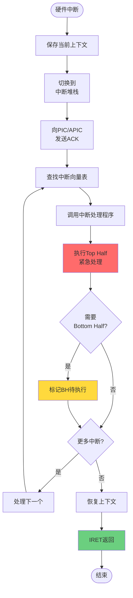
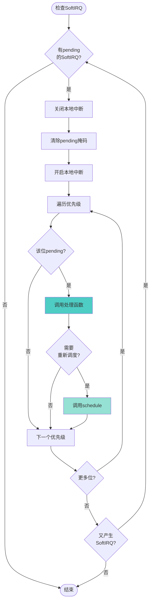
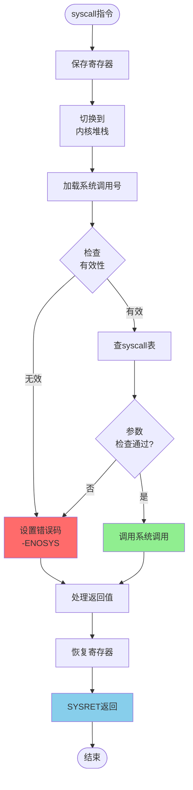
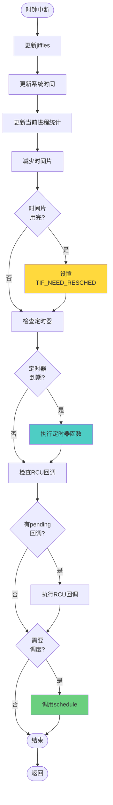
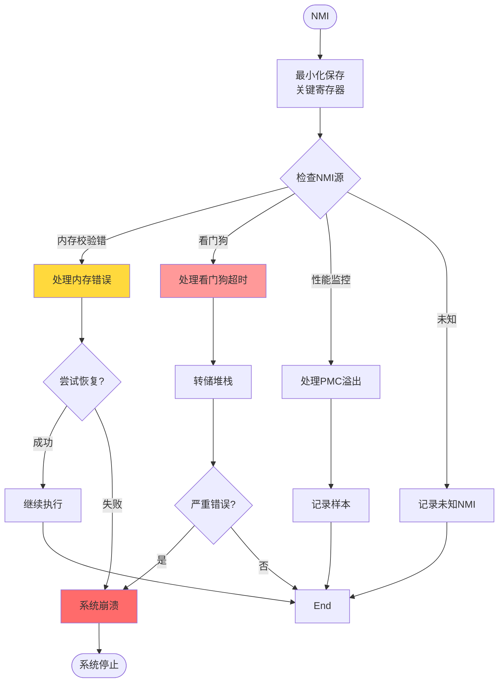
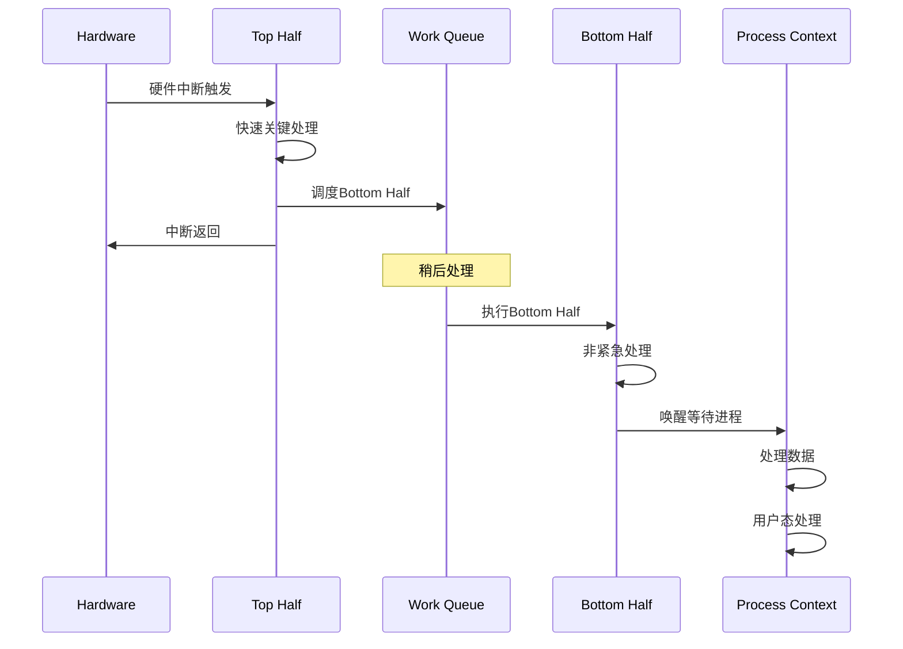

# 中断处理流程图

## 1. 硬件中断处理流程



## 2. SoftIRQ / Tasklet 处理流程



## 3. 系统调用中断流程



## 4. 时钟中断处理流程 (Tick)



## 5. NMI (不可屏蔽中断) 处理



## 6. 中断上下半部协作流程



## 7. 中断嵌套处理流程

```mermaid
flowchart TD
    Start([中断发生]) --> CheckLevel{当前<br/>中断级别}

    CheckLevel -->|禁止中断| QueueInt[排队等待]
    CheckLevel -->|允许中断| CheckPriority{新中断<br/>优先级更高?}

    CheckPriority -->|否| QueueInt
    CheckPriority -->|是| SaveCurrent[保存当前<br/>中断上下文]

    SaveCurrent --> NestLevel++[嵌套深度+1]
    NestLevel++ --> AckNew[ACK新中断]
    AckNew --> ProcessNew[处理新中断]

    ProcessNew --> CompleteNew{处理完成?}
    CompleteNew -->|否| ProcessNew
    CompleteNew -->|是| NestLevel--[嵌套深度-1]

    NestLevel-- --> RestorePrev[恢复前中断
上下文]
    RestorePrev --> ResumePrev[继续原中断]

    QueueInt --> CheckDequeue{可以<br/>出队?}
    CheckDequeue -->|是| ProcessQueued[处理排队中断]
    CheckDequeue -->|否| End
    ProcessQueued --> End
    ResumePrev --> End([结束])

    style SaveCurrent fill:#FFD93D
    style NestLevel++ fill:#FF9999
    style NestLevel-- fill:#90EE90
```
