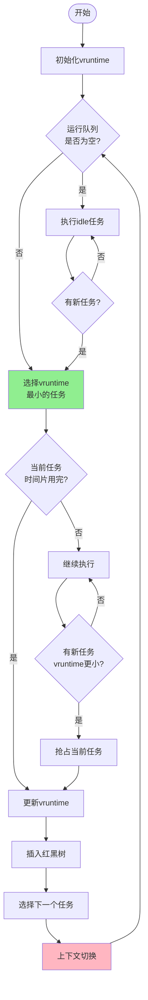
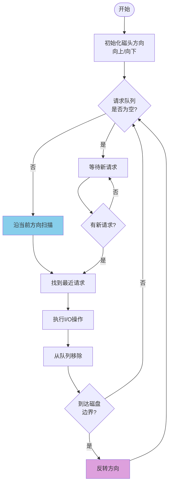
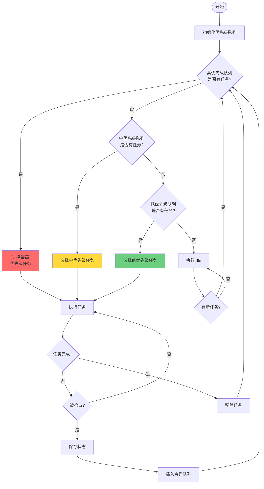
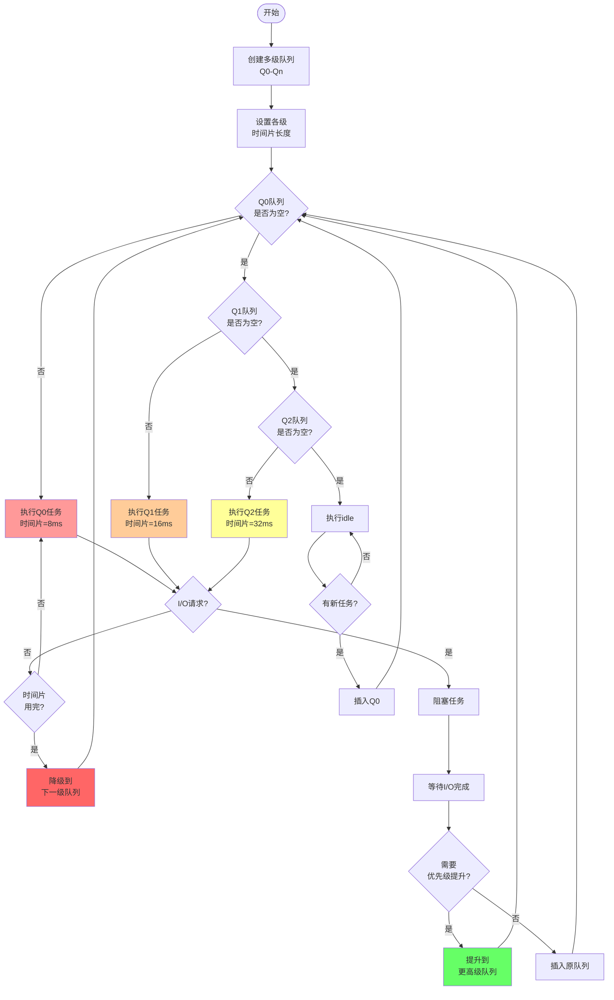
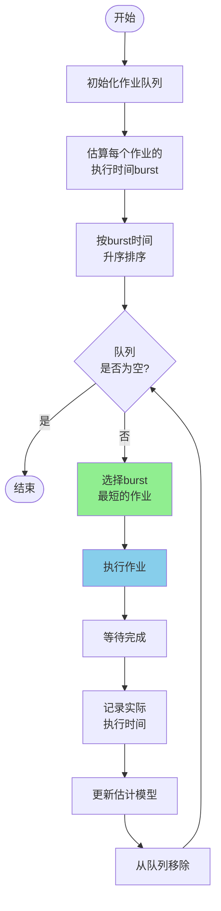
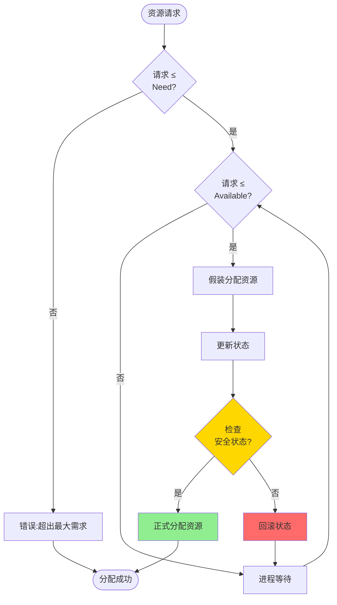
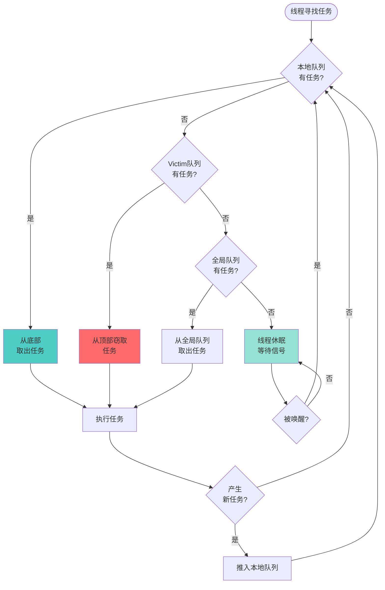
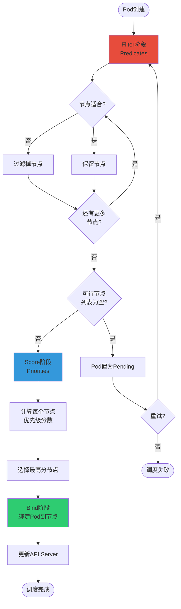

# 调度算法流程图

## 1. CFS (完全公平调度器) 算法流程

## 2. 电梯算法 (SCAN) 磁盘调度

## 3. 优先级调度算法

## 4. 多级反馈队列 (MLFQ) 算法

## 5. 最短作业优先 (SJF) 算法

## 6. 银行家算法 (死锁避免)

## 7. 工作窃取 (Work Stealing) 算法

## 8. Kubernetes调度器流程

