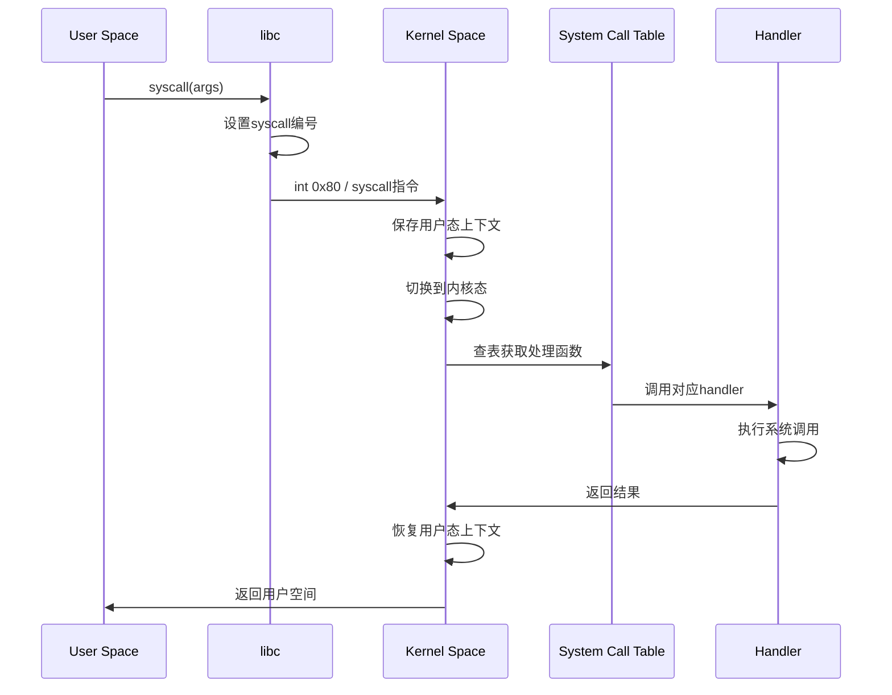
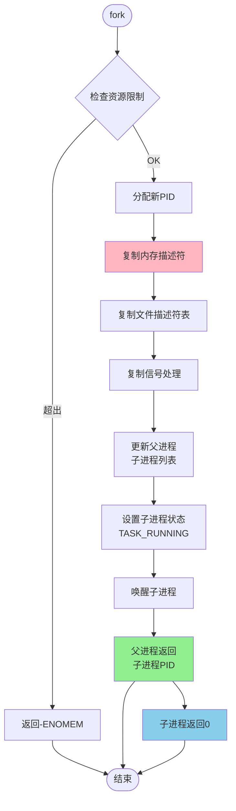
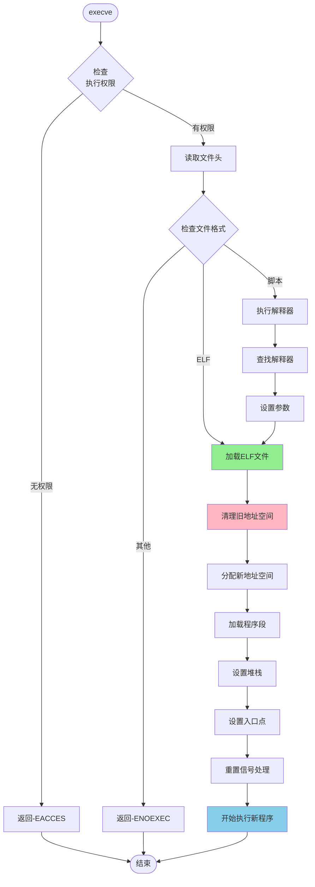
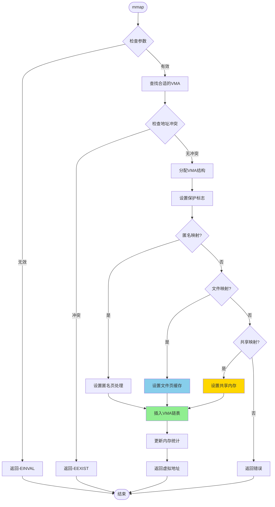
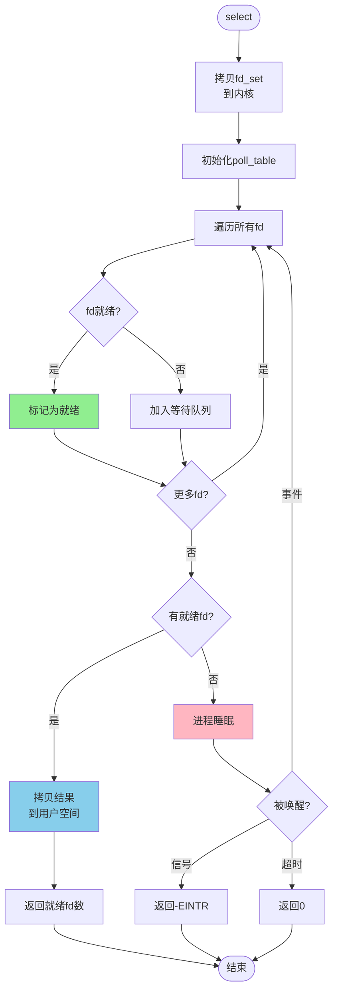

# 系统调用流程图

## 1. 通用系统调用流程



## 2. fork() 系统调用流程



## 3. execve() 系统调用流程



## 4. mmap() 系统调用流程



## 5. 进程间通信 - pipe() 流程

```mermaid
flowchart TD
    Start([pipe]) --> AllocInode[分配inode]
    AllocInode --> CreatePipe[创建管道文件]

    CreatePipe --> AllocReadFD[分配读端fd]
    AllocReadFD --> AllocWriteFD[分配写端fd]

    AllocWriteFD --> SetupBuffer[设置环形缓冲区]
    SetupBuffer --> InitLock[初始化读写锁]

    InitLock --> ReturnFD[返回fd数组<br/>fd[0]=读, fd[1]=写]
    ReturnFD --> End([结束])

    subgraph 读操作
        ReadStart[read] --> CheckEmpty{缓冲区空?}
        CheckEmpty -->|是| BlockRead[阻塞等待]
        CheckEmpty -->|否| ReadData[读取数据]
        BlockRead --> CheckEmpty
        ReadData --> WakeWriter[唤醒写者]
    end

    subgraph 写操作
        WriteStart[write] --> CheckFull{缓冲区满?}
        CheckFull -->|是| BlockWrite[阻塞等待]
        CheckFull -->|否| WriteData[写入数据]
        BlockWrite --> CheckFull
        WriteData --> WakeReader[唤醒读者]
    end

    style AllocReadFD fill:#87CEEB
    style AllocWriteFD fill:#FFB6C1
    style SetupBuffer fill:#90EE90
```

## 6. select() / poll() 流程


