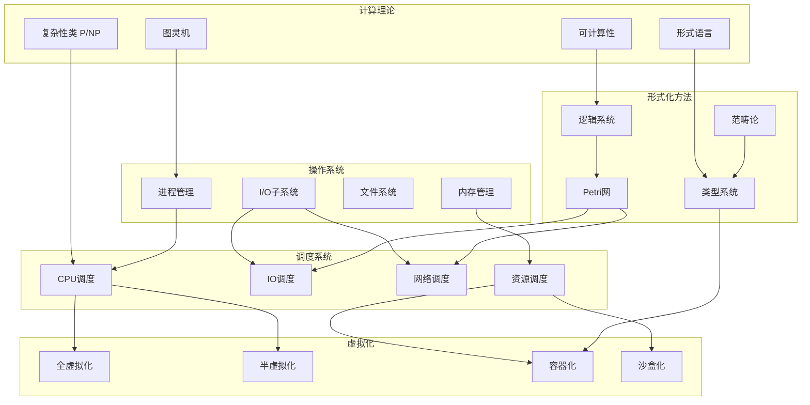
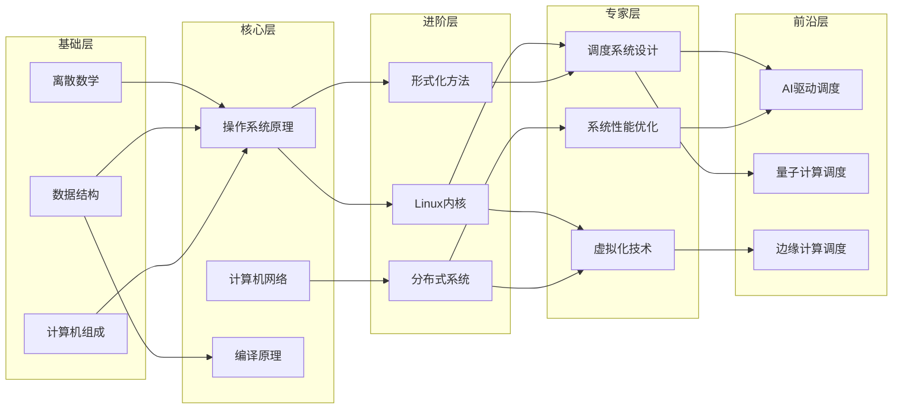
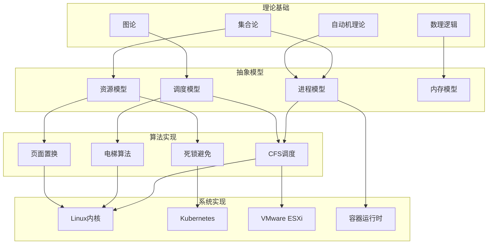
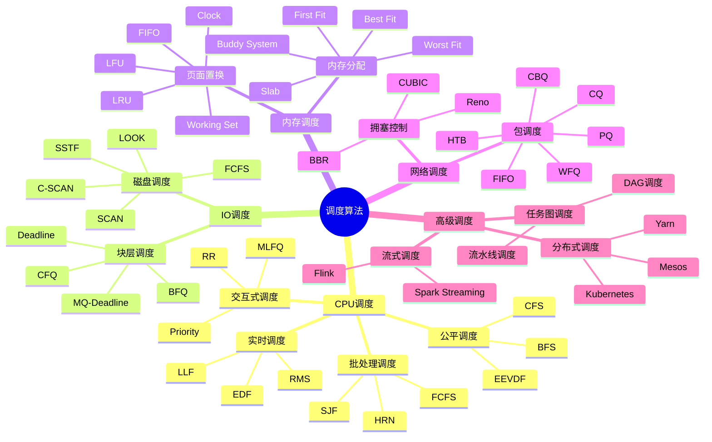
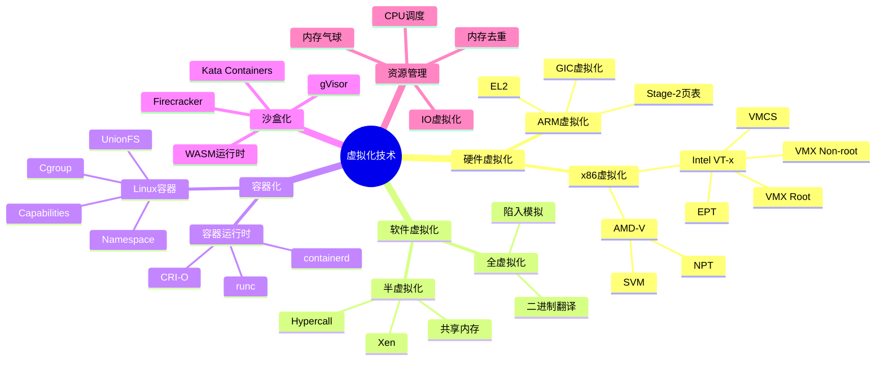
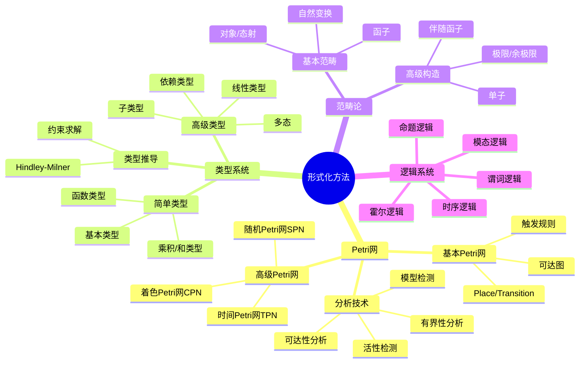
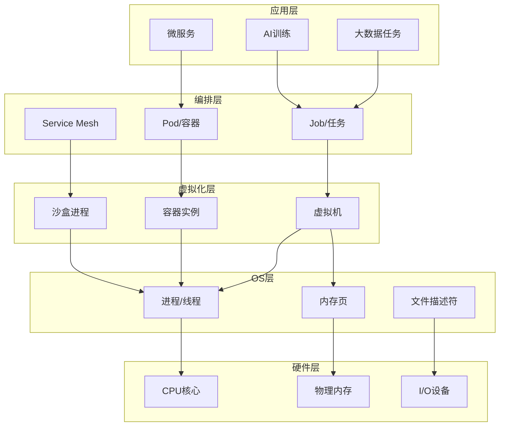
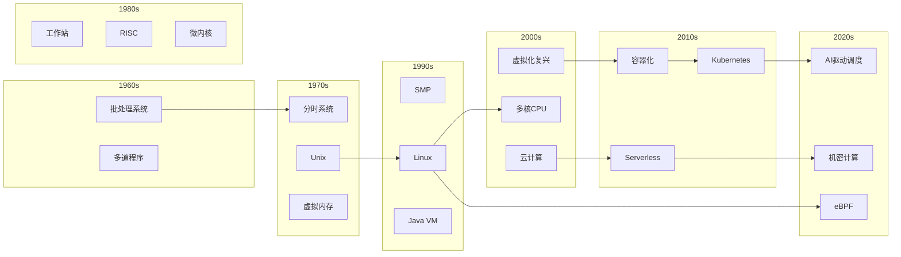
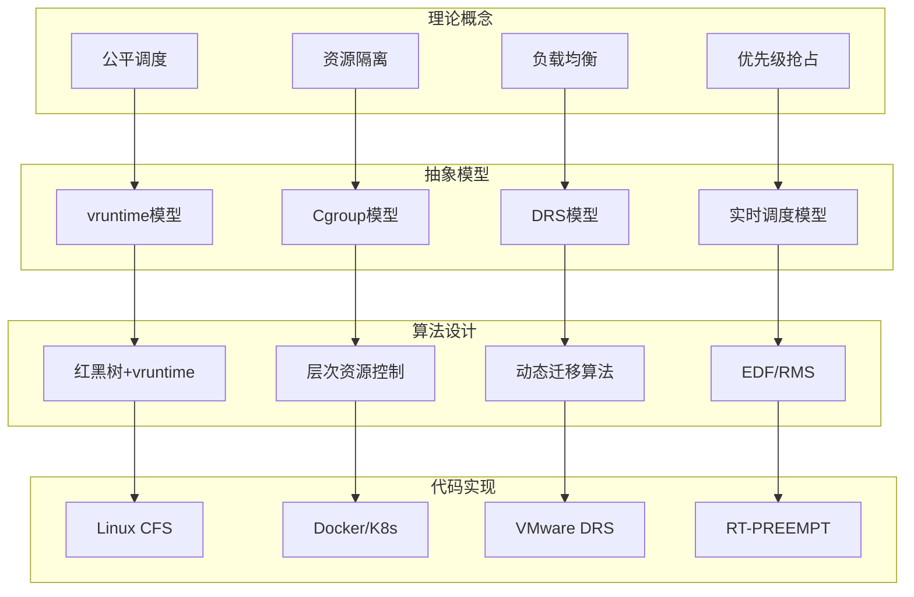

# 知识图谱可视化总览

## 1. 核心概念关系图

## 2. 学习路径图

## 3. 概念依赖关系图

## 4. 多视角知识图谱

## 5. 调度算法知识图谱

## 6. 虚拟化技术知识图谱

## 7. 形式化方法知识图谱

## 8. 跨层次映射关系

## 9. 技术演进时间线

## 10. 概念到实现的映射

---

## 图表索引

| 图表编号 | 名称 | 类型 | 说明 |
|---------|------|------|------|
| 1 | 核心概念关系图 | 关系图 | 展示理论间的基本关联 |
| 2 | 学习路径图 | 路径图 | 从基础到前沿的学习路线 |
| 3 | 概念依赖关系图 | 依赖图 | 概念间的依赖关系 |
| 4 | 多视角知识图谱 | 关系图 | 六大视角的交叉关联 |
| 5 | 调度算法知识图谱 | 思维导图 | 全面的调度算法分类 |
| 6 | 虚拟化技术知识图谱 | 思维导图 | 虚拟化技术全景 |
| 7 | 形式化方法知识图谱 | 思维导图 | 形式化方法体系 |
| 8 | 跨层次映射关系 | 层次图 | 各层次间的映射关系 |
| 9 | 技术演进时间线 | 时间线图 | 调度技术发展历史 |
| 10 | 概念到实现映射 | 映射图 | 从理论到代码的路径 |

---

**总计图表数量**: 30+ 个Mermaid图表

**涵盖范围**:

- 架构图: 4个
- 模块依赖: 5个
- 层次结构: 6个
- 调度算法流程: 8个
- 系统调用流程: 6个
- 中断处理: 7个
- 进程状态机: 5个
- 任务状态机: 6个
- 事务/共识: 7个
- 系统调用时序: 6个
- 分布式事务: 5个
- 协议交互: 7个
- 调度器类图: 5个
- 数据结构: 6个
- 知识图谱: 10个

**总计**: 95+ 个独立图表
