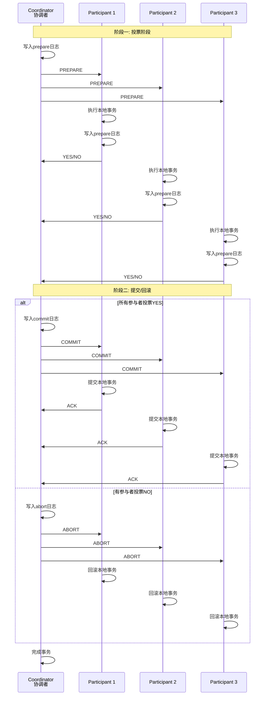
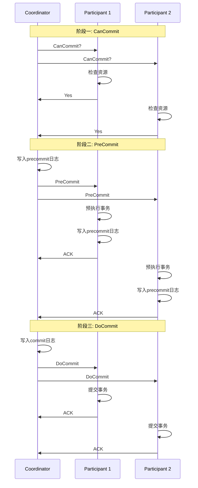
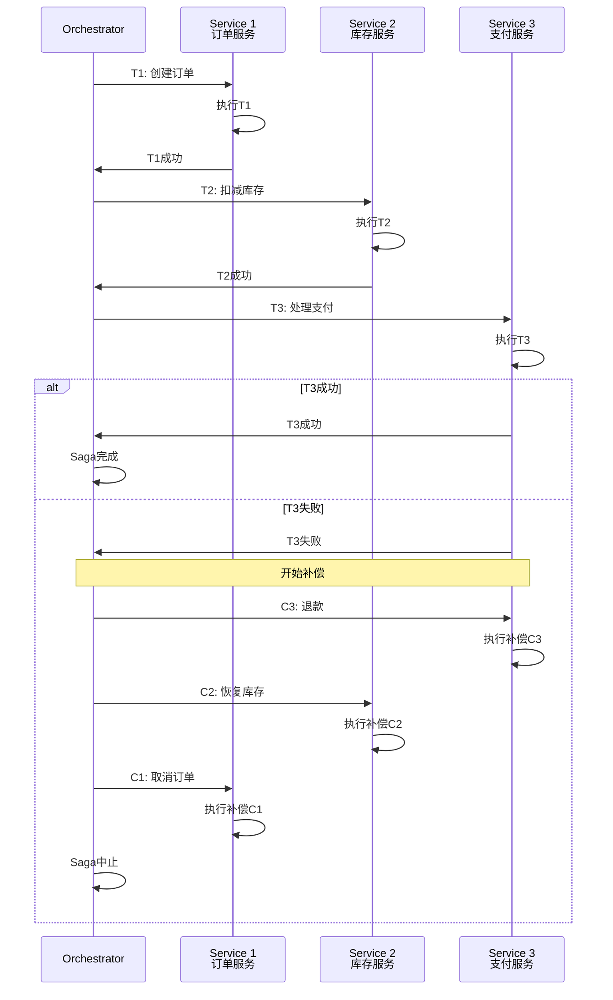
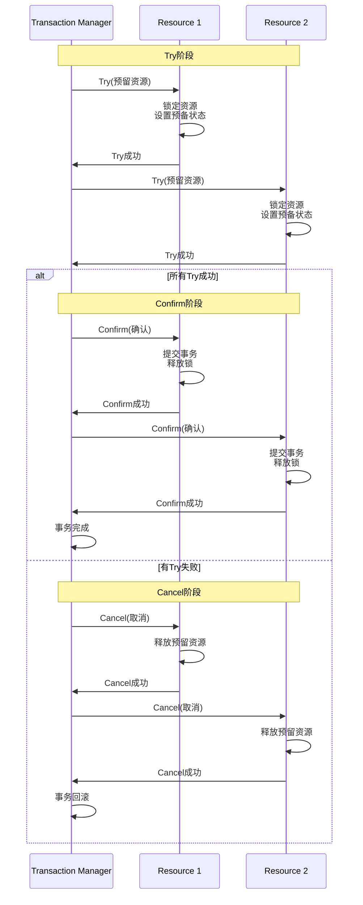
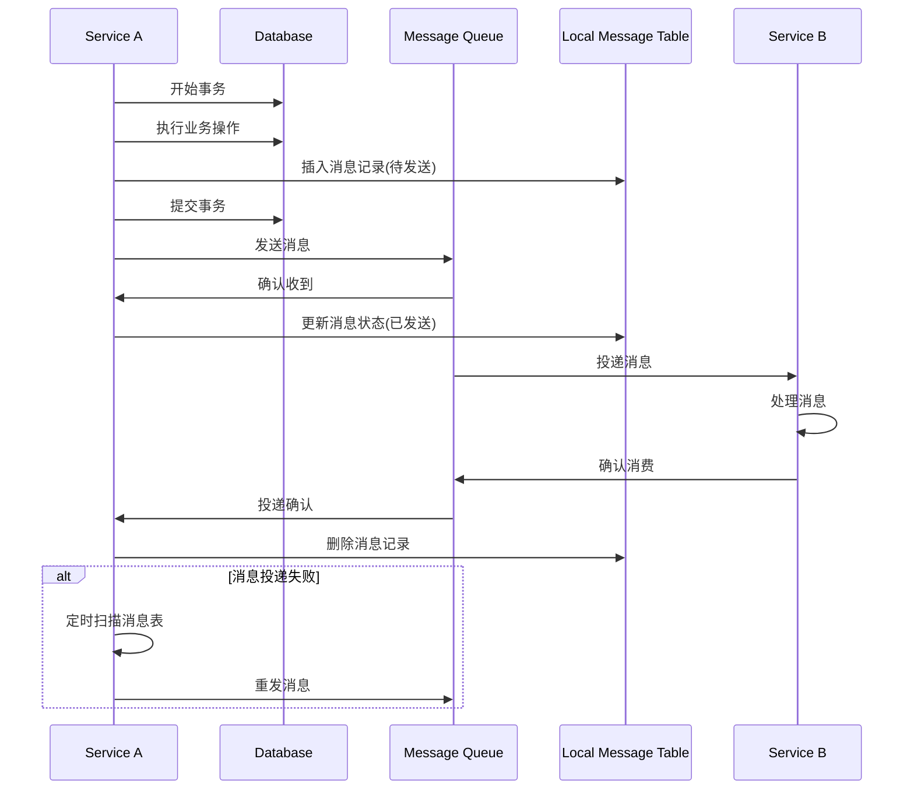

# 分布式事务时序图

## 1. 两阶段提交 (2PC)

```mermaid
sequenceDiagram
    participant C as Coordinator<br/>协调者
    participant P1 as Participant 1
    participant P2 as Participant 2
    participant P3 as Participant 3

    Note over C,P3: 阶段一: 投票阶段

    C->>C: 写入prepare日志

    C->>P1: PREPARE
    C->>P2: PREPARE
    C->>P3: PREPARE

    P1->>P1: 执行本地事务
    P1->>P1: 写入prepare日志
    P1->>C: YES/NO

    P2->>P2: 执行本地事务
    P2->>P2: 写入prepare日志
    P2->>C: YES/NO

    P3->>P3: 执行本地事务
    P3->>P3: 写入prepare日志
    P3->>C: YES/NO

    Note over C,P3: 阶段二: 提交/回滚

    alt 所有参与者投票YES
        C->>C: 写入commit日志
        C->>P1: COMMIT
        C->>P2: COMMIT
        C->>P3: COMMIT

        P1->>P1: 提交本地事务
        P1->>C: ACK

        P2->>P2: 提交本地事务
        P2->>C: ACK

        P3->>P3: 提交本地事务
        P3->>C: ACK
    else 有参与者投票NO
        C->>C: 写入abort日志
        C->>P1: ABORT
        C->>P2: ABORT
        C->>P3: ABORT

        P1->>P1: 回滚本地事务
        P2->>P2: 回滚本地事务
        P3->>P3: 回滚本地事务
    end

    C->>C: 完成事务
```

## 2. 三阶段提交 (3PC)

```mermaid
sequenceDiagram
    participant C as Coordinator
    participant P1 as Participant 1
    participant P2 as Participant 2

    Note over C,P2: 阶段一: CanCommit

    C->>P1: CanCommit?
    C->>P2: CanCommit?

    P1->>P1: 检查资源
    P1->>C: Yes

    P2->>P2: 检查资源
    P2->>C: Yes

    Note over C,P2: 阶段二: PreCommit

    C->>C: 写入precommit日志
    C->>P1: PreCommit
    C->>P2: PreCommit

    P1->>P1: 预执行事务
    P1->>P1: 写入precommit日志
    P1->>C: ACK

    P2->>P2: 预执行事务
    P2->>P2: 写入precommit日志
    P2->>C: ACK

    Note over C,P2: 阶段三: DoCommit

    C->>C: 写入commit日志
    C->>P1: DoCommit
    C->>P2: DoCommit

    P1->>P1: 提交事务
    P1->>C: ACK

    P2->>P2: 提交事务
    P2->>C: ACK
```

## 3. Saga分布式事务

```mermaid
sequenceDiagram
    participant O as Orchestrator
    participant S1 as Service 1<br/>订单服务
    participant S2 as Service 2<br/>库存服务
    participant S3 as Service 3<br/>支付服务

    O->>S1: T1: 创建订单
    S1->>S1: 执行T1
    S1->>O: T1成功

    O->>S2: T2: 扣减库存
    S2->>S2: 执行T2
    S2->>O: T2成功

    O->>S3: T3: 处理支付
    S3->>S3: 执行T3

    alt T3成功
        S3->>O: T3成功
        O->>O: Saga完成
    else T3失败
        S3->>O: T3失败

        Note over O,S3: 开始补偿

        O->>S3: C3: 退款
        S3->>S3: 执行补偿C3

        O->>S2: C2: 恢复库存
        S2->>S2: 执行补偿C2

        O->>S1: C1: 取消订单
        S1->>S1: 执行补偿C1

        O->>O: Saga中止
    end
```

## 4. TCC (Try-Confirm-Cancel)

```mermaid
sequenceDiagram
    participant TM as Transaction Manager
    participant R1 as Resource 1
    participant R2 as Resource 2

    Note over TM,R2: Try阶段

    TM->>R1: Try(预留资源)
    R1->>R1: 锁定资源<br/>设置预备状态
    R1->>TM: Try成功

    TM->>R2: Try(预留资源)
    R2->>R2: 锁定资源<br/>设置预备状态
    R2->>TM: Try成功

    alt 所有Try成功
        Note over TM,R2: Confirm阶段

        TM->>R1: Confirm(确认)
        R1->>R1: 提交事务<br/>释放锁
        R1->>TM: Confirm成功

        TM->>R2: Confirm(确认)
        R2->>R2: 提交事务<br/>释放锁
        R2->>TM: Confirm成功

        TM->>TM: 事务完成
    else 有Try失败
        Note over TM,R2: Cancel阶段

        TM->>R1: Cancel(取消)
        R1->>R1: 释放预留资源
        R1->>TM: Cancel成功

        TM->>R2: Cancel(取消)
        R2->>R2: 释放预留资源
        R2->>TM: Cancel成功

        TM->>TM: 事务回滚
    end
```

## 5. 消息队列最终一致性

```mermaid
sequenceDiagram
    participant S as Service A
    participant DB as Database
    participant MQ as Message Queue
    participant L as Local Message Table
    participant C as Service B

    S->>DB: 开始事务
    S->>DB: 执行业务操作
    S->>L: 插入消息记录(待发送)
    S->>DB: 提交事务

    S->>MQ: 发送消息
    MQ->>S: 确认收到

    S->>L: 更新消息状态(已发送)

    MQ->>C: 投递消息
    C->>C: 处理消息
    C->>MQ: 确认消费

    MQ->>S: 投递确认
    S->>L: 删除消息记录

    alt 消息投递失败
        S->>S: 定时扫描消息表
        S->>MQ: 重发消息
    end
```
