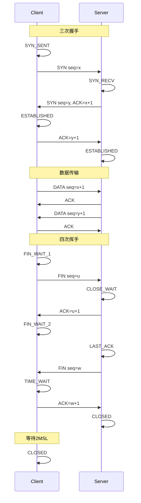
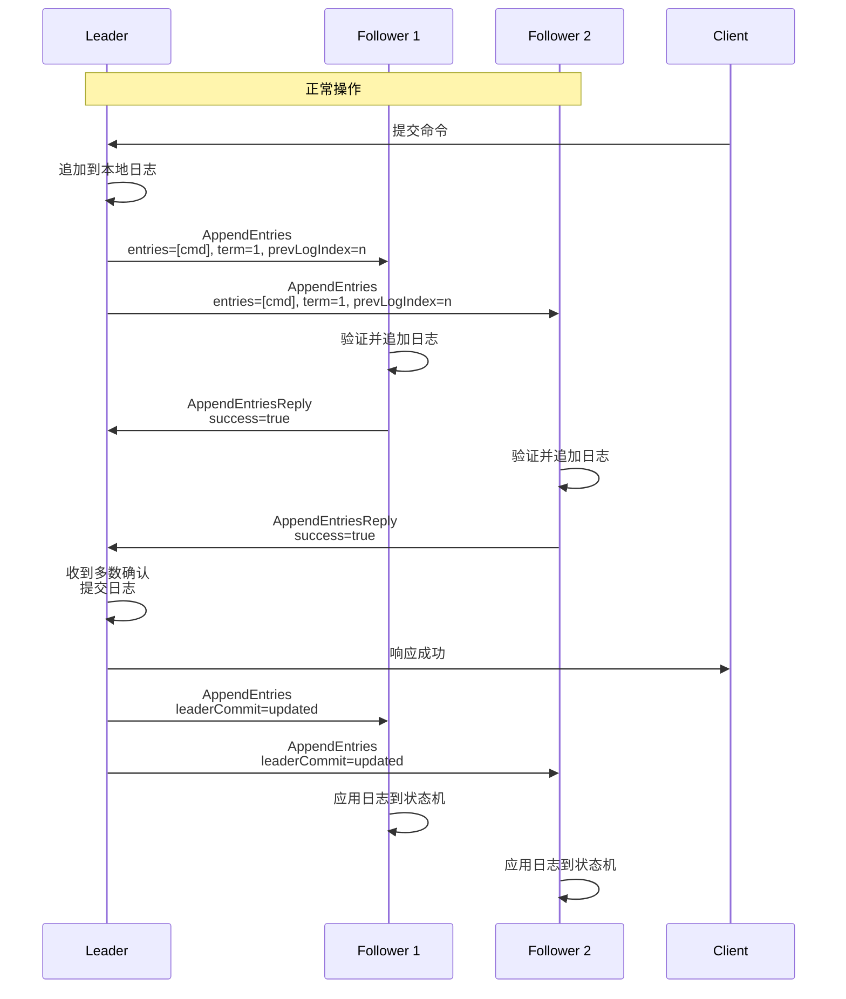
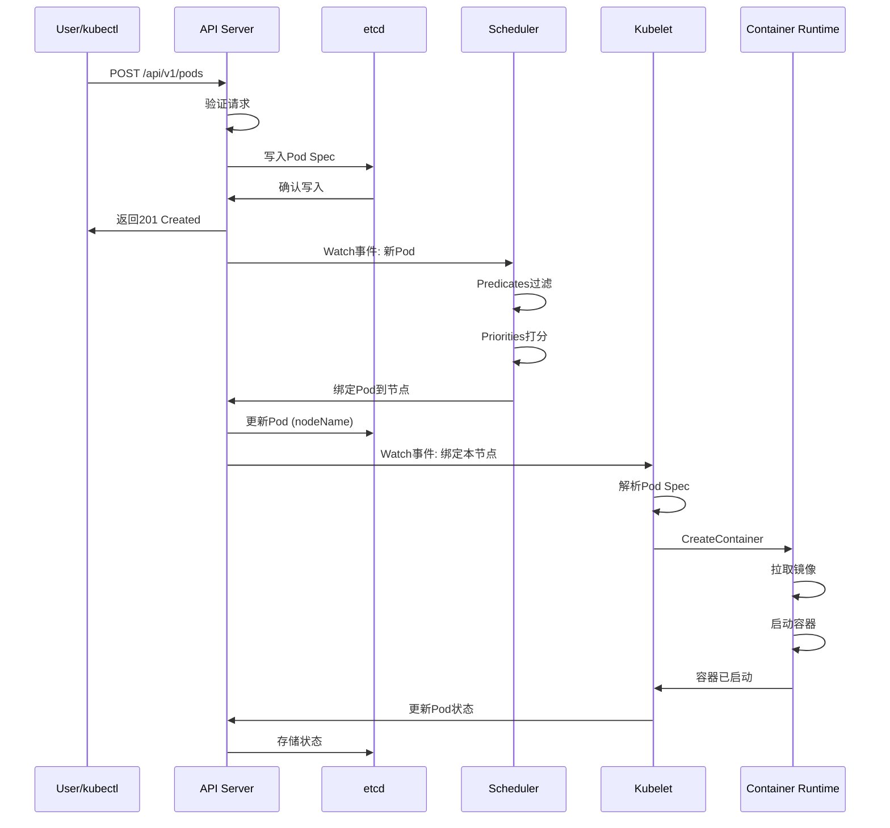
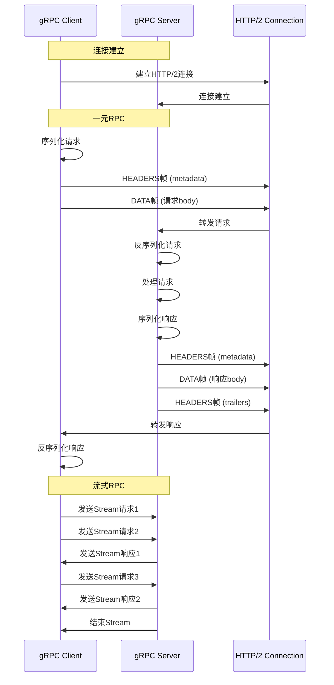
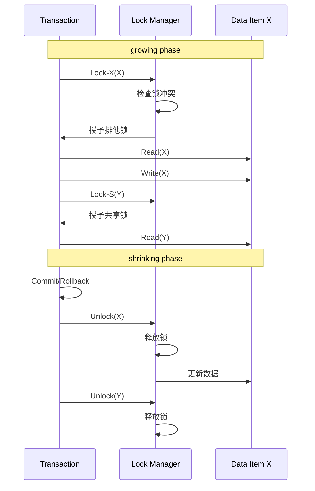
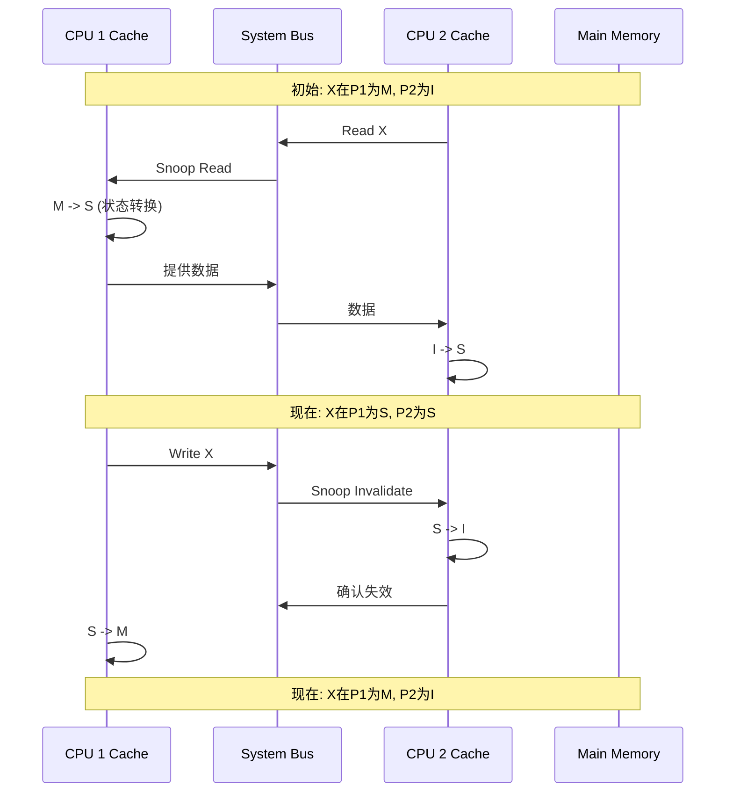
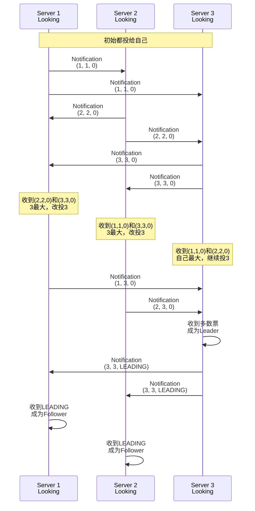

# 协议交互时序图

## 1. TCP三次握手与四次挥手

```mermaid
sequenceDiagram
    participant C as Client
    participant S as Server

    Note over C,S: 三次握手

    C->>C: SYN_SENT
    C->>S: SYN seq=x

    S->>S: SYN_RECV
    S->>C: SYN seq=y, ACK=x+1

    C->>C: ESTABLISHED
    C->>S: ACK=y+1

    S->>S: ESTABLISHED

    Note over C,S: 数据传输

    C->>S: DATA seq=x+1
    S->>C: ACK
    S->>C: DATA seq=y+1
    C->>S: ACK

    Note over C,S: 四次挥手

    C->>C: FIN_WAIT_1
    C->>S: FIN seq=u

    S->>S: CLOSE_WAIT
    S->>C: ACK=u+1

    C->>C: FIN_WAIT_2
    S->>S: LAST_ACK
    S->>C: FIN seq=w

    C->>C: TIME_WAIT
    C->>S: ACK=w+1

    S->>S: CLOSED

    Note over C: 等待2MSL
    C->>C: CLOSED
```

## 2. Raft共识算法交互

```mermaid
sequenceDiagram
    participant L as Leader
    participant F1 as Follower 1
    participant F2 as Follower 2
    participant C as Client

    Note over L,F2: 正常操作

    C->>L: 提交命令

    L->>L: 追加到本地日志

    L->>F1: AppendEntries<br/>entries=[cmd], term=1, prevLogIndex=n
    L->>F2: AppendEntries<br/>entries=[cmd], term=1, prevLogIndex=n

    F1->>F1: 验证并追加日志
    F1->>L: AppendEntriesReply<br/>success=true

    F2->>F2: 验证并追加日志
    F2->>L: AppendEntriesReply<br/>success=true

    L->>L: 收到多数确认<br/>提交日志
    L->>C: 响应成功

    L->>F1: AppendEntries<br/>leaderCommit=updated
    L->>F2: AppendEntries<br/>leaderCommit=updated

    F1->>F1: 应用日志到状态机
    F2->>F2: 应用日志到状态机
```

## 3. Kubernetes Pod创建流程

```mermaid
sequenceDiagram
    participant U as User/kubectl
    participant A as API Server
    participant E as etcd
    participant S as Scheduler
    participant K as Kubelet
    participant C as Container Runtime

    U->>A: POST /api/v1/pods
    A->>A: 验证请求
    A->>E: 写入Pod Spec
    E->>A: 确认写入
    A->>U: 返回201 Created

    A->>S: Watch事件: 新Pod
    S->>S: Predicates过滤
    S->>S: Priorities打分
    S->>A: 绑定Pod到节点
    A->>E: 更新Pod (nodeName)

    A->>K: Watch事件: 绑定本节点
    K->>K: 解析Pod Spec
    K->>C: CreateContainer
    C->>C: 拉取镜像
    C->>C: 启动容器
    C->>K: 容器已启动

    K->>A: 更新Pod状态
    A->>E: 存储状态
```

## 4. gRPC调用流程

```mermaid
sequenceDiagram
    participant C as gRPC Client
    participant S as gRPC Server
    participant E as HTTP/2 Connection

    Note over C,S: 连接建立

    C->>E: 建立HTTP/2连接
    E->>S: 连接建立

    Note over C,S: 一元RPC

    C->>C: 序列化请求
    C->>E: HEADERS帧 (metadata)
    C->>E: DATA帧 (请求body)

    E->>S: 转发请求
    S->>S: 反序列化请求
    S->>S: 处理请求
    S->>S: 序列化响应

    S->>E: HEADERS帧 (metadata)
    S->>E: DATA帧 (响应body)
    S->>E: HEADERS帧 (trailers)

    E->>C: 转发响应
    C->>C: 反序列化响应

    Note over C,S: 流式RPC

    C->>S: 发送Stream请求1
    C->>S: 发送Stream请求2
    S->>C: 发送Stream响应1
    C->>S: 发送Stream请求3
    S->>C: 发送Stream响应2
    S->>C: 结束Stream
```

## 5. 数据库事务两阶段锁

```mermaid
sequenceDiagram
    participant T as Transaction
    participant LM as Lock Manager
    participant D as Data Item X

    Note over T,D:  growing phase

    T->>LM: Lock-X(X)
    LM->>LM: 检查锁冲突
    LM->>T: 授予排他锁

    T->>D: Read(X)
    T->>D: Write(X)

    T->>LM: Lock-S(Y)
    LM->>T: 授予共享锁

    T->>D: Read(Y)

    Note over T,D: shrinking phase

    T->>T: Commit/Rollback

    T->>LM: Unlock(X)
    LM->>LM: 释放锁
    LM->>D: 更新数据

    T->>LM: Unlock(Y)
    LM->>LM: 释放锁
```

## 6. 缓存一致性协议 (MESI)

```mermaid
sequenceDiagram
    participant P1 as CPU 1 Cache
    participant Bus as System Bus
    participant P2 as CPU 2 Cache
    participant M as Main Memory

    Note over P1,M: 初始: X在P1为M, P2为I

    P2->>Bus: Read X
    Bus->>P1: Snoop Read

    P1->>P1: M -> S (状态转换)
    P1->>Bus: 提供数据
    Bus->>P2: 数据
    P2->>P2: I -> S

    Note over P1,M: 现在: X在P1为S, P2为S

    P1->>Bus: Write X
    Bus->>P2: Snoop Invalidate

    P2->>P2: S -> I
    P2->>Bus: 确认失效

    P1->>P1: S -> M

    Note over P1,M: 现在: X在P1为M, P2为I
```

## 7. ZooKeeper领导者选举

```mermaid
sequenceDiagram
    participant S1 as Server 1<br/>Looking
    participant S2 as Server 2<br/>Looking
    participant S3 as Server 3<br/>Looking

    Note over S1,S3: 初始都投给自己

    S1->>S2: Notification<br/>(1, 1, 0)
    S1->>S3: Notification<br/>(1, 1, 0)

    S2->>S1: Notification<br/>(2, 2, 0)
    S2->>S3: Notification<br/>(2, 2, 0)

    S3->>S1: Notification<br/>(3, 3, 0)
    S3->>S2: Notification<br/>(3, 3, 0)

    Note over S1: 收到(2,2,0)和(3,3,0)<br/>3最大，改投3
    Note over S2: 收到(1,1,0)和(3,3,0)<br/>3最大，改投3
    Note over S3: 收到(1,1,0)和(2,2,0)<br/>自己最大，继续投3

    S1->>S3: Notification<br/>(1, 3, 0)
    S2->>S3: Notification<br/>(2, 3, 0)

    S3->>S3: 收到多数票<br/>成为Leader
    S3->>S1: Notification<br/>(3, 3, LEADING)
    S3->>S2: Notification<br/>(3, 3, LEADING)

    S1->>S1: 收到LEADING<br/>成为Follower
    S2->>S2: 收到LEADING<br/>成为Follower
```
