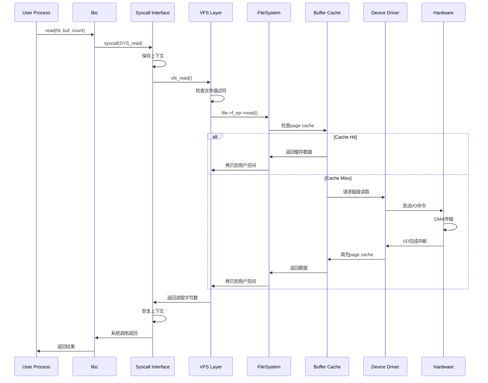
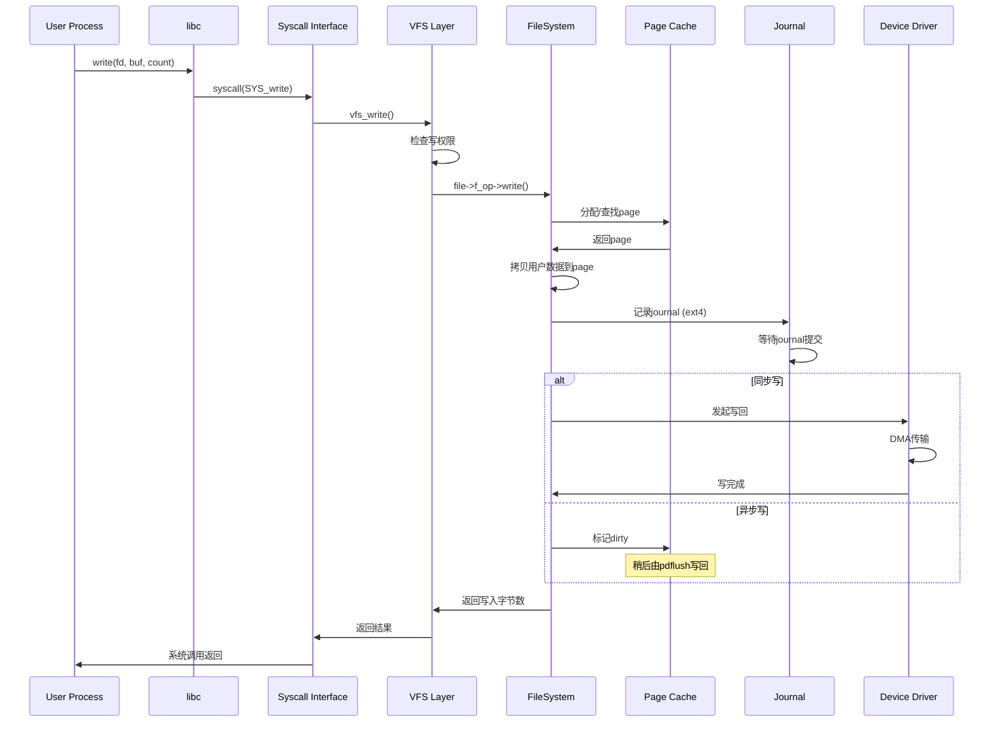
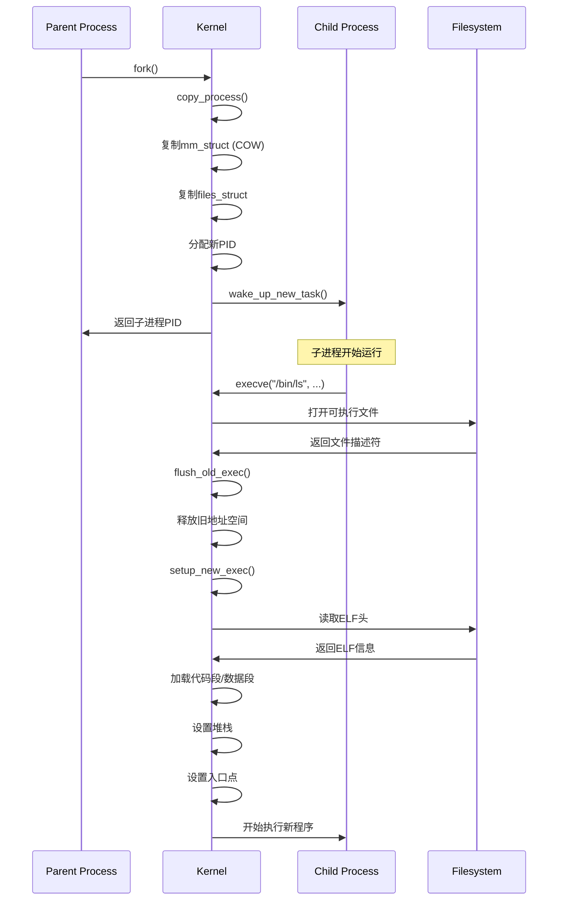
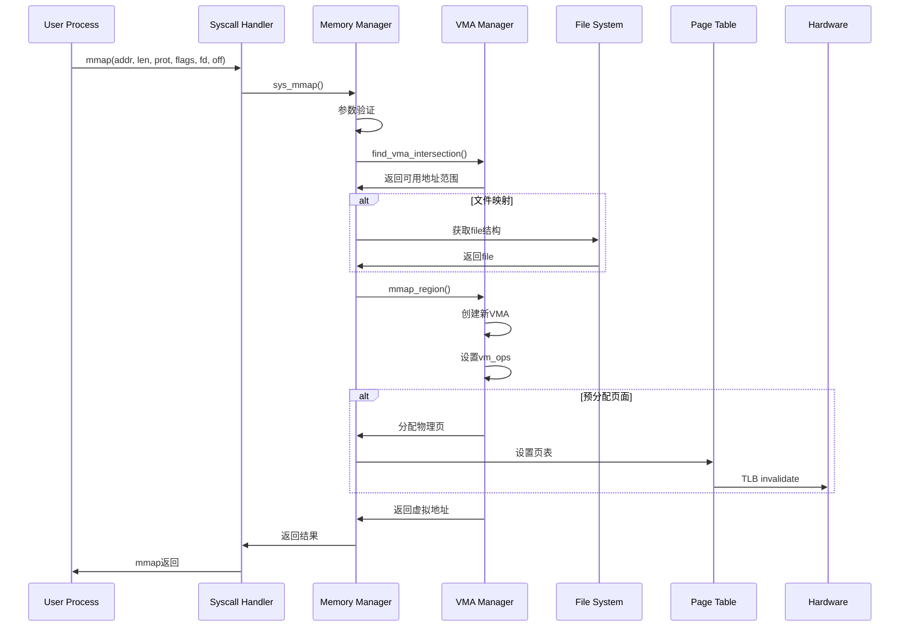
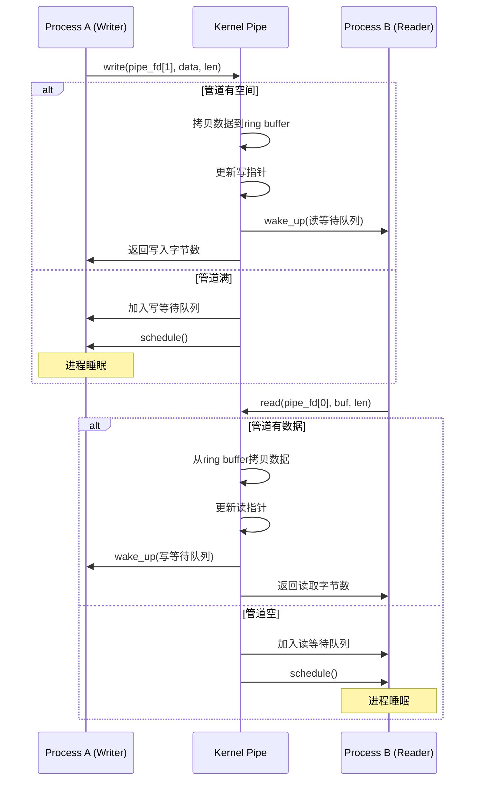
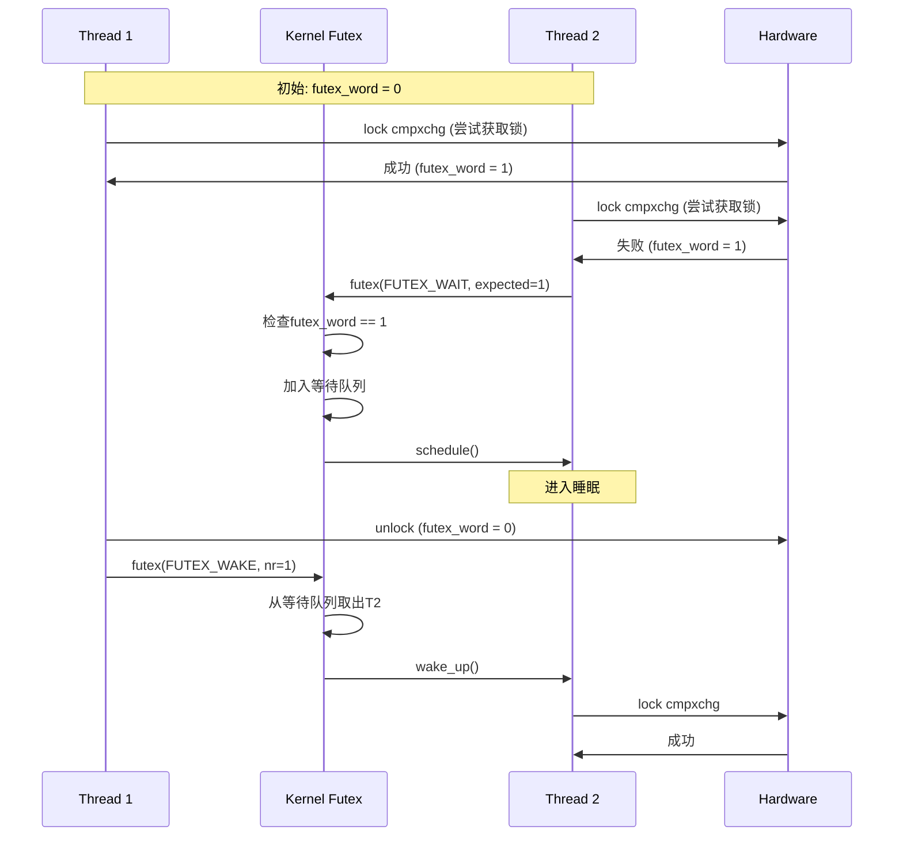

# 系统调用时序图

## 1. read() 系统调用时序

```mermaid
sequenceDiagram
    participant U as User Process
    participant L as libc
    participant S as Syscall Interface
    participant V as VFS Layer
    participant FS as FileSystem
    participant B as Buffer Cache
    participant D as Device Driver
    participant H as Hardware

    U->>L: read(fd, buf, count)
    L->>S: syscall(SYS_read)
    S->>S: 保存上下文
    S->>V: vfs_read()

    V->>V: 检查文件描述符
    V->>FS: file->f_op->read()

    FS->>B: 检查page cache
    alt Cache Hit
        B->>FS: 返回缓存数据
        FS->>V: 拷贝到用户空间
    else Cache Miss
        B->>D: 请求磁盘读取
        D->>H: 发送I/O命令
        H->>H: DMA传输
        H->>D: I/O完成中断
        D->>B: 填充page cache
        B->>FS: 返回数据
        FS->>V: 拷贝到用户空间
    end

    V->>S: 返回读取字节数
    S->>S: 恢复上下文
    S->>L: 系统调用返回
    L->>U: 返回结果
```

## 2. write() 系统调用时序

```mermaid
sequenceDiagram
    participant U as User Process
    participant L as libc
    participant S as Syscall Interface
    participant V as VFS Layer
    participant FS as FileSystem
    participant B as Page Cache
    participant J as Journal
    participant D as Device Driver

    U->>L: write(fd, buf, count)
    L->>S: syscall(SYS_write)
    S->>V: vfs_write()

    V->>V: 检查写权限
    V->>FS: file->f_op->write()

    FS->>B: 分配/查找page
    B->>FS: 返回page

    FS->>FS: 拷贝用户数据到page
    FS->>J: 记录journal (ext4)
    J->>J: 等待journal提交

    alt 同步写
        FS->>D: 发起写回
        D->>D: DMA传输
        D->>FS: 写完成
    else 异步写
        FS->>B: 标记dirty
        Note over B: 稍后由pdflush写回
    end

    FS->>V: 返回写入字节数
    V->>S: 返回结果
    S->>U: 系统调用返回
```

## 3. fork() + execve() 时序

```mermaid
sequenceDiagram
    participant P as Parent Process
    participant K as Kernel
    participant C as Child Process
    participant F as Filesystem

    P->>K: fork()
    K->>K: copy_process()
    K->>K: 复制mm_struct (COW)
    K->>K: 复制files_struct
    K->>K: 分配新PID
    K->>C: wake_up_new_task()
    K->>P: 返回子进程PID

    Note over C: 子进程开始运行

    C->>K: execve("/bin/ls", ...)
    K->>F: 打开可执行文件
    F->>K: 返回文件描述符

    K->>K: flush_old_exec()
    K->>K: 释放旧地址空间
    K->>K: setup_new_exec()

    K->>F: 读取ELF头
    F->>K: 返回ELF信息

    K->>K: 加载代码段/数据段
    K->>K: 设置堆栈
    K->>K: 设置入口点

    K->>C: 开始执行新程序
```

## 4. mmap() 时序

```mermaid
sequenceDiagram
    participant U as User Process
    participant S as Syscall Handler
    participant MM as Memory Manager
    participant VMA as VMA Manager
    participant FS as File System
    participant PT as Page Table
    participant H as Hardware

    U->>S: mmap(addr, len, prot, flags, fd, off)
    S->>MM: sys_mmap()

    MM->>MM: 参数验证
    MM->>VMA: find_vma_intersection()
    VMA->>MM: 返回可用地址范围

    alt 文件映射
        MM->>FS: 获取file结构
        FS->>MM: 返回file
    end

    MM->>VMA: mmap_region()
    VMA->>VMA: 创建新VMA
    VMA->>VMA: 设置vm_ops

    alt 预分配页面
        VMA->>MM: 分配物理页
        MM->>PT: 设置页表
        PT->>H: TLB invalidate
    end

    VMA->>MM: 返回虚拟地址
    MM->>S: 返回结果
    S->>U: mmap返回
```

## 5. 进程间通信 - pipe()

```mermaid
sequenceDiagram
    participant P1 as Process A (Writer)
    participant K as Kernel Pipe
    participant P2 as Process B (Reader)

    P1->>K: write(pipe_fd[1], data, len)

    alt 管道有空间
        K->>K: 拷贝数据到ring buffer
        K->>K: 更新写指针
        K->>P2: wake_up(读等待队列)
        K->>P1: 返回写入字节数
    else 管道满
        K->>P1: 加入写等待队列
        K->>P1: schedule()
        Note over P1: 进程睡眠
    end

    P2->>K: read(pipe_fd[0], buf, len)

    alt 管道有数据
        K->>K: 从ring buffer拷贝数据
        K->>K: 更新读指针
        K->>P1: wake_up(写等待队列)
        K->>P2: 返回读取字节数
    else 管道空
        K->>P2: 加入读等待队列
        K->>P2: schedule()
        Note over P2: 进程睡眠
    end
```

## 6. futex() 同步原语

```mermaid
sequenceDiagram
    participant T1 as Thread 1
    participant K as Kernel Futex
    participant T2 as Thread 2
    participant H as Hardware

    Note over T1,T2: 初始: futex_word = 0

    T1->>H: lock cmpxchg (尝试获取锁)
    H->>T1: 成功 (futex_word = 1)

    T2->>H: lock cmpxchg (尝试获取锁)
    H->>T2: 失败 (futex_word = 1)

    T2->>K: futex(FUTEX_WAIT, expected=1)
    K->>K: 检查futex_word == 1
    K->>K: 加入等待队列
    K->>T2: schedule()
    Note over T2: 进入睡眠

    T1->>H: unlock (futex_word = 0)
    T1->>K: futex(FUTEX_WAKE, nr=1)
    K->>K: 从等待队列取出T2
    K->>T2: wake_up()

    T2->>H: lock cmpxchg
    H->>T2: 成功
```
