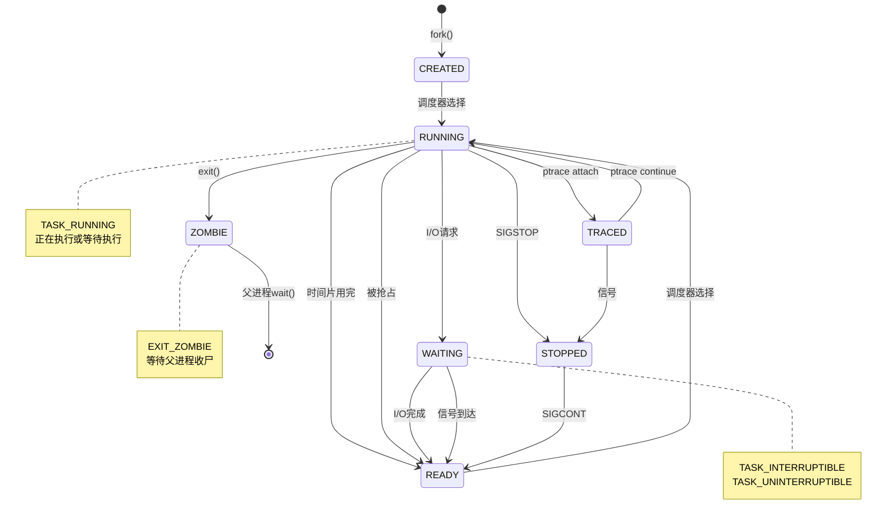
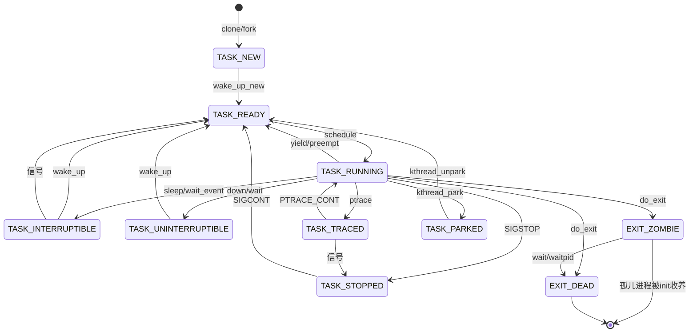
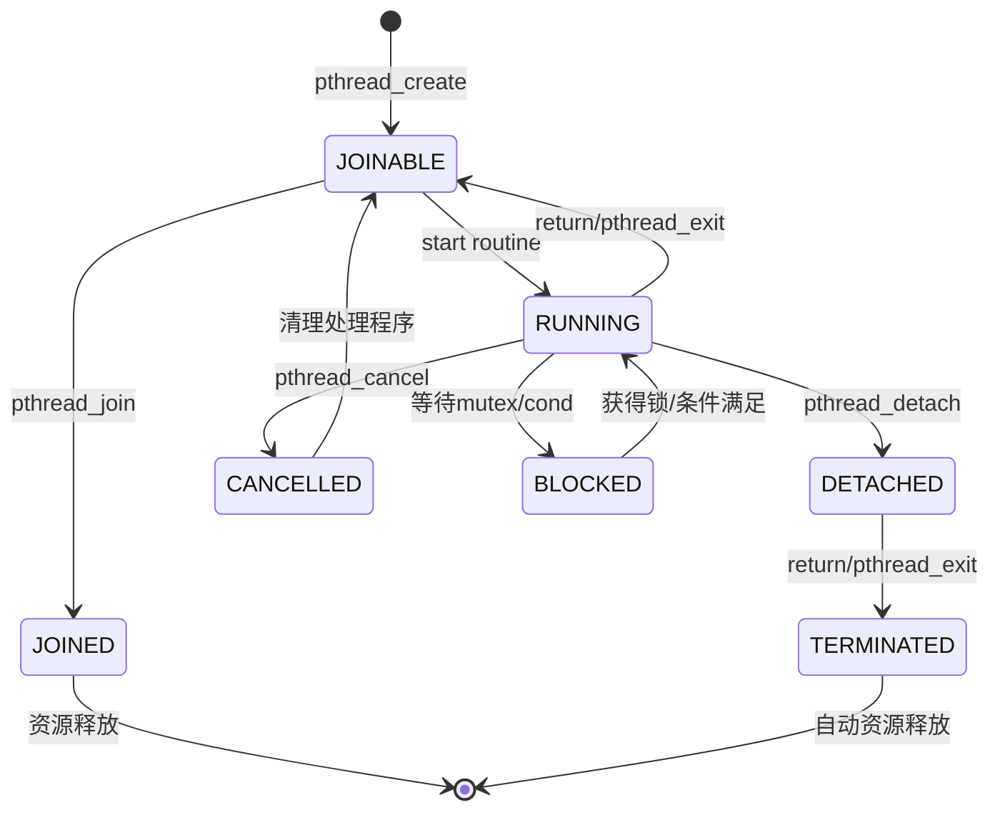
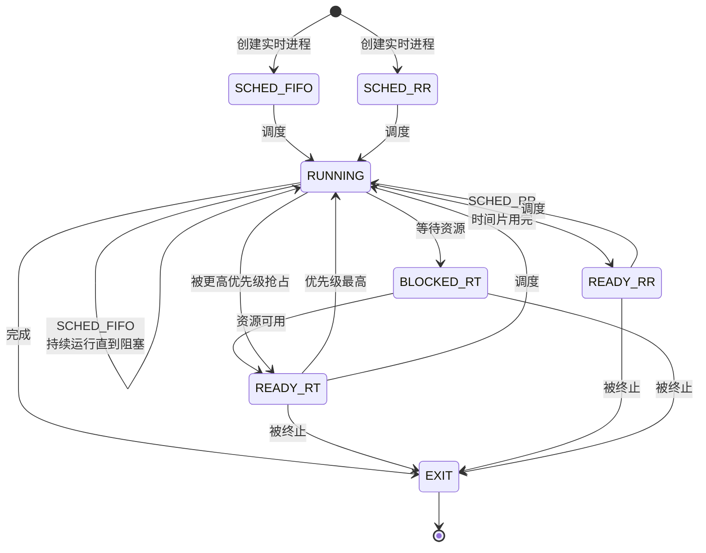
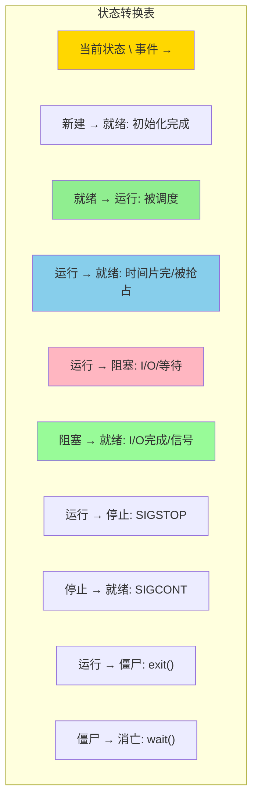

# 进程状态机

## 1. Linux进程状态机

```mermaid
stateDiagram-v2
    [*] --> CREATED: fork()
    CREATED --> RUNNING: 调度器选择

    RUNNING --> READY: 时间片用完
    RUNNING --> WAITING: I/O请求
    RUNNING --> STOPPED: SIGSTOP
    RUNNING --> ZOMBIE: exit()
    RUNNING --> READY: 被抢占

    READY --> RUNNING: 调度器选择

    WAITING --> READY: I/O完成
    WAITING --> READY: 信号到达

    STOPPED --> READY: SIGCONT

    ZOMBIE --> [*]: 父进程wait()

    RUNNING --> TRACED: ptrace attach
    TRACED --> STOPPED: 信号
    TRACED --> RUNNING: ptrace continue

    note right of RUNNING
        TASK_RUNNING
        正在执行或等待执行
    end note

    note right of WAITING
        TASK_INTERRUPTIBLE
        TASK_UNINTERRUPTIBLE
    end note

    note right of ZOMBIE
        EXIT_ZOMBIE
        等待父进程收尸
    end note
```

## 2. 详细进程生命周期

```mermaid
stateDiagram-v2
    [*] --> TASK_NEW: clone/fork
    TASK_NEW --> TASK_READY: wake_up_new

    TASK_READY --> TASK_RUNNING: schedule
    TASK_RUNNING --> TASK_READY: yield/preempt

    TASK_RUNNING --> TASK_INTERRUPTIBLE: sleep/wait_event
    TASK_INTERRUPTIBLE --> TASK_READY: wake_up
    TASK_INTERRUPTIBLE --> TASK_READY: 信号

    TASK_RUNNING --> TASK_UNINTERRUPTIBLE: down/wait
    TASK_UNINTERRUPTIBLE --> TASK_READY: wake_up

    TASK_RUNNING --> TASK_STOPPED: SIGSTOP
    TASK_STOPPED --> TASK_READY: SIGCONT

    TASK_RUNNING --> TASK_TRACED: ptrace
    TASK_TRACED --> TASK_STOPPED: 信号
    TASK_TRACED --> TASK_RUNNING: PTRACE_CONT

    TASK_RUNNING --> EXIT_DEAD: do_exit
    TASK_RUNNING --> EXIT_ZOMBIE: do_exit

    EXIT_ZOMBIE --> EXIT_DEAD: wait/waitpid
    EXIT_ZOMBIE --> [*]: 孤儿进程被init收养
    EXIT_DEAD --> [*]

    TASK_RUNNING --> TASK_PARKED: kthread_park
    TASK_PARKED --> TASK_READY: kthread_unpark
```

## 3. 线程状态机 (pthread)

```mermaid
stateDiagram-v2
    [*] --> JOINABLE: pthread_create

    JOINABLE --> RUNNING: start routine
    RUNNING --> JOINABLE: return/pthread_exit
    RUNNING --> DETACHED: pthread_detach

    JOINABLE --> JOINED: pthread_join
    JOINED --> [*]: 资源释放

    RUNNING --> CANCELLED: pthread_cancel
    CANCELLED --> JOINABLE: 清理处理程序

    DETACHED --> TERMINATED: return/pthread_exit
    TERMINATED --> [*]: 自动资源释放

    RUNNING --> BLOCKED: 等待mutex/cond
    BLOCKED --> RUNNING: 获得锁/条件满足
```

## 4. 实时进程状态机

```mermaid
stateDiagram-v2
    [*] --> SCHED_FIFO: 创建实时进程
    [*] --> SCHED_RR: 创建实时进程

    SCHED_FIFO --> RUNNING: 调度
    SCHED_RR --> RUNNING: 调度

    RUNNING --> BLOCKED_RT: 等待资源
    BLOCKED_RT --> READY_RT: 资源可用

    READY_RT --> RUNNING: 优先级最高
    RUNNING --> READY_RT: 被更高优先级抢占

    RUNNING --> RUNNING: SCHED_FIFO<br/>持续运行直到阻塞
    RUNNING --> READY_RR: SCHED_RR<br/>时间片用完

    READY_RR --> RUNNING: 调度
    READY_RT --> RUNNING: 调度

    RUNNING --> EXIT: 完成
    READY_RT --> EXIT: 被终止
    READY_RR --> EXIT: 被终止
    BLOCKED_RT --> EXIT: 被终止
    EXIT --> [*]
```

## 5. 进程状态转换矩阵

```mermaid
graph TB
    subgraph "状态转换表"
        T1["当前状态 \ 事件 →"]
        T2["新建 → 就绪: 初始化完成"]
        T3["就绪 → 运行: 被调度"]
        T4["运行 → 就绪: 时间片完/被抢占"]
        T5["运行 → 阻塞: I/O/等待"]
        T6["阻塞 → 就绪: I/O完成/信号"]
        T7["运行 → 停止: SIGSTOP"]
        T8["停止 → 就绪: SIGCONT"]
        T9["运行 → 僵尸: exit()"]
        T10["僵尸 → 消亡: wait()"]
    end

    style T1 fill:#FFD700
    style T3 fill:#90EE90
    style T4 fill:#87CEEB
    style T5 fill:#FFB6C1
    style T6 fill:#98FB98
```
