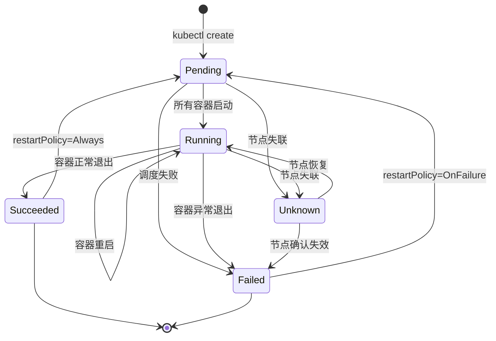
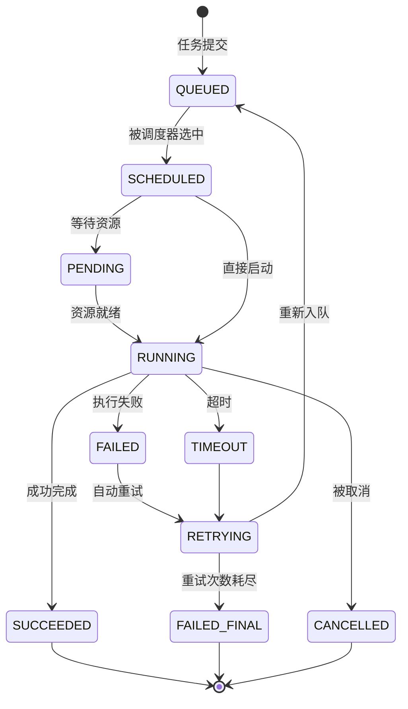
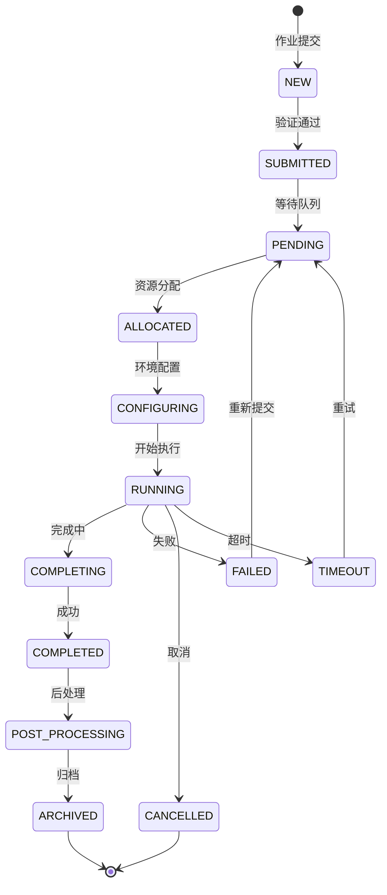
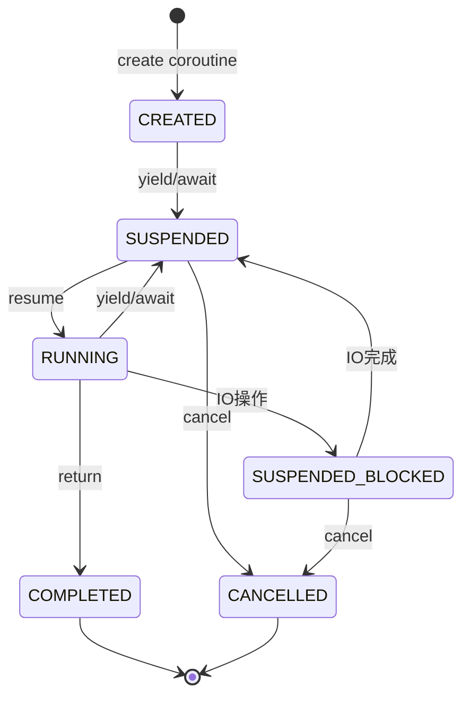
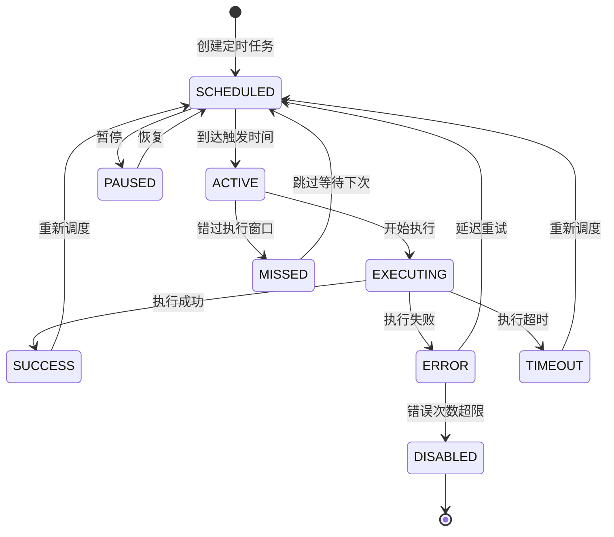
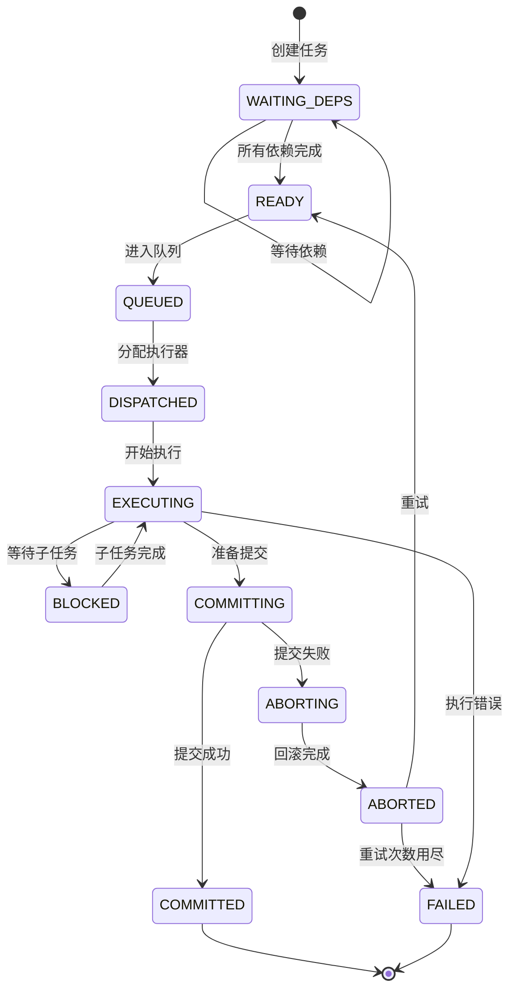

# 任务状态机

## 1. Kubernetes Pod生命周期

```mermaid
stateDiagram-v2
    [*] --> Pending: kubectl create
    Pending --> Running: 所有容器启动
    Pending --> Failed: 调度失败
    Pending --> Unknown: 节点失联

    Running --> Succeeded: 容器正常退出
    Running --> Failed: 容器异常退出
    Running --> Unknown: 节点失联

    Succeeded --> [*]
    Failed --> [*]
    Unknown --> Running: 节点恢复
    Unknown --> Failed: 节点确认失效

    Running --> Running: 容器重启
    Failed --> Pending: restartPolicy=OnFailure
    Succeeded --> Pending: restartPolicy=Always
```

## 2. 工作流任务状态机

```mermaid
stateDiagram-v2
    [*] --> QUEUED: 任务提交
    QUEUED --> SCHEDULED: 被调度器选中

    SCHEDULED --> PENDING: 等待资源
    PENDING --> RUNNING: 资源就绪
    SCHEDULED --> RUNNING: 直接启动

    RUNNING --> SUCCEEDED: 成功完成
    RUNNING --> FAILED: 执行失败
    RUNNING --> CANCELLED: 被取消
    RUNNING --> TIMEOUT: 超时

    FAILED --> RETRYING: 自动重试
    RETRYING --> QUEUED: 重新入队
    RETRYING --> FAILED_FINAL: 重试次数耗尽

    SUCCEEDED --> [*]
    FAILED_FINAL --> [*]
    CANCELLED --> [*]
    TIMEOUT --> RETRYING
```

## 3. 批处理作业状态机

```mermaid
stateDiagram-v2
    [*] --> NEW: 作业提交
    NEW --> SUBMITTED: 验证通过
    SUBMITTED --> PENDING: 等待队列

    PENDING --> ALLOCATED: 资源分配
    ALLOCATED --> CONFIGURING: 环境配置
    CONFIGURING --> RUNNING: 开始执行

    RUNNING --> COMPLETING: 完成中
    COMPLETING --> COMPLETED: 成功
    RUNNING --> FAILED: 失败
    RUNNING --> CANCELLED: 取消
    RUNNING --> TIMEOUT: 超时

    COMPLETED --> POST_PROCESSING: 后处理
    POST_PROCESSING --> ARCHIVED: 归档
    ARCHIVED --> [*]

    FAILED --> PENDING: 重新提交
    CANCELLED --> [*]
    TIMEOUT --> PENDING: 重试
```

## 4. 协程 (Coroutine) 状态机

```mermaid
stateDiagram-v2
    [*] --> CREATED: create coroutine
    CREATED --> SUSPENDED: yield/await

    SUSPENDED --> RUNNING: resume
    RUNNING --> SUSPENDED: yield/await

    RUNNING --> SUSPENDED_BLOCKED: IO操作
    SUSPENDED_BLOCKED --> SUSPENDED: IO完成

    RUNNING --> COMPLETED: return
    SUSPENDED --> CANCELLED: cancel
    SUSPENDED_BLOCKED --> CANCELLED: cancel

    COMPLETED --> [*]
    CANCELLED --> [*]
```

## 5. 定时任务状态机

```mermaid
stateDiagram-v2
    [*] --> SCHEDULED: 创建定时任务
    SCHEDULED --> ACTIVE: 到达触发时间
    SCHEDULED --> PAUSED: 暂停

    PAUSED --> SCHEDULED: 恢复

    ACTIVE --> EXECUTING: 开始执行
    ACTIVE --> MISSED: 错过执行窗口

    EXECUTING --> SUCCESS: 执行成功
    EXECUTING --> ERROR: 执行失败
    EXECUTING --> TIMEOUT: 执行超时

    SUCCESS --> SCHEDULED: 重新调度
    ERROR --> SCHEDULED: 延迟重试
    ERROR --> DISABLED: 错误次数超限

    MISSED --> SCHEDULED: 跳过等待下次
    TIMEOUT --> SCHEDULED: 重新调度

    DISABLED --> [*]
```

## 6. 任务依赖状态机

```mermaid
stateDiagram-v2
    [*] --> WAITING_DEPS: 创建任务

    WAITING_DEPS --> READY: 所有依赖完成
    WAITING_DEPS --> WAITING_DEPS: 等待依赖

    READY --> QUEUED: 进入队列
    QUEUED --> DISPATCHED: 分配执行器
    DISPATCHED --> EXECUTING: 开始执行

    EXECUTING --> BLOCKED: 等待子任务
    BLOCKED --> EXECUTING: 子任务完成

    EXECUTING --> COMMITTING: 准备提交
    COMMITTING --> COMMITTED: 提交成功
    COMMITTING --> ABORTING: 提交失败

    ABORTING --> ABORTED: 回滚完成
    ABORTED --> READY: 重试
    ABORTED --> FAILED: 重试次数用尽

    COMMITTED --> [*]
    FAILED --> [*]

    EXECUTING --> FAILED: 执行错误
```
