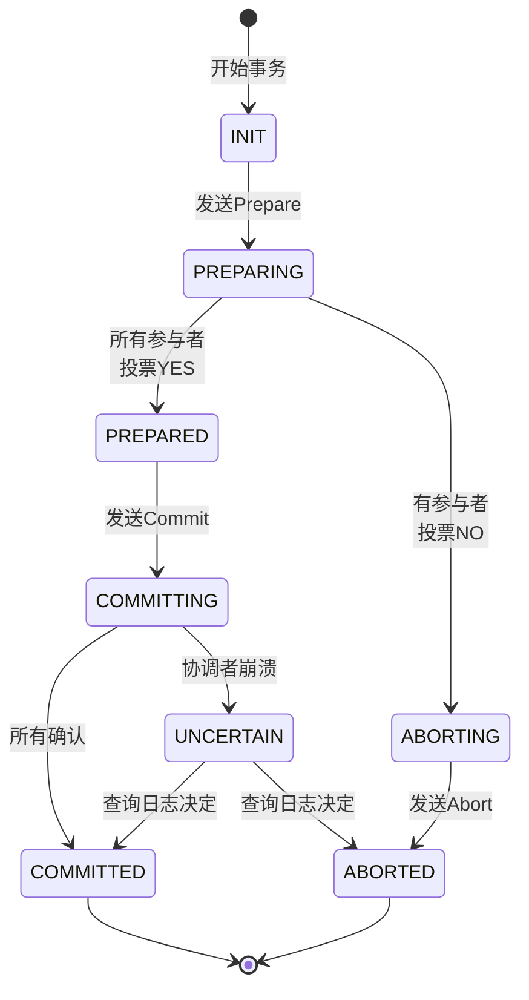
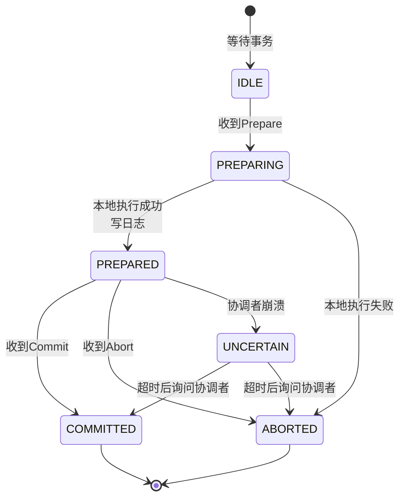
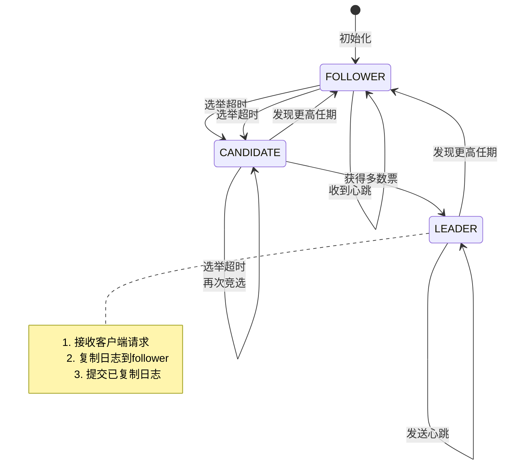
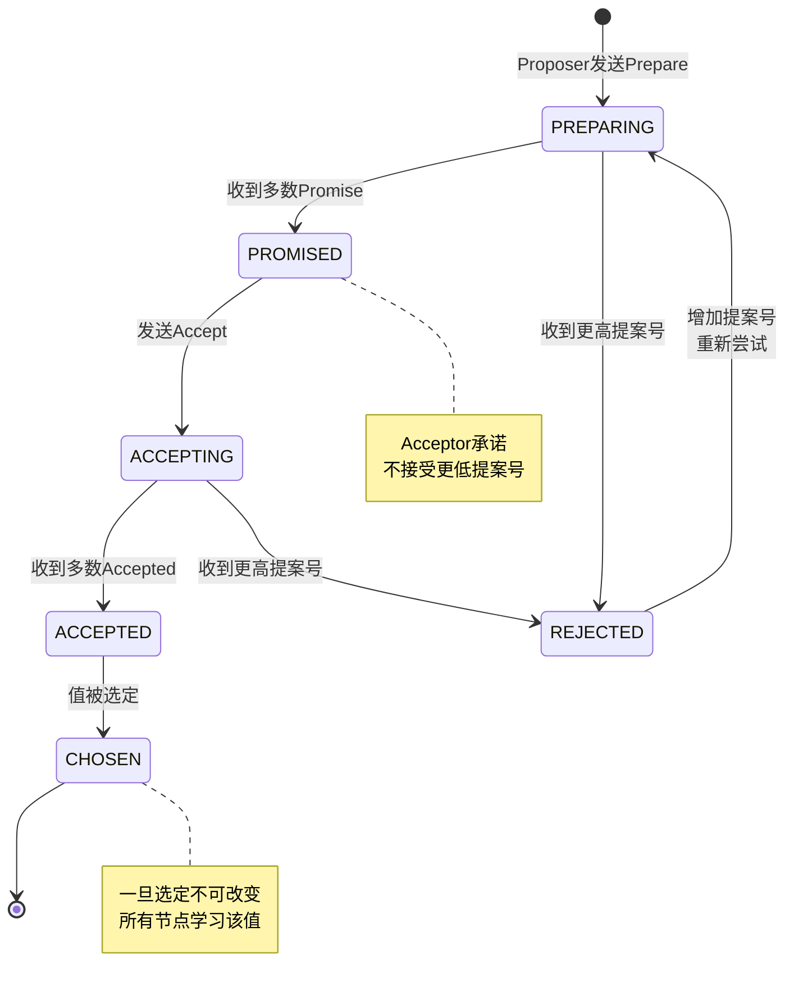
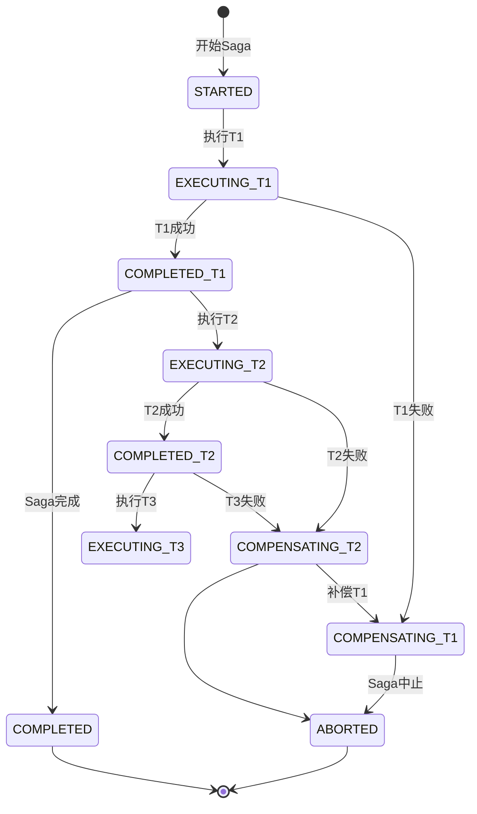
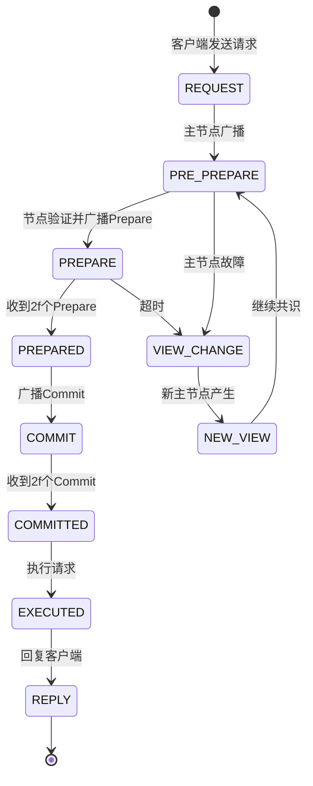
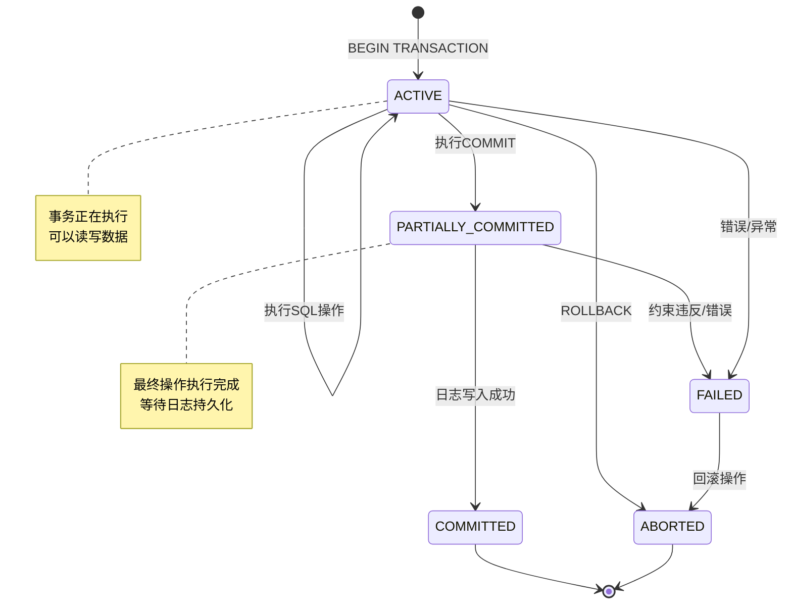

# 事务与共识算法状态机

## 1. 两阶段提交 (2PC) 状态机

```mermaid
stateDiagram-v2
    [*] --> INIT: 开始事务
    INIT --> PREPARING: 发送Prepare

    PREPARING --> PREPARED: 所有参与者<br/>投票YES
    PREPARING --> ABORTING: 有参与者<br/>投票NO

    PREPARED --> COMMITTING: 发送Commit
    ABORTING --> ABORTED: 发送Abort

    COMMITTING --> COMMITTED: 所有确认
    COMMITTING --> UNCERTAIN: 协调者崩溃

    UNCERTAIN --> COMMITTED: 查询日志决定
    UNCERTAIN --> ABORTED: 查询日志决定

    ABORTED --> [*]
    COMMITTED --> [*]
```

## 2. 参与者状态机 (2PC)

```mermaid
stateDiagram-v2
    [*] --> IDLE: 等待事务
    IDLE --> PREPARING: 收到Prepare

    PREPARING --> PREPARED: 本地执行成功<br/>写日志
    PREPARING --> ABORTED: 本地执行失败

    PREPARED --> COMMITTED: 收到Commit
    PREPARED --> ABORTED: 收到Abort

    COMMITTED --> [*]
    ABORTED --> [*]

    PREPARED --> UNCERTAIN: 协调者崩溃
    UNCERTAIN --> COMMITTED: 超时后询问协调者
    UNCERTAIN --> ABORTED: 超时后询问协调者
```

## 3. Raft共识算法状态机

```mermaid
stateDiagram-v2
    [*] --> FOLLOWER: 初始化
    FOLLOWER --> CANDIDATE: 选举超时

    CANDIDATE --> LEADER: 获得多数票
    CANDIDATE --> FOLLOWER: 发现更高任期
    CANDIDATE --> CANDIDATE: 选举超时<br/>再次竞选

    LEADER --> FOLLOWER: 发现更高任期
    FOLLOWER --> FOLLOWER: 收到心跳
    FOLLOWER --> CANDIDATE: 选举超时

    LEADER --> LEADER: 发送心跳

    note right of LEADER
        1. 接收客户端请求
        2. 复制日志到follower
        3. 提交已复制日志
    end note
```

## 4. Paxos状态机

```mermaid
stateDiagram-v2
    [*] --> PREPARING: Proposer发送Prepare
    PREPARING --> PROMISED: 收到多数Promise
    PREPARING --> REJECTED: 收到更高提案号

    PROMISED --> ACCEPTING: 发送Accept
    ACCEPTING --> ACCEPTED: 收到多数Accepted
    ACCEPTING --> REJECTED: 收到更高提案号

    ACCEPTED --> CHOSEN: 值被选定
    REJECTED --> PREPARING: 增加提案号<br/>重新尝试

    CHOSEN --> [*]

    note right of PROMISED
        Acceptor承诺
        不接受更低提案号
    end note

    note right of CHOSEN
        一旦选定不可改变
        所有节点学习该值
    end note
```

## 5. 分布式事务状态机 (Saga模式)

```mermaid
stateDiagram-v2
    [*] --> STARTED: 开始Saga
    STARTED --> EXECUTING_T1: 执行T1

    EXECUTING_T1 --> COMPLETED_T1: T1成功
    EXECUTING_T1 --> COMPENSATING_T1: T1失败

    COMPLETED_T1 --> EXECUTING_T2: 执行T2
    COMPLETED_T1 --> COMPLETED: Saga完成

    EXECUTING_T2 --> COMPLETED_T2: T2成功
    EXECUTING_T2 --> COMPENSATING_T2: T2失败

    COMPLETED_T2 --> EXECUTING_T3: 执行T3

    COMPENSATING_T2 --> COMPENSATING_T1: 补偿T1
    COMPLETED_T2 --> COMPENSATING_T2: T3失败

    COMPENSATING_T1 --> ABORTED: Saga中止
    COMPENSATING_T2 --> ABORTED

    ABORTED --> [*]
    COMPLETED --> [*]
```

## 6. 拜占庭容错 (PBFT) 状态机

```mermaid
stateDiagram-v2
    [*] --> REQUEST: 客户端发送请求
    REQUEST --> PRE_PREPARE: 主节点广播

    PRE_PREPARE --> PREPARE: 节点验证并广播Prepare
    PREPARE --> PREPARED: 收到2f个Prepare

    PREPARED --> COMMIT: 广播Commit
    COMMIT --> COMMITTED: 收到2f个Commit

    COMMITTED --> EXECUTED: 执行请求
    EXECUTED --> REPLY: 回复客户端
    REPLY --> [*]

    PRE_PREPARE --> VIEW_CHANGE: 主节点故障
    PREPARE --> VIEW_CHANGE: 超时

    VIEW_CHANGE --> NEW_VIEW: 新主节点产生
    NEW_VIEW --> PRE_PREPARE: 继续共识
```

## 7. 数据库事务状态机 (ACID)

```mermaid
stateDiagram-v2
    [*] --> ACTIVE: BEGIN TRANSACTION

    ACTIVE --> ACTIVE: 执行SQL操作
    ACTIVE --> PARTIALLY_COMMITTED: 执行COMMIT

    PARTIALLY_COMMITTED --> COMMITTED: 日志写入成功
    PARTIALLY_COMMITTED --> FAILED: 约束违反/错误

    ACTIVE --> FAILED: 错误/异常
    ACTIVE --> ABORTED: ROLLBACK

    FAILED --> ABORTED: 回滚操作
    COMMITTED --> [*]
    ABORTED --> [*]

    note right of ACTIVE
        事务正在执行
        可以读写数据
    end note

    note right of PARTIALLY_COMMITTED
        最终操作执行完成
        等待日志持久化
    end note
```
